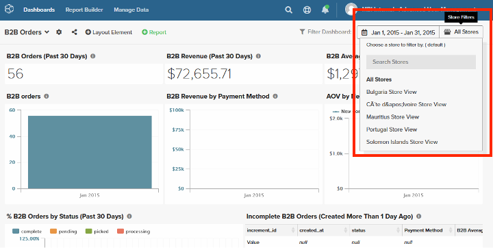

# 高度なユーザー管理

[!DNL Advanced User Management] 機能により、強化されたデータ表示コントロールが提供され、ユーザーグループ（組織地域）に基づく論理データフィルタリングが可能になります。 これにより、ユーザーグループに基づいてデータの表示をカスタマイズでき、ビジネスが新しい地域に拡大するたびに、地域固有のレポート要件を満たすために既存のダッシュボードのレプリカを作成する必要がなくなります。

[!DNL Advanced User Management] は、ダッシュボードの共有とデータの表示をシンプル化すると同時に、大企業のセキュリティとスケーラビリティを確保します。 ユーザーグループ、ロール、権限を柔軟に設定できるCommerce Intelligenceは、大規模法人レベルの要件に対応する強力なツールです。

[!DNL Advanced User Management] を有効にすると、以下を設定するためのアクセス権を持つのは管理者ユーザーのみになります。

- 指標
- ビジュアルReport Builder
- SQL ベースのレポート
- 電子メールの概要
- 生の書き出し

## 機能マトリックス

[!DNL Advanced User Management] は、Commerce Intelligenceの複数の機能に影響します。 次の表に、有効または無効にする機能に応じた様々な役割の機能、権限およびその可用性を示します。

<table><thead>
  <tr>
    <th colspan="3" rowspan="2">Commerce Intelligenceの機能</th>
    <th colspan="6">高度なユーザー管理（AUM）の機能</th>
  </tr>
  <tr>
    <th colspan="3">Disabled</th>
    <th colspan="3">Enabled</th>
  </tr></thead>
<tbody>
  <tr>
    <td>機能グループ</td>
    <td>機能</td>
    <td>権限</td>
    <td>Admin</td>
    <td>標準</td>
    <td>読み取り専用</td>
    <td>Admin</td>
    <td>標準</td>
    <td>読み取り専用</td>
  </tr>
  <tr>
    <td rowspan="7">ユーザーの管理（すべての管理者からアクセスでき、すべての役割に影響します）</td>
    <td>ユーザーグループの設定</td>
    <td></td>
    <td></td>
    <td></td>
    <td></td>
    <td>✓</td>
    <td></td>
    <td></td>
  </tr>
  <tr>
    <td>ユーザーを招待</td>
    <td></td>
    <td>✓</td>
    <td></td>
    <td></td>
    <td>✓</td>
    <td></td>
    <td></td>
  </tr>
  <tr>
    <td>「権限」タブ – 役割マッピング</td>
    <td></td>
    <td>✓</td>
    <td></td>
    <td></td>
    <td>✓</td>
    <td></td>
    <td></td>
  </tr>
  <tr>
    <td>「権限」タブ – ユーザーグループマッピング（AUM）</td>
    <td></td>
    <td></td>
    <td></td>
    <td></td>
    <td>✓</td>
    <td></td>
    <td></td>
  </tr>
  <tr>
    <td>「権限」タブ – サブセットマッピング（AUM）を格納</td>
    <td></td>
    <td></td>
    <td></td>
    <td></td>
    <td>✓</td>
    <td></td>
    <td></td>
  </tr>
  <tr>
    <td>「指標」タブ</td>
    <td></td>
    <td>✓</td>
    <td></td>
    <td></td>
    <td>✓</td>
    <td></td>
    <td></td>
  </tr>
  <tr>
    <td>「共有ダッシュボード」タブ</td>
    <td></td>
    <td>✓</td>
    <td></td>
    <td></td>
    <td>✓</td>
    <td></td>
    <td></td>
  </tr>
  <tr>
    <td rowspan="2">Report Builder</td>
    <td>ビジュアルReport Builder</td>
    <td></td>
    <td>✓</td>
    <td>✓</td>
    <td></td>
    <td>✓</td>
    <td></td>
    <td></td>
  </tr>
  <tr>
    <td>SQL REPORT BUILDER</td>
    <td></td>
    <td>✓</td>
    <td></td>
    <td></td>
    <td>✓</td>
    <td></td>
    <td></td>
  </tr>
  <tr>
    <td rowspan="2">電子メールの概要</td>
    <td>データ・パーティション化を使用しない電子メール要約の作成</td>
    <td></td>
    <td>✓</td>
    <td>✓</td>
    <td></td>
    <td>✓</td>
    <td></td>
    <td></td>
  </tr>
  <tr>
    <td>データ・パーティション化（AUM）を使用した電子メール要約の作成</td>
    <td></td>
    <td></td>
    <td></td>
    <td></td>
    <td>✓</td>
    <td></td>
    <td></td>
  </tr>
  <tr>
    <td rowspan="4">ダッシュボード   – 共有</td>
    <td>役割をまたいだユーザーとのダッシュボードの共有</td>
    <td></td>
    <td>✓</td>
    <td>✓</td>
    <td></td>
    <td></td>
    <td></td>
    <td></td>
  </tr>
  <tr>
    <td>ダッシュボードをユーザーグループや管理者（AUM）と共有する</td>
    <td></td>
    <td></td>
    <td></td>
    <td></td>
    <td>✓</td>
    <td></td>
    <td></td>
  </tr>
  <tr>
    <td rowspan="2">ダッシュボードの共有 – 権限</td>
    <td>編集</td>
    <td>✓</td>
    <td>✓</td>
    <td></td>
    <td></td>
    <td></td>
    <td></td>
  </tr>
  <tr>
    <td>表示</td>
    <td>✓</td>
    <td>✓</td>
    <td></td>
    <td>✓</td>
    <td></td>
    <td></td>
  </tr>
  <tr>
    <td rowspan="18">ダッシュボード – 表示（指定された権限で共有ダッシュボードを開く）</td>
    <td rowspan="2">共有ダッシュボードの再共有</td>
    <td>編集</td>
    <td>✓</td>
    <td>✓</td>
    <td></td>
    <td></td>
    <td></td>
    <td></td>
  </tr>
  <tr>
    <td>表示</td>
    <td></td>
    <td></td>
    <td></td>
    <td></td>
    <td></td>
    <td></td>
  </tr>
  <tr>
    <td rowspan="2">日付フィルター（「編集時間オプション」機能フラグを除く）</td>
    <td>編集</td>
    <td>✓</td>
    <td>✓</td>
    <td>✓</td>
    <td></td>
    <td></td>
    <td></td>
  </tr>
  <tr>
    <td>表示</td>
    <td></td>
    <td></td>
    <td></td>
    <td>✓</td>
    <td></td>
    <td></td>
  </tr>
  <tr>
    <td rowspan="2">日付フィルター（「編集時間オプション」機能フラグを使用）</td>
    <td>編集</td>
    <td>✓</td>
    <td>✓</td>
    <td>✓</td>
    <td></td>
    <td></td>
    <td></td>
  </tr>
  <tr>
    <td>表示</td>
    <td>✓</td>
    <td>✓</td>
    <td></td>
    <td>✓</td>
    <td>✓</td>
    <td>✓</td>
  </tr>
  <tr>
    <td rowspan="2">ストアフィルター（「編集時間オプション」機能フラグを除く）</td>
    <td>編集</td>
    <td>✓</td>
    <td>✓</td>
    <td>✓</td>
    <td></td>
    <td></td>
    <td></td>
  </tr>
  <tr>
    <td>表示</td>
    <td>✓</td>
    <td>✓</td>
    <td></td>
    <td>✓</td>
    <td>✓</td>
    <td></td>
  </tr>
  <tr>
    <td rowspan="2">ストアフィルター（「編集時間オプション」機能フラグを使用）</td>
    <td>編集</td>
    <td>✓</td>
    <td>✓</td>
    <td>✓</td>
    <td></td>
    <td></td>
    <td></td>
  </tr>
  <tr>
    <td>表示</td>
    <td>✓</td>
    <td>✓</td>
    <td></td>
    <td>✓</td>
    <td>✓</td>
    <td></td>
  </tr>
  <tr>
    <td rowspan="2">ダッシュボードデータ – ユーザーグループマッピング（AUM）に基づいてレポートデータをフィルタリングできます</td>
    <td>編集</td>
    <td></td>
    <td></td>
    <td></td>
    <td></td>
    <td></td>
    <td></td>
  </tr>
  <tr>
    <td>表示</td>
    <td></td>
    <td></td>
    <td></td>
    <td>✓</td>
    <td>✓</td>
    <td>✓</td>
  </tr>
  <tr>
    <td rowspan="2">レポート – 編集</td>
    <td>編集</td>
    <td>✓</td>
    <td>✓</td>
    <td></td>
    <td>✓</td>
    <td></td>
    <td></td>
  </tr>
  <tr>
    <td>表示</td>
    <td></td>
    <td></td>
    <td></td>
    <td>✓</td>
    <td></td>
    <td></td>
  </tr>
  <tr>
    <td rowspan="2">レポートの書き出し（CSV、XLSX）</td>
    <td>編集</td>
    <td>✓</td>
    <td>✓</td>
    <td>✓</td>
    <td>✓</td>
    <td></td>
    <td></td>
  </tr>
  <tr>
    <td>表示</td>
    <td>✓</td>
    <td>✓</td>
    <td>✓</td>
    <td>✓</td>
    <td>✓</td>
    <td>✓</td>
  </tr>
  <tr>
    <td rowspan="2">レポート – 生の書き出し</td>
    <td>編集</td>
    <td>✓</td>
    <td>✓</td>
    <td></td>
    <td>✓</td>
    <td></td>
    <td></td>
  </tr>
  <tr>
    <td>表示</td>
    <td>✓</td>
    <td>✓</td>
    <td></td>
    <td></td>
    <td></td>
    <td></td>
  </tr>
</tbody></table>

## 管理コントロール

管理者ユーザーは、次のタスクを管理できます。

- ユーザーグループの設定
- 個々のユーザーへの役割とユーザーグループの割り当て
- ダッシュボードレベルの権限を持つユーザーグループまたは他の管理者とダッシュボードを共有する
- ユーザーグループレベルのデータフィルタリングによるメール要約のスケジュール設定

### ユーザーグループの設定

ユーザーグループは、特定のストアフィルターにマッピングされた地域の論理グループです（例えば、大陸、国、地域の名前に基づいて作成されたユーザーグループ）。

ユーザーグループを設定するには：

1. [!UICONTROL **ユーザーを管理**]/[!UICONTROL **User Groups]**&#x200B;に移動して、既存のユーザーグループを表示します。

   

1. [!UICONTROL **グループを追加**] を使用すると、管理者は新しいユーザーグループを作成できます。

   - グループの名前を入力します（例：「Americas」）。

   - ユーザーグループに関連するストアまたはフィルターを選択します。

   - 設定を保存します。

     

1. 管理者は次の操作を実行できます。

   - ユーザーグループを編集して、ストアマッピングを更新したり、わかりやすくするために名前を変更したりします。

   - 不要になったユーザーグループは削除します。 管理者は、削除されたユーザーグループにマッピングされた既存のユーザーを手動で再割り当てする必要があります。

1. デフォルトのグループ：

   - [!UICONTROL **None]**：まだ特定のグループにマッピングされていないユーザー用のフォールバックグループ。 これらのユーザーには、適切なグループに割り当てられるまでデータは表示されません。

   - [!UICONTROL **すべて**]：すべてのデータへの無制限のアクセスを提供します（通常は管理者ユーザー用に予約済み）。

### ユーザーグループへのユーザーの割り当て

管理者は、[!UICONTROL **ユーザーを招待**] を使用して、オンボーディング中に新しいユーザーを関連グループにマッピングできます。 ビジネス要件に基づいて、既存のユーザーをユーザーグループに再マッピングできます。

>[!TIP]
>
>- [!UICONTROL **Standard**] または [!UICONTROL **読み取り専用**] ユーザーが関連するユーザーグループに割り当てられるまで、それらのユーザーを [!UICONTROL **なし**] に割り当てて、ダッシュボードのデータに誤ってアクセスしないようにすることができます。
>
>- ユーザーに権限を割り当てる際に、ビジネス要件に基づいて、グループ内の特定のストアを制限して、制御を強化できる可能性があります。

管理者ユーザーは、デフォルトで常に [!UICONTROL **すべて**] のストアにマッピングされ、完全なストア表示でダッシュボードを表示できます。

### ダッシュボードの共有

[!DNL Advanced User Management] は、データのセキュリティを維持しながらダッシュボードを共有するための強力なオプションを提供します。

- 管理者は、ユーザーグループや他の管理者ユーザーとダッシュボードを共有して、共同作業を行うことができます。 これにより、ダッシュボードを一元的に管理でき、大規模組織の管理を簡素化できます。

  

- ダッシュボード共有の権限には、次のものが含まれます。

   - [!UICONTROL **編集**]：管理者ユーザーのみが使用できます。ダッシュボードの変更、データのフィルタリング、レポートの変更、データの書き出しを行えます。

   - [!UICONTROL **表示**]:（特定の制限）を持つすべての役割を持つユーザーが使用できます。

   - [!UICONTROL **なし**]：特定のユーザーグループまたは管理者のダッシュボードへのアクセスを無効にします。

  >[!NOTE]
  >
  >様々な組み合わせを理解するために、ルールとダッシュボードの権限に基づいた様々なCommerce Intelligence機能の使いやすさについては、[&#x200B; 機能マトリックス &#x200B;](#feature-matrix) を参照してください。

#### ダッシュボードビュー

管理者ユーザーは、すべてのストアにアクセスできるダッシュボードデータを表示できます。

ただし、ユーザーは、ユーザー設定時にマッピングされたストアに基づいてフィルタリングされたダッシュボードデータを表示できます。

>[!TIP]
>
>管理者は共有ダッシュボードの日付フィルターを有効にして、ユーザーがレポート作成時に設定されたデフォルトのタイムスパンの代わりに、様々な日付範囲でデータを表示できるようにします。 この機能は、ビジネスニーズに応じてオンとオフを切り替えることができます。

### メール概要のスケジュール

[!DNL Advanced User Management] は、データのフィルター機能をメールの概要にも拡張します。 オーディエンスに応じて、管理者ユーザーは、選択したレポートをフィルタリングする必要があるユーザーグループを指定できます。

