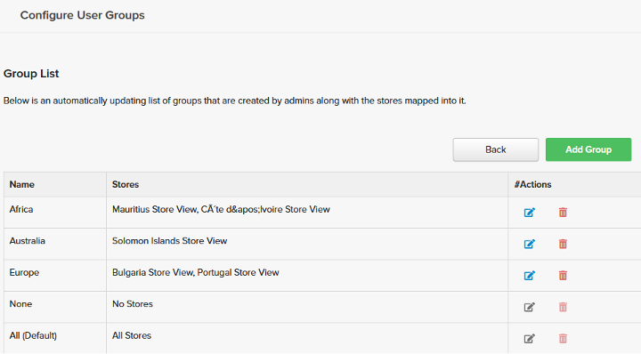
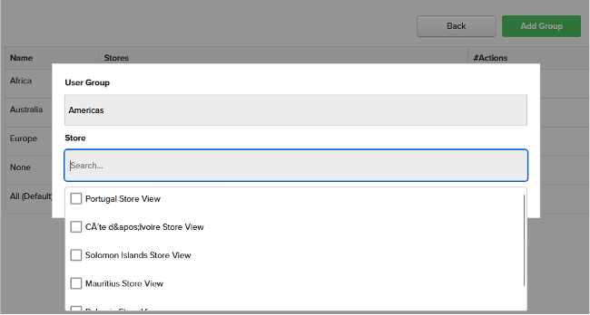

# 高度なユーザー管理

[!DNL Advanced User Management]機能は、強化されたデータ可視性コントロールを提供し、ユーザーグループ（組織領域）に基づく論理データフィルタリングを有効にします。 ユーザーグループに基づいてデータの可視性をカスタマイズでき、新しい地域にビジネスが拡大するたびに、地域固有のレポート要件を満たすために既存のダッシュボードのレプリカを作成する必要がなくなります。

[!DNL Advanced User Management]は、大規模な組織のセキュリティと拡張性を確保しながら、ダッシュボードの共有とデータの可視化を簡素化します。 Commerce Intelligenceは、ユーザーグループ、役割、権限を柔軟に設定できるため、企業レベルの要件に対応する強力なツールです。

[!DNL Advanced User Management]が有効になっている場合、管理者ユーザーのみが次の設定を行うことができます。

- 指標
- Visual Report Builder
- SQL ベースのレポート
- メールの概要
- Raw書き出し

## 機能マトリックス

[!DNL Advanced User Management]は、Commerce Intelligenceの複数の機能に影響を与えます。 次の表は、有効または無効になっている機能に基づいて、様々な役割に対する機能、権限およびその可用性を示しています。

<table><thead>
  <tr>
    <th colspan="3" rowspan="2">Commerce Intelligenceの機能</th>
    <th colspan="6">高度なユーザー管理（AUM）機能</th>
  </tr>
  <tr>
    <th colspan="3">無効</th>
    <th colspan="3">有効</th>
  </tr></thead>
<tbody>
  <tr>
    <td>機能グループ</td>
    <td>機能</td>
    <td>権限</td>
    <td>管理者</td>
    <td>Standard</td>
    <td>読み取り専用</td>
    <td>管理者</td>
    <td>Standard</td>
    <td>読み取り専用</td>
  </tr>
  <tr>
    <td rowspan="7">ユーザーの管理（すべての管理者がアクセスでき、すべての役割に影響する）</td>
    <td>ユーザーグループの設定</td>
    <td></td>
    <td></td>
    <td></td>
    <td></td>
    <td>✓</td>
    <td></td>
    <td></td>
  </tr>
  <tr>
    <td>ユーザーを招待</td>
    <td></td>
    <td>✓</td>
    <td></td>
    <td></td>
    <td>✓</td>
    <td></td>
    <td></td>
  </tr>
  <tr>
    <td>「権限」タブ – ロールマッピング</td>
    <td></td>
    <td>✓</td>
    <td></td>
    <td></td>
    <td>✓</td>
    <td></td>
    <td></td>
  </tr>
  <tr>
    <td>「権限」タブ – ユーザーグループマッピング（AUM）</td>
    <td></td>
    <td></td>
    <td></td>
    <td></td>
    <td>✓</td>
    <td></td>
    <td></td>
  </tr>
  <tr>
    <td>「権限」タブ – サブセットマッピング（AUM）を保存します</td>
    <td></td>
    <td></td>
    <td></td>
    <td></td>
    <td>✓</td>
    <td></td>
    <td></td>
  </tr>
  <tr>
    <td>「指標」タブ</td>
    <td></td>
    <td>✓</td>
    <td></td>
    <td></td>
    <td>✓</td>
    <td></td>
    <td></td>
  </tr>
  <tr>
    <td>「共有ダッシュボード」タブ</td>
    <td></td>
    <td>✓</td>
    <td></td>
    <td></td>
    <td>✓</td>
    <td></td>
    <td></td>
  </tr>
  <tr>
    <td rowspan="2">Report Builder</td>
    <td>Visual Report Builder</td>
    <td></td>
    <td>✓</td>
    <td>✓</td>
    <td></td>
    <td>✓</td>
    <td></td>
    <td></td>
  </tr>
  <tr>
    <td>SQL REPORT BUILDER</td>
    <td></td>
    <td>✓</td>
    <td></td>
    <td></td>
    <td>✓</td>
    <td></td>
    <td></td>
  </tr>
  <tr>
    <td rowspan="2">メールの概要</td>
    <td>データのパーティション化なしでメール概要を作成</td>
    <td></td>
    <td>✓</td>
    <td>✓</td>
    <td></td>
    <td>✓</td>
    <td></td>
    <td></td>
  </tr>
  <tr>
    <td>データ分割（AUM）を使用したメール概要の作成</td>
    <td></td>
    <td></td>
    <td></td>
    <td></td>
    <td>✓</td>
    <td></td>
    <td></td>
  </tr>
  <tr>
    <td rowspan="4">ダッシュボード   – 共有</td>
    <td>役割をまたいでユーザーとダッシュボードを共有</td>
    <td></td>
    <td>✓</td>
    <td>✓</td>
    <td></td>
    <td></td>
    <td></td>
    <td></td>
  </tr>
  <tr>
    <td>ユーザーグループと管理者（AUM）とのダッシュボードの共有</td>
    <td></td>
    <td></td>
    <td></td>
    <td></td>
    <td>✓</td>
    <td></td>
    <td></td>
  </tr>
  <tr>
    <td rowspan="2">ダッシュボードの共有 – 権限</td>
    <td>Edit</td>
    <td>✓</td>
    <td>✓</td>
    <td></td>
    <td></td>
    <td></td>
    <td></td>
  </tr>
  <tr>
    <td>ビュー</td>
    <td>✓</td>
    <td>✓</td>
    <td></td>
    <td>✓</td>
    <td></td>
    <td></td>
  </tr>
  <tr>
    <td rowspan="18">ダッシュボード – 表示（特定の権限を持つ共有ダッシュボードを開く）</td>
    <td rowspan="2">共有ダッシュボードの再共有</td>
    <td>Edit</td>
    <td>✓</td>
    <td>✓</td>
    <td></td>
    <td></td>
    <td></td>
    <td></td>
  </tr>
  <tr>
    <td>ビュー</td>
    <td></td>
    <td></td>
    <td></td>
    <td></td>
    <td></td>
    <td></td>
  </tr>
  <tr>
    <td rowspan="2">日付フィルター（時間オプションの編集機能フラグなし）</td>
    <td>Edit</td>
    <td>✓</td>
    <td>✓</td>
    <td>✓</td>
    <td></td>
    <td></td>
    <td></td>
  </tr>
  <tr>
    <td>ビュー</td>
    <td></td>
    <td></td>
    <td></td>
    <td>✓</td>
    <td></td>
    <td></td>
  </tr>
  <tr>
    <td rowspan="2">日付フィルター（時間オプションの編集機能フラグ付き）</td>
    <td>Edit</td>
    <td>✓</td>
    <td>✓</td>
    <td>✓</td>
    <td></td>
    <td></td>
    <td></td>
  </tr>
  <tr>
    <td>ビュー</td>
    <td>✓</td>
    <td>✓</td>
    <td></td>
    <td>✓</td>
    <td>✓</td>
    <td>✓</td>
  </tr>
  <tr>
    <td rowspan="2">フィルターを保存（時間オプションの編集機能フラグなし）</td>
    <td>Edit</td>
    <td>✓</td>
    <td>✓</td>
    <td>✓</td>
    <td></td>
    <td></td>
    <td></td>
  </tr>
  <tr>
    <td>ビュー</td>
    <td>✓</td>
    <td>✓</td>
    <td></td>
    <td>✓</td>
    <td>✓</td>
    <td></td>
  </tr>
  <tr>
    <td rowspan="2">ストアフィルター（時間オプションの編集機能フラグ付き）</td>
    <td>Edit</td>
    <td>✓</td>
    <td>✓</td>
    <td>✓</td>
    <td></td>
    <td></td>
    <td></td>
  </tr>
  <tr>
    <td>ビュー</td>
    <td>✓</td>
    <td>✓</td>
    <td></td>
    <td>✓</td>
    <td>✓</td>
    <td></td>
  </tr>
  <tr>
    <td rowspan="2">ダッシュボードデータ – ユーザーグループマッピング（AUM）に基づいてレポートデータをフィルタリングします</td>
    <td>Edit</td>
    <td></td>
    <td></td>
    <td></td>
    <td></td>
    <td></td>
    <td></td>
  </tr>
  <tr>
    <td>ビュー</td>
    <td></td>
    <td></td>
    <td></td>
    <td>✓</td>
    <td>✓</td>
    <td>✓</td>
  </tr>
  <tr>
    <td rowspan="2">レポート – 編集</td>
    <td>Edit</td>
    <td>✓</td>
    <td>✓</td>
    <td></td>
    <td>✓</td>
    <td></td>
    <td></td>
  </tr>
  <tr>
    <td>ビュー</td>
    <td></td>
    <td></td>
    <td></td>
    <td>✓</td>
    <td></td>
    <td></td>
  </tr>
  <tr>
    <td rowspan="2">レポートの書き出し（CSV、XLSX）</td>
    <td>Edit</td>
    <td>✓</td>
    <td>✓</td>
    <td>✓</td>
    <td>✓</td>
    <td></td>
    <td></td>
  </tr>
  <tr>
    <td>ビュー</td>
    <td>✓</td>
    <td>✓</td>
    <td>✓</td>
    <td>✓</td>
    <td>✓</td>
    <td>✓</td>
  </tr>
  <tr>
    <td rowspan="2">レポート – 未加工エクスポート</td>
    <td>Edit</td>
    <td>✓</td>
    <td>✓</td>
    <td></td>
    <td>✓</td>
    <td></td>
    <td></td>
  </tr>
  <tr>
    <td>ビュー</td>
    <td>✓</td>
    <td>✓</td>
    <td></td>
    <td></td>
    <td></td>
    <td></td>
  </tr>
</tbody></table>

## 管理者コントロール

管理者ユーザーは、次のタスクを管理できます。

- ユーザーグループの設定
- 個々のユーザーに役割とユーザーグループを割り当てる
- ユーザーグループまたはダッシュボードレベルの権限を持つ他の管理者とダッシュボードを共有する
- ユーザーグループレベルのデータフィルタリングでメール要約をスケジュールできます

### ユーザーグループの設定

ユーザーグループは、特定のストアフィルターにマッピングされた地域の論理グループです（大陸、国、地域の名前に基づいて作成されたユーザーグループなど）。

ユーザーグループを設定するには：

1. [!UICONTROL **ユーザーの管理**] > [!UICONTROL **User Groups]**に移動して、既存のユーザーグループを表示します。

   

1. [!UICONTROL **グループを追加**]&#x200B;すると、管理者は新しいユーザーグループを作成できます。

   - グループの名前を入力します（例：「Americas」）。

   - ユーザーグループに関連するストアまたはフィルターを選択します。

   - 設定を保存します。

     

1. 管理者は次のことが可能になります。

   - ユーザーグループを編集してストアマッピングを更新したり、名前を変更したりして、わかりやすくします。

   - ユーザーグループが不要になったときに削除します。 管理者は、削除されたユーザーグループにマッピングされている既存のユーザーを手動で再割り当てする必要があります。

1. デフォルトグループ：

   - [!UICONTROL **None]**：まだ特定のグループにマッピングされていないユーザーのフォールバックグループ。 これらのユーザーは、適切なグループに割り当てられるまでデータを表示しません。

   - [!UICONTROL **すべて**]：すべてのデータに無制限にアクセスできます（通常、管理者ユーザー用に予約されています）。

### ユーザーグループへのユーザーの割り当て

管理者は、[!UICONTROL **ユーザーを招待**]&#x200B;を使用して、オンボーディング中に新規ユーザーを関連グループにマッピングできます。 ビジネス要件に基づいて、既存のユーザーをユーザーグループに再マッピングできます。

>[!TIP]
>
>- [!UICONTROL **Standard**]&#x200B;または&#x200B;[!UICONTROL **読み取り専用**]&#x200B;のユーザーが関連するユーザーグループに割り当てられるまで、ダッシュボードデータに誤ってアクセスしないように&#x200B;[!UICONTROL **None**]&#x200B;に割り当てても安全です。
>
>- ユーザーに権限を割り当てる際に、ビジネス要件に基づいて、グループ内の特定のストアを制限して制御を強化する可能性があります。

管理者ユーザーは、デフォルトでは常に&#x200B;[!UICONTROL **すべての**] ストアにマッピングされます。これにより、完全なストアビューでダッシュボードを表示できます。

### ダッシュボードの共有

[!DNL Advanced User Management]は、データのセキュリティを維持しながらダッシュボードを共有するための強力なオプションを提供します。

- 管理者は、ダッシュボードをユーザーグループや他の管理者ユーザーと共有して共同作業を行うことができます。 これにより、ダッシュボードを一元管理し、大規模企業の管理を簡素化することができます。

  

- ダッシュボード共有の権限には、次のものが含まれます。

   - [!UICONTROL **編集**]：管理者ユーザーは、ダッシュボードの変更、データのフィルター、レポートの変更、データの書き出しのみを行うことができます。

   - [!UICONTROL **表示**]：で役割を問わず、すべてのユーザーが利用できます（特定の制限）。

   - [!UICONTROL **なし**]：特定のユーザーグループまたは管理者のダッシュボードへのアクセス権を取り消します。

  >[!NOTE]
  >
  >ルールとダッシュボードの権限に基づく様々なCommerce Intelligence機能の使いやすさについては、[機能マトリックス ](#feature-matrix)を参照して、様々な組み合わせを理解してください。

#### ダッシュボードビュー

管理者ユーザーは、すべてのストアにアクセスできるダッシュボードデータを表示できます。

ただし、ユーザーは、ユーザー設定時にマッピングされたストアに基づいてフィルタリングされたダッシュボードデータを表示できます。

>[!TIP]
>
>管理者は、共有ダッシュボードの日付フィルターを有効にすることができ、レポート作成時に設定されたデフォルトの期間ではなく、異なる日付範囲のデータを表示できます。 この機能は、ビジネスニーズに応じてオンとオフを切り替えることができます。

### メール要約のスケジュール

[!DNL Advanced User Management]は、データ フィルタリング機能をメールの要約に拡張します。 管理者ユーザーは、オーディエンスに応じて、選択したレポートをフィルタリングする必要があるユーザーグループを指定できます。

