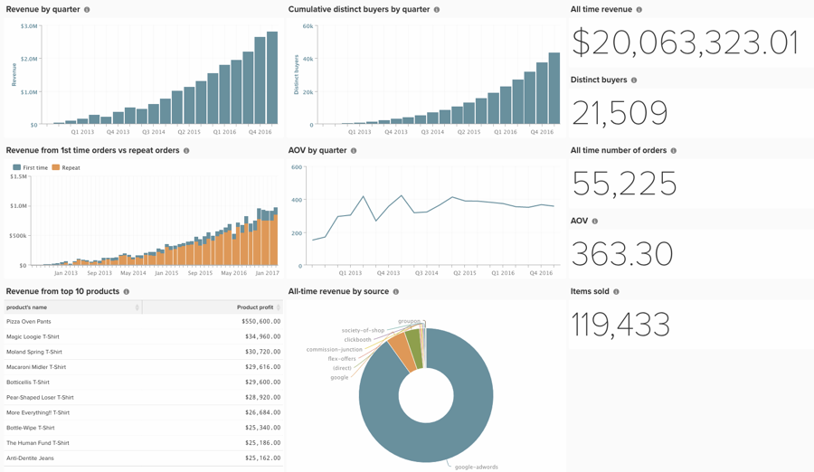

# 投資家向けダッシュボードの構築

多くの顧客は、投資家と連携し、プラットフォームから情報を共有する必要があります。しかし、日々のビジネス上の意思決定に役立つダッシュボードは、投資家のニーズとは異なるかもしれません。 以下では、包括的でありながらシンプルで、アクティブな投資家や潜在的な投資家と共有するのに理想的なダッシュボードを作成する方法に関するベストプラクティスをいくつか紹介します。

投資家ダッシュボードのレポートを作成するには、次のことが必要です。

## スカラーレポート

* **[!UICONTROL All-time revenue]**
* **[!UICONTROL Distinct buyers]**
* **[!UICONTROL All-time number of orders]**
* **[!UICONTROL AOV]**
* **[!UICONTROL Items sold]**

## ビジュアルレポート

* **[!UICONTROL Revenue by quarter]**
   * 指標 – 収益
* **[!UICONTROL Revenue from 1st time orders vs repeat orders]**
   * 指標 – 初回注文収益
      * フィルター – ユーザーの注文番号が1に等しい
   * 指標2 - リピート注文収益
      * フィルター – ユーザーの注文番号が1より大きい
   * 複数のY軸のチェックボックスをオフにします
   * 積み上げ棒グラフに変更
* **[!UICONTROL AOV by quarter]**
   * 指標1 – 収益
      * この指標を非表示
   * 指標2 – 注文数
      * この指標を非表示
   * 数式 – AOV
      * A/B
* **[!UICONTROL All-time revenue by source]**
   * 指標 – 収益
   * 顧客の`utm_source`でグループ化
* **[!UICONTROL Revenue from top 10 products]**
   * 指標 – 製品売上
      * グラフを非表示にする
      * 製品の名前でグループ化します。 すべての製品を選択してください。
      * 時間範囲をAll-Timeに設定
      * 時間間隔を「なし」に設定します
      * 「トップ/ボトムを表示」で、製品利益でソートされたトップ 10のみを表示します
* **[!UICONTROL Cumulative distinct buyers by quarter]**
   * 指標 – 購入者の分類
      * 遠近感 – 累積
* **[!UICONTROL Site visits - New vs. repeat by month]**
* セッション

[!DNL Google Analytics]統合では、次のレポートを含めることができます。

* サイト訪問
* コンバージョン率

[Commerce Data Enrichment services](https://business.adobe.com/products/magento/magento-commerce.html)では、次のレポートを含めることができます。

* 州/地域、年齢、性別ごとのユニーク顧客。

## その他のヒント

* 明快で簡潔な[命名規則](../best-practices/naming-elements.md)を使用する
* ダッシュボードを投資家ユーザーと共有する
* または、**[!UICONTROL Automated email summary]** （../data-user/export-data/email-summaries.md）経由で送信します
* 単一のダッシュボードのみを作成します。 これにより、コンテンツの保守が容易になり、投資家が何を閲覧しているのかを正確に把握できます。

レポートを入念に整理し、詳細に注意を払う。 完了すると、ダッシュボードは次のようになります。

