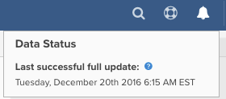
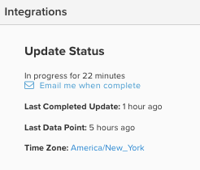

# 更新サイクルの進捗状況

[!DNL Adobe Commerce Intelligence] ダッシュボードにログインすると、前回の更新サイクルのステータスを確認する方法がいくつかあります。 それはすべて、お持ちの[ ユーザー権限](../administrator/user-management/user-management.md)の種類によって異なります。

## 更新サイクルのステータスを確認する必要があるのはなぜですか？

ステータス更新サイクルの確認は、[!DNL Commerce Intelligence] アカウントのデータを監査する際に便利です。 例えば、[件の結果が期待に合わない](../data-analyst/data-warehouse-mgr/data-and-updates-faq.md)場合、[!DNL Commerce Intelligence]の日別売上がe コマースプラットフォームまたは[[!DNL Google] e コマース収益](https://experienceleague.adobe.com/docs/commerce-knowledge-base/kb/troubleshooting/miscellaneous/diagnosing-google-ecommerce-revenue-discrepancies.html)の日別売上と一致しない場合は、最後のデータポイントを確認して、更新が完了した後に問題が解決されるかどうかを確認できます。

## [!UICONTROL Read-Only]名と[!UICONTROL Standard]名のユーザー

`Read-only`人のユーザーがダッシュボードにログインし、ページの右上にあるアイコンにカーソルを合わせると、データが最近更新された回数を確認できます。 これは、最後のデータポイントがいつプルされたかを示しています。

に表示されたデータ更新の最後の成功したタイムスタンプ

## [!UICONTROL Admin] ユーザー

`Admin`人のユーザーがダッシュボードにログインすると、アカウント統合の簡単なステータスアイコンと共に、上記の最後のデータポイントを確認できます。

詳細については、管理者ユーザーは&#x200B;**[!UICONTROL Manage Data]** > **[!UICONTROL Integrations]**&#x200B;をクリックできます。



このページには、現在の更新ステータスと、最後に完了した更新の時刻が表示されます。

更新が進行中の場合、更新が完了すると、メール通知をリクエストするためのリンクが表示されます。

更新が進行中でない場合は、更新を強制的に開始するリンクが表示されます。

>[!NOTE]
>
>ブラックアウト時間（[!DNL Commerce Intelligence]がデータを更新しない時間）が設定されている場合、強制的に更新すると、それらのブラックアウト時間の制限を尊重しない更新サイクルが開始されます。


## APIを使用した更新サイクルのステータスの確認

**更新サイクルステータス API**&#x200B;を使用して、完了した最新の更新サイクルを取得できます。

**リクエスト**

```bash
curl -sS -H "X-RJM-API-Key: <EXPORT-API-KEY>" \
  https://api.rjmetrics.com/0.1/client/<CLIENT_ID>/fullupdatestatus
```

**応答（例）**

```json
{
  "clientId": 194,
  "lastCompletedUpdateJob": {
    "id": 13554,
    "type": { "id": 2, "name": "Full Update" },
    "start": "2025-12-09 03:26:25",
    "end": "2025-12-09 03:29:03",
    "status": { "id": 4, "name": "Completed Successfully" }
  },
  "lastCompletedUpdateJobWithDataSync": null,
  "timezoneAbbreviation": "EST"
}
```

パラメーター、認証、エラー、レート制限については、開発者ドキュメントの[ サイクルステータス APIの更新](https://developer.adobe.com/commerce/services/reporting/update-cycle/)を参照してください。
