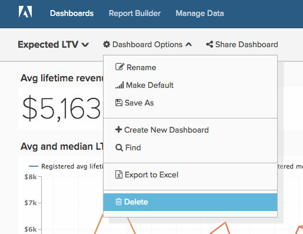
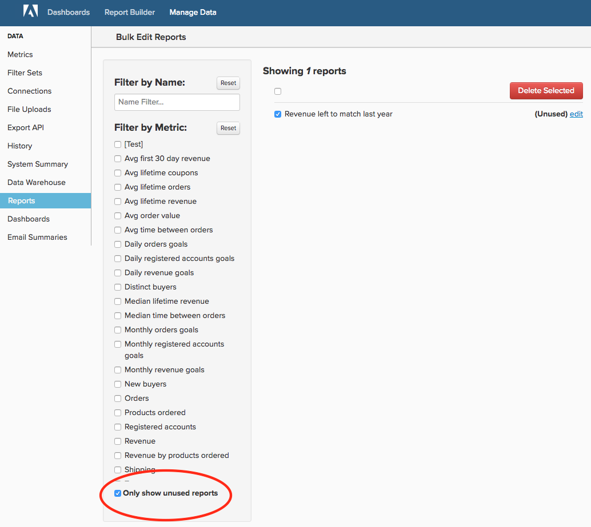
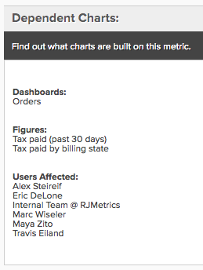
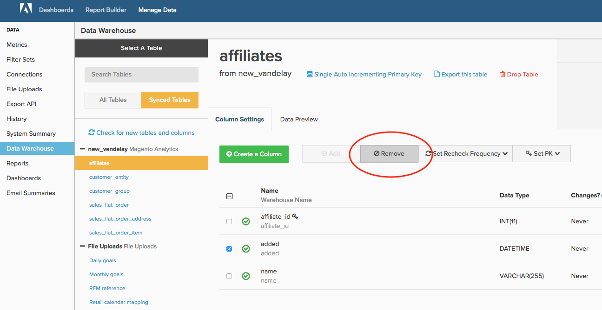

# [!DNL Adobe Commerce Intelligence] アカウントのクリーンアップ

[!DNL Commerce Intelligence]に6か月または6年間参加している場合でも、整頓されたアカウントを維持することは、組織がプラットフォームを最大限に活用するために最も重要なことです。 時間の経過とともに、不要になったユーザー、ダッシュボード、レポート、指標、列が自然に見えてきます。 1回限りのレポートを作成して忘れた場合や、アカウントを無効にしたことがない場合に、会社を辞めたユーザーがいるかもしれません。

[ アカウントのすべての要素](../best-practices/naming-elements.md)）に対して[!DNL Commerce Intelligence]標準化された明確な名前を付けることで、以下のアカウント監査手順を使用して、ユーザーの混乱や不要な分析を減らすことができます。 さらに、更新サイクルが[高速化される可能性があります](../best-practices/reduce-update-cycle-time.md)。

## 手順1：非アクティブユーザーの特定

アカウントのクリーンアップの最初の手順は、会社を退職したユーザーや、現在の役割で[!DNL Commerce Intelligence]を使用しなくなったユーザーなど、非アクティブなユーザーのアカウントを非アクティブにすることです。

これを行うには、右上のナビゲーションバーで会社名をクリックし、**[!UICONTROL Manage Users]**&#x200B;を選択します。 次に、非アクティブにするユーザーを選択し、**[!UICONTROL Deactivate User]**&#x200B;をクリックします。

>[!NOTE]
>
>これを行うには、[管理者権限](../administrator/user-management/user-management.md)が必要です。

>[!WARNING]
>
>ユーザーを非アクティブ化すると、そのユーザーが作成したチャート、ダッシュボード、その他のアセットが削除されます。 これらのアセットを保持する場合は、ユーザーを非アクティブ化する前に、[!DNL Commerce Intelligence] [ サポート ](../guide-overview.md#Submitting-a-Support-Ticket) チームにお問い合わせください。 サポートは、これらのアセットを別のユーザーに転送するのに役立ちます。

### ユーザーの再アクティブ化

ユーザーを再アクティブ化するには、非アクティブ化された同じ電子メールアドレスでアカウントを再作成してユーザーを再招待し、そのユーザーのアクセスと所有していたデータがログイン時に復元されます。

## 手順2：未使用のダッシュボードとレポートの削除

アカウントを監査する次の手順は、未使用のダッシュボードとレポートを削除することです。

>[!NOTE]
>
>これを行うには、`Admin`または`Standard` [ ユーザー権限](../administrator/user-management/user-management.md)が必要です。

`Admin`または`Standard` アクセス権を持つすべてのユーザーは、レポートとダッシュボードを作成できます。 そのため、これらの権限を持つすべてのユーザーは、未使用のレポートを特定して削除するには、次の手順に従う必要があります。

### ダッシュボードとレポートの確認

何かを削除する前に、レポートとダッシュボードを確認し、何が使用されているかを評価する必要があります。 以下に説明する&#x200B;**[!UICONTROL find unused reports]**&#x200B;機能を使用できますが、最初のレビューでは、クリーンアップ作業の生産性が大幅に向上します。

### ダッシュボードとレポートの削除

ダッシュボードとレポートにアクセスしたら、アカウントのクリーンアップを開始できます。

**ダッシュボードからレポートを削除するには**

1. ダッシュボードで削除するレポートを探します。
1. レポートの右上隅にある「**[!UICONTROL Options]**」を選択します。
1. **[!UICONTROL Remove From Dashboard]**&#x200B;をクリックします。

**ダッシュボード全体を削除するには**

1. 「**[!UICONTROL Manage Data]**」、「**[!UICONTROL Dashboards**]」の順に選択します。
1. 削除するダッシュボードをクリックします。
1. **[!UICONTROL Delete Dashboard]**&#x200B;をクリックします。

ダッシュボード自体から&#x200B;**[!UICONTROL Dashboard Options]**、**[!UICONTROL Delete]**&#x200B;を選択することもできます。

ダッシュボードのギアメニューの

>[!NOTE]
>
>ダッシュボードを削除しても、そのダッシュボード内のレポートは削除されないので、レポートを削除するには、もう1つの手順を実行する必要があります。

**未使用のレポートを削除するには**

1. 「**[!UICONTROL Manage Data]**」、「**[!UICONTROL Reports]**」の順に選択します。
1. 指標リストの下にある「**未使用のレポートのみを表示**」ボックスをオンにします。 これにより、ダッシュボードやメールの要約では使用されないレポートのリストが作成されます。
1. 削除するレポートを選択します。 レポートリストの上にあるチェックボックスをクリックすると、すべてを選択できます。
1. **[!UICONTROL Delete Selected]**&#x200B;をクリックします。

未使用のレポート削除プロセスを次に示します。

## 手順3：未使用の指標の削除

ユーザーリスト、ダッシュボード、レポートをクリーンアップしたら、指標のリストの監査に進むことができます。 これにより、古い指標（新しい指標が別の定義で作成されたなど）を特定したり、使用していないものを特定したりできます。

1. 指標の依存レポートのリストを生成するには、**[!DNL Manage Data]**&#x200B;に移動し、「**[!UICONTROL Metrics]**」をクリックします。
1. 指標の横にある「**[!UICONTROL Edit]**」をクリックします。
1. ページの下部に&#x200B;**[!UICONTROL Dependent Charts]**&#x200B;というセクションがあります。 リンクをクリックして、この指標の依存レポートリストを生成します。
1. システムがチェックを完了すると、この指標を使用するダッシュボード、レポート、ユーザーのリストが[!DNL Commerce Intelligence]に表示されます。

選択した列を使用するレポートを表示する

指標が不要になった場合は、**[!UICONTROL Metrics]**&#x200B;をクリックして&#x200B;**[!UICONTROL Back to Metric List]** ページに戻り、削除する指標を見つけます。 **[!UICONTROL Delete]**&#x200B;をクリックします。

## 手順4：同期した列の評価

最後の手順は、Data Warehouseで現在同期されている列を評価することです。 列の同期を解除すると、アカウントが混乱するだけでなく、更新時間が短縮される可能性もあります。

これを続行する場合は、[!DNL Commerce Intelligence] [ サポート ](../guide-overview.md#Submitting-a-Support-Ticket)にお問い合わせください。 サポートチームは、どのユーザーのダッシュボードでも使用されていないすべての列と、SQL レポートを除くメールの概要では使用されていないすべての列を含むレポートを作成できます。 このレポートは、Data Warehouse Managerを使用して同期を解除する列を選択する際のガイドとして使用できます。

>[!NOTE]
>
>後でいつでも列の同期を再開できます。 列の同期を解除すると、Data Warehouseから任意のデータが削除されます。つまり、更新サイクル中に、この列が新しい値または更新された値をチェックされないことのみを意味します。

**列（または列）の同期を解除するには**

1. **[!DNL Manage Data]**、次に&#x200B;**[!UICONTROL Data Warehouse]**&#x200B;に移動します。
1. **[!UICONTROL Synced Tables]** リストで、列を含むテーブルに移動します。
1. 同期を解除する1つ以上の列の横にある1つ以上のボックスをオンにします。

   >[!NOTE]
   >
   >テーブル全体を削除せずにプライマリキー列の同期を解除することはできません。

1. **[!UICONTROL Remove]**&#x200B;をクリックして、1つ以上の列の同期を解除します。

ここでは、そのプロセス全体を紹介します。

## まとめ

これで、[!DNL Commerce Intelligence] アカウントは、あなたとあなたのチームにとって簡潔で簡単に操作できるようになりました。
