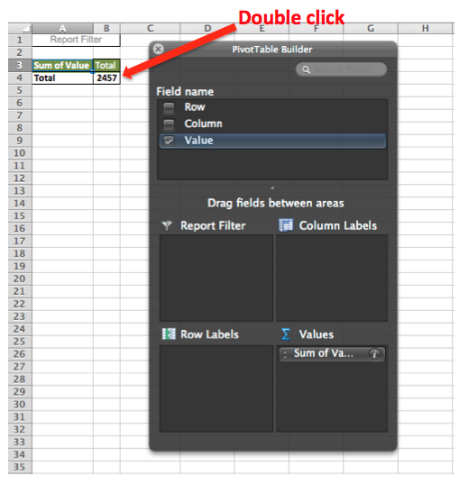

# 財務データのフォーマットとインポート

このトピックでは、[!DNL Adobe Commerce Intelligence]で分析するために財務データをインポートする最適な方法について説明します。

2次元のクロスタブデータテーブルは、一般的に財務データに使用される形式です。 値が列と行の両方のラベルで分類される場合、このタイプのレイアウトは、人間の目やスプレッドシートのツールでは見やすいかもしれませんが、データベースには適していません。

このデータを[!DNL Commerce Intelligence]に読み込んで分析するには、テーブルを1次元のリストに統合する必要があります。 統合すると、各データ値は、1行の複数のラベルによって分類されます。各行は一意であるか、一意の識別子（プライマリキー列など）を持ちます。

## インポート用のExcel ファイルの書式設定

[!DNL Excel] ピボットテーブルを使用して2次元テーブルを統合するには：

1. 2次元データテーブルを含むファイルを開きます。
1. ピボットテーブル ウィザードを開きます。 [!DNL Windows]では、ショートカットは`Alt-D`です。 [!DNL Mac OS]に、`Command-Option-P`と入力します。
1. **[!UICONTROL Multiple consolidated ranges]**&#x200B;を選択し、**[!UICONTROL Next]**&#x200B;をクリックします。
1. **[!UICONTROL I will create the page fields]**&#x200B;を選択し、**[!UICONTROL Next]**&#x200B;をクリックします。
1. ラベルを含め、2次元テーブルのデータセット全体を選択します。 目的のページフィールド数に対して`0`が選択されていることを確認し、**[!UICONTROL Next]**&#x200B;をクリックします。
1. 新しいシートにピボットテーブルを作成し、**[!UICONTROL Finish]**&#x200B;をクリックします。
1. フィールドリストから列フィールドと行フィールドの選択を解除します。
1. 結果の数値をダブルクリックして、統合されたソースデータを新しいシートに表示します。
   ダブルクリックして展開することを示す
1. `CSV` ファイルとして保存します。

## まとめ

データテーブルはリスト形式に変換され、元のすべての情報が保持され、分析用に[を [!DNL Commerce Intelligence]](../data-analyst/importing-data/connecting-data/using-file-uploader.md)にインポートできるようになりました。
