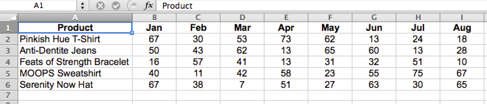

# 財務データのフォーマットとインポート

このトピックでは、[!DNL Adobe Commerce Intelligence] で分析する財務データをインポートする最適な方法を説明します。

2 次元のクロスタブ データ テーブルは、多くの場合、財務データに使用される形式です。 列と行の両方のラベルで値が分類されるので、このタイプのレイアウトは人間の目やスプレッドシートツールで簡単に表示できるかもしれませんが、データベースには適していません。

このデータを [!DNL Commerce Intelligence] にインポートして分析するには、テーブルを 1 次元リストにフラット化する必要があります。 フラット化すると、各データ値は複数のラベルによって分類され、すべてが 1 行に含まれます。各行は一意であるか、主キー列などの一意の識別子を持ちます。

## インポートする Excel ファイルのフォーマット

[!DNL Excel] しいピボットテーブルを使用して 2 次元テーブルをフラット化するには：

1. 2 次元データ テーブルを使用してファイルを開きます。
1. ピボットテーブル ウィザードを開きます。 [!DNL Windows] では、ショートカットは `Alt-D` です。 [!DNL Mac OS] に、`Command-Option-P` と入力します。
1. 「**[!UICONTROL Multiple consolidated ranges]**」を選択し、「**[!UICONTROL Next]**」をクリックします。
1. 「**[!UICONTROL I will create the page fields]**」を選択し、「**[!UICONTROL Next]**」をクリックします。
1. ラベルを含む 2 次元テーブルのデータ・セット全体を選択します。 目的のページフィールドの数に `0` が選択されていることを確認し、「**[!UICONTROL Next]**」をクリックします。
1. 新しいシートにピボットテーブルを作成し、**[!UICONTROL Finish]** をクリックします。
1. フィールドリストから列フィールドと行フィールドの選択を解除します。
1. 結果の数値をダブルクリックして、フラット化されたソースデータを新しいシートに表示します。
   
1. `CSV` ファイルとして保存します。

## まとめ

データ テーブルはリスト形式に変換され、元の情報がすべて保持されます。このデータ テーブルは分析用に [ インポート  [!DNL Commerce Intelligence]](../data-analyst/importing-data/connecting-data/using-file-uploader.md) できます。
