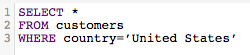
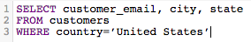
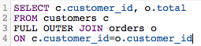
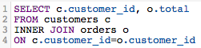
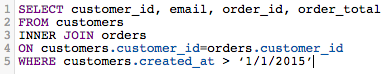
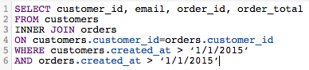
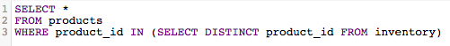
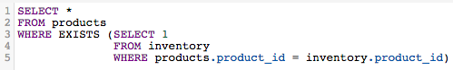
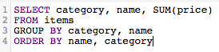
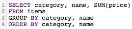

# SQL クエリの最適化

[!DNL SQL Report Builder]を使用すると、必要なときにいつでもクエリを実行および変更できます。 この機能は、列やレポートを修正する前に更新サイクルが終了するのを待つのではなく、クエリをすぐに更新する必要がある場合に役立ちます。

クエリを実行する前に、[[!DNL Commerce Intelligence] はそのコストを見積もります](https://experienceleague.adobe.com/docs/commerce-knowledge-base/kb/troubleshooting/miscellaneous/sql-queries-explain-cost-errors.html)。 コスト：クエリの実行に必要な時間とリソース数を考慮します。 そのコストが高すぎると見なされた場合、または返される行の数が[!DNL Commerce Intelligence]個の制限を超えた場合、クエリは失敗します。 [Data Warehouse](../data-analyst/data-warehouse-mgr/tour-dwm.md)に対してクエリを実行する場合は、最も効率的なクエリを作成するために、Adobeでは次をお勧めします。

## SELECTの使用または全列の選択

すべての列を選択しても、タイムリーで簡単に実行できるクエリにはなりません。 `SELECT *`を使用するクエリは、特にテーブルに列が多い場合、実行に時間がかかる場合があります。

このため、Adobeでは、可能な限り`SELECT *`の使用を避け、必要な列のみを含めることをお勧めします。

| **代わりに…** | **試してみる！** |
|-----|-----|
| SELECT アスタリスク SQL クエリ |  |

{style="table-layout:auto"}

## 完全な外部結合の使用

外部結合では、結合されている両方のテーブル全体が選択され、クエリの計算コストが増加します。 つまり、クエリの実行に時間がかかり、結果を返すには実行制限よりも時間がかかる可能性があるため、失敗する可能性が高くなります。

この種類の結合を使用する代わりに、内部結合または左結合を使用することを検討してください。 内部結合は、テーブル間に列の一致がある場合にのみ結果を返します（例えば、`order_id`は一般的な`customers`と`orders` テーブルの両方に存在します）。 左の結合は、左（最初）のテーブルのすべての結果を、右（2番目）のテーブルの一致する結果とともに返します。

FULL OUTER JOIN クエリの書き換え方法を確認します。

| **代わりに…** | **試してみる！** |
|-----|-----|
|  | 最適化された結合SQL クエリ |

{style="table-layout:auto"}

これらのクエリは、使用するJOINのタイプを除き、すべての方法で同じです。

## 複数の結合の使用

クエリに複数の結合を含めることもできますが、クエリのコストを押し上げる可能性があることを忘れないでください。 コストしきい値に達しないように、Adobeでは、可能な限り複数の結合を避けることをお勧めします。

## フィルターの使用

可能な限りフィルターを使用します。 句`WHERE`と`HAVING`は、結果をフィルタリングし、本当に必要なデータのみを提供します。

## JOIN句でのフィルターの使用

結合を実行する際にフィルターを使用する場合は、必ず結合の両方のテーブルに適用してください。 冗長であっても、クエリの計算コストを削減し、実行時間を短縮できます。

| **代わりに…** | **試してみる！** |
|-----|-----|
|  |  |

{style="table-layout:auto"}

## 演算子の使用

クエリを作成する際には、可能な限り「安価」な演算子を使用することを検討してください。 各クエリには計算コストがあり、クエリを構成する関数、演算子、フィルターによって決まります。 一部のオペレーターは計算作業が少ないため、他のオペレーターよりもコストが低くなります。

比較演算子（>、&lt;、=など）は最も安価で、次に[LIKEが続きます。 最も高額な演算子であるTO演算子とPOSIX演算子](https://www.postgresql.org/docs/9.5/functions-matching.html)に似ています。

## EXISTSとINの使用

`EXISTS`と`IN`の比較は、返す結果の種類によって異なります。 1つの値のみに関心がある場合は、`EXISTS`の代わりに`IN`句を使用します。 `IN`は、コンマ区切りの値のリストと共に使用されます。これにより、クエリの計算コストが増加します。

`IN` クエリを実行する場合、システムは最初にサブクエリ（`IN` ステートメント）を処理し、次に`IN` ステートメントで指定された関係に基づいてクエリ全体を処理する必要があります。 クエリを複数回実行する必要がないため、`EXISTS` クエリの方がはるかに効率的です。クエリで指定された関係を確認する際に、true/false値が返されます。

簡単に言えば、`EXISTS`を使用する際にシステムが処理する必要はありません。

| **代わりに…** | **試してみる！** |
|-----|-----|
|  | EXISTS句SQL クエリ |

{style="table-layout:auto"}

## ORDER BYの使用

`ORDER BY`関数はSQLでコストがかかり、クエリのコストを大幅に引き上げることができます。 クエリのEXPLAIN コストが高すぎるというエラーメッセージが表示された場合は、必要でない限り、クエリから`ORDER BY`を削除してみてください。

これは、`ORDER BY`を使用できないということではなく、必要な場合にのみ使用する必要があることです。

## GROUP BYとORDER BYの使用

この方法が、お客様が行おうとしているものと一致しない場合があります。 一般的なルールは、`GROUP BY`と`ORDER BY`を使用している場合は、両方の句の列を同じ順序で配置する必要があることです。 例：

| **代わりに…** | **試してみる！** |
|-----|-----|
| フィルターSQL クエリ | の前にフィルターを含むSQL クエリ |

{style="table-layout:auto"}

## まとめ

SQLの書き方を効率的に学ぶには、試行錯誤が必要です。 最適なレポートを見つけるには、SQL エディターのみを使用して、いくつかのレポートを再作成してみてください。
