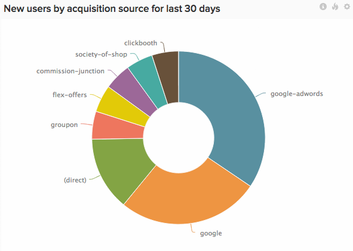

# セグメンテーションとフィルタリング

優れたセグメンテーションは、表面的な統計をビジネス指標に変換し、意思決定を促進するものです。

最も価値のある顧客は誰か？ 最も価値のあるマーケティングチャネルは何か？ 動きが速い製品とその理由は？ これらの質問に答えるには、まずデータをセグメンテーションすることから始めましょう。

ここでは、顧客に推奨されることが多い重要なセグメントについて取り上げます。 また、これらのセグメントがどのような質問に答えるのに役立つかについても詳しく説明します。 技術的には、セグメントはデータベース内のデータ列です。 [!DNL Adobe Commerce Intelligence]では、ディメンションと呼ばれます。

重要な顧客セグメントとフィルターを表示する

## ユーザーセグメント

ユーザーセグメントは、利用者が誰で、どのように行動するのかを把握するのに役立ちます。

* **年齢/誕生年**：ユーザーの年齢は？ 最もアクティブなユーザーは何歳か？ 通常、より効果的な分析をおこなうために、値を範囲にバケット化することは理にかなっています。
* **性別**：異なる性別が異なる方法でweb サイトを利用しますか？
* **住所**: ユーザーの出身地 マーケティング施策を特定の地域に集中させるべきか？ 最近の広告キャンペーンは、ターゲット地域で期待どおりに実行されていますか？
* **顧客獲得ソース**\: ユーザーの出身地のマーケティングチャネルを知っていますか？ 広告をクリックしたのか、検索で見つけたのか？ [&#x200B; ユーザー獲得ソース別にデータをセグメント化](../data-analyst/analysis/google-track-user-acq.md)することは、新規顧客獲得を最適化するための最初のステップです。 ステップ 2は、より多くのお金を使うことです。
* **登録デバイス**：ユーザーはモバイルアプリまたはweb サイトを通じて登録しましたか？ iOSとAndroid™? モバイルユーザー基盤は、モバイル製品を開発するためにより多くのリソースを割り当てるのに十分な規模を備えていますか？ これをまだ追跡していない場合は、このトピック [&#x200B; ユーザーデバイスの追跡について](../data-analyst/analysis/track-usr-dev-browser.md)を参照してください。
* **参照元**：上位のインフルエンサーは誰ですか？ 他のユーザーから直接紹介されたユーザー数は？
* **業界**:B2B企業の場合、ユーザーが働く業界はどれですか？ どの貿易機関が参加する価値がありますか？
* **アンケート回答**：顧客アンケートを実施する場合は、回答をセグメントとして使用して、より詳細なプロファイリングを行います。 利用者について既に把握している情報を補完する質問をしたり、推測を裏付けたりすることができます。
* **最初の注文金額と商品カテゴリ**: ユーザーの最初の注文と将来の購入パターンとの間に相関関係がありますか？

## 注文/イベントセグメント

注文セグメントとイベントセグメントは、顧客の行動とエンゲージメントを長期的に分析するのに役立ちます。

* **[!UICONTROL Billing / Shipping Address]**：ご注文のほとんどはどこから来ていますか？ 請求先住所と配送先住所の違いはありますか？
* **[!UICONTROL Status]**：注文のうち、完了しなかった件数は？ 過去7日間の保留中の注文の割合を教えてください。
* **[!UICONTROL Customer acquisition source]**: ユーザーレベルでユーザー獲得データを追跡するだけでなく、注文レベルまたはイベントレベルで[追跡することもできます](../data-analyst/analysis/google-track-user-acq.md)。 あるソースを介して登録したユーザーが、他のソースを介してサイトにアクセスし続ける可能性があります。
* **[!UICONTROL Device]**: モバイル注文の数は増加していますか？ モバイルで購入した商品は、どの程度売上につながっていますか？ （まだ追跡していない場合は、注文デバイスデータの追跡についてのこのトピック [を参照してください](../data-analyst/analysis/track-usr-dev-browser.md)。
* **[!UICONTROL Fulfillment Center]**：最も売上を伸ばしているフルフィルメントセンターはどれですか？ 注文時間と発送時間の違いを分析する場合、最もレスポンシブなフルフィルメントセンターはどれですか？
* **[!UICONTROL Delivery Carrier]**：最も人気のある通信事業者はどれですか？ 返品数が最も少ない航空会社はどれですか？
* **[!UICONTROL Discount / Coupon Codes]**：あなたのプロモーションは実際に余分なビジネスを生み出していますか？ 顧客は販売中の商品に加えて、どれだけの追加商品を購入しましたか？ クーポンは平均注文額にどのような影響を与えますか？ 割引対象商品と非割引商品の平均利益率を教えてください。
* **[!UICONTROL Satisfaction / Rating]**：注文に対する顧客の満足度は？ 顧客は自社を推奨する可能性が高いか？

## 製品セグメント

商品セグメントは、マーチャンダイジングの意思決定に役立ちます。

* **[!UICONTROL Merchant / Brand]**：特定のブランドの販売速度が他のブランドよりも速いですか？ パフォーマンスが低いブランドはどれか？
* **[!UICONTROL Type / Category]**：異なるユーザーセグメントは、異なる種類の製品を利用しますか？ リピーターが最も多い製品カテゴリは？
* **[!UICONTROL Discount / Coupon Codes]**: プロモーションは割引されない商品の販売に影響しますか？ クーポンは商品の知覚価値にどのように影響しますか？
* **[!UICONTROL Social Activity]**: ソーシャルメディアで生成されたバズと、製品の販売数量との間に相関関係がありますか？
* **[!UICONTROL Size / Variant]**：各バリエーションに必要な在庫の割合は？ 割引率で販売できるバリエーションはどれですか？

マーチャンダイジングに興味がある場合は、[商品セグメントを使用してリピート購入を促進する方法](../data-analyst/analysis/most-value-source-channel.md)をご確認ください。

## 顧客プロファイルの構築

セグメンテーションの専門家は、一次元のスライスの枠を超えて、実際の顧客プロファイルの構築を始めたいと考えるかもしれません。 例えば、モバイルデバイスを介して登録した13～24歳の人は、「Young &amp; Mobile」というグループに入れます。 このグループの行動は、他のユーザーベースとどのように比較されますか？

フォーチュン 1000企業のマーケターは、このタイプの分析を毎日おこなっています。 [!DNL Commerce Intelligence]のようなクラウドベースのビジネスインテリジェンスプラットフォームが登場する前は、私たちにとって手の届かないところがほとんどでした。 幸いなことに、今ではそのような状況にはなりません。

## 新しいセグメントのトラッキング

上記のディメンションで指標をセグメント化する最初の手順は、このデータをデータベースで追跡することです。 追跡されていない場合は、技術部門に相談し、データの追跡を開始する方法を見つけましょう。

データがデータベースで追跡されていることを確認したら、[&#x200B; サポートチーム &#x200B;](https://experienceleague.adobe.com/docs/commerce-knowledge-base/kb/troubleshooting/miscellaneous/mbi-service-policies.html?lang=ja)に連絡して、ディメンションを[!DNL Commerce Intelligence]指標とグラフにプッシュします。 *フィールド管理* ツールを使用して、[!DNL Commerce Intelligence]でこれらのフィールドを追跡することもできます。

## 関連

* [分析のためのデータベースの最適化](../best-practices/opt-db-analysis.md)
