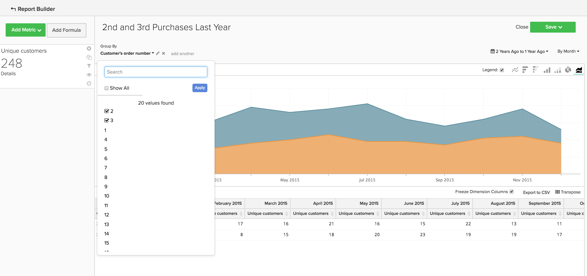
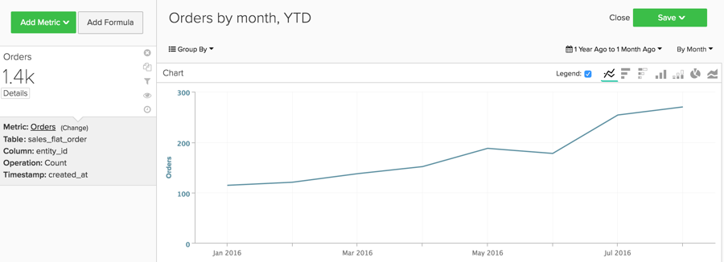
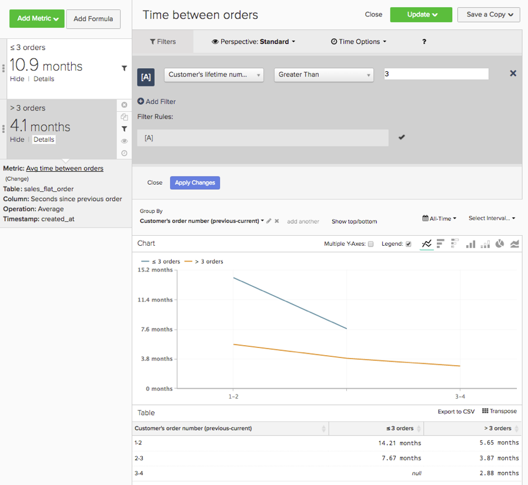
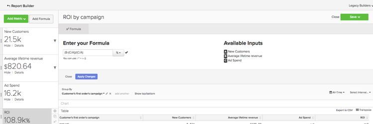

# 基本的な分析

について理解できたら、 [!DNL Adobe Commerce Intelligence] 次にツールの基本を理解したら、レポートの作成を開始します。 よくある質問の 1 つは、「何を見るべきか」です。

次の情報は、役に立つ可能性のある一般的な指標とレポートの一部の概要を示しています。 これらのレポートの一部はアカウント内に存在するので、重複が作成されるのを避けるために、アカウント内に存在する指標とレポートを必ず確認してください。

## 理解したいテーブルと列

指標を作成する際は、次の 4 つの情報を把握している必要があります。

1. データが存在するテーブル、
1. 実行する特定のアクション。
1. アクションの実行対象となる列、および
1. そのデータのトラッキングに使用するタイムスタンプ。

ほとんどの場合、これらの例で使用されるテーブルの名前は、データベースの列名やテーブル名とは少し異なります。これは、各データベースが一意であるためです。 データベース内の対応するテーブルまたは列の識別に関するヘルプが必要な場合は、以下の定義を参照してください。

## 顧客テーブル

このテーブルには、一意の顧客 ID、メールアドレスなど、各顧客に関する主要な情報が含まれています。 以下の例では、を使用しています。 **[!UICONTROL customer_entity]** サンプル顧客テーブルの名前として。

これらの計算の一部が現在データベースに存在しない場合は、アカウント内の管理者ユーザーが計算を作成できます。 また、これらのディメンションが、該当するすべての指標に対してグループ化できるようにする必要もあります。

**Dimension**

* **[!UICONTROL Entity_id]**：各顧客の一意の ID。 これは、一意の顧客番号や顧客のメールアドレスである場合もあり、注文のテーブルへの参照キーとして機能する必要があります。
* **[!UICONTROL Created_at]**：顧客のアカウントが作成され、データベースに追加された日付。
* **[!UICONTROL Customer's lifetime revenue]**：顧客によって生み出された生涯売上高の合計。
* **[!UICONTROL Customer's first 30-day revenue]**：最初の 30 日間に顧客が生成した売上高の合計金額。
* **[!UICONTROL Customer's lifetime number of orders]**：顧客が全期間に行った注文数。
* **[!UICONTROL Customer's lifetime number of coupons]**：顧客が全期間で使用したクーポンの合計数。
* **[!UICONTROL Customer's first order date]**：顧客の初回注文日。 顧客が作成時に注文を行っていない場合は、created_at 日付とは異なる可能性があります。

**ゲストの注文に応じますか？**

*その場合、一部の顧客がこのテーブルに含まれていない可能性があります。 に連絡してください [サポートチーム](https://experienceleague.adobe.com/docs/commerce-knowledge-base/kb/troubleshooting/miscellaneous/mbi-service-policies.html) 顧客の分析にすべての顧客が含まれるようにします。*

*ゲストの注文に同意できるかどうか不明な場合は、 こちらを参照してください [このトピック](../data-warehouse-mgr/guest-orders.md) 詳細情報*

## 注文テーブル

この表では、各行が 1 つの順序を表しています。 このテーブルの列には、注文 ID、作成日、ステータス、注文を行った顧客の ID など、各注文に関する基本的な情報が含まれています。 以下の例では、を使用しています。 **[!UICONTROL sales_flat_order]** サンプル orders テーブルの名前として使用します。

**Dimension**

* **[!UICONTROL Customer_id]**：注文した顧客の一意の ID。 これは、多くの場合、顧客テーブルと注文テーブルの間で情報を移動するために使用されます。 これらの例では、に customer_id を期待しています。 **[!UICONTROL sales_flat_order]** に合わせるテーブル **[!UICONTROL entitiy_id]** 日 **[!UICONTROL customer_entity]** テーブル。
* **[!UICONTROL Created_at]**：注文が作成または発注された日付。
* **[!UICONTROL Customer_email]**：注文を行った顧客のメールアドレス。 これは、顧客の一意の ID である場合もあります。
* **[!UICONTROL Customer's lifetime number of orders]**：上にある同じ名前の列のコピー `Customers` テーブル。
* **[!UICONTROL Customer's order number]**：注文に関連付けられている顧客の連続注文番号。 例えば、表示している行が顧客の最初の注文の場合、この列は「1」ですが、顧客の 15 番目の注文の場合、この列には、この注文の「15」が表示されます。 このディメンションがユーザーに存在しない場合 `Customers` テーブル、質問 [サポートチーム](https://experienceleague.adobe.com/docs/commerce-knowledge-base/kb/troubleshooting/miscellaneous/mbi-service-policies.html) 作成を支援します。
* **[!UICONTROL Customer's order number (previous-current)]**：内の 2 つの値の連結 **[!UICONTROL Customer's order number]** 列。 以下のサンプルレポートで、任意の 2 つの注文間の経過時間を表示するために使用されます。 例えば、顧客の最初の注文日と 2 番目の注文日の間の時間は、この計算では「1-2」として表されます。
* **[!UICONTROL Coupon_code]**：各注文で使用されたクーポンを表示します。
* **[!UICONTROL Seconds since previous order]**：顧客の注文間の時間（秒単位）。

## 注文項目テーブル

この表では、各行は販売された 1 つの品目を表しています。 この表には、受注参照番号、製品番号、数量など、各受注で販売された品目に関する情報が含まれます。 以下の例では、を使用しています。 `sales_flat_order_item` サンプルの order items テーブルの名前として使用します。

**Dimension**

* **[!UICONTROL Item_id]**：テーブルの各行の一意の ID。
* **[!UICONTROL Order_id]**：への参照キー `Orders` 同じ順序で購入された品目を示す表。 1 つの注文に複数の品目が含まれる場合、この値が繰り返されます。
* **[!UICONTROL Product_id]**：購入した特定の製品に関する情報（色、サイズなど）が必要な場合は、この列を使用して製品テーブルからその情報を取り込みます。
* **[!UICONTROL Order's created_at]**：注文されたタイムスタンプ。通常は、にコピーされます `order line items` テーブルを選択 `Orders` テーブル。
* **[!UICONTROL Order's coupon_code]**：に類似しています `Order's created_at` ディメンション。この列は注文テーブルからコピーされます。

## 購読テーブル

このテーブルは、サブスクリプション ID、サブスクライバーの E メールアドレス、サブスクリプション開始日など、サブスクリプション情報の管理に使用されます。

**Dimension**

* **[!UICONTROL Customer_id]**：注文した顧客の一意の ID。 これは、[ 得意先 ] テーブルと [ 受注 ] テーブルの間のパスを作成する一般的な方法です。 これらの例では、に customer_id を期待しています。 **sales_flat_order** に合わせるテーブル `entitiy_id` 日 `customer_entity` テーブル。
* **[!UICONTROL Start date]**：顧客の購読が開始された日付。

## マーケティング費用テーブル

マーケティング費用を分析する際に、次を含めることができます [!DNL Facebook], [!DNL Google AdWords]、または分析内の他のソース。 複数のマーケティング費用ソースがある場合は、にお問い合わせください [Managed Services チーム](https://business.adobe.com/products/magento/fully-managed-service.html) マーケティングキャンペーン用の統合テーブルの設定に関するヘルプ。

**Dimension**

* **[!UICONTROL Spend]**：合計広告費用。 対象： [!DNL Facebook]、これは、の支出列になります `facebook_ads_insights_####` テーブル。 の場合 [!DNL Google AdWords]。のようになります。 `adCost` 列： `campaigns####` テーブル。
* この `####` 各テーブルに追加される ID は、の特定のアカウント ID に関連するものです。 [!DNL Facebook] または [!DNL Google AdWords] アカウント。
* **[!UICONTROL Clicks]**：クリックの合計数。 対象： [!DNL Facebook]、これは `facebook_ads_insights_####` テーブル。 対象： [!DNL Google AdWords]、これは `campaigns####` テーブル。
* **[!UICONTROL Impressions]**：インプレッション数の合計。 対象： [!DNL Facebook]。これは、 `facebook_ads_insights_####` テーブル。 対象： [!DNL Google AdWords]、これはインプレッション数 `campaigns####` テーブル。
* **[!UICONTROL Campaign]**：クリックの合計数。 対象： [!DNL Facebook]。これは `facebook_ads_insights_####` テーブル。 対象： [!DNL Google AdWords]。これは、 `campaigns####` テーブル。
* **[!UICONTROL Date]**：特定のキャンペーンに対してアクティビティ（費用、クリック数またはインプレッション数）が発生した日時。 対象： [!DNL Facebook]。のようになります。 `date_start` 列： `facebook_ads_insights_####` テーブル。 対象： [!DNL Google AdWords]。これは `campaigns####` テーブル。
* **[!UICONTROL Customer's first order's source]**：顧客の最初の注文からの注文のソース。 まず、という名前の列があるかどうかを確認します。 `customer's first order's source` あなたの口座に。 この列が表示されない場合は、次の手順を使用して目的の列を作成できます。
* **[!UICONTROL Customer's first order's medium]**：顧客の最初の注文からの注文のメディア。 まず、という名前の列があるかどうかを確認します。 `customer's first order's source` あなたの口座に。 この列が表示されない場合は、次の手順を使用して目的の列を作成できます。
* **[!UICONTROL Customer's first order's campaign]**：顧客の最初の注文からの注文のキャンペーン。 まず、という名前の列があるかどうかを確認します。 `customer's first order's source` あなたの口座に。 この列が表示されない場合は、次の手順を使用して目的の列を作成できます。

## 一般的なレポートと指標

役に立つ可能性のあるレポートと指標の一般的な例を次に示します。

* [Customer Analytics](#customeranalytics)
* [Order Analytics](#orderanalytics)
* [マーケティング費用分析](#mktgspendanalytics)

## 顧客分析 {#customeranalytics}

### 新規ユーザー

* **説明**：特定の期間に新しく取得したユーザーの合計数のカウント。 `New Users` 次と異なる `Unique Customers`理由： `New Users` サービスでアカウントが作成されたタイムスタンプを持つ（これは必ずしも注文があるという意味ではありません） `Unique Customers` 様は 1 つ以上の注文を行っています。
* **指標の定義**：この指標は、以下を実行します **カウント** 件中 `entity_id` から `customer_entity` 並べ替え順のテーブル `created_at`.
* **レポートの例**：先月作成された新規ユーザーの数
   * **[!UICONTROL Metric]**: `New Users`
   * **[!UICONTROL Time Range]**: `Last Month`
   * **[!UICONTROL Time Interval]**: `By Day`

<!--{: width="929"}-->

### ユニーク顧客

* **説明**：特定期間の個別の顧客の合計数。 次と異なります `New Users`を使用します。これは、少なくとも 1 つの注文を行った顧客のみを追跡するためです。 ユニーク顧客レポートでは、特定の時間間隔で 1 回だけ顧客を追跡します。 時間間隔をに設定した場合 `By Day` また、1 人の顧客がその日に複数の購入を行った場合、その顧客は 1 回だけカウントされます。 一般的な購入数の合計を確認したい場合は、以下を参照してください `Number of Orders`.
* **指標の定義**：この指標は、以下を実行します **個別カウント** 件中 `customer_id` から `sales_flat_order` 並べ替え順のテーブル `created_at`.
* **レポートの例**：過去 90 日間の週別のユニーク顧客
   * **[!UICONTROL Metric]**: `Distinct Customers`
   * **[!UICONTROL Time Range]**: `Moving range > Last 90 Days`
   * **[!UICONTROL Time Interval]**: `By Day`

<!--{: width="929"}-->

### 新規購読者

* **説明**：特定の期間に取得した新しいサブスクライバーの合計数の数。
* **指標の定義**：この指標は、以下を実行します **個別カウント** 件中 `customer_id` から `subscriptions` 並べ替え順のテーブル `start_date`.
* **レポートの例**：今年の新規購読者（月別）
   * **[!UICONTROL Metric]**: `New Subscribers`
   * **[!UICONTROL Time Range]**: `1 Year Ago to 0 Days Ago`
   * **[!UICONTROL Time Interval]**: `By Month`

<!--{: width="929"}-->

### リピート顧客

* **説明**：一定期間に複数の注文を行った顧客の合計数。 リピート顧客レポートでは、 `Distinct Customers` 指標と `Customer's Order Number` からのディメンション `orders` テーブル。
* **使用される指標**: `Distinct Customers`
* **レポートの例**：昨年、2 回目と 3 回目に購入した回数
   * **[!UICONTROL Metric]**: `Distinct Customers`
   * **[!UICONTROL Time Range]**: `Moving Range > Last Year`
   * **[!UICONTROL Time Interval]**: `By Month`
   * **[!UICONTROL Group By]**: `Customer's Order Number`を選択してから、 `2` および `3`

  

* **レポートの例 2**：昨年のリピート顧客の数
   * **[!UICONTROL Metric]**: `Distinct Customers`
   * **[!UICONTROL Filters]**: `Customer's Order Number Greater Than 1`
   * **[!UICONTROL Time Range]**: `Moving range > Last Year`
   * **[!UICONTROL Time Interval]**: `By Month`

  <!--{: width="929"}-->

### 注文のライフタイム数別の上位顧客

* **説明**：注文の合計数に基づく上位の顧客のリスト。 これにより、最も頻繁に買い物客の直接リストが表示されます。
* **使用される指標**: `Orders`
* **レポートの例**：注文のライフタイム数別の上位 25 顧客
   * **[!UICONTROL Metric]**: `Orders`
   * **[!UICONTROL Time Range]**: `All Time`
   * **[!UICONTROL Time Interval]**: `None`
   * **[!UICONTROL Group By]**: `customer_email`
   * **[!UICONTROL Show Top/Bottom]**：注文別に並べ替えられた上位 25

  <!--{: width="929"}-->

### 生涯売上高で上位の顧客

* **説明**：生涯売上高に基づいた上位の顧客のリスト。
* **使用される指標**: `Average Lifetime Revenue`
* **レポートの例**：生涯収益別の上位 25 顧客
   * **[!UICONTROL Metric]**: `Average Lifetime Revenue`
   * **[!UICONTROL Time Range]**: `All time`
   * **[!UICONTROL Time Interval]**: `None`
   * **[!UICONTROL Group By]**: `customer_email`
   * **[!UICONTROL Show Top Bottom]**：生涯収益順の上位 25

  <!--{: width="929"}-->

### コホート別の平均生涯売上高

* **説明**：をトラックします [個別コホートの平均生涯売上高](../dev-reports/lifetime-rev-cohort-analysis.md) のユーザーを経時的に特定して、最もパフォーマンスの高いコホートを特定する。 コホートは、初回注文日や作成日など、共通の日付でグループ化されます。
* **使用される指標**: `Revenue`
* **レポートの例**：コホート別の平均顧客生涯売上高
   * **[!UICONTROL Metric]**: `Revenue`
   * **[!UICONTROL Cohort Date]**: `Customer's first order date`
   * **[!UICONTROL Time Interval]**: `Month`
   * **[!UICONTROL Time Period]**：少なくとも 4 か月のデータを含む最新の 8 つのコホートのセットを移動しています
   * **[!UICONTROL Duration]**: `12 Month(s)`
   * **[!UICONTROL Table]**: `Customer_entity`
   * **[!UICONTROL Perspective]**：コホートメンバーあたりの累積平均値

  <!--{: width="929"}-->

### クーポン使用量別の顧客

* **説明**：クーポン/割引コードを使用した、取得した顧客の数。 これにより、割引希望者と全額購入者を明確に把握できます。
* **使用される指標**: `New Users`
* **レポートの例**：クーポン顧客とクーポン以外の顧客（月別）
   * **[!UICONTROL Metric A]**: `Non coupon customers`
   * **[!UICONTROL Metric]**: `New Users`
   * **[!UICONTROL Filters]**：顧客の 0 より大きい注文のライフタイム数、および顧客の 0 と等しいクーポンのライフタイム数
   * **[!UICONTROL Metric B]**: `Coupon customers`
   * **[!UICONTROL Metric]**: `New Users`
   * **[!UICONTROL Filters]**：顧客の生涯注文数が 0 を超え、顧客の生涯注文数が 0 を超える
   * **[!UICONTROL Time range]**: `All Time`
   * **[!UICONTROL Time interval]**: `By Month`

  <!--{: width="929"}-->

* **レポートの例 2**：クーポン顧客とクーポン以外の顧客の月別の割合
   * **[!UICONTROL Metric A]**: `Non coupon customers` （指標を非表示）
      * **[!UICONTROL Metric]**: `New Users`
      * **[!UICONTROL Filters]**: `Customer's Lifetime Number of Orders Greater Than 0` および `Customer's Lifetime Number of Coupons Equal to 0`
   * **[!UICONTROL Metric B]**: `Coupon customers`
      * **[!UICONTROL Metric]**: `New Users`
      * **[!UICONTROL Filters]**: `Customers Lifetime Number of Orders Greater Than 0` および `Customer's Lifetime Number of Coupons Greater Than 0`
   * **[!UICONTROL Time Range]**: `All Time`
   * **[!UICONTROL Time Interval]**: `By Month`
   * **[!UICONTROL Formula]**: `B/(A+B)`

>[!NOTE]
>
> **すべての指標を非表示**

<!--{: width="929"}-->

### 最初の 30 日間の平均売上高

* **説明**：顧客として最初の 30 日以内に顧客が生成した収益額の平均。
* **指標の説明**：この指標は、次のことを実行します **平均** 件中 `Customer's First 30 Day Revenue` から `customer_entity` 並べ替え順のテーブル `created_at`.
* **レポートの説明**：お客様の最初の 30 日間の売上高の常に平均
* **[!UICONTROL Metric]**: `Average First 30 Day Revenue`
* **[!UICONTROL Time Range]**: `All Time`
* **[!UICONTROL Time Interval]**: `None`

<!--{: width="929"}-->

### 顧客の生涯平均売上高

* **説明**：顧客が全期間で生み出した平均売上高。
* **指標の説明**：この指標は、次のことを実行します **平均** の `Customer's Lifetime Revenue` の列 `customer_entity` に基づくテーブル `created_at`.
* **レポートの説明**：顧客の生涯売上高の常に平均
   * **[!UICONTROL Metric]**: `Average Customer Lifetime Revenue`
   * **[!UICONTROL Time Range]**: `All Time`
   * **[!UICONTROL Time Interval]**: `None`

<!--{: width="929"}-->

## 注文分析 {#orderanalytics}

### 収益

* **説明**：売上高指標は、選択した期間に獲得した合計売上高を表示します。
* このメトリックは、 **sum** 件中 `grand_total` から `sales_flat_order` 並べ替え順のテーブル `created_at`.
* **レポートの例**：月別の売上高、YTD
   * **[!UICONTROL Metric]**: `Revenue`
   * **[!UICONTROL Time Range]**: `1 Year Ago to 1 Month Ago`
   * **時間間隔**: `By Month`

>[!TIP]
>
>売上高指標の計算が、社内で話し合った定義と一致していることを確認します。 例えば、出荷済みの注文からの売上高をカウントしたり、様々な地域の通貨を換算したり、税を除外したりできます。 また、次を使用できます [フィルターセット](../../data-user/reports/ess-manage-data-filters.md) 同じテーブルに基づいて作成されたすべての指標の一貫性を確保する。

<!--{: width="929"}-->

### 注文件数

* **説明**：特定の期間における注文の合計数。 注文レポートは、新製品の提供、プロモーション、またはトランザクション量を増加（または減少）させる可能性のあるその他の要因によって発生した注文量の変化を追跡します。 質問に答えるために、いくつかの変数でこの指標をセグメント化したい場合がよくあります。
* **指標の定義**：この指標は、以下を実行します **カウント** 件中 `entity_id` から `sales_flat_order` 並べ替え順のテーブル `created_at`.
* **レポートの例**：月別の注文数、年累計
   * **[!UICONTROL Metric]**: `number of orders`
   * **[!UICONTROL Time Range]**: `1 Year Ago to 1 Month Ago`
   * **[!UICONTROL Time Interval]**: `By Month`

>[!TIP]
>
>売上高指標と同様に、以下が必要です [フィルターセット](../../data-user/reports/ess-manage-data-filters.md) 未完了、テストまたは返品注文を除外する場所。

<!--{: width="929"}-->

### 注文された製品

* **説明**：注文済み製品指標は、特定の期間に販売された項目の数量を示します。
* **指標の定義**：この指標は、以下を実行します **sum** 件中 `qty_ordered` から `sales_flat_order_item` 並べ替え順のテーブル `created_at`.
* **レポートの例**：月別に販売された商品（年累計）
   * **[!UICONTROL Metric]**: `Products ordered`
   * **[!UICONTROL Time Range]**: `1 Year Ago to 1 Month Ago`
   * **[!UICONTROL Time Interval]**: `By Month`

  <!--{: width="929"}-->

* この指標を注文数指標と組み合わせて、注文あたりの項目数を計算します。 次に、レポートにクーポンコードを追加して、プロモーションが買い物かごのサイズに与える影響を判断したり、新規注文とリピート注文でセグメント化して顧客の行動をより深く理解したりします。
* **レポートの例**：注文あたりの製品数：初回注文とリピート注文
   * **[!UICONTROL Metric A]**：注文された製品：最初の注文
      * **[!UICONTROL Metric]**: `Products ordered`
      * **[!UICONTROL Filter]**: `Customer's order number = 1`
   * **[!UICONTROL Metric B]**：注文件数：初回注文
      * **[!UICONTROL Metric]**: `Orders`
      * **[!UICONTROL Filter]**: `Customer's order number = 1`
   * **[!UICONTROL Metric C]**：注文された製品：リピート注文
      * **[!UICONTROL Metric]**: `Products ordered`
      * **[!UICONTROL Filter]**: `Customer's order number > 1`
   * **[!UICONTROL Metric D]**：注文：リピート注文
      * **[!UICONTROL Metric]**: `Orders`
      * **[!UICONTROL Filter]**: `Customer's order number > 1`
   * **[!UICONTROL Time Range]**: `1 Year Ago to 1 Month Ago`
   * **[!UICONTROL Time Interval]**: `By Week`
   * **[!UICONTROL Formula 1]**: `A/B`
   * **[!UICONTROL Formula 2]**: `C/D`

>[!NOTE]
>
>「」をオフにします `Multiple Y-Axes box` および `Hide` すべての指標

<!--{: width="929"}-->

### 平均注文値

* **説明**：一定期間にわたる注文の平均値を追跡します。 この指標を使用すると、マーケティング活動、製品オファー、ビジネスのその他の変化の結果として平均注文額（AOV）がどのように変動したかをすばやく判断できます。
* **指標の定義**：この指標は、次のことを実行します **平均** 件中 `grand_total` から `sales_flat_order` 並べ替え順のテーブル `created_at`.
* **レポートの例**:AOV と前年、YTD の比較
   * **[!UICONTROL Metric]**: `Average order value`
   * **[!UICONTROL Time Range]**: `1 Year Ago to 1 Month Ago`
   * **[!UICONTROL Time Interval]**: `By Month`
   * **[!UICONTROL Perspective]**: `Amount Change vs Previous Year`

  <!--{: width="929"}-->

### クーポンで最も多く購入された製品

* **説明**：このレポートは、プロモーションやクーポンの提供時に販売されている製品に関するインサイトを提供します。
* **使用される指標**：注文された製品
* **レポートの例**：クーポンで最も多く購入された製品
   * **[!UICONTROL Metric]**: `Products ordered`
   * **[!UICONTROL Filter]**: `Order's coupon_code Is Not \[NULL\]`
   * **[!UICONTROL Time Range]**: `All-Time`
   * **[!UICONTROL Time Interval]**: `None`
   * **[!UICONTROL Group By**]: `name` （または `SKU`、またはその他の製品識別子）
   * **[!UICONTROL Show top/bottom]**：並べ替えられた製品で並べ替えられた上位 25

  <!--{: width="929"}-->

### 注文間の時間

* **説明**：を使用して、顧客の購入サイクルに関する前提と期待をテストします **注文間の時間** 平均（または中央値）を調べる分析 購入間の時間。 次のグラフを見ると、3 つ以上の注文を行った顧客のうち最高の顧客が、6 か月以内に 2 番目の購入を行っていることがわかります。 4 回目の注文を行っていない顧客は、2 回目の購入を行う 14 か月前に待ちます。
* **指標の定義**：この指標は、次のことを実行します **平均** 件中 `Time since previous order` から `sales_flat_order` 並べ替え順 `created_at`.
* **レポートの例**:
   * **指標 1**: ≤ 3 個のオーダー
      * **[!UICONTROL Metric]**: `Average time between orders`
      * **[!UICONTROL Filter]**: `Customer's lifetime number of orders ≤ 3`
   * **指標 2**: > 3 件の注文
      * **[!UICONTROL Metric]**: `Average time between orders`
      * **[!UICONTROL Filter]**: `Customer's lifetime number of orders > 3`
   * **[!UICONTROL Time Range]**: `All-Time`
   * **[!UICONTROL Time Interval]**: `None`
   * **[!UICONTROL Group By]**:` Customer's order number (previous-current)`

>[!NOTE]
>
>「」をオフにします `Multiple Y-Axes` ボックス。

<!--{: width="929"}-->

## マーケティング費用分析 {#mktgspendanalytics}

### 広告費用

* **説明**：キャンペーンや広告セット、またはその他のセグメントごとに、様々な期間と間隔でマーケティング費用を分析できます。
* **指標の定義**：この指標は、の支出列に対して合計を実行します `Marketing Spend` で並べ替えられたテーブル `date` 列。
* **レポートの例**：キャンペーン別の広告費用
   * **[!UICONTROL Metric]**: `Ad spend`
   * **[!UICONTROL Time Range]**: `All-Time`
   * **[!UICONTROL Time Interval]**: `None`
   * **[!UICONTROL Group By]**: `campaign`

<!--{: width="929"}-->

### 広告インプレッション数と広告クリック数

* **説明**：広告費用の分析に加えて、広告インプレッション数と広告クリック数を分析できます。
* **指標の定義**：この指標は、のインプレッション数（またはクリック数）列で合計を実行します `Marketing Spend` 日付列で並べ替えられたテーブル。
* **レポートの例**：インプレッション数および広告クリック数を日別に追加
   * **[!UICONTROL Metric A]**: `Ad impressions`
   * **[!UICONTROL Metric B]**: `Ad clicks`
   * **[!UICONTROL Time Range]**: `1 Year Ago to 3 Months Ago`
   * **[!UICONTROL Time Interval]**: `By Day`

  <!--{: width="929"}-->

### クリックスルー率（CTR）

* **説明**：上記で作成した広告インプレッション数および広告クリック数の指標を使用すると、異なるキャンペーン別のクリックスルー率を経時的に分析できます。
* **レポートの例**：キャンペーン別の CTR
   * **[!UICONTROL Metric A]**: `Ad impressions`
   * **[!UICONTROL Metric B]**: `Ad clicks`
   * **[!UICONTROL Time Range]**:`All-Time`
   * **[!UICONTROL Time Interval]**: `None`
   * **[!UICONTROL Formula]**: `B/A`
   * 「」を選択します `%` オプション。
   * **[!UICONTROL Group By]**: `campaign`

>[!NOTE]
>
>次のことができます **タイトル** 数式を `CTR`、および **非表示** すべての指標。

<!--{: width="929"}-->

### クリック単価（CPC）

* **説明**：上記で作成した広告費用と広告クリック数指標を使用して、異なるキャンペーン別にクリック単価の推移を分析できます。
* **レポートの例**：キャンペーン別の CPC
   * **[!UICONTROL Metric A]**: `Ad spend`
   * **[!UICONTROL Metric B]**: `Ad clicks`
   * **[!UICONTROL Time Range]**: `All-Time`
   * **[!UICONTROL Time Interval]**: `None`
   * **[!UICONTROL Formula]**: `A/B`
   * 「」を選択します `currency` オプション
   * **[!UICONTROL Group By]**: `campaign`

>[!NOTE]
>
>次のことができます **タイトル** 数式を `CPC`、および **非表示** すべての指標。

<!--{: width="929"}-->

### 獲得ソース別の顧客

* **説明**：を使用して注文のソース、標準およびキャンペーンをトラッキングする場合 [!DNL Google eCommerce]を使用すると、顧客の獲得ソース別に顧客を分析できます。 これにより、どのマーケティングソースが顧客を獲得しているかを特定し、「顧客のほとんどは、を通じて最初の注文をしている [!DNL Google], [!DNL Facebook]何か他の情報源はありますか？」
* **レポートの例**：獲得ソース別の顧客
   * **[!UICONTROL Metric Used]**: `New Customers`
   * **[!UICONTROL Time Range]**: `All-Time`
   * **[!UICONTROL Time Interval]**: `By Month`
   * **[!UICONTROL Group By]**: `Customer's first order's source`

>[!NOTE]
>
>チェックアウト [この記事](../analysis/most-value-source-channel.md) 獲得ソースを使用したレポートのその他の例については、を参照してください。

<!--{: width="929"}-->

### 獲得メディア別および獲得キャンペーン別の顧客

* **説明**：獲得ソース別に顧客を分析するのと同様に、初回注文のメディアとキャンペーン別に顧客を分析することもできます。 これは、「新しい顧客を引き付けているのはどのキャンペーンか」といった質問に答えるのに役立ちます。
* **レポートの例**：有料メディアを使用した獲得キャンペーン別の顧客
   * **[!UICONTROL Metric Used]**: `New customers`
   * **[!UICONTROL Filter]**: `Customer's first order's medium IN ppc`
   * **[!UICONTROL Time Range]**: `All-Time`
   * **[!UICONTROL Time Interval]**: `None`
   * **[!UICONTROL Group By]**: `Customer's first order's campaign`

>[!NOTE]
>
>のフィルターの場合 `New Customers` 指標を使用すると、cpc や有料検索など、ビジネスに対して「有料」のメディアと見なされる他のメディアを追加できます。

<!--{: width="929"}-->

### 顧客獲得コスト（CAC）または獲得あたりのコスト（CPA）

* **説明**：キャンペーンのコストを分析する 1 つの方法は、すべてのコストを、キャンペーンで獲得した顧客にのみ関連付けることです。
* **レポートの例**：キャンペーン別の CAC
   * **[!UICONTROL Metric A]**: `New customers`
   * **[!UICONTROL Filter]**: `Customer's first order's medium IN ppc`
   * **[!UICONTROL Metric B]**: `Ad Spend`
   * **[!UICONTROL Time Range]**: `All-Time`
   * **[!UICONTROL Time Interval]**: `None`
   * **[!UICONTROL Formula]**: `B/A`
   * 「」を選択します `currency` オプション
   * **[!UICONTROL Group By]**:
      * 指標の `A`を選択 `Customer's first order's campaign`
      * 指標の `B`を選択 `campaign`

  

>[!NOTE]
>
>次のことができます **タイトル** 数式を `CTR`、および **非表示** すべての指標。 また、以下も確認してください [この記事](../analysis/roi-ad-camp.md) を参照してください。

### 獲得ソース、メディア、キャンペーン別のライフタイム・バリュー

* **説明**：各キャンペーンで取得した顧客数を分析するだけでなく、これらの顧客の平均生涯売上高を分析することもできます。 次の項目を特定するのに役立ちます。
   * 特定のキャンペーンが大量の顧客を引き付けるが、それらの顧客の生涯価値が低い場合。
   * 特定のキャンペーンが少量の顧客を引き付けているが、それらの顧客は高い生涯価値を持っている場合。
* **レポートの例**：まず、 `New customers` 指標。 次に、を追加します `Average lifetime revenue` 指標。 目的の時間枠を選択し、 `interval` as `None`. 最後に、 `group by` オプション`Customer's first order's campaign`.
   * **[!UICONTROL Metric A]**: `New Customers`
   * **[!UICONTROL Filter A]**: `Customer's first order's source` &#39;%google%&#39;に類似
   * **[!UICONTROL Filter B]**: `Customer's first order's medium IN ppc`
   * **[!UICONTROL Metric B]**: `Average lifetime revenue`
   * **[!UICONTROL Filter A]**: `Customer's first order's source` &#39;%google%&#39;に類似
   * **[!UICONTROL Filter B]**: `Customer's first order's medium IN ppc`
   * **[!UICONTROL Time Range]**: `All-Time`
   * **[!UICONTROL Time Interval]**: `None`
   * **[!UICONTROL Group By]**: `Customer's first order's campaign`

>[!NOTE]
>
>2 つのフィルターについて、「有料」メディアと見なされる他のメディア（cpc や有料検索など）を追加できます。 また、分析したい他のソース（Facebookなど）を追加することもできます。 チェックアウト [この記事](../analysis/roi-ad-camp.md) cac、LTV および ROI について詳しくは、こちらを参照してください。

<!--{: width="929"}-->

### ROI （投資収益率）

* **説明**：キャンペーン別に ROI を計算する 1 つの方法は、キャンペーンを通じて行われたすべての注文を分析することです。 ただし、別の方法として、キャンペーンを通じて取得した顧客の生涯価値を分析する方法もあります。 ROI を分析するには、キャンペーン名が支出データとトランザクションデータの間で一貫していることが重要です。 次のレポートを作成し、キャンペーン名が一致しないために ROI 値が存在しない場合は、 [UTM タギング](../../best-practices/utm-tagging-google.md) が実装されました。
* **レポートの例**：キャンペーン別の ROI
   * **[!UICONTROL Metric A]**: `New Customers`
   * **[!UICONTROL Filter A]**: `Customer's first order's source` &#39;%google%&#39;に類似
   * **[!UICONTROL Filter B]**: `Customer's first order's medium IN ppc`
   * **[!UICONTROL Metric B]**: `Average lifetime revenue`
   * **[!UICONTROL Filter A]**: `Customer's first order's source` &#39;%google%&#39;に類似
   * **[!UICONTROL Filter B]**: `Customer's first order's medium IN ppc`
   * **[!UICONTROL Metric C]**: `Ad spend`
   * **[!UICONTROL Time Range]**: `All-Time`
   * **[!UICONTROL Time Interval]**: `None`
   * **[!UICONTROL Formula]**: `(B-(C/A))/(C/A)`
   * 「」を選択します `% `オプション
   * **[!UICONTROL Group By]**:
      * 指標の `A` および `B`を選択 `Customer's first order's campaign`
      * 指標の `C`を選択 `campaign`

>[!NOTE]
>
>数式のタイトルを「ROI」にし、すべての指標を非表示にすることができます。 さらに、指標のフィルターを調整して、代替のソースやメディアを分析することもできます。 また、以下も確認してください [このトピック](../analysis/roi-ad-camp.md) cac、LTV および ROI について詳しくは、こちらを参照してください。

<!--{: width="929"}-->

<!--{: width="929"}-->
