# 基本的な分析

[!DNL Adobe Commerce Intelligence] プラットフォームについて理解し、ツールの基本を理解したら、レポートの作成を開始します。 よくある質問の一つは、「何を見るべきか？」です。

ここでは、価値が高いと思われる一般的な指標とレポートの概要を解説します。 これらのレポートの一部はアカウント内に存在するので、重複を作成しないように、アカウント内に存在する指標とレポートを必ず確認してください。

## 理解したい表と列

指標を構築する際は、次の4つの情報を把握する必要があります。

1. データが格納されているテーブル，
1. 実行したい特定のアクション，
1. そのアクションを実行する列、および
1. そのデータのトラッキングに使用するタイムスタンプ。

ほとんどの場合、これらの例で使用されるテーブルの名前は、各データベースが一意であるため、データベース内のカラム名やテーブル名とは若干異なります。 データベース内の対応するテーブルまたは列の識別に関するヘルプが必要な場合は、以下の定義を参照してください。

## 顧客テーブル

この表には、一意の顧客ID、電子メールアドレスなど、各顧客に関する主要情報が含まれています。 以下の例では、サンプル顧客テーブルの名前として&#x200B;**[!UICONTROL customer_entity]**&#x200B;を使用しています。

これらの計算の一部が現在データベースに存在しない場合は、アカウント内の管理者ユーザーが作成できます。 また、これらのディメンションが該当するすべての指標に対してグループ化できることを確認します。

**ディメンション**

* **[!UICONTROL Entity_id]**：各顧客の一意のID。 これは、一意の顧客番号または顧客のメールアドレスでもよく、注文のテーブルへの参照キーとして機能する必要があります。
* **[!UICONTROL Created_at]**：顧客のアカウントが作成され、データベースに追加された日付。
* **[!UICONTROL Customer's lifetime revenue]**：顧客によって生成された合計生涯売上。
* **[!UICONTROL Customer's first 30-day revenue]**：最初の30日間に顧客が生成した収益の合計金額。
* **[!UICONTROL Customer's lifetime number of orders]**：顧客が生涯にわたって行った注文数。
* **[!UICONTROL Customer's lifetime number of coupons]**：顧客が生涯にわたって使用したクーポンの合計数。
* **[!UICONTROL Customer's first order date]**：顧客の最初の注文日。 顧客が作成時に注文しなかった場合、これはcreated_at日とは異なる場合があります。

**ゲスト注文を受け付けていますか？**

*その場合、このテーブルにはすべての顧客が含まれていない可能性があります。 [ サポートチーム ](https://experienceleague.adobe.com/docs/commerce-knowledge-base/kb/troubleshooting/miscellaneous/mbi-service-policies.html)に連絡して、顧客分析にすべての顧客が含まれていることを確認してください。*

*ゲスト注文を受け入れるかどうかわからない場合は、 詳細については、[このトピック ](../data-warehouse-mgr/guest-orders.md)を参照してください。*

## 注文テーブル

この表では、各行は1つの順序を表します。 この表の列には、注文ID、作成日、ステータス、注文を行った顧客のIDなど、各注文に関する基本情報が含まれています。 以下の例では、**[!UICONTROL sales_flat_order]**&#x200B;をサンプル注文テーブルの名前として使用しています。

**ディメンション**

* **[!UICONTROL Customer_id]**：注文を行った顧客の一意のID。 これは、顧客テーブルと注文テーブルの間で情報を移動するためによく使用されます。 これらの例では、**[!UICONTROL sales_flat_order]** テーブルのcustomer_idが&#x200B;**[!UICONTROL customer_entity]** テーブルの&#x200B;**[!UICONTROL entitiy_id]**&#x200B;と一致することを期待しています。
* **[!UICONTROL Created_at]**：注文が作成または配置された日付。
* **[!UICONTROL Customer_email]**：注文を行った顧客の電子メールアドレス。 これは顧客の一意のIDである可能性もあります。
* **[!UICONTROL Customer's lifetime number of orders]**: `Customers` テーブル上の同じ名前の列のコピー。
* **[!UICONTROL Customer's order number]**：注文に関連付けられている顧客の順序注文番号。 例えば、お客様の最初の注文の行の場合、この列は「1」ですが、お客様の15番目の注文の場合、この列にはこの注文の「15」が表示されます。 このディメンションが`Customers` テーブルに存在しない場合は、[ サポートチーム ](https://experienceleague.adobe.com/docs/commerce-knowledge-base/kb/troubleshooting/miscellaneous/mbi-service-policies.html)に作成を依頼してください。
* **[!UICONTROL Customer's order number (previous-current)]**: **[!UICONTROL Customer's order number]**&#x200B;列の2つの値の連結。 以下のサンプルレポートで、2つの注文の間の経過時間を表示するために使用します。 例えば、顧客の最初の注文日から2番目の注文日までの時間は、この計算で「1-2」と表されます。
* **[!UICONTROL Coupon_code]**：各注文で使用されたクーポンを表示します。
* **[!UICONTROL Seconds since previous order]**：顧客の注文間の時間（秒単位）。

## 注文項目テーブル

この表では、各行は販売された1つの項目を表しています。 この表には、注文参照番号、製品番号、数量など、各注文で販売された品目に関する情報が含まれています。 以下の例では、`sales_flat_order_item`をサンプル注文項目テーブルの名前として使用しています。

**ディメンション**

* **[!UICONTROL Item_id]**: テーブルの各行の一意のID。
* **[!UICONTROL Order_id]**：同じ順序で購入されたアイテムを示す`Orders` テーブルへの参照キー。 注文に複数のアイテムが含まれている場合、この値が繰り返されます。
* **[!UICONTROL Product_id]**：購入した特定の製品に関する情報（色、サイズなど）が必要な場合は、この列を使用して製品テーブルからその情報を取得します。
* **[!UICONTROL Order's created_at]**：注文が配置されたタイムスタンプ。通常、`Orders` テーブルから`order line items` テーブルにコピーされます。
* **[!UICONTROL Order's coupon_code]**: `Order's created_at` ディメンションと同様に、この列は注文テーブルからコピーされます。

## 購読テーブル

この表は、購読ID、購読者の電子メールアドレス、購読開始日など、購読情報を管理するために使用されます。

**ディメンション**

* **[!UICONTROL Customer_id]**：注文を行った顧客の一意のID。 これは、顧客テーブルと受注テーブルの間のパスを構築する一般的な方法です。 これらの例では、**sales_flat_order** テーブルのcustomer_idが`customer_entity` テーブルの`entitiy_id`と一致することを期待しています。
* **[!UICONTROL Start date]**：顧客のサブスクリプションが開始された日付。

## マーケティング支出表

マーケティング費用を分析する際に、[!DNL Facebook]、[!DNL Google AdWords]またはその他のソースを分析に含めることができます。 複数のマーケティング費用ソースがある場合は、[Managed Services チーム ](https://business.adobe.com/products/magento/fully-managed-service.html)に連絡して、マーケティング施策の統合テーブルの設定に関するサポートを受けてください。

**ディメンション**

* **[!UICONTROL Spend]**：合計広告費。 [!DNL Facebook]では、これは`facebook_ads_insights_####` テーブルの支出列になります。 [!DNL Google AdWords]の場合、これは`campaigns####` テーブルの`adCost`列になります。
* これらのテーブルのそれぞれに追加される`####`は、[!DNL Facebook]または[!DNL Google AdWords] アカウントの特定のアカウント IDに関連しています。
* **[!UICONTROL Clicks]**: クリックの合計数。 [!DNL Facebook]では、`facebook_ads_insights_####` テーブルのクリック列になります。 [!DNL Google AdWords]では、これは`campaigns####` テーブルのadClicks列になります。
* **[!UICONTROL Impressions]**: インプレッションの合計数。 [!DNL Facebook]では、これは`facebook_ads_insights_####` テーブルのインプレッションになります。 [!DNL Google AdWords]では、`campaigns####` テーブルのインプレッションになります。
* **[!UICONTROL Campaign]**: クリックの合計数。 [!DNL Facebook]では、これは`facebook_ads_insights_####` テーブルのcampaign_name列になります。 [!DNL Google AdWords]では、これは`campaigns####` テーブルのキャンペーン列になります。
* **[!UICONTROL Date]**：特定のキャンペーンのアクティビティ（支出、クリック、またはインプレッション）が発生した日時。 [!DNL Facebook]では、これは`facebook_ads_insights_####` テーブルの`date_start`列になります。 [!DNL Google AdWords]では、これは`campaigns####` テーブルの日付列になります。
* **[!UICONTROL Customer's first order's source]**：顧客の最初の注文からの注文のソース。 まず、アカウントに`customer's first order's source`という名前の列があるかどうかを確認します。 この列が表示されない場合は、次の手順を使用して目的の列を作成できます。
* **[!UICONTROL Customer's first order's medium]**：顧客の最初の注文からの注文のメディア。 まず、アカウントに`customer's first order's source`という名前の列があるかどうかを確認します。 この列が表示されない場合は、次の手順を使用して目的の列を作成できます。
* **[!UICONTROL Customer's first order's campaign]**：顧客の最初の注文からの注文のキャンペーン。 まず、アカウントに`customer's first order's source`という名前の列があるかどうかを確認します。 この列が表示されない場合は、次の手順を使用して目的の列を作成できます。

## 一般的なレポートと指標

ここでは、役に立つ可能性のあるレポートや指標の一般的な例をいくつか紹介します。

* [顧客分析](#customeranalytics)
* [Order Analytics](#orderanalytics)
* [マーケティング支出分析](#mktgspendanalytics)

## 顧客分析 {#customeranalytics}

### 新規ユーザー

* **説明**：特定の期間に新たに獲得したユーザーの合計数。 `New Users`は`Unique Customers`とは異なります。なぜなら、`New Users`には、アカウントがサービスで作成されたタイムスタンプがあります（これは、必ずしも注文されたとは限りません）。一方、`Unique Customers`は少なくとも1つの注文を行っています。
* **指標の定義**：この指標は、`created_at`によって注文された`customer_entity` テーブルから`entity_id`件中&#x200B;**件の**&#x200B;件を実行します。
* **レポート例**：先月作成された新規ユーザーの数
   * **[!UICONTROL Metric]**: `New Users`
   * **[!UICONTROL Time Range]**: `Last Month`
   * **[!UICONTROL Time Interval]**: `By Day`

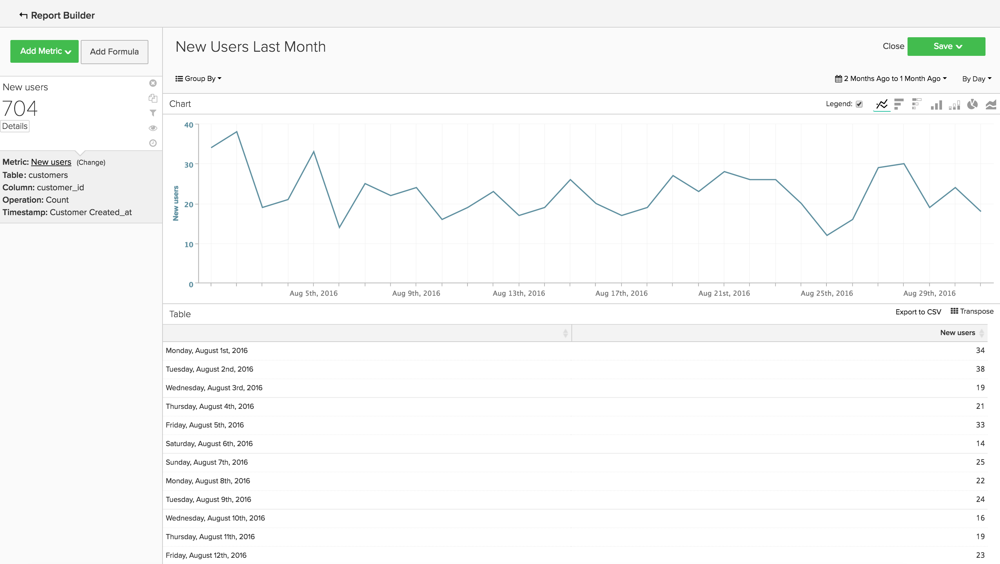<!--{: width="929"}-->

### 個別顧客

* **説明**：特定の期間における個別の顧客の合計数。 これは、`New Users`とは異なります。少なくとも1つの注文を行った顧客のみを追跡するためです。 明確な顧客レポートは、特定の時間間隔で顧客を1回しか追跡しません。 時間間隔を`By Day`に設定し、顧客がその日に複数の購入を行った場合、顧客は1回のみカウントされます。 一般的に購入の合計数を確認する場合は、`Number of Orders`を参照してください。
* **指標の定義**：この指標は、`created_at`によって注文された`sales_flat_order` テーブルから`customer_id`の&#x200B;**個目の個数**&#x200B;を実行します。
* **レポートの例**：過去90日間の週ごとの個別の顧客
   * **[!UICONTROL Metric]**: `Distinct Customers`
   * **[!UICONTROL Time Range]**: `Moving range > Last 90 Days`
   * **[!UICONTROL Time Interval]**: `By Day`

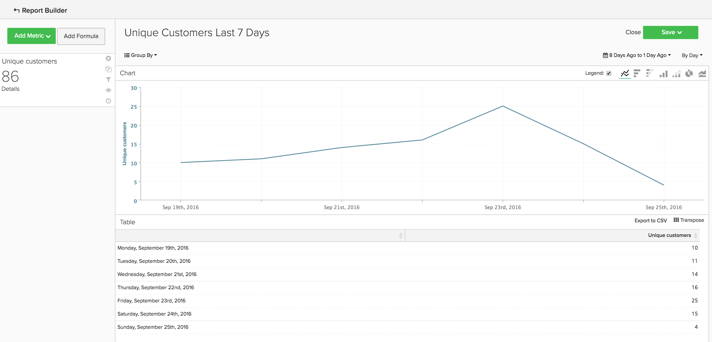<!--{: width="929"}-->

### 新規登録者

* **説明**：特定の期間に獲得した新規購読者の合計数。
* **指標の定義**：この指標は、`start_date`によって注文された`subscriptions` テーブルから`customer_id`の&#x200B;**個目の個数**&#x200B;を実行します。
* **レポートの例**：今月の新規登録者（月別）
   * **[!UICONTROL Metric]**: `New Subscribers`
   * **[!UICONTROL Time Range]**: `1 Year Ago to 0 Days Ago`
   * **[!UICONTROL Time Interval]**: `By Month`

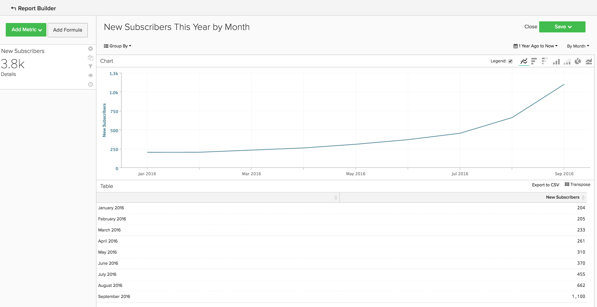<!--{: width="929"}-->

### リピート顧客

* **説明**：一定期間に複数の注文を行った顧客の合計数。 リピート顧客レポートでは、`Distinct Customers`指標と`orders` テーブルの`Customer's Order Number` ディメンションを使用できます。
* **指標が使用されました**: `Distinct Customers`
* **レポートの例**：昨年の2回目および3回目の購入回数
   * **[!UICONTROL Metric]**: `Distinct Customers`
   * **[!UICONTROL Time Range]**: `Moving Range > Last Year`
   * **[!UICONTROL Time Interval]**: `By Month`
   * **[!UICONTROL Group By]**: `Customer's Order Number`を選択してから、`2`と`3`を選択してください

  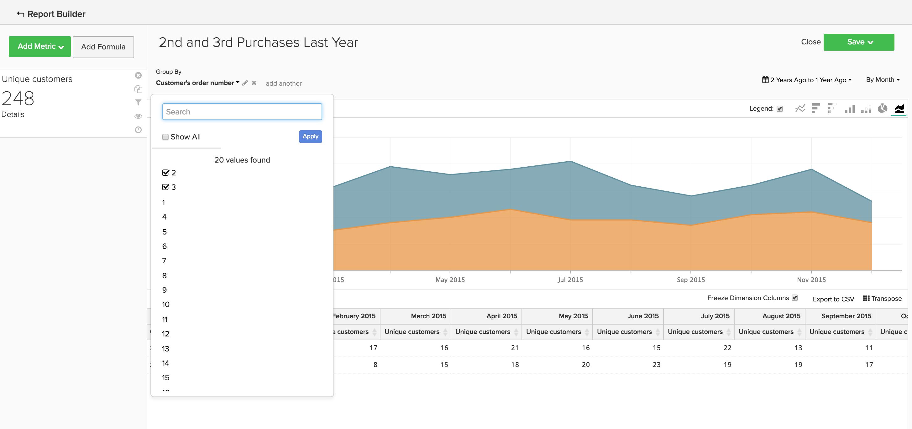

* **レポート例2**：過去1年間のリピート顧客の数
   * **[!UICONTROL Metric]**: `Distinct Customers`
   * **[!UICONTROL Filters]**: `Customer's Order Number Greater Than 1`
   * **[!UICONTROL Time Range]**: `Moving range > Last Year`
   * **[!UICONTROL Time Interval]**: `By Month`

  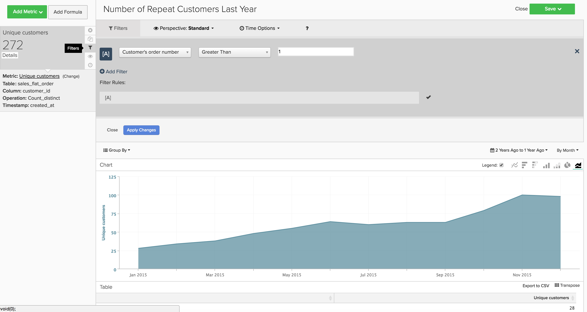<!--{: width="929"}-->

### 生涯注文数別の優良顧客

* **説明**：合計注文数に基づく上位のお客様のリスト。 これにより、最も頻繁に購入する顧客のリストを表示できます。
* **指標が使用されました**: `Orders`
* **レポートの例**：注文生涯数で見た上位25人の顧客
   * **[!UICONTROL Metric]**: `Orders`
   * **[!UICONTROL Time Range]**: `All Time`
   * **[!UICONTROL Time Interval]**: `None`
   * **[!UICONTROL Group By]**: `customer_email`
   * **[!UICONTROL Show Top/Bottom]**：上位25件の並べ替え順

  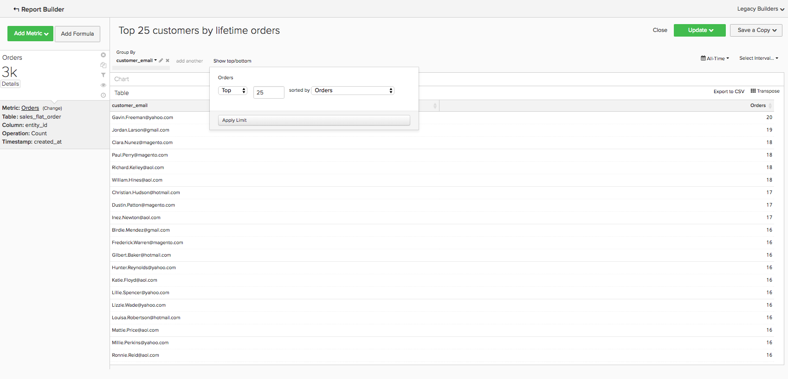<!--{: width="929"}-->

### 生涯収益別の優良顧客

* **説明**：ライフタイム収益に基づく上位の顧客のリスト。
* **指標が使用されました**: `Average Lifetime Revenue`
* **レポートの例**：生涯売上別の上位25人の顧客
   * **[!UICONTROL Metric]**: `Average Lifetime Revenue`
   * **[!UICONTROL Time Range]**: `All time`
   * **[!UICONTROL Time Interval]**: `None`
   * **[!UICONTROL Group By]**: `customer_email`
   * **[!UICONTROL Show Top Bottom]**: トップ 25は生涯収入で並べ替えられました

  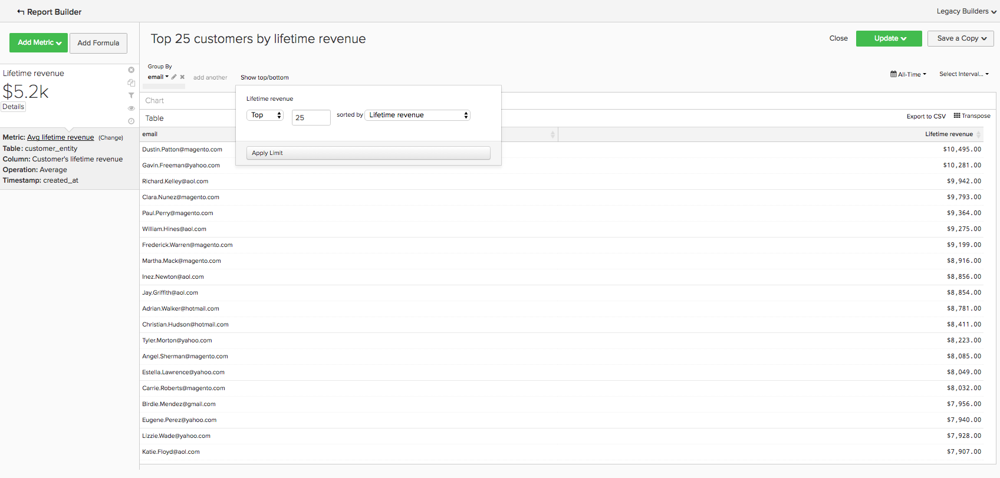<!--{: width="929"}-->

### コホート別平均生涯売上

* **説明**: ユーザーの個別コホート ](../dev-reports/lifetime-rev-cohort-analysis.md)の[平均生涯収益を経時的に追跡して、最もパフォーマンスの高いコホートを特定します。 コホートは、1回目の注文日や作成日など、共通の日付ごとにグループ化されています。
* **指標が使用されました**: `Revenue`
* **レポートの例**：コホート別の平均顧客生涯売上
   * **[!UICONTROL Metric]**: `Revenue`
   * **[!UICONTROL Cohort Date]**: `Customer's first order date`
   * **[!UICONTROL Time Interval]**: `Month`
   * **[!UICONTROL Time Period]**：少なくとも4か月間のデータを持つ最新の8つのコホートの移動セット
   * **[!UICONTROL Duration]**: `12 Month(s)`
   * **[!UICONTROL Table]**: `Customer_entity`
   * **[!UICONTROL Perspective]**: コホートメンバーごとの累積平均値

  コホート別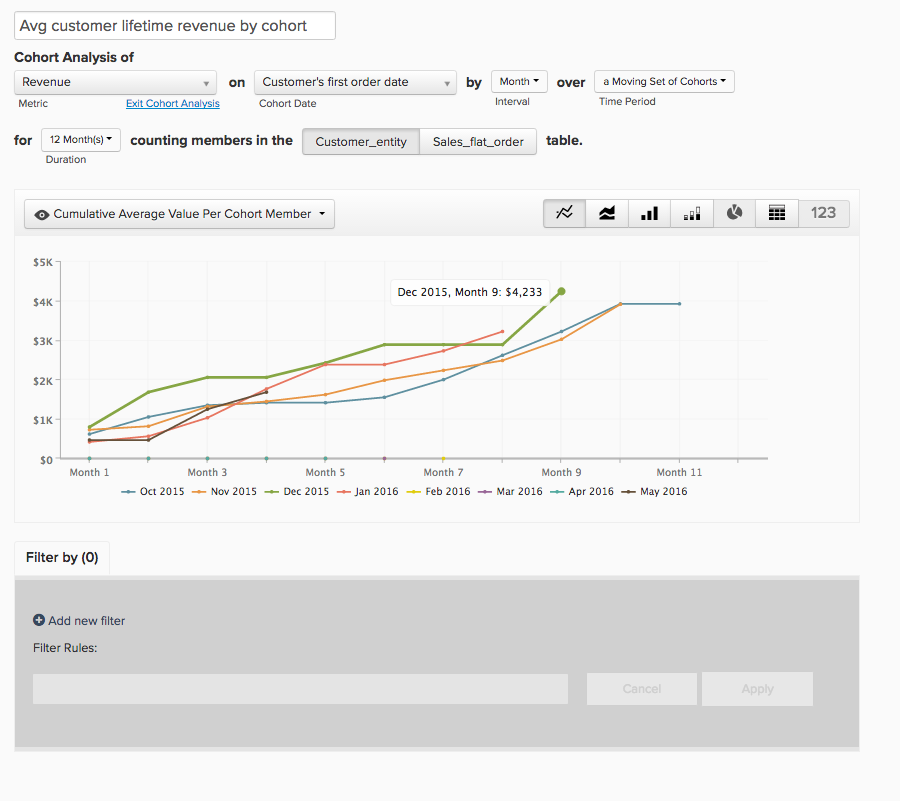<!--{: width="929"}-->

### クーポン利用状況別の顧客

* **説明**: クーポン/割引コードを使用して獲得した顧客の数。 これにより、割引希望者とフルプライス購入者を明確に把握することができます。
* **指標が使用されました**: `New Users`
* **レポートの例**：月ごとのクーポンおよびクーポン以外のお客様
   * **[!UICONTROL Metric A]**: `Non coupon customers`
   * **[!UICONTROL Metric]**: `New Users`
   * **[!UICONTROL Filters]**：顧客の生涯注文数が0を超え、顧客の生涯注文数が0に等しい
   * **[!UICONTROL Metric B]**: `Coupon customers`
   * **[!UICONTROL Metric]**: `New Users`
   * **[!UICONTROL Filters]**：顧客生涯注文数が0より大きく、顧客の生涯注文数が0より大きい
   * **[!UICONTROL Time range]**: `All Time`
   * **[!UICONTROL Time interval]**: `By Month`

  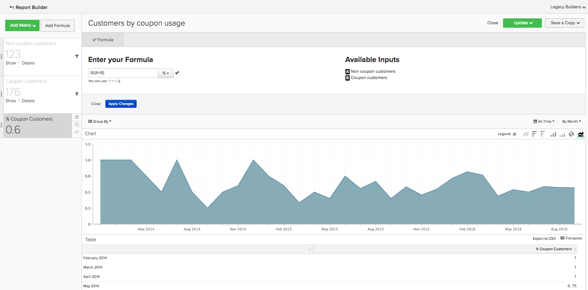<!--{: width="929"}-->

* **レポートの例2**：月ごとのクーポンおよびクーポン以外の顧客の割合
   * **[!UICONTROL Metric A]**: `Non coupon customers` （指標を非表示）
      * **[!UICONTROL Metric]**: `New Users`
      * **[!UICONTROL Filters]**: `Customer's Lifetime Number of Orders Greater Than 0`および`Customer's Lifetime Number of Coupons Equal to 0`
   * **[!UICONTROL Metric B]**: `Coupon customers`
      * **[!UICONTROL Metric]**: `New Users`
      * **[!UICONTROL Filters]**: `Customers Lifetime Number of Orders Greater Than 0`および`Customer's Lifetime Number of Coupons Greater Than 0`
   * **[!UICONTROL Time Range]**: `All Time`
   * **[!UICONTROL Time Interval]**: `By Month`
   * **[!UICONTROL Formula]**: `B/(A+B)`

>[!NOTE]
>
> **すべての指標を非表示**

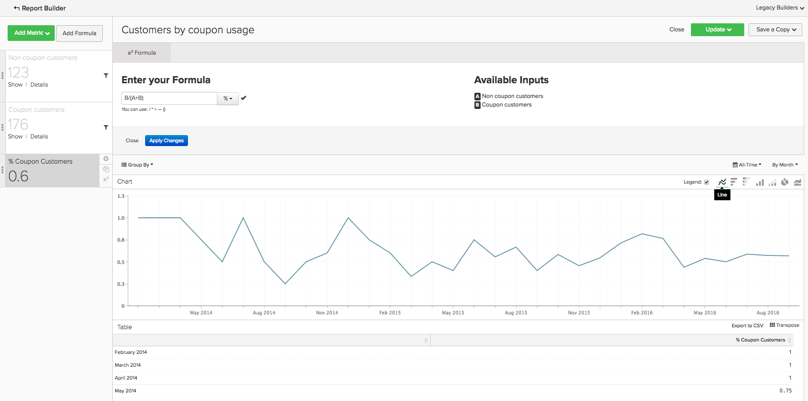<!--{: width="929"}-->

### 最初の30日間の平均収益

* **説明**：顧客として最初の30日以内に顧客が生成した収益額の平均。
* **指標の説明**：この指標は、`created_at`によって注文された`customer_entity` テーブルから`Customer's First 30 Day Revenue`の&#x200B;**平均**&#x200B;を実行します。
* **レポートの説明**：お客様の最初の30日間の収益の全期間平均
   * **[!UICONTROL Metric]**: `Average First 30 Day Revenue`
   * **[!UICONTROL Time Range]**: `All Time`
   * **[!UICONTROL Time Interval]**: `None`

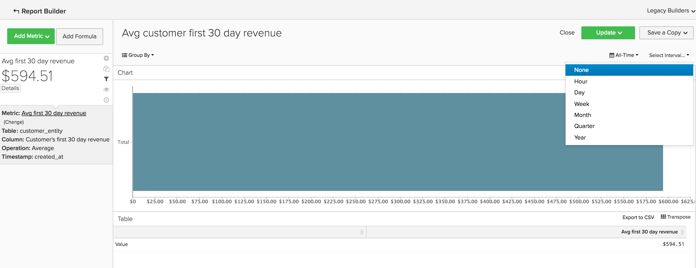<!--{: width="929"}-->

### 平均的な顧客生涯売上

* **説明**：顧客が生涯にわたって生成した平均収益額。
* **指標の説明**：この指標は、`created_at`に基づいて、`customer_entity` テーブルの`Customer's Lifetime Revenue`列のうち&#x200B;**平均**&#x200B;を実行します。
* **レポートの説明**：顧客のライフタイムレベニューの全期間平均
   * **[!UICONTROL Metric]**: `Average Customer Lifetime Revenue`
   * **[!UICONTROL Time Range]**: `All Time`
   * **[!UICONTROL Time Interval]**: `None`

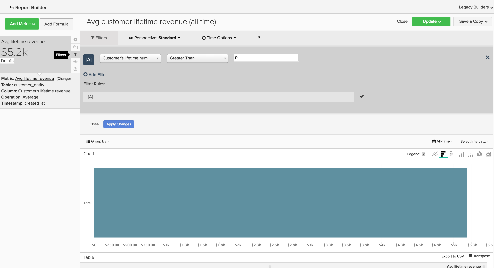<!--{: width="929"}-->

## 注文分析 {#orderanalytics}

### 収益

* **説明**：収益指標には、選択した期間に獲得した合計収益が表示されます。
* この指標は、`created_at`によって注文された`sales_flat_order` テーブルから`grand_total`の&#x200B;**合計**&#x200B;を実行します。
* **レポートの例**：月別、年別
   * **[!UICONTROL Metric]**: `Revenue`
   * **[!UICONTROL Time Range]**: `1 Year Ago to 1 Month Ago`
   * **時間間隔**: `By Month`

>[!TIP]
>
>収益指標の計算が、社内で議論している定義と一致していることを確認しましょう。 例えば、発送された注文の収益をカウントしたり、別の地域の通貨を変換したり、税金を除外したりすることができます。 また、[ フィルターセット ](../../data-user/reports/ess-manage-data-filters.md)を使用して、同じテーブル上に構築されたすべての指標の一貫性を確保することもできます。

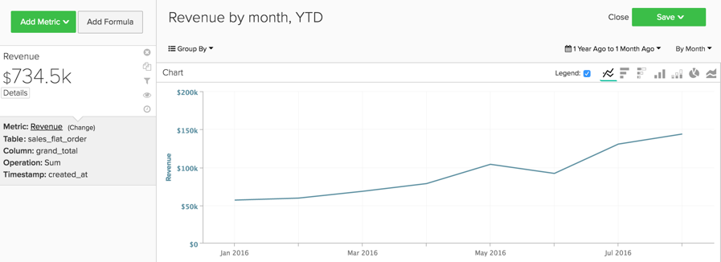<!--{: width="929"}-->

### 注文

* **説明**：特定の期間における合計注文数のカウント。 注文レポートは、新製品のオファーやプロモーションなど、取引量が増加（または減少）する可能性のある要因による注文量の変化を追跡します。 多くの場合、質問の回答を得るために、この指標をいくつかの変数でセグメント化する必要があります。
* **指標の定義**：この指標は、`created_at`によって注文された`sales_flat_order` テーブルから`entity_id`件中&#x200B;**件の**&#x200B;件を実行します。
* **レポートの例**：月別、年別の注文
   * **[!UICONTROL Metric]**: `number of orders`
   * **[!UICONTROL Time Range]**: `1 Year Ago to 1 Month Ago`
   * **[!UICONTROL Time Interval]**: `By Month`

>[!TIP]
>
>収益指標と同様に、不完全な注文、テスト注文、返品注文を除外するために、[ フィルターセット ](../../data-user/reports/ess-manage-data-filters.md)を配置する必要があります。

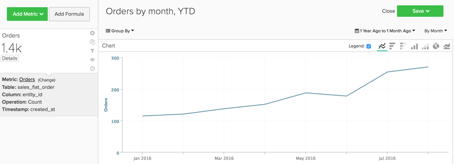<!--{: width="929"}-->

### 注文した製品

* **説明**：注文された製品指標は、特定の期間に販売された品目の数量を示します。
* **指標の定義**：この指標は、`created_at`によって注文された`sales_flat_order_item` テーブルから`qty_ordered`の&#x200B;**合計**&#x200B;を実行します。
* **レポートの例**：月別、年別の販売品目
   * **[!UICONTROL Metric]**: `Products ordered`
   * **[!UICONTROL Time Range]**: `1 Year Ago to 1 Month Ago`
   * **[!UICONTROL Time Interval]**: `By Month`

  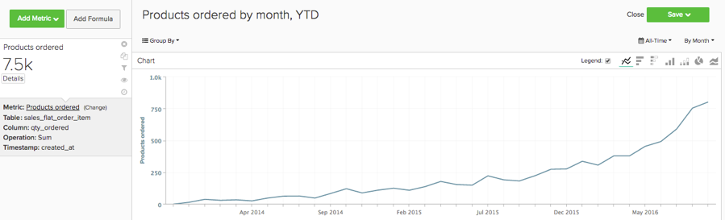<!--{: width="929"}-->

* この指標を注文数指標と組み合わせて、注文あたりのアイテム数を計算します。 次に、レポートにクーポンコードを追加して、プロモーションがカートのサイズにどのような影響を与えるかを決定するか、新規注文とリピート注文でセグメンテーションして、顧客行動をより詳細に把握します。
* **レポートの例**：注文ごとの商品：初回注文とリピート注文
   * **[!UICONTROL Metric A]**：注文された製品：最初の注文
      * **[!UICONTROL Metric]**: `Products ordered`
      * **[!UICONTROL Filter]**: `Customer's order number = 1`
   * **[!UICONTROL Metric B]**：注文：最初の注文
      * **[!UICONTROL Metric]**: `Orders`
      * **[!UICONTROL Filter]**: `Customer's order number = 1`
   * **[!UICONTROL Metric C]**：注文された製品：リピート注文
      * **[!UICONTROL Metric]**: `Products ordered`
      * **[!UICONTROL Filter]**: `Customer's order number > 1`
   * **[!UICONTROL Metric D]**：注文：リピート注文
      * **[!UICONTROL Metric]**: `Orders`
      * **[!UICONTROL Filter]**: `Customer's order number > 1`
   * **[!UICONTROL Time Range]**: `1 Year Ago to 1 Month Ago`
   * **[!UICONTROL Time Interval]**: `By Week`
   * **[!UICONTROL Formula 1]**: `A/B`
   * **[!UICONTROL Formula 2]**: `C/D`

>[!NOTE]
>
>すべての指標`Multiple Y-Axes box`と`Hide`のチェックを外す

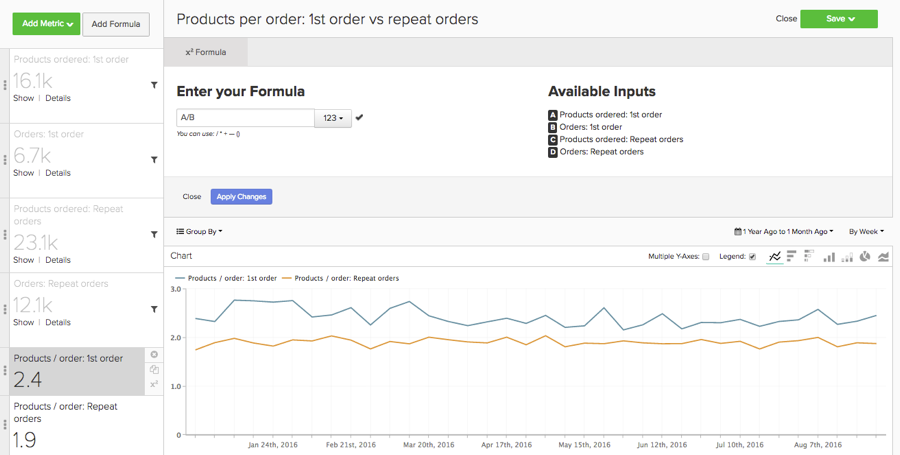<!--{: width="929"}-->

### 平均注文額

* **説明**：一定期間の注文の平均値を追跡します。 この指標は、マーケティング施策、製品オファー、ビジネス内のその他の変化の結果、平均注文額（AOV）がどのように変動したのかを迅速に判断するために使用できます。
* **指標の定義**：この指標は、`created_at`によって注文された`sales_flat_order` テーブルから`grand_total`の&#x200B;**平均**&#x200B;を実行します。
* **レポートの例**:AOVと前年、YTD
   * **[!UICONTROL Metric]**: `Average order value`
   * **[!UICONTROL Time Range]**: `1 Year Ago to 1 Month Ago`
   * **[!UICONTROL Time Interval]**: `By Month`
   * **[!UICONTROL Perspective]**: `Amount Change vs Previous Year`

  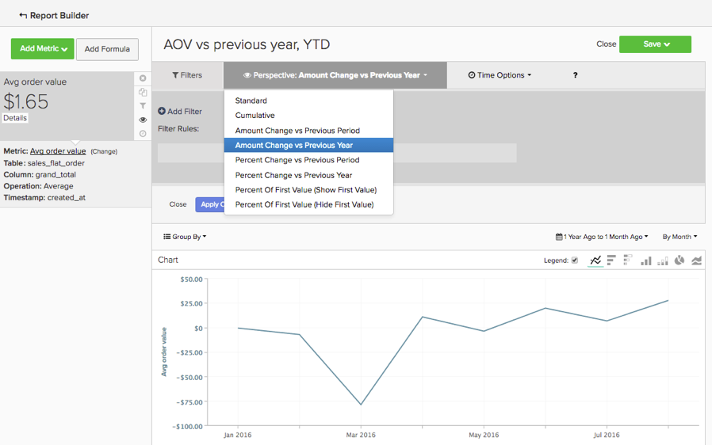<!--{: width="929"}-->

### クーポンで最も購入された製品

* **説明**：このレポートでは、プロモーションやクーポンを提供する際に、どの商品が販売されているかをinsightで確認できます。
* **指標が使用されました**：製品が注文されました
* **レポートの例**：クーポンで最も購入された製品
   * **[!UICONTROL Metric]**: `Products ordered`
   * **[!UICONTROL Filter]**: `Order's coupon_code Is Not \[NULL\]`
   * **[!UICONTROL Time Range]**: `All-Time`
   * **[!UICONTROL Time Interval]**: `None`
   * **[!UICONTROL Group By**]: `name` （または`SKU`、またはその他の製品識別子）
   * **[!UICONTROL Show top/bottom]**：上位25件の並べ替え（注文された製品による）

  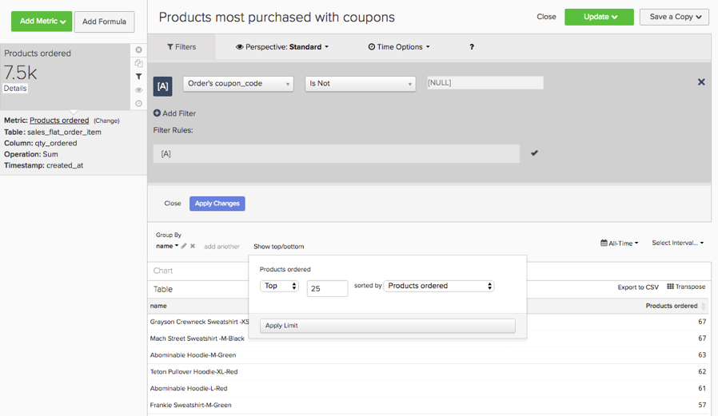<!--{: width="929"}-->

### 注文間の時間

* **説明**：平均（または中央値）を調べる&#x200B;**注文間の時間**&#x200B;分析で、顧客の購入サイクルに関する仮定と期待をテストします。 購入から購入までの時間。 下のグラフでは、最高のお客様（注文が3つ以上の顧客）が6か月以内に2回目の購入を行っていることがわかります。 4回目の注文をしていない顧客は、14 ヶ月待ってから2回目の購入をおこないます。
* **指標の定義**：この指標は、`created_at`様が注文した`sales_flat_order`から`Time since previous order`件中&#x200B;**平均**&#x200B;件を実行します。
* **レポートの例**:
   * **指標1**: ≤ 3件の注文
      * **[!UICONTROL Metric]**: `Average time between orders`
      * **[!UICONTROL Filter]**: `Customer's lifetime number of orders ≤ 3`
   * **指標2**: > 3件の注文
      * **[!UICONTROL Metric]**: `Average time between orders`
      * **[!UICONTROL Filter]**: `Customer's lifetime number of orders > 3`
   * **[!UICONTROL Time Range]**: `All-Time`
   * **[!UICONTROL Time Interval]**: `None`
   * **[!UICONTROL Group By]**:` Customer's order number (previous-current)`

>[!NOTE]
>
>「`Multiple Y-Axes`」ボックスのチェックを外します。

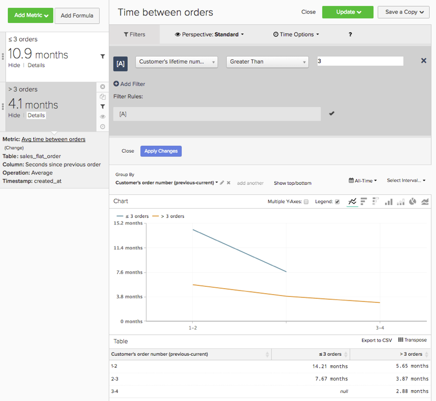<!--{: width="929"}-->

## マーケティング支出分析 {#mktgspendanalytics}

### 広告費

* **説明**：様々な期間と期間、キャンペーンや広告セット、またはその他のセグメントによって、マーケティング費用を分析できます。
* **指標の定義**：この指標は、`date`列が順序付けした`Marketing Spend` テーブルの支出列に対して合計を実行します。
* **レポート例**：キャンペーン別の広告費
   * **[!UICONTROL Metric]**: `Ad spend`
   * **[!UICONTROL Time Range]**: `All-Time`
   * **[!UICONTROL Time Interval]**: `None`
   * **[!UICONTROL Group By]**: `campaign`

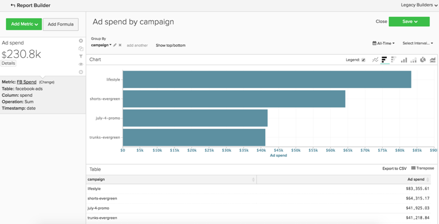<!--{: width="929"}-->

### 広告のインプレッション数と広告クリック数

* **説明**：広告費の分析に加えて、広告インプレッション数と広告クリック数を分析できます。
* **指標の定義**：この指標は、日付列で並べ替えられた`Marketing Spend` テーブルのインプレッション数（またはクリック数）列に対して合計を実行します。
* **レポート例**：日別のインプレッション数と広告クリック数を追加する
   * **[!UICONTROL Metric A]**: `Ad impressions`
   * **[!UICONTROL Metric B]**: `Ad clicks`
   * **[!UICONTROL Time Range]**: `1 Year Ago to 3 Months Ago`
   * **[!UICONTROL Time Interval]**: `By Day`

  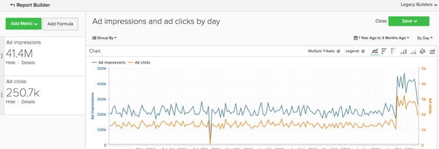<!--{: width="929"}-->

### クリックスルー率（CTR）

* **説明**：上記で作成した広告インプレッション数と広告クリック数の指標を使用すると、時間の経過に伴う様々なキャンペーンによるクリック率を分析できます。
* **レポート例**：キャンペーン別CTR
   * **[!UICONTROL Metric A]**: `Ad impressions`
   * **[!UICONTROL Metric B]**: `Ad clicks`
   * **[!UICONTROL Time Range]**:`All-Time`
   * **[!UICONTROL Time Interval]**: `None`
   * **[!UICONTROL Formula]**: `B/A`
   * 「`%`」オプションを選択します。
   * **[!UICONTROL Group By]**: `campaign`

>[!NOTE]
>
>**title**&#x200B;式を`CTR`として使用し、すべての指標を&#x200B;**非表示**&#x200B;にできます。

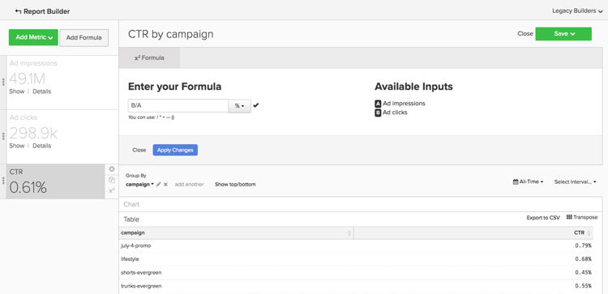<!--{: width="929"}-->

### CPC （クリック単価）

* **説明**：上記で作成した広告費と広告クリック数の指標を使用すると、時間の経過に伴い、様々なキャンペーンでクリック単価を分析できます。
* **レポート例**：キャンペーン別CPC
   * **[!UICONTROL Metric A]**: `Ad spend`
   * **[!UICONTROL Metric B]**: `Ad clicks`
   * **[!UICONTROL Time Range]**: `All-Time`
   * **[!UICONTROL Time Interval]**: `None`
   * **[!UICONTROL Formula]**: `A/B`
   * `currency` オプションを選択
   * **[!UICONTROL Group By]**: `campaign`

>[!NOTE]
>
>**title**&#x200B;式を`CPC`として使用し、すべての指標を&#x200B;**非表示**&#x200B;にできます。

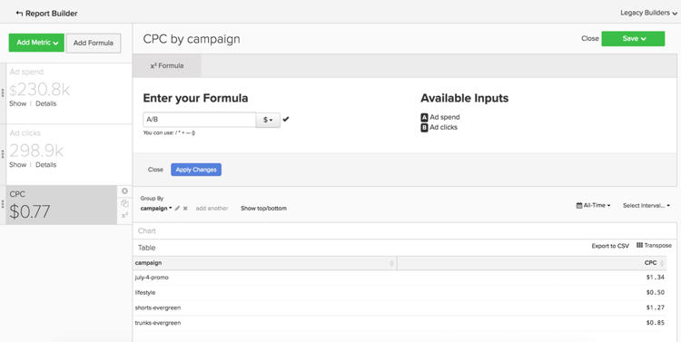<!--{: width="929"}-->

### 顧客別ソース

* **説明**: [!DNL Google eCommerce]を使用して注文のソース、メディア、およびキャンペーンを追跡する場合、顧客を獲得ソースで分析できます。 これにより、顧客を獲得しているマーケティングソースを特定し、「ほとんどの顧客は[!DNL Google]、[!DNL Facebook]またはその他のソースを通じて最初の注文を行っていますか？」などの質問に答えることができます。
* **レポート例**：獲得ソース別の顧客
   * **[!UICONTROL Metric Used]**: `New Customers`
   * **[!UICONTROL Time Range]**: `All-Time`
   * **[!UICONTROL Time Interval]**: `By Month`
   * **[!UICONTROL Group By]**: `Customer's first order's source`

>[!NOTE]
>
>獲得ソースを使用したレポートの例については、[この記事](../analysis/most-value-source-channel.md)を参照してください。

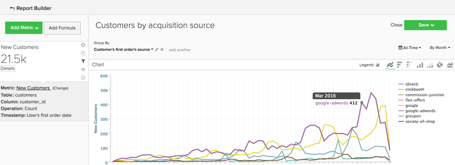<!--{: width="929"}-->

### 顧客獲得媒体と獲得施策別

* **説明**：獲得ソース別に顧客を分析するのと同様に、最初の注文のメディアとキャンペーン別に顧客を分析することもできます。 これは、「新規顧客を惹きつけている施策はどれか」といった質問に対する回答に役立ちます。
* **レポートの例**：有料メディアを使用した獲得キャンペーン別の顧客
   * **[!UICONTROL Metric Used]**: `New customers`
   * **[!UICONTROL Filter]**: `Customer's first order's medium IN ppc`
   * **[!UICONTROL Time Range]**: `All-Time`
   * **[!UICONTROL Time Interval]**: `None`
   * **[!UICONTROL Group By]**: `Customer's first order's campaign`

>[!NOTE]
>
>`New Customers`指標のフィルターでは、cpcや有料検索など、ビジネスの「有料」メディアと見なされるその他のメディアを追加できます。

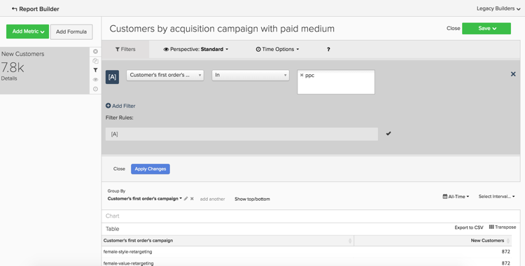<!--{: width="929"}-->

### 顧客獲得コスト（CAC）または獲得単価（CPA）

* **説明**: キャンペーンのコストを分析する方法の1つは、すべてのコストを、キャンペーンを通じて獲得した顧客のみに関連付けることです。
* **レポート例**：キャンペーン別のCAC
   * **[!UICONTROL Metric A]**: `New customers`
   * **[!UICONTROL Filter]**: `Customer's first order's medium IN ppc`
   * **[!UICONTROL Metric B]**: `Ad Spend`
   * **[!UICONTROL Time Range]**: `All-Time`
   * **[!UICONTROL Time Interval]**: `None`
   * **[!UICONTROL Formula]**: `B/A`
   * `currency` オプションを選択
   * **[!UICONTROL Group By]**:
      * 指標`A`で、`Customer's first order's campaign`を選択します
      * 指標`B`で、`campaign`を選択します

  

>[!NOTE]
>
>**title**&#x200B;式を`CTR`として使用し、すべての指標を&#x200B;**非表示**&#x200B;にできます。 また、詳細については、[この記事](../analysis/roi-ad-camp.md)を参照してください。

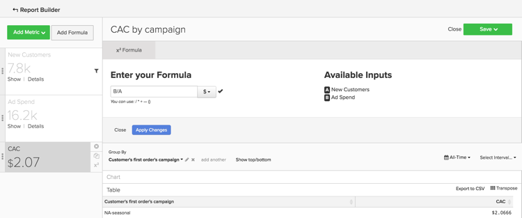

### 獲得ソース、メディア、キャンペーンごとの生涯価値

* **説明**：各キャンペーンで獲得した顧客数を分析すると同時に、これらの顧客の平均生涯売上を分析できます。 これにより、次のことを特定できます。
   * 特定の施策が大量の顧客を惹きつけ、その顧客の生涯価値が低い場合。
   * 特定の施策が少量の顧客を惹きつけ、その顧客の生涯価値が高い場合。
* **レポートの例**：まず`New customers`指標を追加します。 次に、`Average lifetime revenue`指標を追加します。 目的の時間枠を選択し、`interval`を`None`として選択します。 最後に、`group by` オプションを`Customer's first order's campaign`として選択します。
   * **[!UICONTROL Metric A]**: `New Customers`
   * **[!UICONTROL Filter A]**: `Customer's first order's source` （&#39;%google%&#39;など）
   * **[!UICONTROL Filter B]**: `Customer's first order's medium IN ppc`
   * **[!UICONTROL Metric B]**: `Average lifetime revenue`
   * **[!UICONTROL Filter A]**: `Customer's first order's source` （&#39;%google%&#39;など）
   * **[!UICONTROL Filter B]**: `Customer's first order's medium IN ppc`
   * **[!UICONTROL Time Range]**: `All-Time`
   * **[!UICONTROL Time Interval]**: `None`
   * **[!UICONTROL Group By]**: `Customer's first order's campaign`

>[!NOTE]
>
>2つのフィルターでは、ビジネスの「有料」メディアと見なされるその他のメディア（cpcや有料検索など）を追加できます。 Facebookなど、分析したい他のソースを追加することもできます。 CAC、LTV、ROIの詳細については、[この記事](../analysis/roi-ad-camp.md)を参照してください。

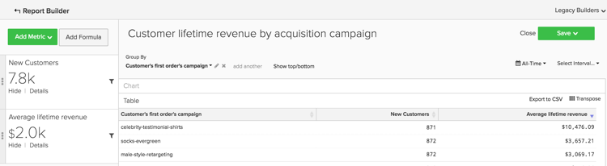<!--{: width="929"}-->

### ROI （投資収益率）

* **説明**: キャンペーン別のROIを計算する1つの方法は、キャンペーンを通じて行われたすべての注文を分析することです。 ただし、別の方法として、施策を通じて獲得した顧客の生涯価値を分析する方法もあります。 ROIを分析するには、キャンペーン名が、支出データとトランザクションデータ全体で一貫していることが重要です。 次のレポートを作成し、キャンペーン名が一致しないためにROI値が存在しない場合は、実装した[UTM タグ ](../../best-practices/utm-tagging-google.md)を調べる必要がある場合があります。
* **レポート例**：施策ごとのROI
   * **[!UICONTROL Metric A]**: `New Customers`
   * **[!UICONTROL Filter A]**: `Customer's first order's source` （&#39;%google%&#39;など）
   * **[!UICONTROL Filter B]**: `Customer's first order's medium IN ppc`
   * **[!UICONTROL Metric B]**: `Average lifetime revenue`
   * **[!UICONTROL Filter A]**: `Customer's first order's source` （&#39;%google%&#39;など）
   * **[!UICONTROL Filter B]**: `Customer's first order's medium IN ppc`
   * **[!UICONTROL Metric C]**: `Ad spend`
   * **[!UICONTROL Time Range]**: `All-Time`
   * **[!UICONTROL Time Interval]**: `None`
   * **[!UICONTROL Formula]**: `(B-(C/A))/(C/A)`
   * `% ` オプションを選択
   * **[!UICONTROL Group By]**:
      * 指標`A`および`B`の場合、`Customer's first order's campaign`を選択します
      * 指標`C`で、`campaign`を選択します

>[!NOTE]
>
>式のタイトルを「ROI」とし、すべての指標を非表示にすることができます。 さらに、指標のフィルターを調整して、代替ソースや媒体を分析することもできます。 また、CAC、LTV、ROIの詳細については、[このトピック ](../analysis/roi-ad-camp.md)を参照してください。

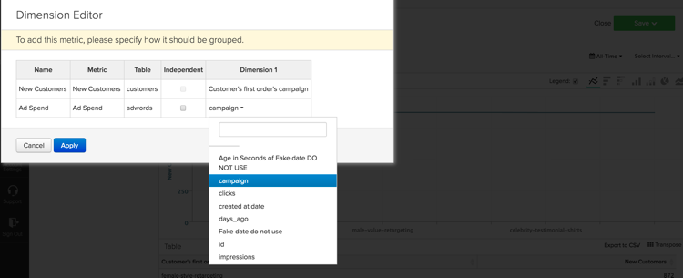<!--{: width="929"}-->

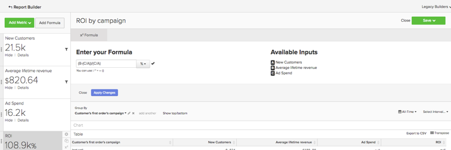<!--{: width="929"}-->
