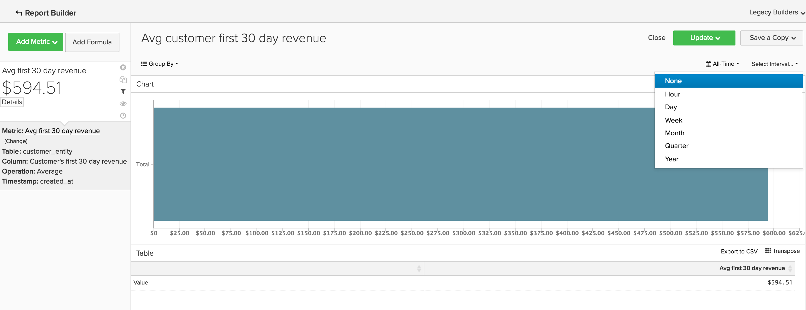

# 基本分析

以前、 [!DNL MBI] プラットフォームを使用し、ツールの基本を理解している場合は、レポートの作成を開始します。 最も一般的な質問の 1 つは、「何を見るべきか」です。

次の情報では、価値のある一般的な指標やレポートの一部を説明します。 アカウント内には既にこれらのレポートが多数存在するので、重複を避けるために、アカウント内に存在する指標とレポートを確認してください。

## 理解したいテーブルおよび列

指標を作成する際には、次の 4 つの情報を把握しておく必要があります。

1. データが置かれているテーブル
1. 実行する特定のアクション
1. そのアクションを実行する列、および
1. そのデータの追跡に使用するタイムスタンプ。

ほとんどの場合、各データベースは一意なので、これらの例で使用するテーブルの名前は、データベース内の列名やテーブル名とは少し異なる可能性があります。 データベース内の対応するテーブルや列を識別する際に役立つ情報については、以下の定義を参照してください。

## 顧客テーブル

このテーブルには、一意の顧客 ID、E メールアドレス、アカウント作成日など、各顧客に関する主要情報が含まれています。 以下の例では、 **[!UICONTROL customer_entity]** をサンプル顧客テーブルの名前として使用します。

これらの計算の一部がデータベースに存在しない場合は、アカウントの管理者ユーザーが作成できます。 さらに、これらのディメンションが、該当するすべての指標でグループ化可能であることを確認する必要があります。

**Dimension**

* **[!UICONTROL Entity_id]**:各顧客の一意の ID。 これは、一意の顧客番号や顧客の E メールアドレスでもかまいません。注文の表の参照キーとして機能する必要があります。
* **[!UICONTROL Created_at]**:顧客アカウントが作成され、データベースに追加された日付。
* **[!UICONTROL Customer's lifetime revenue]**:顧客が生み出した全期間の合計売上高。
* **[!UICONTROL Customer's first 30-day revenue]**:顧客が最初の 30 日間に生み出した売上高の合計。
* **[!UICONTROL Customer's lifetime number of orders]**:顧客が生涯に渡って行った注文の数。
* **[!UICONTROL Customer's lifetime number of coupons]**:顧客が生涯に使用したクーポンの合計数。
* **[!UICONTROL Customer's first order date]**:顧客の初回注文日。 顧客が作成時に注文をしなかった場合は、 created_at 日とは異なる場合があります。

**ゲストによる注文を受け入れますか？**

*その場合、顧客の一部がこのテーブルに含まれていない可能性があります。 お問い合わせ [サポートチーム](https://experienceleague.adobe.com/docs/commerce-knowledge-base/kb/troubleshooting/miscellaneous/mbi-service-policies.html?lang=en) 顧客分析にすべての顧客が含まれるようにします。*

*ゲストによる注文を受け入れるかどうか不明な場合は、 参照： [このトピック](../data-warehouse-mgr/guest-orders.md) 詳細情報：*

## 注文テーブル

この表では、各行が 1 つの順序を表しています。 この表の列には、注文 ID、作成日、ステータス、注文をした顧客の ID など、各注文に関する基本情報が含まれます。 以下の例では、 **[!UICONTROL sales_flat_order]** を、サンプル注文テーブルの名前として設定します。

**Dimension**

* **[!UICONTROL Customer_id]**:注文をした顧客の一意の ID。 これは、多くの場合、顧客テーブルと注文テーブルの間で情報を移動するために使用されます。 この例では、 **[!UICONTROL sales_flat_order]** 整列させるテーブル **[!UICONTROL entitiy_id]** の **[!UICONTROL customer_entity]** 表。
* **[!UICONTROL Created_at]**:注文が作成または配置された日付。
* **[!UICONTROL Customer_email]**:注文をした顧客の電子メールアドレス。 また、顧客の一意の ID である場合もあります。
* **[!UICONTROL Customer's lifetime number of orders]**:同じ名前の列のコピーが `Customers` 表。
* **[!UICONTROL Customer's order number]**:注文に関連付けられた顧客の順次注文番号。 例えば、見ている行が顧客の最初の注文の場合、この列は「1」です。ただし、これが顧客の 15 番目のオーダーの場合、この列にはこのオーダーの「15」と表示されます。 このディメンションが `Customers` テーブルを開け、 [サポートチーム](https://experienceleague.adobe.com/docs/commerce-knowledge-base/kb/troubleshooting/miscellaneous/mbi-service-policies.html?lang=en) を使用して、ビルドを支援します。
* **[!UICONTROL Customer's order number (previous-current)]**:2 つの値を **[!UICONTROL Customer's order number]** 列。 これは、2 つの注文の間の経過時間を表示するために、以下のサンプルレポートで使用されます。 例えば、顧客の最初の注文日から 2 番目の注文日までの時間は、この計算では「1-2」と表されます。
* **[!UICONTROL Coupon_code]**:各注文で使用されたクーポンを表示します。
* **[!UICONTROL Seconds since previous order]**:顧客の注文間隔（秒）。

## 「注文項目」テーブル

この表では、各行が販売された 1 つの項目を表しています。 このテーブルには、注文参照番号、製品番号、数量など、各注文で販売された品目に関する情報が含まれます。 以下の例では、 `sales_flat_order_item` を、サンプルの注文項目テーブルの名前として設定します。

**Dimension**

* **[!UICONTROL Item_id]**:テーブルの各行の一意の ID。
* **[!UICONTROL Order_id]**:参照キー `Orders` 同じ注文で購入された品目を示すテーブル。 1 つの注文に複数の項目が含まれる場合、この値が繰り返されます。
* **[!UICONTROL Product_id]**:購入した特定の製品に関する情報（色、サイズなど）が必要な場合は、この列を使用して製品テーブルからその情報を取り出します。
* **[!UICONTROL Order's created_at]**:注文がおこなわれたタイムスタンプ。通常、 `order line items` テーブル `Orders` 表。
* **[!UICONTROL Order's coupon_code]**:次に類似 `Order's created_at` ディメンションの場合、この列は注文テーブルからコピーされます。

## 購読テーブル

このテーブルは、購読 ID、購読者の E メールアドレス、購読開始日など、購読情報の管理に使用されます。

**Dimension**

* **[!UICONTROL Customer_id]**:注文をした顧客の一意の ID。 これは、 Customers テーブルと Orders テーブルの間のパスを作成する一般的な方法です。 この例では、 **sales_flat_order** 整列させるテーブル `entitiy_id` の `customer_entity` 表。
* **[!UICONTROL Start date]**:顧客のサブスクリプションが開始された日付。

## マーケティング費用テーブル

マーケティング費用を分析する際に、次の項目を含めることができます。 [!DNL Facebook], [!DNL Google AdWords]または分析内の他のソース。 複数のマーケティング費用源がある場合は、 [Managed Services Team](https://business.adobe.com/products/magento/fully-managed-service.html) を参照して、マーケティングキャンペーン用の統合テーブルの設定に役立ちます。

**Dimension**

* **[!UICONTROL Spend]**:合計広告費用。 In [!DNL Facebook]の場合、これは `facebook_ads_insights_####` 表。 の場合 [!DNL Google AdWords]、これは `adCost` 列 `campaigns####` 表。
* この `####` 各テーブルに追加される [!DNL Facebook] または [!DNL Google AdWords] アカウント
* **[!UICONTROL Clicks]**:クリック総数。 In [!DNL Facebook]これは、 `facebook_ads_insights_####` 表。 In [!DNL Google AdWords]の場合、これは、 `campaigns####` 表。
* **[!UICONTROL Impressions]**:インプレッションの合計数。 In [!DNL Facebook]の場合、これは `facebook_ads_insights_####` 表。 In [!DNL Google AdWords]の場合、これはインプレッション数で、 `campaigns####` 表。
* **[!UICONTROL Campaign]**:クリック総数。 In [!DNL Facebook]の場合、これは `facebook_ads_insights_####` 表。 In [!DNL Google AdWords]の場合、これは `campaigns####` 表。
* **[!UICONTROL Date]**:特定のキャンペーンで費やされた時間、クリック数またはインプレッション数が発生したタイムスタンプ。 In [!DNL Facebook]、これは `date_start` 列 `facebook_ads_insights_####` 表。 In [!DNL Google AdWords]の場合、これは `campaigns####` 表。
* **[!UICONTROL Customer's first order's source]**:顧客の最初の注文からの注文のソース。 まず、という名前の列があるかどうかを確認します。 `customer's first order's source` 」と入力します。 この列が表示されない場合は、これらの手順を使用して目的の列を作成できます。
* **[!UICONTROL Customer's first order's medium]**:顧客の最初の注文からの注文のメディア。 まず、という名前の列があるかどうかを確認します。 `customer's first order's source` 」と入力します。 この列が表示されない場合は、これらの手順を使用して目的の列を作成できます。
* **[!UICONTROL Customer's first order's campaign]**:顧客の最初の注文からの注文のキャンペーン。 まず、という名前の列があるかどうかを確認します。 `customer's first order's source` 」と入力します。 この列が表示されない場合は、これらの手順を使用して目的の列を作成できます。

## 一般的なレポートと指標

次に、役立つレポートや指標の一般的な例を示します。

* [Customer Analytics](#customeranalytics)
* [注文分析](#orderanalytics)
* [マーケティング費用分析](#mktgspendanalytics)

## 顧客分析 {#customeranalytics}

### 新規ユーザー

* **説明**:特定の期間に新規に取得したユーザーの総数。 `New Users` 次とは異なる `Unique Customers`で、 `New Users` には、サービスでアカウントが作成された時刻（必ずしも注文をしたとは限りません）が `Unique Customers` 少なくとも 1 つの注文がある
* **指標の定義**:この指標では **カウント** / `entity_id` から `customer_entity` 並べ替えられたテーブル `created_at`.
* **レポートの例**:先月に作成された新規ユーザーの数
   * **[!UICONTROL Metric]**: `New Users`
   * **[!UICONTROL Time Range]**: `Last Month`
   * **[!UICONTROL Time Interval]**: `By Day`

<!--{: width="929"}-->

### ユニーク顧客数

* **説明**:一定期間のユニーク顧客の合計数。 これは、 `New Users`は、少なくとも 1 つの注文をした顧客のみを追跡するので、 ユニーク顧客レポートでは、特定の期間に 1 回のみ顧客を追跡します。 この時間間隔を `By Day` そして、顧客がその日に複数の購入を行った場合、その顧客は 1 回だけカウントされます。 一般的な購入数を確認するには、 `Number of Orders`.
* **指標の定義**:この指標では **個別カウント** / `customer_id` から `sales_flat_order` 並べ替えられたテーブル `created_at`.
* **レポートの例**:過去 90 日間のユニーク顧客を週別に表示
   * **[!UICONTROL Metric]**: `Distinct Customers`
   * **[!UICONTROL Time Range]**: `Moving range > Last 90 Days`
   * **[!UICONTROL Time Interval]**: `By Day`

<!--{: width="929"}-->

### 新規購読者

* **説明**:一定期間に獲得した新規購読者の総数。
* **指標の定義**:この指標では **個別カウント** / `customer_id` から `subscriptions` 並べ替えられたテーブル `start_date`.
* **レポートの例**:今年の新規購読者（月別）
   * **[!UICONTROL Metric]**: `New Subscribers`
   * **[!UICONTROL Time Range]**: `1 Year Ago to 0 Days Ago`
   * **[!UICONTROL Time Interval]**: `By Month`

<!--{: width="929"}-->

### リピート顧客

* **説明**:一定期間に複数の注文をした顧客の合計数。 リピート顧客レポートでは、 `Distinct Customers` 指標と `Customer's Order Number` ディメンションから `orders` 表。
* **使用指標**: `Distinct Customers`
* **レポートの例**:昨年に行われた第 2 および第 3 の購入の数
   * **[!UICONTROL Metric]**: `Distinct Customers`
   * **[!UICONTROL Time Range]**: `Moving Range > Last Year`
   * **[!UICONTROL Time Interval]**: `By Month`
   * **[!UICONTROL Group By]**: `Customer's Order Number`を選択し、「 `2` および `3`

   

* **レポートの例 2**:昨年のリピート顧客数
   * **[!UICONTROL Metric]**: `Distinct Customers`
   * **[!UICONTROL Filters]**: `Customer's Order Number Greater Than 1`
   * **[!UICONTROL Time Range]**: `Moving range > Last Year`
   * **[!UICONTROL Time Interval]**: `By Month`

   <!--{: width="929"}-->

### 全期間注文件数別の上位顧客

* **説明**:注文の合計数に基づく、上位の顧客のリスト。 これにより、最も頻繁に買い物客の直接リストが表示されます。
* **使用指標**: `Orders`
* **レポートの例**:全期間注文件数別上位 25 件の顧客
   * **[!UICONTROL Metric]**: `Orders`
   * **[!UICONTROL Time Range]**: `All Time`
   * **[!UICONTROL Time Interval]**: `None`
   * **[!UICONTROL Group By]**: `customer_email`
   * **[!UICONTROL Show Top/Bottom]**:上位 25 件の注文で並べ替え

   <!--{: width="929"}-->

### 全期間売上高別の上位顧客

* **説明**:全期間売上高に基づく上位の顧客のリスト。
* **使用指標**: `Average Lifetime Revenue`
* **レポートの例**:全期間売上高別上位 25 件の顧客
   * **[!UICONTROL Metric]**: `Average Lifetime Revenue`
   * **[!UICONTROL Time Range]**: `All time`
   * **[!UICONTROL Time Interval]**: `None`
   * **[!UICONTROL Group By]**: `customer_email`
   * **[!UICONTROL Show Top Bottom]**:上位 25 件を全期間売上高で並べ替え

   <!--{: width="929"}-->

### コホート別の平均ライフタイム売上高

* **説明**:追跡 [ユニークコホートの平均全期間売上高](../dev-reports/lifetime-rev-cohort-analysis.md) を使用して、実績の高いコホートを特定できます。 コホートは、1 回目の注文日や作成日など、一般的な日付でグループ化されます。
* **使用指標**: `Revenue`
* **レポートの例**:コホート別平均顧客ライフタイム売上高
   * **[!UICONTROL Metric]**: `Revenue`
   * **[!UICONTROL Cohort Date]**: `Customer's first order date`
   * **[!UICONTROL Time Interval]**: `Month`
   * **[!UICONTROL Time Period]**:最新の 8 つのコホートのコホートセット（少なくとも 4 か月のデータを含む）の移動
   * **[!UICONTROL Duration]**: `12 Month(s)`
   * **[!UICONTROL Table]**: `Customer_entity`
   * **[!UICONTROL Perspective]**:コホートメンバーごとの累積平均値

   <!--{: width="929"}-->

### クーポン使用別の顧客

* **説明**:クーポン/割引コードを使用した、獲得した顧客の数。 これは、割引訪問者と定価購入者を明確に把握するのに役立ちます。
* **使用指標**: `New Users`
* **レポートの例**:月別クーポンおよび非クーポン顧客
   * **[!UICONTROL Metric A]**: `Non coupon customers`
   * **[!UICONTROL Metric]**: `New Users`
   * **[!UICONTROL Filters]**:顧客の全期間の注文件数が 0 より大きく、顧客の全期間のクーポン数が 0 に等しい
   * **[!UICONTROL Metric B]**: `Coupon customers`
   * **[!UICONTROL Metric]**: `New Users`
   * **[!UICONTROL Filters]**:顧客の全期間注文件数が 0 より大きい、および顧客の全期間に 0 より大きいクーポンの数
   * **[!UICONTROL Time range]**: `All Time`
   * **[!UICONTROL Time interval]**: `By Month`

   <!--{: width="929"}-->

* **レポートの例 2**:月別クーポンおよび非クーポンの顧客の割合
   * **[!UICONTROL Metric A]**: `Non coupon customers` （指標を非表示）
      * **[!UICONTROL Metric]**: `New Users`
      * **[!UICONTROL Filters]**: `Customer's Lifetime Number of Orders Greater Than 0` および `Customer's Lifetime Number of Coupons Equal to 0`
   * **[!UICONTROL Metric B]**: `Coupon customers`
      * **[!UICONTROL Metric]**: `New Users`
      * **[!UICONTROL Filters]**: `Customers Lifetime Number of Orders Greater Than 0` および `Customer's Lifetime Number of Coupons Greater Than 0`
   * **[!UICONTROL Time Range]**: `All Time`
   * **[!UICONTROL Time Interval]**: `By Month`
   * **[!UICONTROL Formula]**: `B/(A+B)`

>[!NOTE]
>
> **すべての指標を非表示**

<!--{: width="929"}-->

### 平均最初の 30 日間の売上高

* **説明**:顧客が最初の 30 日間に生み出した売上高の平均。
* **指標の説明**:この指標では **平均** / `Customer's First 30 Day Revenue` から `customer_entity` 並べ替えられたテーブル `created_at`.
* **レポートの説明**:顧客の最初の 30 日間の売上高の全時間平均
* **[!UICONTROL Metric]**: `Average First 30 Day Revenue`
* **[!UICONTROL Time Range]**: `All Time`
* **[!UICONTROL Time Interval]**: `None`

<!--{: width="929"}-->

### 平均顧客ライフタイム売上高

* **説明**:顧客が生涯にわたって生み出した売上高の平均金額。
* **指標の説明**:この指標では **平均** の `Customer's Lifetime Revenue` 列 `customer_entity` 次に基づく表 `created_at`.
* **レポートの説明**:顧客の全期間平均売上高
   * **[!UICONTROL Metric]**: `Average Customer Lifetime Revenue`
   * **[!UICONTROL Time Range]**: `All Time`
   * **[!UICONTROL Time Interval]**: `None`

<!--{: width="929"}-->

## 注文分析 {#orderanalytics}

### 売上高

* **説明**:売上高指標は、選択した期間に対する合計売上高を表示します。
* この指標では **sum** / `grand_total` から `sales_flat_order` 並べ替えられたテーブル `created_at`.
* **レポートの例**:月別収益、年度累計
   * **[!UICONTROL Metric]**: `Revenue`
   * **[!UICONTROL Time Range]**: `1 Year Ago to 1 Month Ago`
   * **時間間隔**: `By Month`

>[!TIP]
>
>売上高指標の計算が、社内で話し合った定義と一致していることを確認します。 例えば、出荷済の注文からの収益のみをカウントし、異なる地域の通貨を換算し、税金を除外する必要がある場合があります。 さらに、 [フィルターセット](../../data-user/reports/ess-manage-data-filters.md) 同じテーブルに作成されたすべての指標の一貫性を確保するため。

<!--{: width="929"}-->

### 注文

* **説明**:一定期間の注文件数の合計。 注文レポートでは、新しい製品やプロモーション、その他のトランザクション量の増加（または減少）につながるすべての注文量の変化を追跡します。 多くの場合、この指標を多数の変数でセグメント化し、質問に答える必要があります。
* **指標の定義**:この指標では **カウント** / `entity_id` から `sales_flat_order` 並べ替えられたテーブル `created_at`.
* **レポートの例**:月別の注文、年度累計
   * **[!UICONTROL Metric]**: `number of orders`
   * **[!UICONTROL Time Range]**: `1 Year Ago to 1 Month Ago`
   * **[!UICONTROL Time Interval]**: `By Month`

>[!TIP]
>
>売上高指標と同様に、 [フィルターセット](../../data-user/reports/ess-manage-data-filters.md) 不完全な注文、テスト注文、返品注文を除外する場合。

<!--{: width="929"}-->

### 注文された製品

* **説明**:注文された製品指標は、特定の期間に販売された品目の数を示します。
* **指標の定義**:この指標では **sum** / `qty_ordered` から `sales_flat_order_item` 並べ替えられたテーブル `created_at`.
* **レポートの例**:月別販売品目（年度累計）
   * **[!UICONTROL Metric]**: `Products ordered`
   * **[!UICONTROL Time Range]**: `1 Year Ago to 1 Month Ago`
   * **[!UICONTROL Time Interval]**: `By Month`

   <!--{: width="929"}-->

* この指標を注文件数指標と組み合わせて、注文あたりの品目数を計算します。 次に、クーポンコードをレポートに追加して、プロモーションが買い物かごのサイズに与える影響を判断したり、新規注文とリピート注文でセグメント化して、顧客の行動をより深く理解したりします。
* **レポートの例**:オーダーあたりの製品数：1 番目の注文とリピート注文
   * **[!UICONTROL Metric A]**:注文された製品：1 位
      * **[!UICONTROL Metric]**: `Products ordered`
      * **[!UICONTROL Filter]**: `Customer's order number = 1`
   * **[!UICONTROL Metric B]**:購入回数：1 位
      * **[!UICONTROL Metric]**: `Orders`
      * **[!UICONTROL Filter]**: `Customer's order number = 1`
   * **[!UICONTROL Metric C]**:注文された製品：繰り返し注文
      * **[!UICONTROL Metric]**: `Products ordered`
      * **[!UICONTROL Filter]**: `Customer's order number > 1`
   * **[!UICONTROL Metric D]**:購入回数：注文を繰り返す
      * **[!UICONTROL Metric]**: `Orders`
      * **[!UICONTROL Filter]**: `Customer's order number > 1`
   * **[!UICONTROL Time Range]**: `1 Year Ago to 1 Month Ago`
   * **[!UICONTROL Time Interval]**: `By Week`
   * **[!UICONTROL Formula 1]**: `A/B`
   * **[!UICONTROL Formula 2]**: `C/D`

>[!NOTE]
>
>「 `Multiple Y-Axes box` および `Hide` すべての指標

<!--{: width="929"}-->

### 平均注文額

* **説明**:一定期間にわたる注文の平均値を追跡します。 この指標を使用して、マーケティング活動、製品提供、その他のビジネスの変化に伴う平均注文額 (AOV) の変動をすばやく判断します。
* **指標の定義**:この指標では **平均** / `grand_total` から `sales_flat_order` 並べ替えられたテーブル `created_at`.
* **レポートの例**:AOV 対前年、年度累計
   * **[!UICONTROL Metric]**: `Average order value`
   * **[!UICONTROL Time Range]**: `1 Year Ago to 1 Month Ago`
   * **[!UICONTROL Time Interval]**: `By Month`
   * **[!UICONTROL Perspective]**: `Amount Change vs Previous Year`

   <!--{: width="929"}-->

### クーポンで最も多く購入した製品

* **説明**:このレポートは、プロモーションやクーポンを提供する際にどの製品が販売されているかに関するインサイトを提供します。
* **使用された指標**:注文された製品
* **レポートの例**:クーポンで最も多く購入した製品
   * **[!UICONTROL Metric]**: `Products ordered`
   * **[!UICONTROL Filter]**: `Order's coupon_code Is Not \[NULL\]`
   * **[!UICONTROL Time Range]**: `All-Time`
   * **[!UICONTROL Time Interval]**: `None`
   * **[!UICONTROL Group By**]: `name` ( または `SKU`、またはその他の製品識別子 )
   * **[!UICONTROL Show top/bottom]**:上位 25 件（注文商品別）

   <!--{: width="929"}-->

### 注文間の時間

* **説明**:顧客の購入サイクルに関する前提と期待を、 **注文間の時間** 平均（中央値）を見る分析 購入間隔。 以下のグラフでは、3 回以上の注文をした顧客が 6 ヶ月以内に 2 回目の購入を行ったことがわかります。 4 回目の注文をしていないお客様は、14 ヶ月待ってから 2 回目の購入をおこないます。
* **指標の定義**:この指標では **平均** / `Time since previous order` から `sales_flat_order` 発注元 `created_at`.
* **レポートの例**:
   * **指標 1**:≤ 3 注文
      * **[!UICONTROL Metric]**: `Average time between orders`
      * **[!UICONTROL Filter]**: `Customer's lifetime number of orders ≤ 3`
   * **指標 2**:3 件の注文
      * **[!UICONTROL Metric]**: `Average time between orders`
      * **[!UICONTROL Filter]**: `Customer's lifetime number of orders > 3`
   * **[!UICONTROL Time Range]**: `All-Time`
   * **[!UICONTROL Time Interval]**: `None`
   * **[!UICONTROL Group By]**:` Customer's order number (previous-current)`

>[!NOTE]
>
>「 `Multiple Y-Axes` ボックス

<!--{: width="929"}-->

## マーケティング費用分析 {#mktgspendanalytics}

### 広告費用

* **説明**:キャンペーンや広告セット、または他のセグメント化によって、様々な期間や間隔でマーケティング費用を分析できます。
* **指標の定義**:この指標では、 `Marketing Spend` ～で並べられたテーブル `date` 列。
* **レポートの例**:キャンペーン別広告費用
   * **[!UICONTROL Metric]**: `Ad spend`
   * **[!UICONTROL Time Range]**: `All-Time`
   * **[!UICONTROL Time Interval]**: `None`
   * **[!UICONTROL Group By]**: `campaign`

<!--{: width="929"}-->

### 広告インプレッション数と広告クリック数

* **説明**:広告費用の分析に加えて、広告インプレッション数および広告クリック数を分析できます。
* **指標の定義**:この指標では、 `Marketing Spend` 日付列で並べ替えられたテーブル。
* **レポートの例**:日別インプレッション数および広告クリック数の追加
   * **[!UICONTROL Metric A]**: `Ad impressions`
   * **[!UICONTROL Metric B]**: `Ad clicks`
   * **[!UICONTROL Time Range]**: `1 Year Ago to 3 Months Ago`
   * **[!UICONTROL Time Interval]**: `By Day`

   <!--{: width="929"}-->

### クリックスルー率 (CTR)

* **説明**:上記で作成した広告インプレッション数および広告クリック数指標を使用して、様々なキャンペーンによるクリックスルー率を経時的に分析できます。
* **レポートの例**:キャンペーン別 CTR
   * **[!UICONTROL Metric A]**: `Ad impressions`
   * **[!UICONTROL Metric B]**: `Ad clicks`
   * **[!UICONTROL Time Range]**:`All-Time`
   * **[!UICONTROL Time Interval]**: `None`
   * **[!UICONTROL Formula]**: `B/A`
   * を選択します。 `%` オプション。
   * **[!UICONTROL Group By]**: `campaign`

>[!NOTE]
>
>以下が可能です。 **タイトル** 次の式 `CTR`、および **非表示** すべての指標。

<!--{: width="929"}-->

### クリック単価 (CPC)

* **説明**:上記で作成した広告費用と広告クリック数の指標を使用すると、様々なキャンペーンによって経時的にクリックあたりのコストを分析できます。
* **レポートの例**:キャンペーンごとの CPC
   * **[!UICONTROL Metric A]**: `Ad spend`
   * **[!UICONTROL Metric B]**: `Ad clicks`
   * **[!UICONTROL Time Range]**: `All-Time`
   * **[!UICONTROL Time Interval]**: `None`
   * **[!UICONTROL Formula]**: `A/B`
   * を選択します。 `currency` オプション
   * **[!UICONTROL Group By]**: `campaign`

>[!NOTE]
>
>以下が可能です。 **タイトル** 次の式 `CPC`、および **非表示** すべての指標。

<!--{: width="929"}-->

### 顧客 — 獲得ソース別

* **説明**:次を使用して注文のソース、メディア、キャンペーンを追跡する場合： [!DNL Google eCommerce]を使用すると、顧客の獲得ソース別に顧客を分析できます。 これにより、顧客を獲得しているマーケティングソースを特定し、「はほとんどの顧客がを通じて最初の注文をする場合、 [!DNL Google], [!DNL Facebook]他の情報源か？」
* **レポートの例**:顧客 — 獲得ソース別
   * **[!UICONTROL Metric Used]**: `New Customers`
   * **[!UICONTROL Time Range]**: `All-Time`
   * **[!UICONTROL Time Interval]**: `By Month`
   * **[!UICONTROL Group By]**: `Customer's first order's source`

>[!NOTE]
>
>チェックアウト [この記事](../analysis/most-value-source-channel.md) 獲得ソースを使用したレポートのその他の例を参照してください。

<!--{: width="929"}-->

### 顧客 — 獲得メディア別および獲得キャンペーン別

* **説明**:獲得ソース別の顧客分析と同様に、初回注文のメディアとキャンペーン別に顧客を分析することもできます。 これは、「どのキャンペーンが新規顧客を引き付けているか」などの質問に答えるのに役立ちます。
* **レポートの例**:有料メディアを使用した獲得キャンペーン別顧客数
   * **[!UICONTROL Metric Used]**: `New customers`
   * **[!UICONTROL Filter]**: `Customer's first order's medium IN ppc`
   * **[!UICONTROL Time Range]**: `All-Time`
   * **[!UICONTROL Time Interval]**: `None`
   * **[!UICONTROL Group By]**: `Customer's first order's campaign`

>[!NOTE]
>
>のフィルター `New Customers` 指標を使用すると、cpc や有料検索など、ビジネスに対して「有料」メディアと見なされる他のメディアを追加できます。

<!--{: width="929"}-->

### 顧客獲得コスト (CAC) または獲得単価 (CPA)

* **説明**:キャンペーンのコストを分析する 1 つの方法は、すべてのコストを、キャンペーンを通じて獲得した顧客のみに関連付けることです。
* **レポートの例**:キャンペーン別 CAC
   * **[!UICONTROL Metric A]**: `New customers`
   * **[!UICONTROL Filter]**: `Customer's first order's medium IN ppc`
   * **[!UICONTROL Metric B]**: `Ad Spend`
   * **[!UICONTROL Time Range]**: `All-Time`
   * **[!UICONTROL Time Interval]**: `None`
   * **[!UICONTROL Formula]**: `B/A`
   * を選択します。 `currency` オプション
   * **[!UICONTROL Group By]**:
      * 指標の場合 `A`を選択します。 `Customer's first order's campaign`
      * 指標の場合 `B`を選択します。 `campaign`

   

>[!NOTE]
>
>以下が可能です。 **タイトル** 次の式 `CTR`、および **非表示** すべての指標。 また、 [この記事](../analysis/roi-ad-camp.md) を参照してください。

### 獲得ソース、メディアおよびキャンペーン別のライフタイム値

* **説明**:各キャンペーンで獲得した顧客数を分析すると同時に、これらの顧客の平均ライフタイム売上高を分析できます。 これは、以下を識別するのに役立ちます。
   * 特定のキャンペーンが大量の顧客を引き付けるが、その顧客のライフタイム値は低い場合。
   * 特定のキャンペーンが少数の顧客を引き付けるが、その顧客のライフタイム値は高い。
* **レポートの例**:まず、 `New customers` 指標。 次に、 `Average lifetime revenue` 指標。 目的の期間を選択し、「 `interval` as `None`. 最後に、 `group by` オプションとして`Customer's first order's campaign`.
   * **[!UICONTROL Metric A]**: `New Customers`
   * **[!UICONTROL Filter A]**: `Customer's first order's source` &#39;%google%&#39;に類似
   * **[!UICONTROL Filter B]**: `Customer's first order's medium IN ppc`
   * **[!UICONTROL Metric B]**: `Average lifetime revenue`
   * **[!UICONTROL Filter A]**: `Customer's first order's source` &#39;%google%&#39;に類似
   * **[!UICONTROL Filter B]**: `Customer's first order's medium IN ppc`
   * **[!UICONTROL Time Range]**: `All-Time`
   * **[!UICONTROL Time Interval]**: `None`
   * **[!UICONTROL Group By]**: `Customer's first order's campaign`

>[!NOTE]
>
>2 つのフィルターについては、cpc や有料検索など、ビジネスに対して「有料」メディアと見なされる他のメディアを追加でき、Facebookなど、分析する他のソースを追加できます。 また、 [この記事](../analysis/roi-ad-camp.md) を参照してください。

<!--{: width="929"}-->

### 投資利益率 (ROI)

* **説明**:キャンペーンごとに ROI を計算する 1 つの方法は、キャンペーンを通じて行われたすべての注文を分析することです。 ただし、別の方法は、キャンペーンで獲得した顧客のライフタイム値を分析することです。 ROI を分析するには、支出データとトランザクションデータをまたいでキャンペーン名が一致していることが重要です。 キャンペーン名の不一致により、次のレポートを作成しても ROI 値がない場合は、 [UTM タグ付け](../../best-practices/utm-tagging-google.md) を実装しました。
* **レポートの例**:キャンペーン別 ROI
   * **[!UICONTROL Metric A]**: `New Customers`
   * **[!UICONTROL Filter A]**: `Customer's first order's source` &#39;%google%&#39;に類似
   * **[!UICONTROL Filter B]**: `Customer's first order's medium IN ppc`
   * **[!UICONTROL Metric B]**: `Average lifetime revenue`
   * **[!UICONTROL Filter A]**: `Customer's first order's source` &#39;%google%&#39;に類似
   * **[!UICONTROL Filter B]**: `Customer's first order's medium IN ppc`
   * **[!UICONTROL Metric C]**: `Ad spend`
   * **[!UICONTROL Time Range]**: `All-Time`
   * **[!UICONTROL Time Interval]**: `None`
   * **[!UICONTROL Formula]**: `(B-(C/A))/(C/A)`
   * を選択します。 `% `オプション
   * **[!UICONTROL Group By]**:
      * 指標の場合 `A` および `B`を選択します。 `Customer's first order's campaign`
      * 指標の場合 `C`を選択します。 `campaign`

>[!NOTE]
>
>数式に「ROI」とタイトルを付け、すべての指標を非表示にすることができます。 さらに、指標のフィルターを調整して、代替ソースとメディアを分析できます。 また、 [このトピック](../analysis/roi-ad-camp.md) を参照してください。

<!--{: width="929"}-->

<!--{: width="929"}-->
