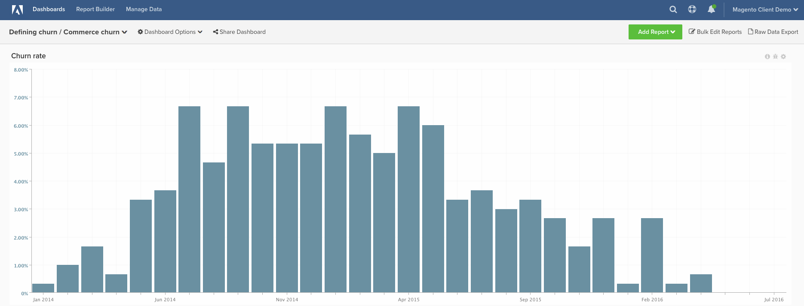

# 解約率

このトピックでは、**コマース顧客**&#x200B;の&#x200B;**解約率**&#x200B;を計算する方法を示します。 SaaSや従来のサブスクリプション企業とは異なり、コマース顧客は通常、アクティブ顧客にカウントされなくなったことを示す具体的な&#x200B;**「解約イベント」**&#x200B;を持っていません。 このため、以下の手順では、最後の注文から経過した一定の時間に基づいて、顧客を「解約」と定義できます。

多くの顧客は、データに基づいて使用すべき&#x200B;**期間**&#x200B;を概念化するために支援を求めています。 過去の顧客行動を使用して、この&#x200B;**解約期間**&#x200B;を定義する場合は、[解約](../analysis/define-cust-churn.md)の定義に関するトピックに慣れておくと良いでしょう。 次に、以下の手順で、解約率の計算式で結果を使用できます。

## 予定列

作成する列

* **`customer_entity`** テーブル
* **`Customer's last order date`**
   * [!UICONTROL definition]を選択：`Max`
   * [!UICONTROL table]を選択：`sales_flat_order`
   * [!UICONTROL column]を選択：`created_at`
   * `sales_flat_order.customer_id = customer_entity.entity_id`
   * [!UICONTROL Filter]: `Orders we count`

* **`Seconds since customer's last order date`**
   * [!UICONTROL definition]を選択：`Age`
   * [!UICONTROL column]を選択：`Customer's last order date`

>[!NOTE]
>
>新しいレポートを作成する前に、必ず[すべての新しい列を指標](../data-warehouse-mgr/manage-data-dimensions-metrics.md)にディメンションとして追加してください。

## 指標

* **新規顧客（初回注文日別）**
   * カウントされる顧客

>[!NOTE]
>
>この指標は、アカウントに存在する可能性があります。

* **`customer_entity`** テーブル内
* この指標は&#x200B;**カウント**&#x200B;を実行します
* **`entity_id`**&#x200B;列
* **`Customer's first order date`** タイムスタンプで注文
* [!UICONTROL Filter]:

* **新規顧客（最終注文日別）**
   * カウントされる顧客

  >[!NOTE]
  >
  >この指標は、アカウントに存在する可能性があります。

* **`customer_entity`** テーブル内
* この指標は&#x200B;**カウント**&#x200B;を実行します
* **`entity_id`**&#x200B;列
* **`Customer's last order date`** タイムスタンプで注文
* [!UICONTROL Filter]:

>[!NOTE]
>
>新しいレポートを作成する前に、必ず[すべての新しい列を指標](../data-warehouse-mgr/manage-data-dimensions-metrics.md)にディメンションとして追加してください。

## レポート

* **解約率**
   * [!UICONTROL Metric]：新規顧客（初回注文日別）
   * [!UICONTROL Filter]: `Lifetime number of orders Greater Than 0`
   * 
     [!UICONTROL Perspective]: `Cumulative`
   * [!UICONTROL Metric]: `New customers (by last order date)`
   * [!UICONTROL Filter]:
   * 顧客の最終注文日からの秒数>= [解約済み顧客の自己定義カットオフ ]**`^`**
   * `Lifetime number of orders Greater Than 0`

   * [!UICONTROL Metric]: `New customers (by last order date)`
   * [!UICONTROL Filter]: `Lifetime number of orders Greater Than 0`
   * 
     [!UICONTROL Perspective]: Cumulative
   * [!UICONTROL Formula]: `(B / ((A + B) - C)`
   * 
     [!UICONTROL Format]: Percentage

* *指標`A`:`New customers cumulative`*
* *指標`B`:`Churned customers by last order date`*
* *指標`C`:`Customers by last order date cumulative`*
* *`Formula`:`Repeat order probability`*
* *`Time period`:`All time (or custom range)`*
* *`Group by`:`Customer's order number`*
* *`Chart Type`:`Column`*

以下は、一般的な月/秒のコンバージョンの一部ですが、googleでは、お探しのカスタム値の週/秒のコンバージョンなど、他の値も提供しています。

| **か月** | **秒** |
|---|---|
| 3 | 7,776,000 |
| 6 | 15,552,000 |
| 9 | 23,328,000 |
| 12 | 31,104,000 |

すべてのレポートをまとめた後、必要に応じてダッシュボード上でレポートを整理できます。 結果は、上記のサンプルダッシュボードのようになります。
