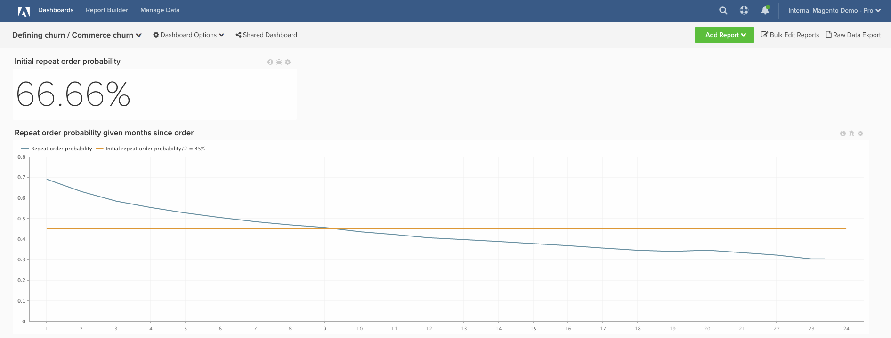

# 取引顧客解約

このトピックでは、取引顧客の解約を定義するのに役立つダッシュボードを設定する方法を示します。

この分析には、[高度な計算列](../data-warehouse-mgr/adv-calc-columns.md)が含まれています。

## 予定列

作成する列

* `customer_entity` テーブル
* `Customer's lifetime number of orders`
* 定義を選択：`Count`
* [!UICONTROL table]を選択：`sales_flat_order`
* [!UICONTROL column]を選択：**`entity_id`**
* [!UICONTROL Path]: sales_flat_order.customer_id = customer_entity.entity_id
* [!UICONTROL Filter]:
* カウントされる注文

* `sales_flat_order` テーブル
* `Customer's lifetime number of orders`
* 定義を選択：結合された列
* [!UICONTROL table]を選択：`customer_entity`
* [!UICONTROL column]を選択：`Customer's lifetime number of orders`
* [!UICONTROL Path]: `sales_flat_order.customer_id = customer_entity.entity_id`
* [!UICONTROL Filter]: `Orders we count`

* `Seconds since created_at`
* 定義を選択：`Age`
* [!UICONTROL column]を選択：`created_at`

* **`Customer's order number`**&#x200B;は、**[DEFINING CHURN]** チケットの一部としてアナリストによって作成されました
* **`Is customer's last order`**&#x200B;は、**[DEFINING CHURN]** チケットの一部としてアナリストによって作成されました
* **`Seconds since previous order`**&#x200B;は、**[DEFINING CHURN]** チケットの一部としてアナリストによって作成されました
* **`Months since order`**&#x200B;は、**[DEFINING CHURN]** チケットの一部としてアナリストによって作成されました
* **`Months since previous order`**&#x200B;は、**[DEFINING CHURN]** チケットの一部としてアナリストによって作成されました

## 指標

新しい指標はありません。

>[!NOTE]
>
>新しいレポートを作成する前に、必ず[すべての新しい列を指標](../data-warehouse-mgr/manage-data-dimensions-metrics.md)にディメンションとして追加してください。

## レポート

* **最初のリピート注文確率**
* 指標A：オールタイムのリピート注文
* [!UICONTROL Metric]: `Number of orders`
* [!UICONTROL Filter]: `Customer's order number greater than 1`

* 指標B：オールタイム注文
* [!UICONTROL Metric]：注文数

* [!UICONTROL Formula]：最初のリピート注文確率
* &#x200B;
  [!UICONTROL 数式]: `A/B`
* &#x200B;
  [!UICONTROL Format]: `Percent`

* [!UICONTROL Time period]: `All time`
* &#x200B;
  [!UICONTROL Interval]: `None`
* &#x200B;
  [!UICONTROL Chart type]: `Scalar`

* **注文から数か月が経過した場合に指定された注文確率を繰り返します**
* 指標A：前回の注文から数か月単位で注文を繰り返す（非表示）
* [!UICONTROL Metric]: `Number of orders`
* &#x200B;
  [!UICONTROL Perspective]: `Cumulative`
* [!UICONTROL Filter]: `Customer's order number greater than 1`

* 指標B：最後の注文（注文から数か月単位）（非表示）
* [!UICONTROL Metric]: `Number of orders`
* &#x200B;
  [!UICONTROL Perspective]: `Cumulative`
* [!UICONTROL Filter]: `Is customer's last order? (Yes/No) = Yes`

* 指標C：常に繰り返し注文（非表示）
* [!UICONTROL Metric]: `Number of orders`
* [!UICONTROL Filter]: `Customer's order number greater than 1`

* &#x200B;
  [!UICONTROL グループ化：]: `Independent`

* 指標D：すべての時間の最終注文（非表示）
* [!UICONTROL Metric]: `Number of orders`
* [!UICONTROL Filter]: `Is customer's last order? (Yes/No) = Yes`

* &#x200B;
  [!UICONTROL グループ化：]: `Independent`

* [!UICONTROL Formula]：最初のリピート注文確率
* &#x200B;
  [!UICONTROL 数式]: `(C-A)/(C+D-A-B)`
* &#x200B;
  [!UICONTROL Format]: `Percent`

* [!UICONTROL Time period]: `All time`
* &#x200B;
  [!UICONTROL Interval]: `None`
* [!UICONTROL Group by]: `Months since previous order`
* Show top.bottom: カテゴリ名で並べ替えられた上位24のカテゴリ

* &#x200B;
  [!UICONTROL Chart type]: `Line`

最初のリピート注文確率レポートは、リピート注文合計/注文の合計を表します。 あらゆる注文は、リピート注文を行う機会です。リピート注文の数は、実際に行う注文のサブセットです。

使用する数式は、（Xか月後に発生したリピート注文の合計）/（Xか月以上経過した注文の合計）に簡略化されます。 過去に、注文からXか月が経過していることを考えると、顧客が別の注文を行う可能性はY%であることを示しています。

ダッシュボードを構築したら、最も一般的な質問は、「これを使用して解約しきい値を決定するにはどうすればよいですか？」です。

**これに対する「正解」はありません。**&#x200B;ただし、Adobeでは、線が最初の再現率の半分の値を横切る点を見つけることをお勧めします。 ここからがポイントで、「ユーザーがリピート注文を行う場合、今までにそれをおこなったでしょう」と言えます。 最終的な目標は、「リテンション」から「再アクティブ化」の取り組みに切り替えることが理にかなったしきい値を選択することです。

すべてのレポートをまとめた後、必要に応じてダッシュボード上でレポートを整理できます。 その結果、ページの上部に画像が表示されます

この分析の構築中に質問が発生した場合、または単にプロフェッショナルサービスチームに連絡したい場合は、[&#x200B; サポートにお問い合わせください](https://experienceleague.adobe.com/docs/commerce-knowledge-base/kb/troubleshooting/miscellaneous/mbi-service-policies.html)。
