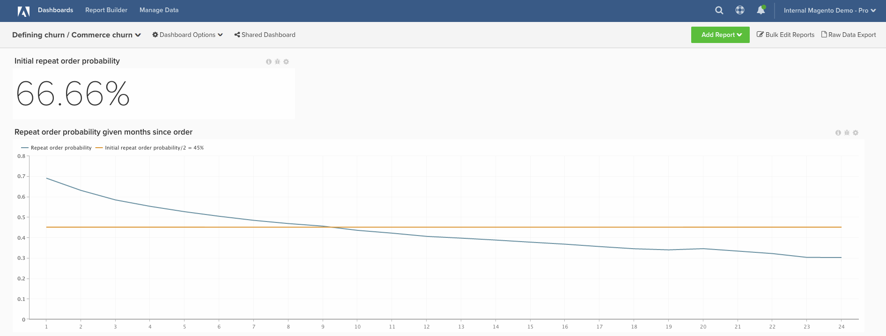

# トランザクション顧客チャーン

この記事では、トランザクション顧客のチャーンを定義するのに役立つダッシュボードを設定する方法について説明します。

この分析に含まれる内容 [高度な計算列](../data-warehouse-mgr/adv-calc-columns.md).

## 計算列

作成する列

* `customer_entity` 表
* `Customer's lifetime number of orders`
* 定義を選択します。 `Count`
* を選択します。 [!UICONTROL table]: `sales_flat_order`
* を選択します。 [!UICONTROL column]: **`entity_id`**
* [!UICONTROL Path]:sales_flat_order.customer_id = customer_entity.entity_id
* [!UICONTROL Filter]:
* カウントされる注文

* `sales_flat_order` 表
* `Customer's lifetime number of orders`
* 定義を選択します。結合された列
* を選択します。 [!UICONTROL table]: `customer_entity`
* を選択します。 [!UICONTROL column]: `Customer's lifetime number of orders`
* [!UICONTROL Path]: `sales_flat_order.customer_id = customer_entity.entity_id`
* [!UICONTROL Filter]: `Orders we count`

* `Seconds since created_at`
* 定義を選択します。 `Age`
* を選択します。 [!UICONTROL column]: `created_at`

* **`Customer's order number`** は、 **[チャーンの定義]** チケット
* **`Is customer's last order`** は、 **[チャーンの定義]** チケット
* **`Seconds since previous order`** は、 **[チャーンの定義]** チケット
* **`Months since order`** は、 **[チャーンの定義]** チケット
* **`Months since previous order`** は、 **[チャーンの定義]** チケット

## 指標

新しい指標がありません。

>[!NOTE]
>
>必ず [すべての新しい列を指標のディメンションとして追加](../data-warehouse-mgr/manage-data-dimensions-metrics.md) 新しいレポートを作成する前に

## レポート

* **最初の繰り返し順序の確率**
* 指標 A:全期間リピート注文
* [!UICONTROL Metric]: `Number of orders`
* [!UICONTROL Filter]: `Customer's order number greater than 1`

* 指標 B:常勤の注文
* [!UICONTROL Metric]:注文数

* [!UICONTROL Formula]:最初の繰り返し順序の確率
* 
   [!UICONTROL 数式]: `A/B`
* 

   [!UICONTROL Format]: `Percent`

* [!UICONTROL Time period]: `All time`
* 
   [!UICONTROL Interval]: `None`
* 

   [!UICONTROL Chart type]: `Scalar`

* **注文から指定された月の繰り返し注文の確率**
* 指標 A:前の注文からの注文を月単位で繰り返す（非表示）
* [!UICONTROL Metric]: `Number of orders`
* 
   [!UICONTROL Perspective]: `Cumulative`
* [!UICONTROL Filter]: `Customer's order number greater than 1`

* 指標 B:注文からの最終注文を月単位で表示（非表示）
* [!UICONTROL Metric]: `Number of orders`
* 
   [!UICONTROL Perspective]: `Cumulative`
* [!UICONTROL Filter]: `Is customer's last order? (Yes/No) = Yes`

* 指標 C:全期間繰り返し注文（非表示）
* [!UICONTROL Metric]: `Number of orders`
* [!UICONTROL Filter]: `Customer's order number greater than 1`

* 

   [!UICONTROL グループ化基準]: `Independent`

* 指標 D:前回の注文をすべて無視（非表示）
* [!UICONTROL Metric]: `Number of orders`
* [!UICONTROL Filter]: `Is customer's last order? (Yes/No) = Yes`

* 

   [!UICONTROL グループ化基準]: `Independent`

* [!UICONTROL Formula]:最初の繰り返し順序の確率
* 
   [!UICONTROL 数式]: `(C-A)/(C+D-A-B)`
* 

   [!UICONTROL Format]: `Percent`

* [!UICONTROL Time period]: `All time`
* 
   [!UICONTROL Interval]: `None`
* [!UICONTROL Group by]: `Months since previous order`
* top.bottom を表示：上位 24 カテゴリ（カテゴリ名で並べ替え）

* 

   [!UICONTROL Chart type]: `Line`

最初の繰り返し注文の確率レポートは、「繰り返し注文の合計/合計注文件数」を表します。 すべての注文は、繰り返し注文をする機会です。繰り返し注文の数は、実際に実行する順序のサブセットです。

使用する式は、（X ヶ月後に発生した繰り返し注文の合計）/（少なくとも X ヶ月前の注文の合計）に簡素化します。 これは、過去に、注文から X ヶ月が経過した場合に、ユーザーが別の注文をする可能性が Y%あることを示しています。

ダッシュボードを構築した後、最も一般的な質問は次のとおりです。これを使用してチャーンしきい値を決定する方法を教えてください。

**これに対する「一つの正しい答え」はありません。** ただし、Adobeでは、線が最初の繰り返し確率の半分の値と交差する点を見つけることをお勧めします。 ここで、「ユーザーが繰り返し注文をする場合は、おそらく今までに完了していたでしょう」と言えるポイントです。 最終的な目標は、「リテンション」から「再アクティブ化」への切り替えが意味を持つしきい値を選択することです。

すべてのレポートをコンパイルした後、必要に応じてダッシュボードで整理できます。 結果は、ページ上部の画像のように表示される場合があります

この分析の構築中に質問が発生した場合、または単に Professional Services チームを引き付けたい場合、 [連絡先サポート](https://experienceleague.adobe.com/docs/commerce-knowledge-base/kb/troubleshooting/miscellaneous/mbi-service-policies.html?lang=en).
