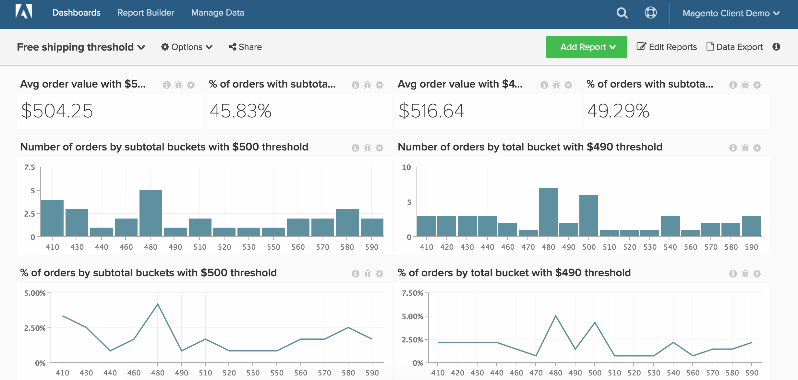

# 送料無料

>[!NOTE]
>
>このトピックには、元のアーキテクチャと新しいアーキテクチャを使用しているクライアントの手順が含まれています。 メインツールバーから「`Data Warehouse Views`」を選択した後に「`Manage Data`」セクションを使用できる場合は、新しいアーキテクチャを使用しています。

このトピックでは、送料無料しきい値のパフォーマンスを追跡するダッシュボードを設定する方法を示します。 このダッシュボードは、2つの送料無料しきい値をA/B テストするための優れた方法です。 例えば、送料無料を50 ドルと100 ドルのどちらで提供すべきか、判断できないことがあります。 顧客の2つのランダムサブセットのA/B テストを実行し、[!DNL Commerce Intelligence]で分析を実行する必要があります。

開始する前に、ストアの送料無料しきい値が異なる2つの期間を特定する必要があります。

この分析には、[高度な計算列](../data-warehouse-mgr/adv-calc-columns.md)が含まれています。

## 予定列

元のアーキテクチャを使用している場合（例えば、`Data Warehouse Views` メニューの下に`Manage Data` オプションがない場合）は、サポートチームに連絡して、以下の列を作成する必要があります。 新しいアーキテクチャでは、これらの列は`Manage Data > Data Warehouse` ページから作成できます。 詳細な手順は以下のとおりです。

* **`sales_flat_order`** テーブル
   * この計算では、一般的なカートのサイズに対してバケットを増分で作成します。 これには、5、10、50、100などの増分の範囲があります

* **`Order subtotal (buckets)`** Original Architecture: アナリストが`[FREE SHIPPING ANALYSIS]` チケットの一部として作成しました
* **`Order subtotal (buckets)`**&#x200B;新しいアーキテクチャ：
   * 前述のように、この計算では、一般的なカートサイズに対してバケットを増分で作成します。 `base_subtotal`のようなネイティブの小計カラムがある場合、この新しいカラムのベースとして使用できます。 そうでない場合は、送料と割引を収益から除外する計算列を使用できます。

  >[!NOTE]
  >
  >「バケット」のサイズは、クライアントとして適切なものによって異なります。 `average order value`から始めて、その金額より少ないバケットと大きいバケットを作成できます。 以下の計算を見ると、クエリの一部を簡単にコピーし、編集し、追加のグループを作成する方法が表示されます。 この例は、50単位で実行します。

   * `Column type - Same table, Column definition - Calculation, Column Inputs-` `base_subtotal`、または`calculated column`、`Datatype`: `Integer`
   * [!UICONTROL Calculation]: `case when A >= 0 and A<=200 then 0 - 200`
`A< 200`と`A <= 250`の場合は`201 - 250`
`A<251`と`A<= 300`の場合は`251 - 300`
`A<301`と`A<= 350`の場合は`301 - 350`
`A<351`と`A<=400`の場合は`351 - 400`
`A<401`と`A<=450`の場合は`401 - 450`
else &#39;over 450&#39;
終了

## 指標

新しい指標はありません！!!

>[!NOTE]
>
>新しいレポートを作成する前に、必ず[すべての新しい列を指標](../data-warehouse-mgr/manage-data-dimensions-metrics.md)にディメンションとして追加してください。

## レポート

* **配送ルール A**&#x200B;の平均注文額
   * [!UICONTROL Metric]: `Average order value`

* 指標`A`: `Average Order Value`
* [!UICONTROL Time period]: `Time period with shipping rule A`
* &#x200B;
  [!UICONTROL Interval]: `None`
* &#x200B;
  [!UICONTROL Chart Type]: `Scalar`

* **配送ルール A**&#x200B;を持つ小計バケット別の注文数
   * [!UICONTROL Metric]: `Number of orders`

  >[!NOTE]
  >
  >`X`にトップ `sorted by` `Order subtotal` `Show top/bottom` （バケット）を表示すると、テールエンドを切り取ることができます。

* 指標`A`: `Number of orders`
* [!UICONTROL Time period]: `Time period with shipping rule A`
* &#x200B;
  [!UICONTROL Interval]: `None`
* [!UICONTROL Group by]: `Order subtotal (buckets)`
* &#x200B;
  [!UICONTROL Chart Type]: `Column`

* **配送ルール A**&#x200B;を持つ小計による注文の割合
   * [!UICONTROL Metric]: `Number of orders`

   * [!UICONTROL Metric]: `Number of orders`
   * &#x200B;
     [!UICONTROL グループ化：]: `Independent`
   * [!UICONTROL Formula]: `(A / B)`
   * &#x200B;
     [!UICONTROL Format]: `%`

* 指標`A`: `Number of orders by subtotal (hide)`
* 指標`B`: `Total number of orders (hide)`
* [!UICONTROL Formula]: `% of orders`
* [!UICONTROL Time period]: `Time period with shipping rule A`
* &#x200B;
  [!UICONTROL Interval]: `None`
* [!UICONTROL Group by]: `Order subtotal (buckets)`
* &#x200B;
  [!UICONTROL Chart Type]: `Line`

* **小計が発送ルール A**&#x200B;を超える注文の割合
   * [!UICONTROL Metric]: `Number of orders`
   * &#x200B;
     [!UICONTROL Perspective]: `Cumulative`

   * [!UICONTROL Metric]: `Number of orders`
   * &#x200B;
     [!UICONTROL グループ化：]: `Independent`

   * [!UICONTROL Formula]: `1- (A / B)`
   * &#x200B;
     [!UICONTROL Format]: `%`

* 指標`A`: `Number of orders by subtotal`
* 指標`B`: `Total number of orders (hide)`
* [!UICONTROL Formula]: `% of orders`
* [!UICONTROL Time period]: `Time period with shipping rule A`
* &#x200B;
  [!UICONTROL Interval]: `None`
* [!UICONTROL Group by]: `Order subtotal (buckets)`
* &#x200B;
  [!UICONTROL Chart Type]: `Line`

上記の手順とレポートを繰り返して、配送Bと配送ルール Bの期間を確認します。

すべてのレポートをまとめた後、必要に応じてダッシュボード上でレポートを整理できます。 結果は、このページの上部の画像のように見えます。
