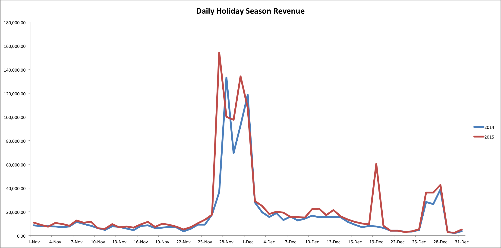

# 休日の買い物分析

あなたのビジネスにとって、休日は 1 年で最も忙しい時期の 1 つであるかもしれません。 米国の顧客が多い小売業者の場合、ホリデーシーズンは通常、感謝祭と新年の間の数ヶ月に及びます。

ラッシュは、1 年の任意の時点で発生する可能性があります。例えば、会社がショーツやプール用品を販売している場合、夏にラッシュが発生する可能性があります。 このトピックでは、様々な年にわたるハイシーズンを比較するのに役立つ分析について説明します。

## 推奨される指標

ホリデーシーズンのパフォーマンスを分析する場合は、の分析を検討します（[または建物](../../data-user/reports/ess-manage-data-metrics.md)）これらの指標：

### 新規顧客数、注文数、売上高

今年の成長のパターンを前年と比較する方法を理解するには、これらの測定を分析することを検討してください。 新規顧客数、新規注文数および売上高には、指定した期間（ホリデーシーズン）のビジネスの日々のパフォーマンスが表示されます。 また、累積パースペクティブを使用してこれらの測定を分析し、指標が時間の経過とともにどのように変化するかを確認することもできます。

### 平均注文値

このメジャーは、ホリデーシーズンの全体的な平均注文額を表示します。

## 例：毎日のホリデーシーズンの売上高

これで、分析する指標がわかったので、2014 年と 2015 年の 11 月と 12 月のホリデーシーズンの間の収益データのサンプルを見てみましょう。

この例では、2014 年と 2015 年の収益が 2 つの大きなスパイクがあります。これらの増加は、ブラックフライデーとサイバーマンデーと一致しています。 2014 年と 2015 年でスパイクが同じ日でないことに注意してください。 これは、ブラックフライデーが 11 月に落ちたためです 2014 年 11 月 27 日と 2015 年 11 月 28 日。 同様に、サイバーマンデーは 2014 年は 11 月 30 日、2015 年は 12 月 1 日でした。

さらに、12 月 19 日の 2015 年の売上高は急増しているが、2014 年には急増していない。 前年に利用できなかった特定の土曜日に販売が提供された可能性があります。

上記のいくつかの日付を除いて、これらの 2 年間の収益は一緒に追跡されます。

## どのような質問を検討すればよいですか？

ビジネスの季節的なトレンドを理解するのに役立つように、独自のデータを調べる際に留意する必要のある質問を次に示します。

* 年から年への傾向は予想されますか？
* 季節間の変動に対する期待を反映したトレンドか。
* 年によって違いはありますか？ この違いを説明することはできますか？
* プロモーションは特定の年に提供されましたか？
* 特定の年に価格は上昇しましたか？
* 広告費用は特定の年に増加しましたか？

## 他に何を分析すればよいですか？

1 つの選択肢は、ホリデーシーズン中の顧客の購入行動を分析することです。 ホリデーシーズン中に獲得した顧客は、ホリデーシーズン以外に獲得した顧客よりも多くを費やしていますか、または頻繁に購入していますか？

もう 1 つのオプションは、ホリデーシーズンのキャンペーン別に ROI を分析することです。 ホリデーシーズンに実行する特定のキャンペーンの ROI は高いですか？ これらのシーズンで、ROI の高いキャンペーンの費用を増やす必要がありますか？

さらに、割引注文とフルプライス注文の数を分析することもできます。 [ほとんどの顧客は、購入オーダーに対するセールを待っている](../analysis/coupon-usage.md) ホリデーシーズン中ですか、フルプライスの商品を購入していますか？

### 関連

* [顧客の獲得および維持に対するクーポンの影響の分析](../analysis/coupon-impact.md)
* [顧客の再購入行動の分析](../analysis/repurchase-behavior.md)
