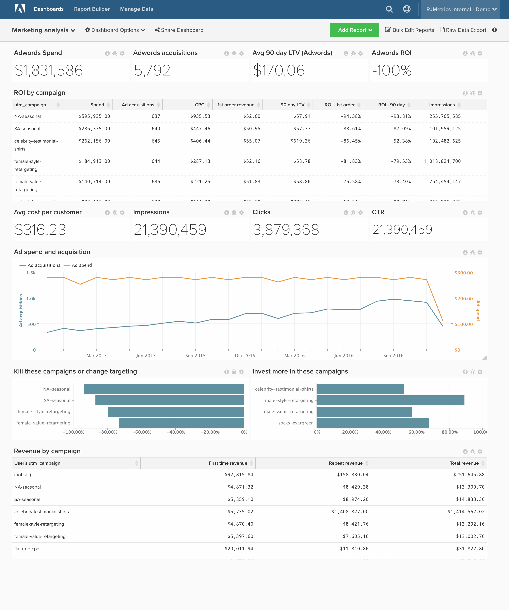

# マーケティング ROI

>[!NOTE]
>
>このトピックには、元のアーキテクチャと新しいアーキテクチャを使用しているクライアントの手順が含まれています。 メインツールバーから「データの管理」を選択した後に「Data Warehouse ビュー」セクションを使用できる場合は、[新しいアーキテクチャ ](../../administrator/account-management/new-architecture.md)に移行しています。

オンライン広告に予算を費やしている場合は、この支出のリターンを追跡し、さらなる投資に関してデータ主導の意思決定をおこないます。 このトピックでは、チャネル分析を追跡するダッシュボードを設定する方法（集計およびキャンペーン別のROIを含む）について説明します。

ROI指標とキャンペーンのパフォーマンスを示す

開始する前に、[!DNL [Facebook Ads]](../importing-data/integrations/facebook-ads.md)、[!DNL [Adwords]](../importing-data/integrations/google-adwords.md)、[!DNL [Google Ecommerce]](../importing-data/integrations/google-ecommerce.md) アカウントを接続し、追加のオンライン広告費データを取り込む必要があります。 この分析には、[高度な計算列](../data-warehouse-mgr/adv-calc-columns.md)が含まれています。

## 統合テーブル

**元のアーキテクチャ：** [!DNL Facebook Ads]や[!DNL Google Adwords]など、様々なソースからの支出をまとめるために、Adobeでは、すべての広告支出の&#x200B;**統合テーブル**&#x200B;を作成することをお勧めします。 このステップを完了するにはアナリストが必要です。 まだ使用していない場合は、[件名](../../guide-overview.md#Submitting-a-Support-Ticket)でサポートリクエスト `[MARKETING ROI ANALYSIS]`を提出し、アナリストがこのテーブルを作成します。

**新しいアーキテクチャ：** [このAnalysis Library](../../data-analyst/data-warehouse-mgr/create-dw-views.md)のトピックの例に従うことができます。 統合テーブルは、新しいアーキテクチャではData Warehouse ビューと呼ばれるようになりました。

## 予定列

作成する列

* **`Consolidated Digital Ad Spend`** テーブル
* **`Campaign name`**&#x200B;は、**[MARKETING ROI ANALYSIS]** チケットの一部として、Adobe アナリストによって作成されました

**元のアーキテクチャと新しいアーキテクチャ：**

* **`sales_flat_order`** テーブル
   * **`Order's GA campaign`**
      * 定義を選択：`Joined Column`
      * [!UICONTROL Create Path]:
      * 
        [!UICONTROL Many]: `sales_flat_order.increment_id`
      * 
        [!UICONTROL One]: `ecommerce####.transaction_id`

      * [!UICONTROL table]を選択：`ecommerce####`
      * [!UICONTROL column]を選択：`campaign`
      * [!UICONTROL Path]: `sales_flat_order.increment_id = ecommerce#####.transactionID`

   * **`Order's GA medium`**
      * 定義を選択：連結された列
      * [!UICONTROL table]を選択：`ecommerce####`
      * [!UICONTROL column]を選択：`medium`
      * [!UICONTROL Path]: sales_flat_order.increment_id = ecommerce#####.transactionId

   * **`Order's GA source`**
      * 定義を選択：連結された列
      * [!UICONTROL table]を選択：`ecommerce####`
      * [!UICONTROL column]を選択：`source`
      * [!UICONTROL Path]: sales_flat_order.increment_id = ecommerce#####.transactionId
^

* **`customer_entity`** テーブル
* **`Customer's first order GA campaign`**
   * 定義を選択：`Max`
   * [!UICONTROL table]を選択：`sales_flat_order`
   * [!UICONTROL column]を選択：`Order's GA campaign`
   * [!UICONTROL Path]: `sales_flat_order.customer_id = customer_entity.entity_id`
   * [!UICONTROL Filter]:
      * `Orders we count`
      * `Customer's order number = 1`

* **`Customer's first order GA source`**
   * 定義を選択：`Max`
   * [!UICONTROL table]を選択：`sales_flat_order`
   * [!UICONTROL column]を選択：`Order's GA source`
   * [!UICONTROL Path]: sales_flat_order.customer_id = customer_entity.entity_id
   * [!UICONTROL Filter]:
      * `Orders we count`
      * `Customer's order number = 1`

* **`Customer's first order GA medium`**
   * 定義を選択：`Max`
   * [!UICONTROL table]を選択：`sales_flat_order`
   * [!UICONTROL column]を選択：`Order's GA medium`
   * [!UICONTROL Path]: `sales_flat_order.customer_id = customer_entity.entity_id`
   * [!UICONTROL Filter]:
      * `Orders we count`
      * `Customer's order number = 1`

* **`sales_flat_order`** テーブル
* **`Customer's first order GA campaign`**
   * 定義を選択：`Joined Column`
   * [!UICONTROL table]を選択：`customer_entity`
   * [!UICONTROL column]を選択：`Customer's first order GA campaign`
   * [!UICONTROL Path]: `sales_flat_order.customer_id = customer_entity.entity_id`

* **`Customer's first order GA source`**
   * 定義を選択：連結された列
   * [!UICONTROL table]を選択：`customer_entity`
   * [!UICONTROL column]を選択：`Customer's first order GA source`
   * [!UICONTROL Path]: `sales_flat_order.customer_id = customer_entity.entity_id`

* **`Customer's first order GA medium`**
   * 定義を選択：`Joined Column`
   * [!UICONTROL table]を選択：`customer_entity`
   * [!UICONTROL column]を選択：`Customer's first order GA medium`
   * [!UICONTROL Path]: `sales_flat_order.customer_id = customer_entity.entity_id`

## 指標

* **広告費**
* **`Consolidated Digital Ad Spend`** テーブル内
* この指標は&#x200B;**合計**&#x200B;を実行します
* **`adCost`**&#x200B;列
* **`date`** タイムスタンプで注文

* **広告インプレッション**
* **`Consolidated Digital Ad Spend`** テーブル内
* この指標は&#x200B;**合計**&#x200B;を実行します
* **`Impressions`**&#x200B;列
* **`Month`** タイムスタンプで注文

* **広告クリック**
* **`Consolidated Digital Ad Spend`** テーブル内
* この指標は&#x200B;**合計**&#x200B;を実行します
* **`adClicks`**&#x200B;列
* **`Month`** タイムスタンプで注文

>[!NOTE]
>
>新しいレポートを作成する前に、必ず[すべての新しい列を指標](../../data-analyst/data-warehouse-mgr/manage-data-dimensions-metrics.md)にディメンションとして追加してください。

## レポート

* **広告費（すべての時間）**
   * [!UICONTROL Metric]：広告費

* 指標`A`：広告費
* [!UICONTROL Time period]: `All time`
* 
  [!UICONTROL間隔]: `None`
* 
  [!UICONTROL Chart Type]: `Scalar`

* **広告顧客獲得（常に）**
   * [!UICONTROL Metric]: `New customers`
   * [!UICONTROL Filters]:
      * `User's first order's source LIKE %google%`
      * `User's first order's source LIKE %facebook%`
      * `User's first order's source LIKE %fb%`
      * `User's first order's medium IN cpc, ppc`
      * フィルターロジック：（[`A`]または[`B`]または[`C`]）と[`D`]

* 指標`A`: `Ad customer acquisitions`
* [!UICONTROL Time period]: `All time`
* 
  [!UICONTROL間隔]: `None`
* 
  [!UICONTROL Chart Type]: `Scalar`

* **広告ROI**
   * [!UICONTROL Metric]：広告費

   * [!UICONTROL Metric]: `New customers`
   * [!UICONTROL Filters]:
      * `User's first order's source LIKE %google%`
      * `User's first order's source LIKE %facebook%`
      * `User's first order's source LIKE %fb%`
      * `User's first order's medium IN cpc, ppc`
      * フィルターロジック：（[`A`]または[`B`]または[`C`]）と[`D`]

   * [!UICONTROL Metric]：平均生涯売上
   * [!UICONTROL Filters]:
      * `User's first order's source LIKE %google%`
      * `User's first order's source LIKE %facebook%`
      * `User's first order's source LIKE %fb%`
      * `User's first order's medium IN cpc, ppc`
      * フィルターロジック：（[`A`]または[`B`]または[`C`]）と[`D`]

   * [!UICONTROL Formula]: `((C - (A / B)) / (A / B))`
   * 
     [!UICONTROL Format]: `Percentage`

* 指標`A`: `Ad Spend (hide)`
* 指標`B`: `Ad customer acquisitions (hide)`
* 指標`C`: `Average LTV (hide)`
* [!UICONTROL Formula]: `Ads ROI`
* [!UICONTROL Time period]: `All time`
* 
  [!UICONTROL間隔]: `None`
* 
  [!UICONTROL Chart Type]: `Scalar`

* **GA中の注文**
   * 
     [!UICONTROL指標]: `Orders`

* 指標`A`: `Orders`
* [!UICONTROL Time period]: `All time`
* [!UICONTROL Interval]: `By Month`
* [!UICONTROL Group by]: `Order's medium`
* 
  [!UICONTROL Chart Type]: `Area`

* キャンペーン別&#x200B;**広告ROI**
   * [!UICONTROL Metric]: `Ad Spend`

   * [!UICONTROL Metric]:`New customers`
   * [!UICONTROL Filters]:
      * `User's first order's source LIKE %google%`
      * `User's first order's source LIKE %facebook%`
      * `User's first order's source LIKE %fb%`
      * `User's first order's medium IN cpc, ppc`
      * フィルターロジック：（[`A`]または[`B`]または[`C`]）と[`D`]

   * [!UICONTROL Metric]：平均生涯売上
   * [!UICONTROL Filters]:
      * `User's first order's source LIKE %google%`
      * `User's first order's source LIKE %facebook%`
      * `User's first order's source LIKE %fb%`
      * `User's first order's medium IN cpc, ppc`
      * フィルターロジック：（[`A`]または[`B`]または[`C`]）と[`D`]

   * [!UICONTROL Metric]：注文の平均生涯数
   * [!UICONTROL Filters]:
      * `User's first order's source LIKE %google%`
      * `User's first order's source LIKE %facebook%`
      * `User's first order's source LIKE %fb%`
      * `User's first order's medium IN cpc, ppc`
      * フィルターロジック：（[`A`]または[`B`]または[`C`]）と[`D`]

   * [!UICONTROL Formula]: `(A / B)`
   * 
     [!UICONTROL Format]: `Currency`

   * [!UICONTROL Formula]: `(C - (A / B))`
   * 
     [!UICONTROL Format]: `Currency`

   * [!UICONTROL Formula]: `((C - (A / B)) / (A / B))`
   * 
     [!UICONTROL Format]: `Percentage`

   * [!UICONTROL Metric]: `Ad Clicks`

   * [!UICONTROL Metric]: `Ad Impressions`

   * [!UICONTROL Formula]: `(H / I)`
   * 
     [!UICONTROL Format]: `Percentage`

   * [!UICONTROL Formula]: `(A / H)`
   * 
     [!UICONTROL Format]: `Currency`

* 指標`A`: `Ad Spend` （非表示）
* 指標`B`: `Ad customer acquisitions`
* 指標`C`: `Average LTV`
* 指標`D`: `Average lifetime # of orders`
* 
  [!UICONTROL数式]: `CAC`
* [!UICONTROL Formula]: `Avg return`
* [!UICONTROL Formula]: `Ads ROI`
* 指標`H`: `adClicks`
* 指標`I`: `Impressions`
* 
  [!UICONTROL数式]: `CTR`
* 
  [!UICONTROL数式]: `CPC`
* [!UICONTROL Time period]: `All time`
* 
  [!UICONTROL間隔]: `None`
* 
  [!UICONTROL グループ化：]: `campaign` (「顧客の最初の注文」キャンペーンを広告以外の費用テーブル指標に使用する)
* 
  [!UICONTROL Chart Type]: `Table`

この分析の構築中に質問が発生した場合、または単にプロフェッショナルサービスチームに連絡したい場合は、[ サポートにお問い合わせください](https://experienceleague.adobe.com/docs/commerce-knowledge-base/kb/troubleshooting/miscellaneous/mbi-service-policies.html)。

### 関連

* [ [!DNL Google Analytics]でのUTM タグ付けのベストプラクティス](../../best-practices/utm-tagging-google.md)
* [ [!DNL Google Analytics] UTM アトリビューションの仕組み](../analysis/utm-attributes.md)
