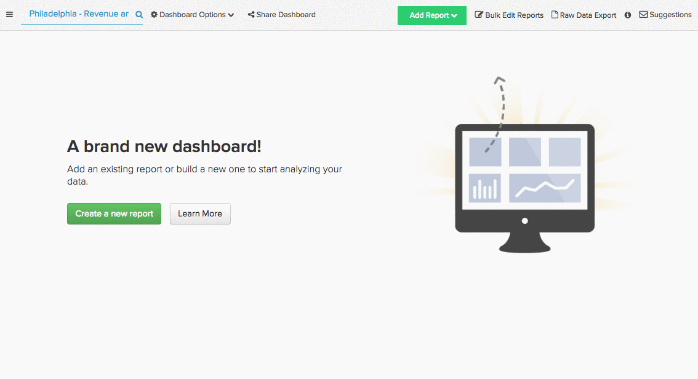
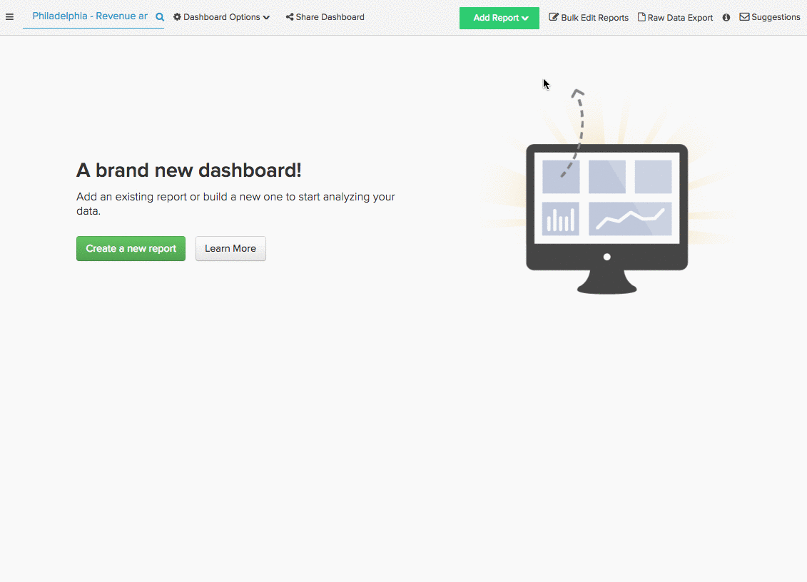

# 成功するマーケティングソースの特定

オーディエンスを調査し、キャンペーンを作成し、いくつかのマーケティングチャネルに投資しました。 時間が経過した今、これらのチャネルのパフォーマンスはどうですか？ 最も新しいユーザーを取り込んだのは、どのチャネルですか？ 総売上高に最も貢献したソースは何ですか？

[!DNL Adobe Commerce Intelligence] を使用すると、[[!DNL [Google Analytics' UTM fields]]](https://support.google.com/analytics/answer/1191184?hl=en) ーザーまたはカスタムデータフィールドのどちらに対応しているかに関わらず、リファラルソース別に売上高とユーザーを簡単にセグメント化できます。 このセグメント化により、最もパフォーマンスの高いチャネルを見つけ、マーケティング予算をより適切に投資できます。

このトピックでは、最も価値の高いマーケティングチャネルを明らかにするために使用できるレポートをいくつか紹介します。

* [ソース別の新規ユーザー](#newusersbysource)
* [ユーザーソース別の平均生涯売上高](#avglifetimerev)
* [ユーザーソース別の平均注文値](#avgorderval)
* [収益（ユーザー登録日およびソース別）](#revbyregdateandsource)
* [繰り返し注文（ユーザーソース別）](#repeatordersbysource)

## 前提条件 {#prereqs}

このトピックで分析を作成するには、マーケティング獲得/リファラルソースデータにアクセスする必要があります。 まだトラッキングしていない場合は、続行する前に、[&#x200B; 参照元データを注文  [!DNL Google ECommerce]](../importing-data/integrations/google-ecommerce.md) を [!DNL Adobe Commerce Intelligence] に取り込む必要があります。 また、分析にユーザーデバイス情報を追加すると、参照で使用しているテクノロジーを確認できます。

## ソース別の新規ユーザー {#newusersbysource}

最も価値の高いチャネルを決定するには、リファラルソースのパフォーマンスを評価することが重要です。 このレポートは、新規登録ユーザー数を取得元別に経時的に表示するため、新規登録ユーザーの取得におけるリファラルソースのパフォーマンスを追跡できます。

[Report Builder](../../tutorials/using-visual-report-builder.md) でこのレポートを作成するには、**新規ユーザー** 指標（または新規ユーザーの数の推移をカウントする同等の指標）をレポートに追加します。 次に、以下の手順を実行します。

1. 分析する登録期間を [!UICONTROL Time Period] 定します。
1. [!UICONTROL Interval] を月単位に設定します。
1. [!UICONTROL Group By] を獲得（またはリファラル）ソースに設定し、組み込むソースを選択します。
1. この例では、`stacked columns` [!UICONTROL chart type] を使用します。

次のチュートリアルを視覚的に示します。

## ユーザーソース別の平均生涯売上高 {#avglifetimerev}

新しいユーザーを引き込むチャネルを見つけることは重要ですが、それらの紹介は全体としてどの程度価値があるのでしょうか。 このレポートには、特定の獲得ソースからのユーザーの平均生涯売上高が経時的に表示されます。 つまり、これにより、特定のソースから取得したユーザーが、別のソースから取得したユーザーのグループよりも、生涯にわたってあなたと一緒に過ごすかどうかを確認できます。

Report Builderでこのレポートを作成するには、**平均生涯売上高** 指標をレポートに追加します。 次に、以下の手順を実行します。

1. 分析する期間の [!UICONTROL Time Period] を設定します。
1. [!UICONTROL Interval] を月単位に設定します。
   獲得（またはリファラル） ソースに [!UICONTROL Group By] 動し、組み込むソースを選択します。
1. この例では、`line chart` タイプを使用します。

次のチュートリアルを視覚的に示します。

。

この例では生涯売上高のみを見ていますが、この分析をレプリケートして、リファラルソースによる [!UICONTROL Number of orders] または [!UICONTROL Distinct buyers] を調べることもできます。

## ユーザーソース別の平均注文値 {#avgorderval}

特定の獲得ソースからユーザーが費やした金額をより正確に把握するために、平均注文額を調べるレポートを作成できます。 これにより、特定のソースから取得されたユーザーが、別のソースのユーザーよりも注文あたりの支出が多いかどうかを追跡できます。

Report Builderでこのレポートを作成するには、**平均注文額** 指標を追加してから、次の手順を実行します。

1. 分析する登録期間を [!UICONTROL Time Period] 定します。
1. [!UICONTROL Time Interval] を月単位に設定します。
1. [!UICONTROL Group By] を獲得（またはリファラル）ソースに設定し、組み込むソースを選択します。
1. 次の使用例は、**積み重ね縦棒グラフ** を使用します。

次のチュートリアルを視覚的に示します。

## ユーザー登録日およびソース別の合計売上高 {#revbyregdateandsource}

以前に説明した生涯売上高分析では、様々なソースから取得したユーザーの平均生涯売上高を見ることができますが、総生涯売上高についてはどうでしょうか。 このレポートを使用すると、特定の時間に、特定のソースから登録されたユーザーが生成した全体的な売上高を特定できます。

Report Builderでこのレポートを作成するには、`Revenue by user registration date` の指標を追加します。 [&#x200B; この指標を作成 &#x200B;](../../data-user/reports/ess-manage-data-metrics.md) していない場合は、`Revenue` の指標をレプリケートし、`time stamp` をユーザーの `creation date` に変更することで作成できます。 指標を追加した後、次の操作を行います。

1. 分析する登録期間を [!UICONTROL Time Period] 定します。
1. [!UICONTROL Time Interval] を月単位に設定します。
1. [!UICONTROL Group By] を獲得（またはリファラル）ソースに設定し、組み込むソースを選択します。
1. 次の使用例では、`stacked columns` グラフの種類を使用します。

次のチュートリアルを視覚的に示します。

## 繰り返し注文（ユーザーソース別） {#repeatordersbysource}

平均注文額レポートには、注文を行うときに特定のソースから取得したユーザー数が平均して表示されます。 ただし、同じユーザーがリピート顧客の場合、このレポートは表示しません。 しかし、ユーザー別のリピート注文ソースを使用すると、特定のソースのユーザーがリピート購入を多くまたは少なくしているかどうかを確認できます。

[Report Builder](../../tutorials/using-visual-report-builder.md) でこのレポートを作成するには、**注文数** 指標を追加して、次の操作を実行します。

1. 分析する登録期間を [!UICONTROL Time Period] 定します。
1. [!UICONTROL Time Interval] を月単位に設定します。
1. リピート注文を持つユーザーのみが含まれるように、[!UICONTROL filter] を追加します。

   ユーザーの注文番号が 1 より大きい

1. [!UICONTROL Group By] を獲得（またはリファラル）ソースに設定し、組み込むソースを選択します。
1. 次の使用例では、`stacked columns` グラフの種類を使用します。

次のチュートリアルを視覚的に示します。

## まとめ {#wrapup}

このトピックでは、獲得チャネルとマーケティングチャネルの価値を分析するために使用できるいくつかの分析に触れましたが、これは氷山の先端にすぎません。

## 関連 {#related}

* [&#x200B; [!DNL Google ECommerce] を介した注文のリファラルソースのトラッキング](../importing-data/integrations/google-ecommerce.md)
* [アカウント  [!DNL Google Adwords]  接続](../importing-data/integrations/google-adwords.md)
* [注文  [!DNL Google ECommerce]  顧客データを使用したディメンションの作成](../data-warehouse-mgr/bldg-google-ecomm-dim.md)
* [&#x200B; [!DNL Google Analytics] の UTM タグ付けのベストプラクティス](../../best-practices/utm-tagging-google.md)
