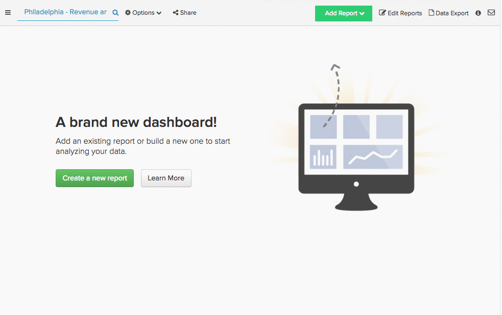
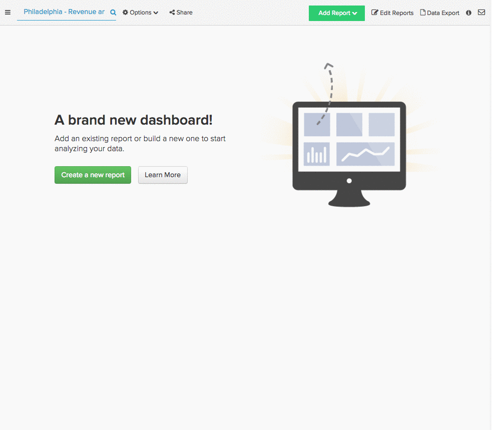
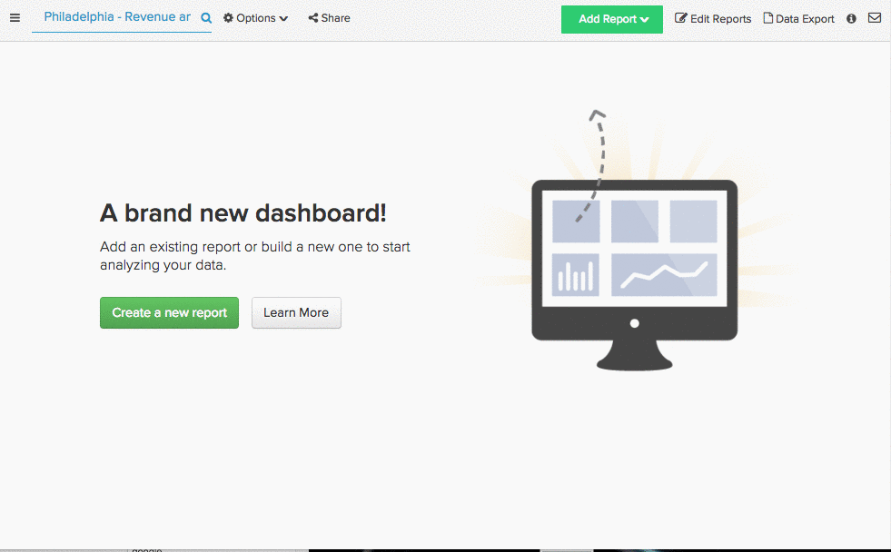
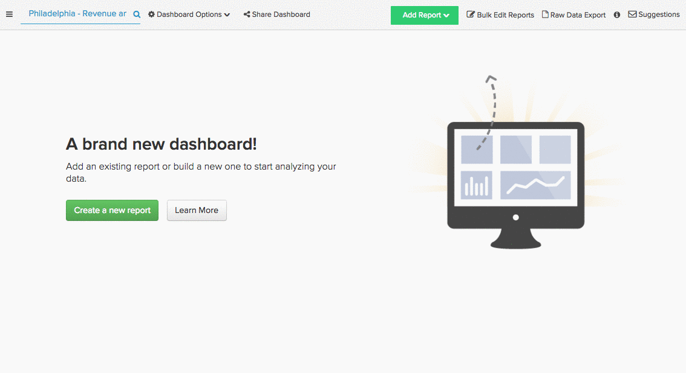
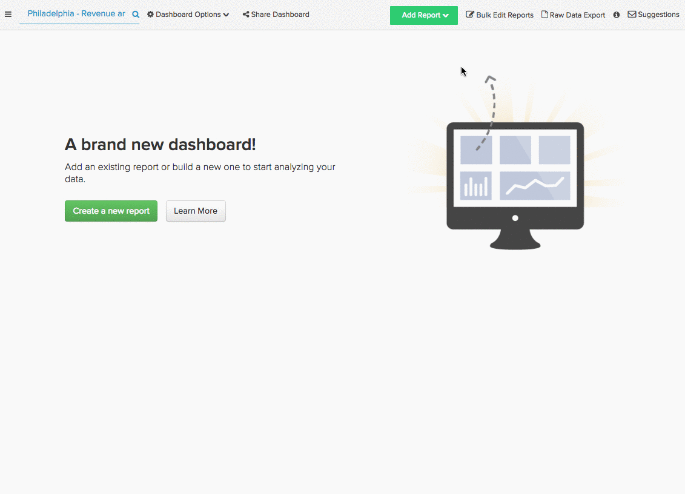

# 成功しているマーケティングソースの特定

オーディエンスを調査し、キャンペーンを作成し、いくつかのマーケティングチャネルに投資しました。 時間が経ったので、これらのチャネルのパフォーマンスはどうでしょうか？ どのようなチャネルが最も多くの新規ユーザーを獲得したのか？ 総収入に最も貢献した情報源は何か？

[!DNL Adobe Commerce Intelligence]を使用すると、[!DNL [Google Analytics' UTM fields]](https://support.google.com/analytics/answer/1191184?hl=en)に対応する場合でも、カスタムデータフィールドに対応する場合でも、参照元によって収益とユーザーを簡単にセグメント化できます。 これにより、最もパフォーマンスの高いチャネルを特定して、マーケティング予算を適切に投資できます。

ここでは、最も価値のあるマーケティングチャネルを明らかにするために利用できるレポートをいくつか紹介します。

* [ソース別の新規ユーザー](#newusersbysource)
* [ユーザーソース別平均生涯売上](#avglifetimerev)
* [ユーザーソース別平均注文額](#avgorderval)
* [ユーザー登録日とソース別の収益](#revbyregdateandsource)
* [ユーザーソース別のリピートオーダー](#repeatordersbysource)

## 前提条件 {#prereqs}

このトピックで分析を構築するには、マーケティング獲得/参照ソースデータにアクセスする必要があります。 まだ追跡していない場合は、続行する前に、[から [!DNL Google ECommerce]](../importing-data/integrations/google-ecommerce.md)に[!DNL Adobe Commerce Intelligence]注文紹介ソースデータを取り込む必要があります。 また、分析にユーザーデバイス情報を追加することで、紹介でどのようなテクノロジーが使用されているのかを確認できます。

## ソース別の新規ユーザー {#newusersbysource}

紹介ソースのパフォーマンスを評価することは、最も価値のあるチャネルを決定するための鍵となります。 このレポートでは、新規登録ユーザー数を取得ソース別に時系列で表示します。これにより、新規登録ユーザーを取得する際の紹介ソースのパフォーマンスを追跡できます。

このレポートを[Report Builder](../../tutorials/using-visual-report-builder.md)で作成するには、**新規ユーザー**&#x200B;指標（または新規ユーザー数を経時的にカウントする同等の指標）をレポートに追加します。 次に、次の操作を行います。

1. [!UICONTROL Time Period]を分析する登録期間に設定します。
1. [!UICONTROL Interval]を月単位に設定します。
1. [!UICONTROL Group By]を取得（または参照）ソースに設定し、含めるソースを選択します。
1. この例では、`stacked columns` [!UICONTROL chart type]を使用しています。

次に、視覚的なチュートリアルを示します。

## ユーザーソース別平均生涯売上 {#avglifetimerev}

新規顧客をもたらすチャネルを見つけることは重要ですが、そのリファラーは全体的にどの程度価値があるのでしょうか？ このレポートは、特定の獲得ソースからのユーザーの長期的な平均生涯売上を示しています。 つまり、特定のソースから取得したユーザーが、別のソースから取得したユーザーグループよりも、生涯にわたって多くの費用を費やしているかどうかを確認できます。

このレポートをReport Builderで作成するには、**平均生涯売上**&#x200B;指標をレポートに追加します。 次に、次の操作を行います。

1. [!UICONTROL Time Period]を分析する期間に設定します。
1. [!UICONTROL Interval]を月単位に設定します。
   [!UICONTROL Group By]を取得（または参照）ソースに追加し、含めるソースを選択します。
1. この例では、`line chart` タイプを使用しています。

次に、視覚的なチュートリアルを示します。

。

この例では、ライフタイム収益のみを見ていますが、この分析を複製して、参照元で[!UICONTROL Number of orders]または[!UICONTROL Distinct buyers]を見ることもできます。

## ユーザーソース別平均注文額 {#avgorderval}

特定の獲得ソースの利用者がどれくらいの金額を費やしているのかをより正確に把握するには、平均注文額に関するレポートを作成します。 これにより、特定のソースから取得したユーザーが、別のソースのユーザーよりも注文あたりの支出が多いかどうかを追跡できます。

このレポートをReport Builderで作成するには、**平均注文額**&#x200B;指標を追加してから、次の操作を行います。

1. [!UICONTROL Time Period]を分析する登録期間に設定します。
1. [!UICONTROL Time Interval]を月単位に設定します。
1. [!UICONTROL Group By]を取得（または参照）ソースに設定し、含めるソースを選択します。
1. この例では、**積み上げ列**&#x200B;のグラフの種類を使用しています。

次に、視覚的なチュートリアルを示します。

## ユーザー登録日とソース別の総収益 {#revbyregdateandsource}

先ほど取り上げた生涯収益分析では、様々なソースから取得したユーザーの平均生涯売上を見ることができますが、総生涯売上はどうでしょうか？ このレポートでは、特定の期間に登録された全体的な収益ユーザーの数と、特定のソースから生成されたユーザーの数を特定できます。

このレポートをReport Builderで作成するには、`Revenue by user registration date`指標を追加します。 この指標[を既に](../../data-user/reports/ess-manage-data-metrics.md)作成していない場合は、`Revenue`指標をレプリケートし、`time stamp`をユーザーの`creation date`に変更することで、作成できます。 指標を追加したら、次の操作を行います。

1. [!UICONTROL Time Period]を分析する登録期間に設定します。
1. [!UICONTROL Time Interval]を月単位に設定します。
1. [!UICONTROL Group By]を取得（または参照）ソースに設定し、含めるソースを選択します。
1. この例では、`stacked columns` グラフの種類を使用しています。

次に、視覚的なチュートリアルを示します。

## ユーザーソース別のリピートオーダー {#repeatordersbysource}

「平均注文額」レポートには、特定のソースから獲得した注文額の平均ユーザー数が表示されます。 ただし、このレポートでは、同じユーザーがリピーターである場合は表示されません。 しかし、ユーザーソースによるリピート注文を使用すると、特定のソースのユーザーがリピート購入を多かれ少なかれ行うかどうかを確認できます。

このレポートを[Report Builder](../../tutorials/using-visual-report-builder.md)で作成するには、**注文数**&#x200B;指標を追加してから、次の操作を行います。

1. [!UICONTROL Time Period]を分析する登録期間に設定します。
1. [!UICONTROL Time Interval]を月単位に設定します。
1. リピートオーダーを持つユーザーのみが含まれるように[!UICONTROL filter]を追加します。

   ユーザーの注文番号が1より大きい

1. [!UICONTROL Group By]を取得（または参照）ソースに設定し、含めるソースを選択します。
1. この例では、`stacked columns` グラフの種類を使用しています。

次に、視覚的なチュートリアルを示します。

## まとめ {#wrapup}

このトピックでは、獲得チャネルとマーケティングチャネルの価値を分析するために利用できるいくつかの分析について触れましたが、これは氷山の一角に過ぎません。

## 関連 {#related}

* [ [!DNL Google ECommerce]経由で注文の紹介ソースをトラッキングしています](../importing-data/integrations/google-ecommerce.md)
* [ [!DNL Google Adwords]  アカウントを接続しています](../importing-data/integrations/google-adwords.md)
* [注文と顧客データを含む [!DNL Google ECommerce]  ディメンションの作成](../data-warehouse-mgr/bldg-google-ecomm-dim.md)
* [ [!DNL Google Analytics]でのUTM タグ付けのベストプラクティス](../../best-practices/utm-tagging-google.md)
