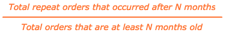
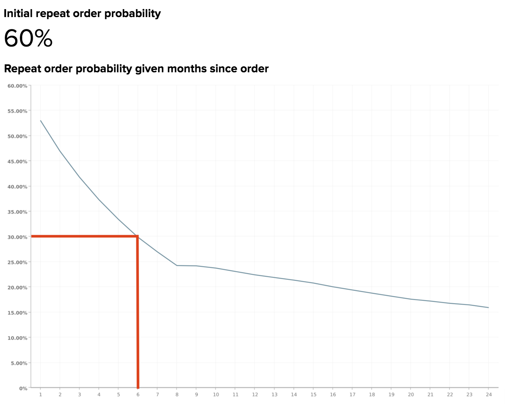

# 繰り返し確率減衰と解約

売上の一部がリピート購入によるものであれば、ロイヤルティの高い顧客基盤の大きな価値を認識していることでしょう。 そのためには、注文間の時間の経過と、顧客がいつ解約すると予想されるかを把握することが重要です。

このトピックでは、次の質問に答えるのに役立つ分析について説明します。

* 顧客が再購入する可能性は何か？
* 顧客が最後に購入してから、リピート注文が発生する可能性は、時間とともにどのように異なりますか？
* 顧客がいつ解約されたと考えられるべきですか？ そのため、リエンゲージメント施策は、いつ開始すべきでしょうか？

## 推奨される指標

繰り返し確率減衰と解約を分析する場合は、次の指標（[またはビルド &#x200B;](../../data-user/reports/ess-manage-data-metrics.md)）を使用することを検討してください。

### 初回リピート注文の可能性

この指標は、リピート注文の総数として定義され、総注文数に対する割合として定義されます。 別の言い方をすれば、これは命令が別の命令によってフォローアップされる可能性である。 この確率が50%を超える場合、すべての注文の半分以上が後続の注文によってフォローアップされることを意味します。

### 注文から数か月が経過した場合の繰り返し注文確率

この指標は、前回の注文から経過した月数を考慮して、ユーザーが再注文する可能性を示しています。 この指標を生成するために使用される数式は、次のように簡単に設定できます。

を繰り返します

ビジネスモデルによっては、リピート注文の可能性は、顧客が注文した直後に低下し、その後の数カ月間で減少し続けるか、季節のバリエーションや急増が発生する可能性があります。

リピート購入が予想される顧客の割合（およびこの傾向が時間とともにどのように変化するかを把握することで、定期的に顧客をターゲティングし、リピート購入の可能性を最大限に高めることができます。 そのため、リピート購入の可能性が低い場合は、顧客が離反していることを特定する期間を設定し、リテンションからリアクティベーションに移行することができます。

## 今日の例

典型的なコマースビジネスにおける再現可能性の減衰を確認しましょう。

### 初回リピート注文の可能性

この例では、最初のリピート注文の可能性、つまり顧客がリピート購入する可能性は60%です。 つまり、このビジネスに寄せられた注文の60%に、その後の注文が続きます。

### 注文から数か月が経過した場合の繰り返し注文確率

このレポートは、最後の注文から数か月が経過していることを考慮して、顧客が再度注文する可能性を示しています。 このレポートでは、解約しきい値に関する明確な定義はありませんが、Adobeでは、確率減衰が最初の確率率の半分の値を超えるポイントとして解約を定義することをお勧めします。

この例の最初の繰り返し確率率は60%であるため、解約日は、繰り返し注文確率が60%/2 = 30%を下回る、または約6か月で低下する時間になります。 注文の60%は別の注文が続くと予想され、その半数は最初の6か月以内に行われた。

言い換えれば、顧客がフォローアップ注文をする場合、6 ヶ月後よりも最後の注文から6 ヶ月以内に注文をおこなった可能性が高いということです。 顧客が6 ヶ月後に再購入しない場合は、リエンゲージメント施策を開始して、その顧客を引き戻す必要があります。

ビジネスモデルによっては、リピート注文の可能性が50%または10%を下回るポイントなど、別のしきい値を選択することもできます。 あなたの内部知識が異なる数を示唆している場合は、必ずそれを使用する必要があります。

最終的な目標は、リテンションからリエンゲージメントの取り組みに切り替えることが理にかなったしきい値を選択することです。 リテンションには、フォローアップで購入を提案した既存顧客と再エンゲージするメールを送信します。一方、リエンゲージメントには、クーポンや取引を含む顧客失注メールを送信するメールを送信します。

## どのような質問を検討すればよいですか？

Adobeでは、リピート注文の可能性を把握するために、自社データを分析する際に、次の点を考慮することを推奨しています。

* 最初の繰り返し注文の可能性は予想されていますか？ そうでない場合、なぜそれが高いか低いと思いますか？
* 前回の注文以降、特定の月の再発注確率が大幅に低下していますか？ その場合、変更は想定されていますか？
* 現在の顧客離れのしきい値は何か？
* 現在の解約しきい値は、前回の注文レポートから数か月が経過したリピート注文の可能性の値のいずれかに一致していますか？
* 現在のしきい値は、リテンションからリアクティベーションに切り替える広告活動を反映していますか？
* しきい値を、確率減衰が初期確率率の半分の値を超える月に変更することは意味がありますか？

## 他に何を分析すればよいですか？

上記の分析を作成し、解約しきい値を決定した後、より多くの分析を構築して、解約したユーザーの一般的な傾向を特定できます。 例えば、同じ期間に解約した顧客は獲得したのか、それとも前回の注文で同様の商品を購入したのか、などです。 解約しきい値を設定すると、これらの解約した顧客の特定の特性をさらに詳しく調べることができます。

複数の商品を提供している場合、特定の商品を購入する顧客は、時間の経過とともにどのように他の顧客と異なる行動をとるのか疑問に思うかもしれません。 Adobe Experience Platform Data Governanceについて詳しくは、 このチュートリアルでは、顧客が購入した特定の製品に基づいて、顧客コホートの生涯購入行動を調べることができます。

このベストプラクティスは、[!DNL Adobe Commerce Intelligence] Data Analysis Services （DAS）によって提供されています。 詳細については、[&#x200B; サポート &#x200B;](https://experienceleague.adobe.com/docs/commerce-knowledge-base/kb/troubleshooting/miscellaneous/mbi-service-policies.html?lang=ja)にお問い合わせください。

### 関連

* [クーポンが顧客の獲得と維持に与える影響を分析する](../analysis/coupon-impact.md)
* [顧客の再購入行動の分析](../analysis/repurchase-behavior.md)
