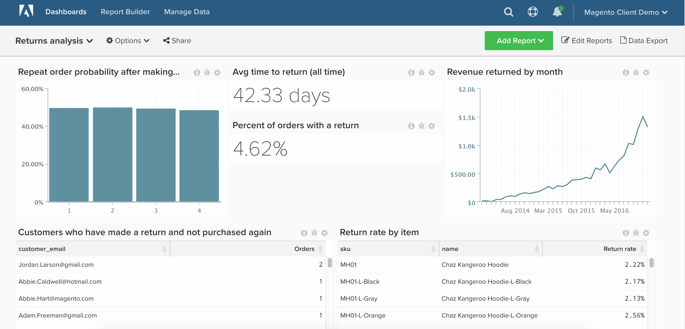

# 返品注文

このトピックでは、ストアのリターンの詳細な分析を提供するダッシュボードを設定する方法を示します。

開始する前に、お客様は[Adobe Commerce](https://business.adobe.com/products/magento/magento-commerce.html)のお客様である必要があり、返品に`enterprise\_rma` テーブルを使用していることを確認する必要があります。

この分析には、[高度な計算列](../data-warehouse-mgr/adv-calc-columns.md)が含まれています。

## はじめに

追跡する列

* **`enterprise_rma`**&#x200B;または&#x200B;**`rma`** テーブル
* **`entity_id`**
* **`status`**
* **`order_id`**
* **`customer_id`**
* **`date_requested`**

* **`enterprise_rma_item_entity`**&#x200B;または&#x200B;**`rma_item_entity`** テーブル
* **`entity_id`**
* **`rma_entity_id`**
* **`qty_returned`**
* **`status`**
* **`order_item_id`**
* **`product_name`**
* **`product_sku`**

作成するフィルターセット

* **`enterprise_rma`** テーブル
* フィルターセット名：`Returns we count`
* フィルターセットロジック：
   * プレースホルダー – ここにカスタムロジックを入力

* **`enterprise_rma_item_entity`** テーブル
* フィルターセット名：`Returns items we count`
* フィルターセットロジック：
   * プレースホルダー – ここにカスタムロジックを入力

### 予定列

作成する列

* **`enterprise_rma`** テーブル
* **`Order's created at`**
* 定義を選択：`Joined Column`
* [!UICONTROL Create Path]:
* 
  [!UICONTROL Many]: `enterprise_rma.order_id`
* 
  [!UICONTROL One]: `sales_flat_order.entity_id`

* [!UICONTROL table]を選択：`sales_flat_order`
* [!UICONTROL column]を選択：`created_at`
   * `enterprise_rma.order_id = sales_flat_order.entity_id`

* **`Customer's order number`**
* 定義を選択：`Joined Column`
* [!UICONTROL table]を選択：`sales_flat_order`
* [!UICONTROL column]を選択：`Customer's order number`
   * `enterprise_rma.order_id = sales_flat_order.entity_id`

* **`Time between order's created_at and date_requested`**&#x200B;は、`[RETURNS ANALYSIS]` チケットの一部としてアナリストによって作成されました

* **`enterprise_rma_item_entity`** テーブル
* **`return_date_requested`**
* 定義を選択：`Joined Column`
* [!UICONTROL Create Path]:
   * 
     [!UICONTROL Many]: `enterprise_rma_item_entity.rma_entity_id`
   * 
     [!UICONTROL One]: `enterprise_rma.entity_id`

* [!UICONTROL table]を選択：`enterprise_rma`
* [!UICONTROL column]を選択：`date_requested`
   * `enterprise_rma_item_entity.rma_entity_id = enterprise_rma.entity_id`

* **`Return item total value (qty_returned * price)`**&#x200B;は、`[RETURNS ANALYSIS]` チケットの一部としてアナリストによって作成されました

* **`sales_flat_order`** テーブル
* **`Order contains a return? (1=yes/0=No)`**
* 定義を選択：`Exists`
* [!UICONTROL table]を選択：`enterprise_rma`
   * `enterprise_rma.order_id = sales_flat_order.entity_id`

* **`Customer's previous order number`**&#x200B;は、`[RETURNS ANALYSIS]` チケットの一部としてアナリストによって作成されました
* **`Customer's previous order contains return? (1=yes/0=no)`**&#x200B;は、`[RETURNS ANALYSIS]` チケットの一部としてアナリストによって作成されました

>[!NOTE]
>
>解決までの秒数または最初の応答までの秒数の営業時間のみを分析したい場合は、チケットをリクエストする際にアナリストにお知らせください。

### 指標

* **返品**
* **`enterprise_rma`** テーブル内
* この指標は&#x200B;**カウント**&#x200B;を実行します
* **`entity_id`**&#x200B;列
* **`date_requested`**&#x200B;様から注文されました
* [!UICONTROL Filter]: `Returns we count`

* **返されたアイテム**
* **`enterprise_rma_item_entity`** テーブル内
* この指標は&#x200B;**合計**&#x200B;を実行します
* **`qty_approved`**&#x200B;列
* **`return date_requested`**&#x200B;様から注文されました
* [!UICONTROL Filter]: `Returns we count`

* **返されたアイテムの合計値**
* **`enterprise_rma_item_entity`** テーブル内
* この指標は&#x200B;**合計**&#x200B;を実行します
* **`Returned item total value (qty_returned * price)`**&#x200B;列
* **`return date_requested`**&#x200B;様から注文されました
* [!UICONTROL Filter]: `Returns we count`

* **注文から返品までの平均時間**
* **`enterprise_rma`** テーブル内
* この指標は、**平均**&#x200B;を実行します
* **`Time between order's created_at and date_requested`**&#x200B;列
* **`date_requested`**&#x200B;様から注文されました
* [!UICONTROL Filter]: `Returns we count`

>[!NOTE]
>
>新しいレポートを作成する前に、必ず[すべての新しい列を指標](../data-warehouse-mgr/manage-data-dimensions-metrics.md)にディメンションとして追加してください。

### レポート

* **返品後に注文確率を繰り返す**
* 指標`A`: `Number of orders with returns`
* [!UICONTROL Metric]: `Number of orders`
* [!UICONTROL Filter]:
   * `Order contains a return? (1=yes/0=No) = 1`
   * `Is in current month? = No`

* 指標`B`: `Non-last orders with returns`
* [!UICONTROL Metric]: `Number of orders`
* [!UICONTROL Filter]:
   * `Is customer's last order? (1=yes/0=no) = 0`
   * `Order contains a return? (1=yes/0=No) = 1`

* 数式：再発注確率
* [!UICONTROL Formula]: `B / A`
* 
  [!UICONTROL Format]: `Percentage`

* [!UICONTROL Time period]: `All time`
* 
  [!UICONTROL間隔]: `None`
* [!UICONTROL Group by]: `Customer's order number`
* 
  [!UICONTROL チャートタイプ]: `Bar`

* **平均返品時間（常に）**
* 指標`A`: `Avg time between order and return`
* [!UICONTROL Metric]: `Avg time between order and return`

* [!UICONTROL Time period]: `All time`
* 
  [!UICONTROL間隔]: `None`
* 
  [!UICONTROL チャートタイプ]: `Number`

* 返品率&#x200B;**返品率**
* 指標`A`: `Number of orders`
* [!UICONTROL Metric]: `Number of orders`

* 指標`B`: `Orders w/ return`
* [!UICONTROL Metric]: `Number of orders`
* [!UICONTROL Filter]:
   * `Order contains a return? (1=yes/0=No) = 1`

* 計算式：返品付き注文の%
* [!UICONTROL Formula]: `B / A`
* 
  [!UICONTROL Format]: `Percentage`

* [!UICONTROL Time period]: `All time`
* 
  [!UICONTROL間隔]: `None`
* [!UICONTROL Chart Type]: `Number - % of orders with return`

* **月までに返された収益**
* 指標`A`: `Returned item total value`
* [!UICONTROL Metric]: `Returned item total value`

* [!UICONTROL Time period]: `All time`
* [!UICONTROL Interval]: `By month`
* 
  [!UICONTROL チャートタイプ]: `Line`

* **リターンを行い、再購入しなかった顧客**
* 指標`A`: `Number of orders with returns`
* [!UICONTROL Metric]: `Number of orders`
* [!UICONTROL Filter]:
   * `Order contains a return? (1=yes/0=No) = 1`
   * `Is customer's last order? (1=yes/0=no) = 1`

* [!UICONTROL Time period]: `All time`
* 
  [!UICONTROL間隔]: `None`
* 
  [!UICONTROL グループ化：]: `Customer_email`
* 
  [!UICONTROL チャートタイプ]: `Table`

* **項目別の返品率**
* 指標`A`: `Returned items` （非表示）
* [!UICONTROL Metric]：返されたアイテム

* 指標`B`: `Items sold` （非表示）
* [!UICONTROL Metric]: `Number of orders`
* [!UICONTROL Filter]:

* [!UICONTROL Formula]: `Return %`
* [!UICONTROL Formula]: `B / A`
* 
  [!UICONTROL Format]: `Percentage`

* [!UICONTROL Time period]: `All time`
* 
  [!UICONTROL間隔]: `None`
* [!UICONTROL Group by]: `product_sku AND/OR product_name`
* 
  [!UICONTROL チャートタイプ]: `Table`

すべてのレポートをまとめた後、必要に応じてダッシュボード上でレポートを整理できます。 結果は、上記のサンプルダッシュボードのようになります。

この分析の構築中に質問が発生した場合、またはプロフェッショナルサービスチームに連絡する場合は、[ サポートにお問い合わせください](https://experienceleague.adobe.com/docs/commerce-knowledge-base/kb/troubleshooting/miscellaneous/mbi-service-policies.html)。
