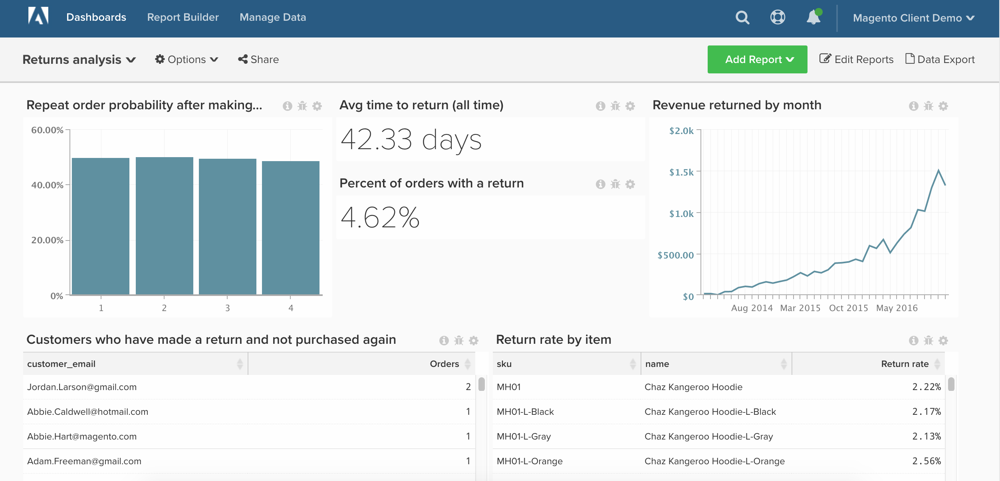

# 返された注文

この記事では、ストアの返品状況を詳細に分析できるダッシュボードを設定する方法について説明します。

使い始める前に、 [Adobe Commerce](https://business.adobe.com/products/magento/magento-commerce.html) の顧客と、会社が `enterprise\_rma` 戻り値のテーブル。

この分析に含まれる内容 [高度な計算列](../data-warehouse-mgr/adv-calc-columns.md).

## はじめに

追跡する列

* **`enterprise_rma`** または **`rma`** 表
* **`entity_id`**
* **`status`**
* **`order_id`**
* **`customer_id`**
* **`date_requested`**

* **`enterprise_rma_item_entity`** または **`rma_item_entity`** 表
* **`entity_id`**
* **`rma_entity_id`**
* **`qty_returned`**
* **`status`**
* **`order_item_id`**
* **`product_name`**
* **`product_sku`**

作成するフィルターセット

* **`enterprise_rma`** 表
* フィルタセット名： `Returns we count`
* フィルターセットの論理式：
   * プレースホルダー — ここにカスタムロジックを入力

* **`enterprise_rma_item_entity`** 表
* フィルタセット名： `Returns items we count`
* フィルターセットの論理式：
   * プレースホルダー — ここにカスタムロジックを入力

### 計算列

作成する列

* **`enterprise_rma`** 表
* **`Order's created at`**
* 定義を選択します。 `Joined Column`
* [!UICONTROL Create Path]:
* 
   [!UICONTROL Many]: `enterprise_rma.order_id`
* 

   [!UICONTROL One]: `sales_flat_order.entity_id`

* を選択します。 [!UICONTROL table]: `sales_flat_order`
* を選択します。 [!UICONTROL column]: `created_at`
   * `enterprise_rma.order_id = sales_flat_order.entity_id`

* **`Customer's order number`**
* 定義を選択します。 `Joined Column`
* を選択します。 [!UICONTROL table]: `sales_flat_order`
* を選択します。 [!UICONTROL column]: `Customer's order number`
   * `enterprise_rma.order_id = sales_flat_order.entity_id`

* **`Time between order's created_at and date_requested`** は、 `[RETURNS ANALYSIS]` チケット

* **`enterprise_rma_item_entity`** 表
* **`return_date_requested`**
* 定義を選択します。 `Joined Column`
* [!UICONTROL Create Path]:
   * 
      [!UICONTROL Many]: `enterprise_rma_item_entity.rma_entity_id`
   * 

      [!UICONTROL One]: `enterprise_rma.entity_id`

* を選択します。 [!UICONTROL table]: `enterprise_rma`
* を選択します。 [!UICONTROL column]: `date_requested`
   * `enterprise_rma_item_entity.rma_entity_id = enterprise_rma.entity_id`

* **`Return item total value (qty_returned * price)`** は、 `[RETURNS ANALYSIS]` チケット

* **`sales_flat_order`** 表
* **`Order contains a return? (1=yes/0=No)`**
* 定義を選択します。 `Exists`
* を選択します。 [!UICONTROL table]: `enterprise_rma`
   * `enterprise_rma.order_id = sales_flat_order.entity_id`

* **`Customer's previous order number`** は、 `[RETURNS ANALYSIS]` チケット
* **`Customer's previous order contains return? (1=yes/0=no)`** は、 `[RETURNS ANALYSIS]` チケット

>[!NOTE]
>
>「秒」が解決するまでの営業時間のみを分析したい場合、または「秒」が最初の応答までの営業時間を分析したい場合は、チケットをリクエストする際にアナリストに通知します。

### 指標

* **戻り値**
* 内 **`enterprise_rma`** 表
* この指標では **カウント**
* の **`entity_id`** 列
* 発注元： **`date_requested`**
* [!UICONTROL Filter]: `Returns we count`

* **返された項目**
* 内 **`enterprise_rma_item_entity`** 表
* この指標では **合計**
* の **`qty_approved`** 列
* 発注元： **`return date_requested`**
* [!UICONTROL Filter]: `Returns we count`

* **返された項目の合計値**
* 内 **`enterprise_rma_item_entity`** 表
* この指標では **合計**
* の **`Returned item total value (qty_returned * price)`** 列
* 発注元： **`return date_requested`**
* [!UICONTROL Filter]: `Returns we count`

* **注文から返品までの平均時間**
* 内 **`enterprise_rma`** 表
* この指標では **平均**
* の **`Time between order's created_at and date_requested`** 列
* 発注元： **`date_requested`**
* [!UICONTROL Filter]: `Returns we count`

>[!NOTE]
>
>必ず [すべての新しい列を指標のディメンションとして追加](../data-warehouse-mgr/manage-data-dimensions-metrics.md) 新しいレポートを作成する前に

### レポート

* **返品後に注文の確率を繰り返す**
* 指標 `A`: `Number of orders with returns`
* [!UICONTROL Metric]: `Number of orders`
* [!UICONTROL Filter]:
   * `Order contains a return? (1=yes/0=No) = 1`
   * `Is in current month? = No`

* 指標 `B`: `Non-last orders with returns`
* [!UICONTROL Metric]: `Number of orders`
* [!UICONTROL Filter]:
   * `Is customer's last order? (1=yes/0=no) = 0`
   * `Order contains a return? (1=yes/0=No) = 1`

* 数式：繰り返し注文の確率
* [!UICONTROL Formula]: `B / A`
* 

   [!UICONTROL Format]: `Percentage`

* [!UICONTROL Time period]: `All time`
* 
   [!UICONTROL 間隔]: `None`
* [!UICONTROL Group by]: `Customer's order number`
* 
   [!UICONTROL グラフの種類]: `Bar`

* **平均戻り時間（全時間）**
* 指標 `A`: `Avg time between order and return`
* [!UICONTROL Metric]: `Avg time between order and return`

* [!UICONTROL Time period]: `All time`
* 
   [!UICONTROL 間隔]: `None`
* 

   [!UICONTROL グラフの種類]: `Number`

* **返品のある注文の割合**
* 指標 `A`: `Number of orders`
* [!UICONTROL Metric]: `Number of orders`

* 指標 `B`: `Orders w/ return`
* [!UICONTROL Metric]: `Number of orders`
* [!UICONTROL Filter]:
   * `Order contains a return? (1=yes/0=No) = 1`

* 数式：返品のある注文の割合
* [!UICONTROL Formula]: `B / A`
* 

   [!UICONTROL Format]: `Percentage`

* [!UICONTROL Time period]: `All time`
* 
   [!UICONTROL 間隔]: `None`
* [!UICONTROL Chart Type]: `Number - % of orders with return`

* **月別の収益**
* 指標 `A`: `Returned item total value`
* [!UICONTROL Metric]: `Returned item total value`

* [!UICONTROL Time period]: `All time`
* [!UICONTROL Interval]: `By month`
* 

   [!UICONTROL グラフの種類]: `Line`

* **再度購入せずに返品を行った顧客**
* 指標 `A`: `Number of orders with returns`
* [!UICONTROL Metric]: `Number of orders`
* [!UICONTROL Filter]:
   * `Order contains a return? (1=yes/0=No) = 1`
   * `Is customer's last order? (1=yes/0=no) = 1`

* [!UICONTROL Time period]: `All time`
* 
   [!UICONTROL 間隔]: `None`
* 
   [!UICONTROL グループ化基準]: `Customer_email`
* 

   [!UICONTROL グラフの種類]: `Table`

* **品目別の返品率**
* 指標 `A`: `Returned items` （非表示）
* [!UICONTROL Metric]:返された項目

* 指標 `B`: `Items sold` （非表示）
* [!UICONTROL Metric]: `Number of orders`
* [!UICONTROL Filter]:

* [!UICONTROL Formula]: `Return %`
* [!UICONTROL Formula]: `B / A`
* 

   [!UICONTROL Format]: `Percentage`

* [!UICONTROL Time period]: `All time`
* 
   [!UICONTROL 間隔]: `None`
* [!UICONTROL Group by]: `product_sku AND/OR product_name`
* 
   [!UICONTROL グラフの種類]: `Table`

すべてのレポートをコンパイルした後、必要に応じてダッシュボードで整理できます。 結果は、上記のサンプルダッシュボードのようになります。

この分析の構築中に質問が発生した場合、または単に Professional Services チームを引き付けたい場合、 [連絡先サポート](../../guide-overview.md).
