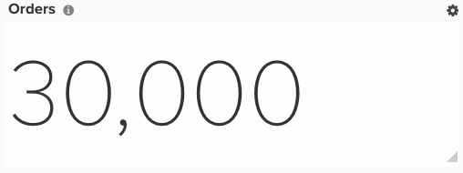

# RFM分析

このトピックでは、最新性、頻度、金銭的ランキングによって顧客をセグメント化できるダッシュボードを設定する方法を示します。 RFM分析とは、顧客の行動を考慮して、アウトリーチのセグメンテーションを決定するマーケティング手法です。 3つの側面を考慮しています。

1. 顧客が店舗から最近購入した商品
1. 購入頻度
1. 顧客が費やす金額

RFM分析は、新しいアーキテクチャで[!DNL Adobe Commerce Intelligence] Pro プランを使用している場合（たとえば、`Manage Data` メニューの下に`Data Warehouse Views` オプションがある場合）にのみ設定できます。 これらの列は&#x200B;**[!DNL Manage Data > Data Warehouse]** ページから作成できます。 詳細な手順は以下のとおりです。

## はじめに

最初に、値が1のプライマリキーのみを含むファイルをアップロードする必要があります。 これにより、分析に必要な計算列を作成できます。

この[記事](../importing-data/connecting-data/using-file-uploader.md)と次の画像を使用して、ファイルをフォーマットできます。

## 予定列

あなたのビジネスがゲストの注文を許可するならば、さらに区別されます。 その場合、`customer_entity` テーブルのすべての手順を無視できます。 ゲスト注文が許可されていない場合は、`sales_flat_order` テーブルのすべての手順を無視します。

作成する列

* **`Sales_flat_order/customer_entity`** テーブル
* `Customer's last order date`
* [!UICONTROL Column type]: `Many to one > Max`
* [!UICONTROL Pat]: `sales_flat_order.customer_id > customer_entity.entity_id`
* 選択済み[!UICONTROL column]: `created_at`
* [!UICONTROL Filter]: `Orders we count`

* 
      お客様の最終注文日からの秒数
  * [!UICONTROL Column type]: - 「同じテーブル >年齢
* 選択済み[!UICONTROL column]: `Customer's last order date`

* （入力） カウント参照
* [!UICONTROL Column type]: `Same table > Calculation`
* 
  [!UICONTROL入力]: `entity_id`
* [!UICONTROL Calculation]: `**case when A is null then null else 1 end**`
* 
  [!UICONTROL データタイプ]: `Integer`

* **参照** テーブルをカウントします（これは、「1」という数字でアップロードしたファイルです）
* 顧客数
* [!UICONTROL Column type]: `Many to One > Count Distinct`
* [!UICONTROL Path]: `ales_flat_order.(input) reference > Count reference.Primary Key`または`customer_entity.(input)reference > Count Reference`。`Primary Key`
* 選択された[!UICONTROL column]: `sales_flat_order.customer_email`または`customer_entity.entity_id`

* **Customer_entity** テーブル
* 顧客数
* [!UICONTROL Column type]: `One to Many > JOINED_COLUMN`
* [!UICONTROL Path]: `customer_entity`.（入力）参照>顧客集中度。`Primary Key`
* 選択済み[!UICONTROL column]: `Number of customers`

* （入力） `Ranking by customer lifetime revenue`
* [!UICONTROL Column type]: `Same table > Event Number`
* [!UICONTROL Event owner]: `(input) reference for count`
* [!UICONTROL Event rank]: `Customer's lifetime revenue`

* 顧客生涯収益別ランキング
* [!UICONTROL Column type]: `Same table > Calculation`
* [!UICONTROL Inputs]: `(input) Ranking by customer lifetime revenue`, `Number of customers`
* [!UICONTROL Calculation]: `case when A is null then null else (B-(A-1)) end`
* 
  [!UICONTROL データタイプ]: `Integer`

* 顧客の金銭的スコア（百分率）
* [!UICONTROL Column type]: `Same table > Calculation`
* [!UICONTROL Inputs]: `(input) Ranking by customer lifetime revenue`, `Number of customers`
* [!UICONTROL Calculation]: `Case when round((B-A+1)*100/B,0) <= 20 then 5 when round((B-A+1)*100/B,0) <= 40 then 4 when round((B-A+1)*100/B,0) <= 60 then 3 when round((B-A+1)*100/B,0) <= 80 then 2 when round((B-A+1)*100/B,0) <= 100 then 1 else 0 end`
* 
  [!UICONTROL データタイプ]: `Integer`

* （input）顧客生涯注文数別ランキング
* [!UICONTROL Column type]: `Same table > Event Number`
* [!UICONTROL Event owner]: `(input) reference for count`
* [!UICONTROL Event rank]: `Customer's lifetime number of orders`

* 顧客のライフタイムオーダー数によるランキング
* 
  [!UICONTROL列タイプ]: – "同じ表/計算"
* [!UICONTROL Inputs]: - **（入力）顧客生涯注文数**、**顧客数**&#x200B;によるランキング
* [!UICONTROL Calculation]: - **Aがnullの場合、その後nullの場合（B – （A-1）） end**
* [!UICONTROL Datatype]: – 整数

* 顧客の頻度スコア（百分率）
* [!UICONTROL Column type]: `Same table > Calculation`
* [!UICONTROL Inputs]: `(input) Ranking by customer lifetime number of orders`, `Number of customers`
* [!UICONTROL Calculation]: `Case when round((B-A+1)*100/B,0) <= 20 then 5 when round((B-A+1)*100/B,0) <= 40 then 4 when round((B-A+1)*100/B,0) <= 60 then 3 when round((B-A+1)*100/B,0) <= 80 then 2 when round((B-A+1)*100/B,0) <= 100 then 1 else 0 end`
* 
  [!UICONTROL データタイプ]: `Integer`

* 顧客の最後の注文日からの秒単位のランキング
* [!UICONTROL Column type]: `Same table > Event Number`
* [!UICONTROL Event owner]: `(input) reference for count`
* [!UICONTROL Event rank]: `Seconds since customer's last order date`

* 顧客の最新性スコア（百分率による）
* [!UICONTROL Column type]: `Same table > Calculation`
* [!UICONTROL Inputs]: `(input) Ranking by customer lifetime number of orders`, `Number of customers`
* [!UICONTROL Calculation]: `Case when (A * 100/B,0) <= 20 then 5 when (A * 100/B,0) <= 40 then 4 when (A * 100/B,0) <= 60 then 3 when (A * 100/B,0) <= 80 then 2 when (A * 100/B,0) <= 100 then 1 else 0 end`
* 
  [!UICONTROL データタイプ]: `Integer`

* 顧客の最新性スコア（百分率による）
* [!UICONTROL Column type]: `Same table > Calculation`
* [!UICONTROL Inputs]: `Customer's recency score (by percentiles)`, `Customer's frequency score (by percentiles)`, `Customer's monetary score (by percentiles)`
* [!UICONTROL Calculation]: `case when (A IS NULL or B IS NULL or C IS NULL) then null else concat(A,B,C) end`
* 
  [!UICONTROL データタイプ]: String

* **参照** テーブルをカウント
* [!UICONTROL Number of customers]: `(RFM > 0)`
* [!UICONTROL Column type]: `Many to One > Count Distinct`
* [!UICONTROL Path]: `sales_flat_order.(input) reference > Customer Concentration. Primary Key`または`customer_entity.(input)reference > Customer Concentration.Primary Key`
* 選択された[!UICONTROL column]: `sales_flat_order.customer_email`または`customer_entity.entity_id`
* [!UICONTROL Filter]: `Customer's RFM score (by percentile)`は000に等しくありません

* **Customer_entity** テーブル
* [!UICONTROL Number of customers]: `(RFM > 0)`
* [!UICONTROL Column type]: `One to Many > JOINED_COLUMN`
* [!UICONTROL Path]: `customer_entity.(input) reference > Customer Concentration.Primary Key`
* 選択された[!UICONTROL column]: - `Number of customers`

* お客様の最新性スコア `(R+F+M)`
* [!UICONTROL Column type]: `Same table > Calculation`
* [!UICONTROL Inputs]: - `Customer's recency score (by percentiles)`、`Customer's frequency score (by percentiles)`、`Customer's monetary score (by percentiles)`
* [!UICONTROL Calculation]: `case when (A IS NULL or B IS NULL or C IS NULL) then null else A+B+C end`
* 
  [!UICONTROL データタイプ]: `Integer`

* （入力）お客様のRFM全体のスコアによるランキング
* [!UICONTROL Column type]: `Same table > Event Number`
* [!UICONTROL Event owner]: `(input) reference for count`
* [!UICONTROL Event rank]: `Customer's recency score (R+F+M)`
* [!UICONTROL Filter]: `Customer's RFM score (by percentile)`は000に等しくありません

* お客様のRFM全体のスコアによるランキング
* [!UICONTROL Column type]: `Same table > Calculation`
* [!UICONTROL Inputs]: `(input) Ranking by customer's overall RFM score`, `Number of customers (RFM > 0)`
* [!UICONTROL Calculation]: `case when A is null then null else (B-(A-1)) end`
* 
  [!UICONTROL データタイプ]: `Integer`

* 顧客のRFM グループ
* [!UICONTROL Column type]: `Same table > Calculation`
* [!UICONTROL Inputs]: `(input) Ranking by customer lifetime revenue`, `Number of customers`
* [!UICONTROL Calculation]: `Case when round(A * 100/B,0) <= 20 then '5. copper' when round(A * 100/B,0) <= 40 then '4. bronze' when round(A * 100/B,0) <= 60 then '3. silver' when round(A * 100/B,0)<= 80 then '2. gold' else '1. Platinum' end`
* 
  [!UICONTROL データタイプ]: `Integer`

>[!NOTE]
>
>使用されるパーセンタイルは、顧客の分割です（例えば、1～5を返すために20%のバケット）。 これらの重みを設定するカスタム方法がある場合は、チケットの送信時にアナリストに通知します。

## 指標

新しい指標はありません。

>[!NOTE]
>
>新しいレポートを作成する前に、必ず[すべての新しい列を指標](../data-warehouse-mgr/manage-data-dimensions-metrics.md)にディメンションとして追加してください。

## レポート

* **RFM グループ化による顧客**
* 指標`A`: `New customers`
* [!UICONTROL Metric]: `New customers`
* [!UICONTROL Filter]: `Customer's RFM score (by percentiles) Not Equal to 000`

* [!UICONTROL Time period]: `All time`
* 
  [!UICONTROL Interval]: `None`
* グラフを隠す
* [!UICONTROL Group by]: `Customer's RFM group`
* 
  [!UICONTROL グループ化：]: `Email`
* 
  [!UICONTROL Chart type]: `Table`

* **5つの最新性スコアを持つ顧客**
* 指標`A`: `New customers`
* [!UICONTROL Metric]: `New customers`
* [!UICONTROL Filter]: `Customer's recency score (by percentiles) Equal to 5`

* [!UICONTROL Time period]: `All time`
* 
  [!UICONTROL Interval]: `None`
* 
  [!UICONTROL Chart Type]: `Scalar`
* グラフを隠す
* 
  [!UICONTROL グループ化：]: `Email`
* [!UICONTROL Group by]: `Customer's RFM score (R+F+M)`
* 
  [!UICONTROL Chart type]: `Table`

* **1つの最新性スコアを持つ顧客**
* 指標`A`: `New customers`
* [!UICONTROL Metric]: `New customers`
* [!UICONTROL Filter]: `Customer's recency score (by percentiles) Equal to 1`

* [!UICONTROL Time period]: `All time`
* 
  [!UICONTROL Interval]: `None`
* 
  [!UICONTROL Chart Type]: `Scalar`
* グラフを隠す
* 
  [!UICONTROL グループ化：]: `Email`
* [!UICONTROL Group by]: `Customer's RFM score (R+F+M)`
* 
  [!UICONTROL Chart type]: `Table`

すべてのレポートをまとめた後、必要に応じてダッシュボード上でレポートを整理できます。 結果は上記のサンプルダッシュボードのように見えるかもしれませんが、生成された3つのテーブルは、実行できる顧客セグメンテーションの例にすぎません。
