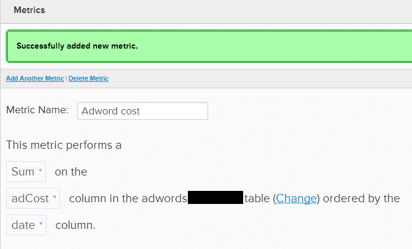

# AdvertisingのキャンペーンとROI

[!DNL Adobe Commerce Intelligence]を使用すると、簡単に[広告コスト データと収益データをデータベースから](../../data-analyst/importing-data/integrations/google-adwords.md)結合できます。 これにより、ROI （投資収益率）が最も高い施策を特定できます。 ここでは、キャンペーンのパフォーマンスを評価するいくつかの異なる方法について説明します。

## 前提条件

* 広告コストデータを読み込みます。
   * [お客様の [!DNL Google AdWords] から [!DNL Commerce Intelligence]](../importing-data/integrations/google-adwords.md)への接続：これにより、[!DNL Adwords]での[!DNL Commerce Intelligence]の支出が同期されます
   * [その他の広告コスト データをアップロード &#x200B;](../importing-data/connecting-data/import-offline-ad-data.md)：これは、直接コネクタのないチャネルの[!DNL Commerce Intelligence]へのアップロードをお勧めします
   * 複数のソースからコストデータをインポートする場合は、[&#x200B; データを](../../best-practices/consolidating-your-tables.md)統合[!DNL Commerce Intelligence]できます。 [&#x200B; サポートチケットを送信](../../guide-overview.md#Submitting-a-Support-Ticket)するだけです。
* [ユーザー獲得チャネルデータの追跡](../analysis/google-track-user-acq.md)

## ユーザー獲得キャンペーン

ユーザー獲得をターゲットにした施策は、次のようなさまざまな観点から測定できます。

1. キャンペーンの新規ユーザー獲得数
1. 登録からキャンペーン購入までのコンバージョン率
1. 平均顧客生涯価値（LTV）にもとづくキャンペーンのROI

上記の分析（1）と（2）については、[上位マーケティングチャネルの特定](../analysis/most-value-source-channel.md)に関する別のチュートリアルで説明します。 ここでは、分析（3）を活用して、キャンペーンのROIを長期的に測定することを目指しています。 これは、特定のキャンペーンから獲得したユーザーが、獲得コストをカバーするのに十分な生涯売上を生み出したかどうかを判断するのに役立ちます。

>[!NOTE]
>
>この例では、すべてのキャンペーンコストが新規顧客の獲得にのみ使用されたことを前提としています。 実際、コンバージョンしていない訪問やリピート購入などを獲得することで、キャンペーンコストも共有されます。 すべてのコストを新しい登録ユーザーの獲得に使用すると仮定すると、ROIは最悪のケース シナリオ（獲得単価が最も高い）を考慮します。 実際のROIが計算のROIを上回っていることを確認できます。
>
>例：10人の新規ユーザーと10人のリピート購入者を生成したキャンペーンに20 ドルを費やした場合、新規ユーザーあたりの実際のコストは1 ドルになります。 ただし、すべてのコストが新規ユーザーの獲得に費やされたと仮定すると、獲得単価は2 ドルになります。

**1.キャンペーン別の広告コストをセグメント化するグラフを作成することから始めます：**

1. 時間の経過に伴う費用を合計する[!UICONTROL Metric]を作成します
1. [!UICONTROL Data > Metrics]に移動
1. `Add New Metric`を選択し、[!DNL `Adwords...`] コスト データを記録している[!DNL AdWords] テーブルを選択します。
1. 指標エディターで、指標に名前を付けます（例：[!UICONTROL AdWord Cost]）
1. ドロップダウンを使用して、**列が順序付けした** テーブル（変更）の`adCost`列で[!DNL Adwords...]合計`date`を実行します。
   <!--="500" height="303"}-->
1. 上部の`Back to Metric List`をクリックして、任意のダッシュボードに移動します。

1. キャンペーンごとの支出をセグメント化するレポートを作成します
1. 任意のダッシュボードで、[!UICONTROL Add Report > Create report]をクリックします
1. 作成したばかりの[!UICONTROL Adword Cost]指標を選択します
1. [!UICONTROL Time period]を`All-time`に、[!UICONTROL Interval]を`None`に設定します
1. 「`Group by`」タブで、`campaign`を[!UICONTROL grouping field]として追加し、ボックス内の`Add All`をクリックします。
1. このレポートには、キャンペーン別のすべての時間[!DNL AdWords] コストが表示されます

**2。 キャンペーン別の新規ユーザー数をカウントするレポートを作成します：**

1. 任意のダッシュボードで、**[!UICONTROL Add Report > Create report]**&#x200B;をクリックします
1. 新規登録ユーザー数を経時的にカウントする`New users`指標を選択します
1. [!UICONTROL Time period]を`All-time`に、[!UICONTROL Interval]を`None`に設定します
1. `Group by` タブで、`campaign`を`grouping field`として追加し、ボックス内の&#x200B;**`Add All`**&#x200B;をクリックします
1. このレポートには、キャンペーン別のすべての時間登録ユーザーが表示されます

**3。 キャンペーン別の平均ユーザーLTVをセグメント化するレポートを作成：**

1. 任意のダッシュボードで、**[!UICONTROL Add Report > Create report]**&#x200B;をクリックします
1. 平均ユーザーのライフタイムレベニューを計算する`Average lifetime revenue`指標を選択します
1. [!UICONTROL Time period]を`All-time`に、[!UICONTROL Interval]を`None`に設定します
1. `Group by` タブで、`campaign`または`utm\_campaign`を[!UICONTROL grouping field]として追加し、ボックス内の`Add All`をクリックします
1. このレポートは、キャンペーン別の平均ユーザー生涯売上を示しています

**最後に、次の3つの分析を1つのレポートにまとめて、キャンペーン ROIを計算します。**

1. 任意のダッシュボードで、**[!UICONTROL Add Report > Create new report]**&#x200B;をクリックします
1. 入力として追加するには、上記の3つの指標を使用します。 各文字が割り当てられます（例：\[`A`\]、\[`B`\]、\[`C`\]）
1. [!UICONTROL Cost]：指標AdWords コストを追加します。これは変数\[A\]です。 これにより、キャンペーン別のコストを回収できます。
1. [!UICONTROL Users]：指標「新規ユーザー」を追加します。これは変数\[B\]です。 キャンペーン別のユーザー数を返します。
1. [!UICONTROL LTV]：指標の平均生涯売上高を追加します。これは変数\[`C`\]です。 これにより、キャンペーンごとにLTVを返します。

1. グラフという単語の横にある非表示アイコンをクリックして、テーブルに集中できるようにします
1. 次のように、`Add Formula`を使用してこれらの指標を組み合わせます。
1. [!UICONTROL ROI]:「\[`(\[C\]-\[A\]/\[B\])/(\[A\]/\[B\])`\]」が`A`、「\[`Ad Cost by Campaigns`\]」が`B`、「\[`New users by campaigns`\] `C`」の場合、数式`LTV by campaigns`を入力します。 これは、（平均ユーザーLTV – 獲得単価）/（獲得単価）の比率を返します
1. [!UICONTROL Avg Return per User]：数式&#x200B;**\[`C`\] – （\[`A`\]/\[`B`\]）**&#x200B;を入力します。 これにより、ユーザーの平均利益率（平均ユーザーLTV） – （平均獲得単価）を計算して、ユーザーに対して行われた平均利益率が返されます。
1. [!UICONTROL CPA]：数式&#x200B;**`\[A\]/\[B\]`**&#x200B;を入力します。 これは、実際のキャンペーンの獲得単価を返します。
1. [!DNL AdWords] データから含めるその他の潜在的な指標には、`Impressions`と`adClicks` （データ [!DNL AdWords]）の合計と、特定のキャンペーンを介して行われた合計`number of orders`が含まれます。
1. また、利用者が登録したり最初に購入したりしてから30日と90日後のLTVにもとづいて、ROIを計算することは興味深いことかもしれません。

1. 指標と数式をクリックしてドラッグし、レポートの列を並べ替えることもできます
1. レポートに名前を付け、必ずテーブルとして保存します。

## 製品キャンペーン

製品固有の広告を配信していますか？ その場合、特定の製品の売上とコストを計算することで、施策のROIを測定できます。

>[!NOTE]
>
>この例では、すべてのキャンペーンコストが特定の製品の購入にのみ使用されたと仮定します。 すべてのコストが購入の創出に費やされたと仮定することで、生じるROIは最悪のケースのシナリオ（購入あたりの最も高いコスト）を考慮します。 実際のROIがこの計算よりも高いことを確認できます。 例：10人の新規ユーザーと10人の購入を生み出したキャンペーンに20 ドルを費やした場合、実際の購入単価は1 ドルとなります。 すべてのコストが新規ユーザーの獲得に費やされたことを前提にすると、購入単価は2 ドルになります。

開始する前に、[&#x200B; サポートチケット &#x200B;](https://experienceleague.adobe.com/docs/commerce-knowledge-base/kb/troubleshooting/miscellaneous/mbi-service-policies.html)を送信して、次のディメンションを行項目テーブル （`sales\_flat\_order\_item, order\_item`）に結合します。

* 注文のソース（ユーザーレベルで紹介ソースのみを追跡する場合は、ユーザーのソースを結合します）
* 注文のキャンペーン（ユーザーレベルで紹介ソースのみを追跡する場合は、ユーザーのキャンペーンに参加します）
* 注文のメディア（ユーザーレベルで紹介ソースのみを追跡する場合は、ユーザーのメディアに参加します）

**1.次に、特定の製品に対するキャンペーンあたりの収益を返すグラフを作成します：**

1. 任意のダッシュボードで、**[!UICONTROL Add Report > Create new report]**&#x200B;をクリックします
1. 行項目レベルで収益を計算する`Revenue by items`指標を選択します
1. [!UICONTROL Time period]を`All-time`に、[!UICONTROL Interval]を`None`に設定します
1. 「`Filter by`」タブに「`product name 'IN'` Product `A`, Product `B`, Product `C`, ...」を追加し、キャンペーンでターゲットとするすべての製品名をコンマで区切って含めます（例：`product name 'IN' yellow t-shirt`, `red t-shirt, blue t-shirt`）
1. 「`Group by`」タブで、`order's campaign`または`order's utm\_campaign`を`grouping` フィールドとして追加し、ボックス内の&#x200B;**[!UICONTROL Add All]**&#x200B;をクリックします
1. このレポートは、特定の製品の売上をキャンペーン別に表示します

**2。 ROIを計算するには、次の1つのレポートで指標を再び組み合わせます：**

1. 任意のダッシュボードで、**[!UICONTROL Add Report > Create new report]**&#x200B;をクリックします
1. 上記の特定の製品のキャンペーンの指示とフィルターに従って`Revenue by items`指標を追加し、指標のスカラー値の下にある&#x200B;**[!UICONTROL Hide]**&#x200B;をクリックします
1. 次に、[!DNL AdWords Cost]指標を追加し、上記の`Ad cost by campaigns` セクションで検索した`User acquisition campaigns` レポートのフィルターと方向でグループ化します。次に、指標のスカラー値の下にある&#x200B;**[!UICONTROL Hide]**&#x200B;をクリックします
1. これらの指標を使用して、式を追加します。
1. [!UICONTROL ROI]: `\[A\]/\[B\]`が`\[A\]`を表し、`Revenue per campaign for specific product(s)`が`\[B\]`を表す場合、数式`Ad cost by campaigns`を入力します。 （特定の製品の収益） / （キャンペーンコスト）の比率を返します
1. [!UICONTROL Return]：数式`\[A\]-\[B\]`を入力します。 これは、計算によってユーザーに対して行われた平均利益率（平均ユーザーLTV） – （平均獲得単価）を返します
   1. （オプション） [!UICONTROL Revenue]: `Revenue by items`指標を再表示して、キャンペーンごとの特定の製品の収益を確認します
   1. （オプション） [!UICONTROL Cost]: `AdWords Cost`指標を再表示して、キャンペーンのコストを確認します

1. レポートに名前を付けて、必ずテーブルとして保存します

**3。 広告された製品または製品グループごとに、上記の手順1と2を繰り返します。**

## 関連ドキュメント

* [&#x200B; [!DNL Google Analytics] E-Commerce経由で注文の紹介ソースを追跡](../importing-data/integrations/google-ecommerce.md)
* [データベース内のユーザー紹介ソースの追跡](../analysis/google-track-user-acq.md)
* [データベース内のユーザーデバイス、ブラウザー、OS データの追跡](../analysis/track-usr-dev-browser.md)
* [最も価値のある獲得ソースとチャネルの発見](../analysis/most-value-source-channel.md)
* [&#x200B; [!DNL Google Adwords]  アカウントを接続](../importing-data/integrations/google-adwords.md)
* [&#x200B; [!DNL Google Analytics] UTM アトリビューションの仕組み](../analysis/utm-attributes.md)
* [&#x200B; [!DNL Google Analytics]でのUTM タグ付けに関する5つのベストプラクティス](../../best-practices/utm-tagging-google.md)
