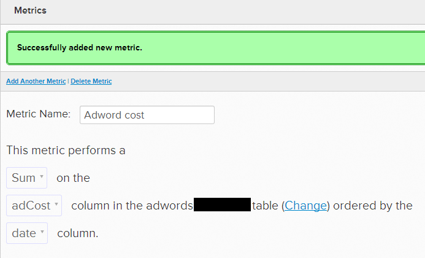

# Advertising キャンペーンと ROI

[!DNL Adobe Commerce Intelligence] を使用すると、データベースから広告のコストデータと売上高データを簡単に結び付ける [ 結合する ](../../data-analyst/importing-data/integrations/google-adwords.md) ことができます。 これにより、投資回収率（ROI）が最も高いキャンペーンを特定できます。 このトピックでは、キャンペーンのパフォーマンスを評価する様々な方法について説明します。

## 前提条件

* 広告コストデータを読み込みます。
   * [ 接続  [!DNL Google AdWords]  先  [!DNL Commerce Intelligence]](../importing-data/integrations/google-adwords.md)：これは、[!DNL Adwords] での [!DNL Commerce Intelligence] の支出を同期します
   * [ その他の広告コストデータをアップロードする ](../importing-data/connecting-data/import-offline-ad-data.md):[!DNL Commerce Intelligence] への直接コネクタがないチャネルの場合に推奨されます
   * 複数のソースから原価データをインポートする場合は、[ のデータを ](../../best-practices/consolidating-your-tables.md) 連結 [!DNL Commerce Intelligence] できます。 単純に [ サポートチケットを送信 ](../../guide-overview.md#Submitting-a-Support-Ticket) します。
* [ユーザー獲得チャネルデータの追跡](../analysis/google-track-user-acq.md)

## ユーザー獲得キャンペーン

ユーザー獲得をターゲットとしたキャンペーンは、次のような多くの観点から測定できます。

1. キャンペーンで獲得した新規ユーザー数
1. キャンペーンの登録から購入へのコンバージョン率
1. 平均ユーザー生涯値（LTV）に基づくキャンペーンの ROI

上記の（1）および（2）の分析は、[ 上位のマーケティングチャネルの識別 ](../analysis/most-value-source-channel.md) に関する別のチュートリアルで説明します。 ここでは、分析（3）を調べて、キャンペーンの ROI の推移を測定します。 これにより、特定のキャンペーンから取得したユーザーが、取得コストをカバーするのに十分な生涯収益を生み出したかどうかに回答できます。

>[!NOTE]
>
>この例では、すべてのキャンペーンコストが新しいユーザーの取得にのみ使用されたと想定しています。 実際には、キャンペーンコストは、コンバージョンされていない訪問の取得やリピート購入者とも共有されます。 新規登録ユーザーの獲得にすべてのコストを使用すると仮定すると、結果として生じる ROI は最悪のケースのシナリオ（獲得あたりの最高コスト）を占めます。 実際の ROI が計算よりも高いことを確認できます。
>
>例：10 人の新規ユーザーと 10 人のリピート購入者を生成したキャンペーンに$20 を費やしたとすると、新規ユーザーあたりの実際のコストは$1 になります。 しかし、すべてのコストが新しいユーザーを獲得するために行ったと仮定すると、獲得あたりのコストは 2 ドルです。

**1.まず、キャンペーン別に広告コストをセグメント化するグラフを作成します。**

1. 時間の経過に伴う支出を合計する [!UICONTROL Metric] を作成
1. [!UICONTROL Data > Metrics] に移動
1. 「`Add New Metric`」を選択し、[!DNL `Adwords...`] のコストデータを記録している [!DNL AdWords] テーブルを選択します。
1. 指標エディターで、指標に名前を付けます（例：[!UICONTROL AdWord Cost]）
1. ドロップダウンを使用して、**列で並べ替えられた** テーブルの `adCost` 列で [!DNL Adwords...] 合計 `date` を実行します。
   <!--="500" height="303"}-->
1. 上部の「`Back to Metric List`」をクリックして、任意のダッシュボードに移動します。

1. キャンペーン別の支出をセグメント化するレポートの作成
1. 任意のダッシュボードで、「[!UICONTROL Add Report > Create report]」をクリックします
1. 作成した [!UICONTROL Adword Cost] 指標を選択します
1. [!UICONTROL Time period] を `All-time` に、[!UICONTROL Interval] を `None` に設定します
1. 「`Group by`」タブで、`campaign` を [!UICONTROL grouping field] として追加し、ボックスの `Add All` をクリックします。
1. このレポートは、キャンペーン別の常 [!DNL AdWords] コストを表示します

**2。 キャンペーン別に新規ユーザーをカウントするレポートを作成：**

1. 任意のダッシュボードで、「**[!UICONTROL Add Report > Create report]**」をクリックします
1. 新規登録ユーザー数の推移をカウントする `New users` 指標を選択します
1. [!UICONTROL Time period] を `All-time` に、[!UICONTROL Interval] を `None` に設定します
1. 「`Group by`」タブで、`campaign` を `grouping field` として追加し、ボックスの「**`Add All`**」をクリックします
1. このレポートは、すべての登録済みユーザーをキャンペーンごとに表示します

**3。 キャンペーン別の平均ユーザー LTV をセグメント化するレポートを作成します。**

1. 任意のダッシュボードで、「**[!UICONTROL Add Report > Create report]**」をクリックします
1. 平均ユーザーのライフタイム収益を計算する `Average lifetime revenue` 指標を選択します
1. [!UICONTROL Time period] を `All-time` に、[!UICONTROL Interval] を `None` に設定します
1. 「`Group by`」タブで、`campaign` または `utm\_campaign` を [!UICONTROL grouping field] として追加し、ボックスの `Add All` をクリックします
1. このレポートは、キャンペーン別の平均ユーザー生涯売上高を表示します

**最後に、次の 3 つの分析を 1 つのレポートにまとめて、キャンペーンの ROI を計算します。**

1. 任意のダッシュボードで、「**[!UICONTROL Add Report > Create new report]**」をクリックします
1. 入力として追加し、上記で使用している 3 つの指標を使用します。 それぞれに文字（例：\[`A`\]、\[`B`\]、\[`C`\]）が割り当てられます
1. [!UICONTROL Cost]：指標 AdWords コストを追加します – これは変数\[A\] です。 これにより、キャンペーン別のコストが返されます。
1. [!UICONTROL Users]：指標「新規ユーザー – これは変数\[B\] です」を追加します。 これは、キャンペーン別のユーザー数を返します。
1. [!UICONTROL LTV]：指標「平均生涯売上高」を追加します – これは変数\[`C`\] です。 これにより、キャンペーン別の LTV が返されます。

1. グラフという単語の横にある非表示アイコンをクリックして、テーブルに焦点を当てます
1. 次に、`Add Formula` を使用して、これらの指標を次のように組み合わせます。
1. [!UICONTROL ROI]: \[`(\[C\]-\[A\]/\[B\])/(\[A\]/\[B\])`\] が `A`、\[`Ad Cost by Campaigns`\] が `B`、\[`New users by campaigns`\] `C` を表す場合は、数式 `LTV by campaigns` を入力します。 これは、（平均ユーザー LTV – 取得あたりの平均コスト） / （取得あたりの平均コスト）の比率を返します
1. [!UICONTROL Avg Return per User]：式 **\[`C`\] – （\[`A`\]/\[`B`\]）** を入力します。 これは、（平均ユーザー LTV） – （獲得あたりの平均コスト）を計算することによって、ユーザーに対して行われた平均利益を返します。
1. [!UICONTROL CPA]：式 **`\[A\]/\[B\]`** を入力します。 これは、獲得あたりの実際のキャンペーンのコストを返します。
1. [!DNL AdWords] データから含めるその他の潜在的な指標には、`Impressions` と `adClicks` の合計（[!DNL AdWords] データから）と、特定のキャンペーンを通じて行われた合計 `number of orders` があります。
1. ユーザーが登録または初回購入してから 30 日後と 90 日後の LTV に基づいて ROI を計算するのも興味深いかもしれません。

1. 指標と式をクリックおよびドラッグして、レポートの列を並べ替えることができます
1. レポートに名前を付け、必ずテーブルとして保存します。

## 製品キャンペーン

製品固有の広告を実行していますか？ その場合は、特定の製品の売上高/コストを計算することで、これらのキャンペーンの ROI を測定できます。

>[!NOTE]
>
>この例では、すべてのキャンペーンコストが特定の製品の購入の生成にのみ使用されたと想定しています。 購入の生成にすべてのコストが費やされたと仮定すると、結果の ROI は最悪のケースシナリオ（購入あたりの最高コスト）を占めます。 実際の ROI はこの計算よりも高いと確信できます。 例：新規ユーザー 10 人と購入 10 件を生成したキャンペーンに$20 を費やしたとすると、購入あたりの実際のコストは$1 です。 新規ユーザーの獲得にはすべてのコストがかかるという前提の下では、1 回の購入あたりのコストは 2 ドルです。

開始する前に、[ サポートチケットを送信 ](https://experienceleague.adobe.com/docs/commerce-knowledge-base/kb/troubleshooting/miscellaneous/mbi-service-policies.html?lang=ja) して、次のディメンションを行項目テーブル（`sales\_flat\_order\_item, order\_item`）に結合します。

* 注文のソース（ユーザーレベルでリファラルソースのみを追跡する場合は、ユーザーのソースを結合します）
* 注文のキャンペーン（ユーザーレベルでのリファラルソースの追跡のみ行う場合は、ユーザーのキャンペーンに参加します）
* 注文のメディア（ユーザーレベルでのリファラルソースのみを追跡する場合は、ユーザーのメディアを結合します）

**1.次に、特定の製品についてキャンペーンあたりの売上高を返すグラフを作成することから始めます。**

1. 任意のダッシュボードで、「**[!UICONTROL Add Report > Create new report]**」をクリックします
1. ライン項目レベルで収益を計算する `Revenue by items` 指標を選択します
1. [!UICONTROL Time period] を `All-time` に、[!UICONTROL Interval] を `None` に設定します
1. 「`Filter by`」タブで、製品 `product name 'IN'`、製品 `A`、製品 `B` な `C` を追加し、コンマで区切られたキャンペーンでターゲットとなるすべての製品名を含めます（例：`product name 'IN' yellow t-shirt`、`red t-shirt, blue t-shirt`）
1. 「`Group by`」タブで、フィールドとして「`order's campaign`」または「`order's utm\_campaign`」 `grouping` 追加し、ボックスの「**[!UICONTROL Add All]**」をクリックします
1. このレポートは、特定の製品の売上高をキャンペーン別に表示します

**2。 ROI を計算するには、指標を 1 つのレポートに再度組み合わせます。**

1. 任意のダッシュボードで、「**[!UICONTROL Add Report > Create new report]**」をクリックします
1. 上の「特定の製品のキャンペーン」レポートの指示に従ってフィルターおよびグループ化した後、`Revenue by items` 指標を追加し、指標のスカラー値の下にある「**[!UICONTROL Hide]**」をクリックします
1. 次に、[!DNL AdWords Cost] 指標を追加し、上記の `Ad cost by campaigns` の節で調べた `User acquisition campaigns` レポートの指示に従ってフィルターおよびグループ化します。次に、指標のスカラー値の下にある「**[!UICONTROL Hide]**」をクリックします
1. これらの指標を設定した状態で、数式を追加します。
1. [!UICONTROL ROI]：式 `\[A\]/\[B\]` を入力します（`\[A\]` が `Revenue per campaign for specific product(s)` を表し、`\[B\]` が `Ad cost by campaigns` を表す場合）。 これは、（特定の製品の売上高） / （キャンペーンコスト）の比率を返します
1. [!UICONTROL Return]：式 `\[A\]-\[B\]` を入力します。 これは、（平均ユーザー LTV） – （獲得あたりの平均コスト）を計算して、ユーザーに対する平均利益を返します
1. （任意） [!UICONTROL Revenue]:`Revenue by items` 指標を表示して、キャンペーンごとの特定の製品の売上高を確認します
1. （任意） [!UICONTROL Cost]:`AdWords Cost` 指標を表示して、キャンペーンのコストを確認します

1. レポートに名前を付け、必ずテーブルとして保存します

**3。 アドバタイズした各製品または製品グループについて、上記の手順 1 と 2 を繰り返します。**

## 関連ドキュメント

* [E-Commerce経由  [!DNL Google Analytics]  注文リファラルソースを追跡](../importing-data/integrations/google-ecommerce.md)
* [データベース内のユーザー紹介ソースを追跡](../analysis/google-track-user-acq.md)
* [データベース内のユーザーデバイス、ブラウザー、OS データの追跡](../analysis/track-usr-dev-browser.md)
* [最も価値のある獲得ソースとチャネルを見つける](../analysis/most-value-source-channel.md)
* [アカウント  [!DNL Google Adwords]  接続](../importing-data/integrations/google-adwords.md)
* [ [!DNL Google Analytics] UTM アトリビューションの仕組み](../analysis/utm-attributes.md)
* [での UTM タグ付けの 5 つのベストプラクティス  [!DNL Google Analytics]](../../best-practices/utm-tagging-google.md)
