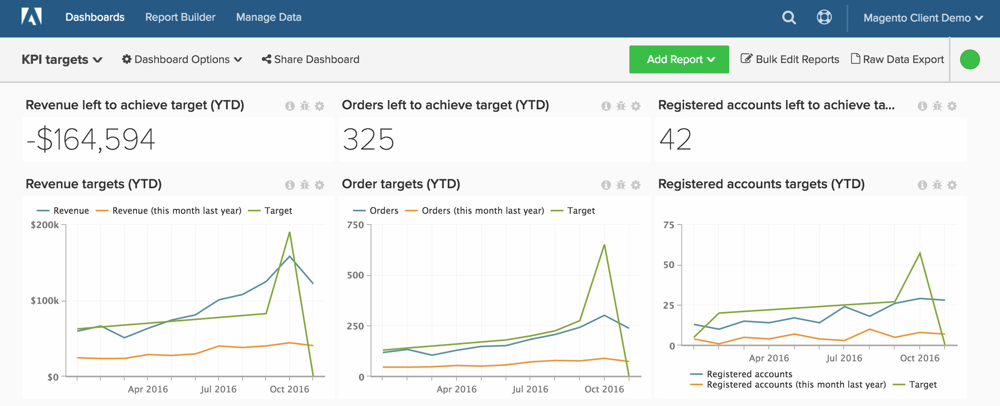
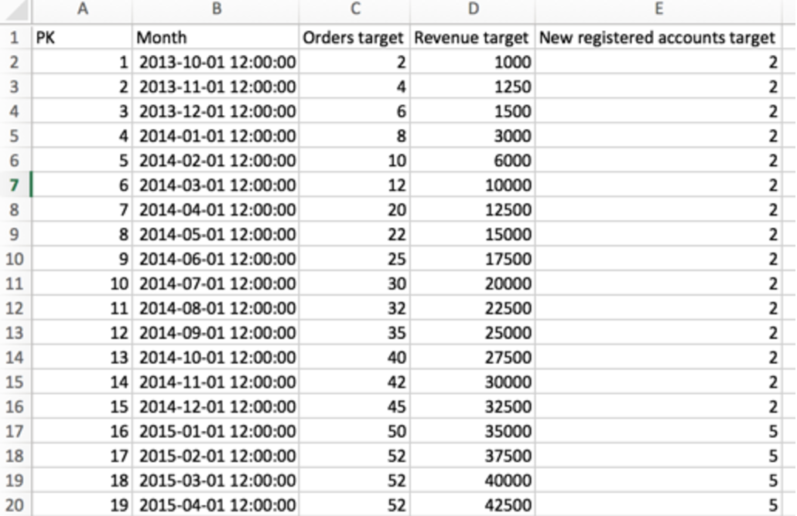

# パフォーマンス指標に対する目標の追跡

ほとんどのクライアントは&#x200B;**ビジネス目標**&#x200B;を追跡したいと考えていますが、[!DNL Adobe Commerce Intelligence]でこれが可能であることに気づきません。 このトピックでは、売上、新規登録ユーザー、注文など、実際のデータに対してビジネス目標を追跡するためのダッシュボードを設定する方法を説明します。 また、次のようなダッシュボードで、前年比のパフォーマンスを比較する方法についても説明します。

実際の指標のパフォーマンスに対する目標の追跡を示す

開始する前に、[ ファイルアップローダー](../importing-data/connecting-data/using-file-uploader.md)を確認し、特定の期間のビジネス目標を定義していることを確認する必要があります。

## はじめに

まず、ビジネス向けの特定の日次、月次、四半期ごとの目標を含むファイルをアップロードする必要があります。

[ ファイルアップローダー](../importing-data/connecting-data/using-file-uploader.md)と以下の画像を使用して、ファイルをフォーマットできます。 [!DNL Commerce Intelligence]でクライアントが追跡する最も一般的なターゲットには、注文、収益、新規登録アカウントなどがあります。

目標と指標を追跡するための

## 指標

ターゲットごとに新しい指標を1つ作成します。 例えば、月間収益と受注目標をアップロードする場合、2つの新しい指標を作成する必要があります。

* **月間売上目標**
* **`Monthly goals`** テーブル内
* この指標は&#x200B;**合計**&#x200B;を実行します
* **`Revenue target`**&#x200B;列
* **`Month`** タイムスタンプで注文

* **月次注文数ターゲット**
* **`Monthly goals`** テーブル内
* この指標は&#x200B;**合計**&#x200B;を実行します
* **`Orders target`**&#x200B;列
* **`Month`** タイムスタンプで注文

* **月間新規登録済みアカウントのターゲット**
* **`Monthly goals`** テーブル内
* この指標は&#x200B;**合計**&#x200B;を実行します
* **`New registered accounts target`**&#x200B;列
* **`Month`** タイムスタンプで注文

## レポート

ターゲットを分析する際には、静的値と視覚的なチャートを組み合わせると便利です。 収益パフォーマンスのトラッキングに役立つ3つのレポート例を紹介します。

* **目標を達成するために残った収益**
* 指標`A`: `Revenue`
* 
  [!UICONTROL指標]: `Revenue`

* 指標`B`: `Target Revenue`
* [!UICONTROL Metric]: `Monthly Revenue Target`

* [!UICONTROL Formula]: `Revenue left to achieve target`
* 
  [!UICONTROL数式]: `(B-A)`
* 
  [!UICONTROL Format]: `Number`

* [!UICONTROL Time period]: （必要な期間を選択）
* 
  [!UICONTROL Interval]: `Month`
* 
  [!UICONTROL チャートタイプ]: `Scalar`

* **売上目標**
* 指標`A`: `Revenue`
* 
  [!UICONTROL指標]: `Revenue`

* 指標`B`: `Target Revenue`
* [!UICONTROL Metric]: `Monthly Revenue Target`

* 指標`C`: `Revenue (amount change since previous year)` （非表示）
* 
  [!UICONTROL指標]: `Revenue`
* [!UICONTROL Perspective]: `Amount change vs. Previous year`

* [!UICONTROL Formula]: （昨年の今月）
* 
  [!UICONTROL数式]: `(A-C)`
* 
  [!UICONTROL Format]: `Currency`

* `Multiple Y-Axes`をオフにする
* [!UICONTROL Time period]: （関連する任意の期間）*
* 
  [!UICONTROL Interval]: `Month`
* [!UICONTROL Chart Type]: `Line Chart`

売上目標に関する上記のレポートが完成したら、注文、登録済みアカウント、または目標ファイルにアップロードしたその他の値に関する同じレポートを作成できます。

すべてのレポートをまとめた後、必要に応じてダッシュボード上でレポートを整理できます。 結果は、このページの上部の画像のように見えます。
