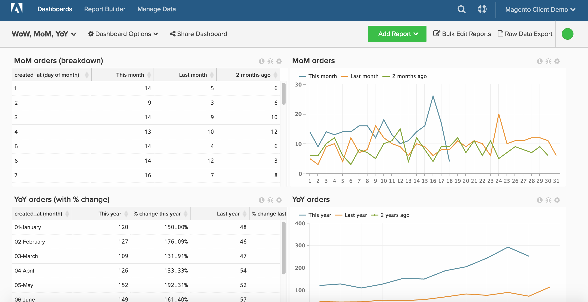
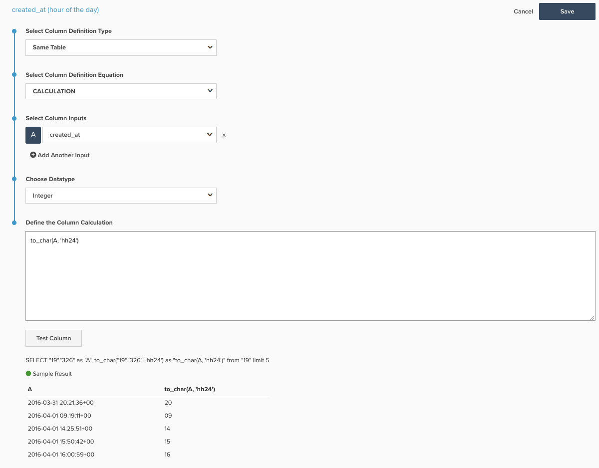

# 長期間のレポート

>[!NOTE]
>
>このトピックには、元のアーキテクチャと新しいアーキテクチャを使用しているクライアントの手順が含まれています。 [をメインツールバーから選択した後に](../../administrator/account-management/new-architecture.md)Data Warehouse ビュー&#x200B;[!DNL _セクションを使用できる場合は、_]&#x200B;新しいアーキテクチャ [!DNL Manage Data]に移行します。

レポートビルダーを使用すると、時間の経過に伴うトレンドを簡単に確認し、比較したい期間の視点を変更できます。 このトピックでは、ダッシュボードをより深く掘り下げて、週単位、月単位、年単位の分析を作成するためのダッシュボードの設定方法について説明します。

開始する前に、もっと詳しく[ここ](../../tutorials/using-visual-report-builder.md)と独立した時間オプション [ここ](../../tutorials/time-options-visual-rpt-bldr.md)で遠近法を確認する必要があります。

この分析には、[高度な計算列](../data-warehouse-mgr/adv-calc-columns.md)が含まれています。

## 予定列

* **`Sales_flat_order`** テーブル
* **元のアーキテクチャ：**&#x200B;以下の列は、アナリストが`[YoY WoW MoM ANALYSIS]` チケットの一部として作成したものです
* `created_at (month-day)`
* `created_at (month)`
* `created_at (day of the month)`
* `created_at (day of the week)`
* `created_at (hour of the day)`

* **新しいアーキテクチャ：** SQLと、この計算の作成方法の例の写真を以下に示します
   * `created_at (month-day)` [!UICONTROL Calculation]: **to_char （A, &#39;mm-dd&#39;）**
   * `created_at (month)` [!UICONTROL Calculation]: **to_char （A, &#39;mm-month&#39;）**
   * `created_at (day of the month)`&lt; [!UICONTROL Calculation]: **to_char （A, &#39;dd&#39;）**
   * `created_at (day of the week)` [!UICONTROL Calculation]: **to_char （A, &#39;d-Day&#39;）**
   * **`created_at (hour of the day)` [!UICONTROL Calculation]: **to_char （A, &#39;hh24&#39;）**
     

## 指標

なし。

>[!NOTE]
>
>新しいレポートを作成する前に、必ず[すべての新しい列を指標](../data-warehouse-mgr/manage-data-dimensions-metrics.md)にディメンションとして追加してください。

## レポート

* **前年比**
   * [!UICONTROL Metric]: `Number of orders`

   * [!UICONTROL Metric]: `Number of orders`
   * [!UICONTROL Time options]: `Time range (Custom)`: `2 years ago to 1 year ago`

   * [!UICONTROL Show top/bottom]：上位100%が&#x200B;**`created_at (month-day)`***で並べ替えられました

* 指標`A`: `This year`
* 指標`B`: `Last year`
* [!UICONTROL Time period]: `1 year ago to 0 years ago`
* 
  [!UICONTROL Interval]: `None`
* [!UICONTROL Group by]: `created_at (month-day)`
* 
  [!UICONTROL Chart Type]: `Line`

* **月グラフ**
   * [!UICONTROL Metric]: `Number of orders`

   * [!UICONTROL Metric]: `Number of orders`
   * 時間オプション：`Time range (Custom)`: `2 months ago to 1 month ago`

   * 上/下を表示：**`created_at (day of month)`***でソートされた上位100%

* 指標`A`：今月*
* 指標`B`：先月*
* [!UICONTROL Time period]: 1か月前から0か月前
* 
  [!UICONTROL Interval]: None
* [!UICONTROL Group by]: `created_at (day of month)`
* 
  [!UICONTROL Chart Type]: Line

* **WoW チャート**
   * [!UICONTROL Metric]: `Number of orders`

   * [!UICONTROL Metric]: `Number of orders`
   * [!UICONTROL Time options]: `Time range (Custom)`: `2 weeks ago to 1 week ago`

   * [!UICONTROL Show top/bottom]：上位100%が`created_at (day of week)`によって並べ替えられました

* 指標`A`: `This week`
* 指標`B`: `Last week`
* [!UICONTROL Time period]: `1 week ago to 0 weeks ago`
* 
  [!UICONTROL Interval]: `None`
* [!UICONTROL Group by]: `created_at (day of week)`
* 
  [!UICONTROL Chart Type]: `Line`

* **DoD チャート**
   * [!UICONTROL Metric]: `Number of orders`

   * [!UICONTROL Metric]: `Number of orders`
   * [!UICONTROL Time options]: `Time range (Custom)`: `2 days ago to 1 day ago`

   * [!UICONTROL Show top/bottom]：上位100%が`created_at (hour of day)`によって並べ替えられました

* 指標`A`: `Today`
* 指標B: `Yesterday`
* [!UICONTROL Time period]: `1 day ago to 0 days ago`
* 
  [!UICONTROL Interval]: `None`
* [!UICONTROL Group by]: `created_at (hour of day)`
* 
  [!UICONTROL Chart Type]: `Line`

すべてのレポートをまとめた後、必要に応じてダッシュボード上でレポートを整理できます。 結果は、このページの上部の画像のように見えます。
