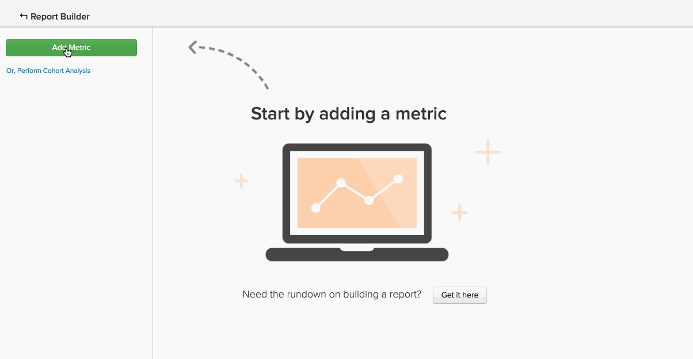

# 高度な計算列タイプ

作成する多くの分析では、**または**&#x200B;を作成する`group by`新しい列`filter by`を使用します。 [計算列の作成](../data-warehouse-mgr/creating-calculated-columns.md) チュートリアルでは、ほとんどのユースケースの基本について説明していますが、Data Warehouse Managerで作成できる計算列よりも少し複雑な計算列が必要な場合があります。
{: #top}

これらの列は、Data WarehouseのAdobeチームで作成できます。 新しい計算列を定義するには、次の情報を提供してください。

1. この列の&#x200B;**`definition`** （入力、数式、または書式設定を含む）
1. 列を作成する&#x200B;**`table`**&#x200B;を指定します
1. 列に含める必要がある内容を記述する&#x200B;**`example data points`**&#x200B;はすべて

便利だと思われる高度な計算列の一般的な例を次に示します。

* [イベントを順次注文（またはランク）する](#compareevents)
* [2つのイベント間の時間を見つける](#twoevents)
* [シーケンシャルイベント値の比較](#sequence)
* [通貨を変換](#currency)
* [タイムゾーンの変換](#timezone)
* [別の何か](#else)

## イベントを順序正しく順序立てようとすることです {#compareevents}

これは&#x200B;**イベント番号**&#x200B;の計算列と呼ばれます。 つまり、顧客やユーザーなど、特定のイベント所有者に対してイベントが発生したシーケンスを検索しようとしています。

例を次に示します。

| **`event\_id`** | **`owner\_id`** | **`timestamp`** | **`Owner's event number`** |
|-----|-----|-----|-----|
| 1 | `A` | 2015-01-01 00:00:00 | 1 |
| 2 | `B` | 2015-01-01 00:30:00 | 1 |
| 3 | `A` | 2015-01-01 02:00:00 | 2 |
| 4 | `A` | 2015-01-02 13:00:00 | 3 |
| 5 | `B` | 2015-01-03 13:00:00 | 2 |

{style="table-layout:auto"}

イベント番号の計算列を使用すると、データ内の初回イベント、リピートイベント、またはn回のイベント間の動作の違いを確認できます。

顧客の注文番号の列を実際に確認する 画像をクリックすると、レポートでグループ別ディメンションとして使用されます。

<!--{: style="max-width: 500px;"}-->

このタイプの計算列を作成するには、次の点を把握する必要があります。

* この列を作成するテーブル
* イベントの所有者を識別するフィールド （この例では`owner\_id`）
* イベントを順序付けするフィールド （この例では`timestamp`）

[トップへ戻る](#top)

## 2つの出来事の間の時間を探しています。 {#twoevents}

これは`date difference`計算列と呼ばれます。 つまり、イベントタイムスタンプに基づいて、1つのレコードに属する2つのイベント間の時間を検索しようとしています。

例を次に示します。

| `id` | `timestamp\_1` | `timestamp\_2` | `Seconds between timestamp\_2 and timestamp\_1` |
|-----|-----|-----|-----|
| `A` | 2015-01-01 00:00:00 | 2015-01-01 12:30:00 | 45000 |
| `B` | 2015-01-01 08:00:00 | 2015-01-01 10:00:00 | 7200 |

{style="table-layout:auto"}

日付差分の計算列を使用して、2つのイベント間の平均または中央値を計算する指標を作成できます。 レポートで`Average time to first order`指標がどのように使用されるかを確認するには、次の画像をクリックしてください。

<!--{: style="max-width: 500px;"}-->

このタイプの計算列を作成するには、次の点を把握する必要があります。

* この列を作成するテーブル
* 差分を知りたい2つのタイムスタンプ

[トップへ戻る](#top)

## シーケンシャルなイベント値を比較しようとしています。 {#sequence}

これは&#x200B;**シーケンシャルイベント比較**&#x200B;と呼ばれます。 つまり、値（通貨、数値、タイムスタンプ）と所有者の前のイベントの対応する値との間の差分を見つけようとしています。

例を次に示します。

| **`event\_id`** | **`owner\_id`** | **`timestamp`** | **`Seconds since owner's previous event`** |
|-----|-----|-----|-----|
| 1 | `A` | 2015-01-01 00:00:00 | NULL |
| 2 | `B` | 2015-01-01 00:30:00 | NULL |
| 3 | `A` | 2015-01-01 02:00:00 | 7720 |
| 4 | `A` | 2015-01-02 13:00:00 | 126000 |
| 5 | `B` | 2015-01-03 13:00:00 | 217800 |

{style="table-layout:auto"}

シーケンシャルイベントの比較を使用して、各シーケンシャルイベント間の平均時間または中央値を見つけることができます。 以下の画像をクリックして、実際の注文間の&#x200B;**平均と中央値**&#x200B;指標を表示します。

=<!--{: style="max-width: 500px;"}-->

このタイプの計算列を作成するには、次の点を把握する必要があります。

* この列を作成するテーブル
* イベントの所有者を識別するフィールド （例では`owner\_id`）
* 各シーケンシャルイベントの違いを確認する値フィールド（この例では`timestamp`）

[トップへ戻る](#top)

## 通貨を変換しようとしています。 {#currency}

計算列&#x200B;**通貨換算**&#x200B;は、イベント時の為替レートに基づいて、取引金額を記録された通貨からレポート通貨に変換します。

例を次に示します。

| **`id`** | **`timestamp`** | **`transaction\_value\_EUR`** | **`transaction\_value\_USD`** |
|-----|-----|-----|-----|
| `1` | 2015-01-01 00:00:00 | 30 | 33.57 |
| `2` | 2015-01-02 00:00:00 | 50 | 55.93 |

{style="table-layout:auto"}

このタイプの計算列を作成するには、次の点を把握する必要があります。

* この列を作成するテーブル
* 変換するトランザクション金額の列
* データが記録された通貨（通常はISO コード）を示す列
* 優先レポート通貨

[トップへ戻る](#top)

## タイムゾーンを切り替えようとしています。 {#timezone}

**タイムゾーン変換**&#x200B;計算列は、特定のデータソースのタイムスタンプを、記録されたタイムゾーンからレポートタイムゾーンに変換します。

例を次に示します。

| **`id`** | **`timestamp\_UTC`** | **`timestamp\_ET`** |
|-----|-----|-----|
| `1` | 2015-01-01 00:00:00 | 2014-12-31 19:00:00 |
| `2` | 2015-01-01 12:00:00 | 2015-01-01 07:00:00 |

{style="table-layout:auto"}

このタイプの計算列を作成するには、次の点を把握する必要があります。

* この列を作成するテーブル
* 変換するタイムスタンプ列
* データが記録されたタイムゾーン
* 優先レポートタイムゾーン

[トップへ戻る](#top)

## ここに書いてない事をやろうとしています。 {#else}

心配する必要はありません。 ここに記載されていないからといって、それが不可能であるとは限りません。 Data Warehouse AnalystsのAdobeチームがお手伝いします。

新しい計算列を定義するには、[&#x200B; サポートチケット &#x200B;](https://experienceleague.adobe.com/docs/commerce-knowledge-base/kb/troubleshooting/miscellaneous/mbi-service-policies.html)を送信し、作成する内容の詳細を入力します。

## 関連ドキュメント

* [分かりやすい視覚表現](../data-warehouse-mgr/creating-calculated-columns.md)
* [計算列タイプ](../data-warehouse-mgr/calc-column-types.md)
* [注文データと顧客データを含む [!DNL Google ECommerce]  ディメンションの作成](../data-warehouse-mgr/bldg-google-ecomm-dim.md)
