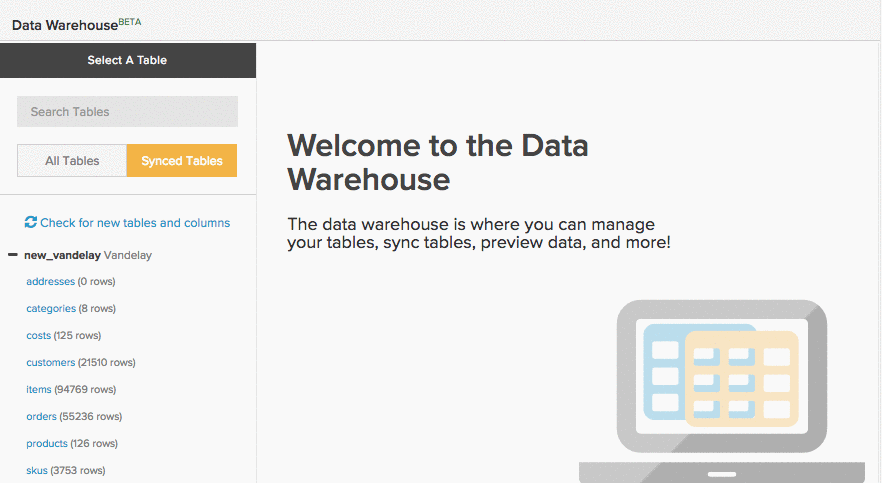
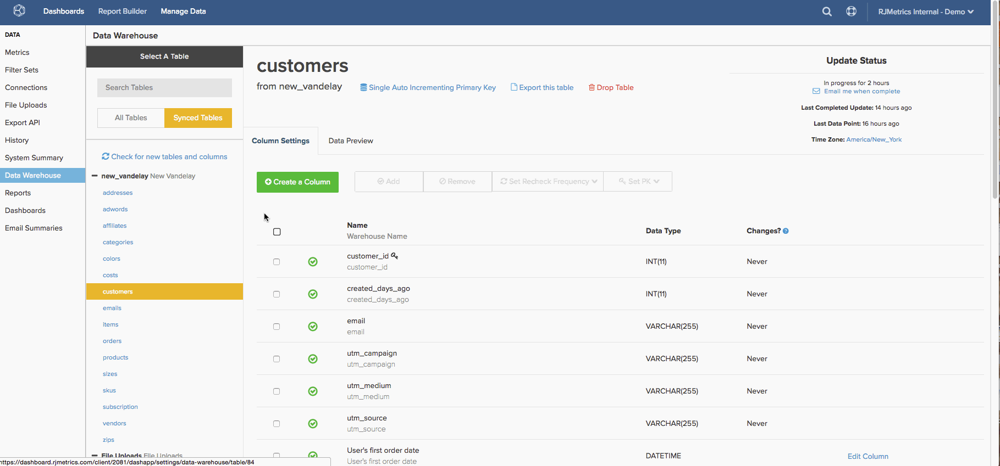

# [!DNL Google ECommerce] ディメンションを作成

>[!NOTE]
>
>[管理者権限](../../administrator/user-management/user-management.md)が必要です。

[&#x200B; アカウント [!DNL Google ECommerce]の](../../data-analyst/importing-data/integrations/google-ecommerce.md)接続が完了したので、[!DNL Commerce Intelligence]のデータで何ができますか？ このトピックでは、コマースデータと注文や顧客データをリンクさせるディメンションの構築について説明します。

対象となるディメンションは、[&#x200B; マーケティングチャネルとキャンペーンに関する重要な質問に回答する](../../data-analyst/analysis/most-value-source-channel.md)分析を構築する機能を提供します。 ・ 売上の何%を各ソースから得ているか？ 獲得した[!DNL Facebook]人の顧客生涯価値と[!DNL Google]人の顧客生涯価値との比較はどうですか？

## 前提条件と概要

このトピックでディメンションを作成するには、[!DNL Google ECommerce] テーブル、`orders` テーブル、および`customers` テーブルが必要です。 これらのテーブルは、ディメンションを構築する前に[Data Warehouse](../../data-analyst/data-warehouse-mgr/tour-dwm.md)と同期している必要があります。 同期されたテーブルは、`Synced Tables`の`Data Warehouse Manager` セクションに表示されます。

ここでは、再読み込みが必要な場合のテーブルと列の同期に関する簡単な説明を示します。

`orders` テーブルから[!DNL Google eCommerce] テーブルへの結合を作成した後、以下のリストの最初の3つのディメンションを作成します。 次に、これらのディメンションを使用して、`customers` テーブルに3つのユーザー/顧客ディメンションを作成します。 最後に、これらの列を`orders` テーブルに結合します。

以下に、対応するディメンションを示します。

* **注文テーブル**

* 注文の[!DNL Google Analytics] ソース
* 注文の[!DNL Google Analytics]件のメディア
* 注文[!DNL Google Analytics]A キャンペーン
* 顧客の最初の注文の[!DNL Google Analytics] ソース
* お客様の最初の注文の[!DNL Google Analytics]件のメディア
* お客様の最初の注文の[!DNL Google Analytics] キャンペーン

* **顧客テーブル**

* 顧客の最初の注文の[!DNL Google Analytics] ソース
* お客様の最初の注文の[!DNL Google Analytics]件のメディア
* お客様の最初の注文の[!DNL Google Analytics] キャンペーン

## ディメンションの作成

ディメンションを作成するには、[&#x200B; > &#x200B;](../data-warehouse-mgr/tour-dwm.md)をクリックして&#x200B;**[!UICONTROL Data]** Data Warehouse Manager **[!UICONTROL Data Warehouse]**&#x200B;を開きます。

### 受注テーブル、ラウンド 1

この例では、**注文の[!DNL Google Analytics] Source** ディメンションを構築します。

1. Data Warehouseのテーブルのリストから、注文情報を含むテーブル （この場合は`orders`）をクリックします。
1. **[!UICONTROL Create a Column]**&#x200B;をクリックします。
1. 列に名前を付けます。
1. `Joined Column`定義ドロップダウン [から](../data-warehouse-mgr/calc-column-types.md)を選択します。 この例は、[1対1の関係](../data-warehouse-mgr/table-relationships.md)で機能し、`eCommerce.transactionID`列を`orders` テーブルの1行に正確に一致させます。
1. 次に、パスを定義するか、使用するテーブルと列の接続方法を定義する必要があります。 `Select a table and column` ドロップダウンをクリックします。
1. 必要なパスは利用できないので、新しいパスを作成する必要があります。 **[!UICONTROL Create new Path]**&#x200B;をクリックします。
1. 表示されるウィンドウで、`Many`側を`orders.order\_id`に設定するか、注文IDを含む`orders` テーブルの列に設定します。
1. `One`側で`Google ECommerce` テーブルを見つけ、列を`transactionID`に設定します。

   使用可能なディメンションを示す

1. **[!UICONTROL Save]**&#x200B;をクリックしてパスを作成します。
1. パスを追加したら、**[!UICONTROL Select table and column]** ドロップダウンをもう一度クリックします。
1. `ECommerce` テーブルを探し、`Source`列をクリックします。 これにより、注文がソース情報に関連付けられます。
1. テーブルスキーマに戻ったら、**[!UICONTROL Save]**&#x200B;をもう一度クリックしてディメンションを作成します。

ここでは、そのプロセス全体を紹介します。

次に、**注文の[!DNL Google Analytics] メディア**&#x200B;と`campaign`を作成してみてください。 これらのディメンションにはあまり変更がないので、試してください。 しかし、行き詰まった場合は、[この記事の最後](#stuck)を参照して、何が違うのかを確認してください。

### 顧客テーブル {#customers}

次の例では、**お客様の最初の注文の[!DNL Google Analytics] ソース** ディメンションを構築します。

1. Data Warehouseのテーブルのリストから、お客様情報を含むテーブル （この場合は`customers`）をクリックします。
1. **[!UICONTROL Create a Column]**&#x200B;をクリックします。
1. 列に名前を付けます。
1. この例では、`is MAX`定義ドロップダウン [から](../../data-analyst/data-warehouse-mgr/calc-column-types.md)定義を選択します。 `is MIN`定義は、可能な値が1つだけのテキスト列に適用した場合にも機能する可能性があります。 重要なのは、後で行う適切なフィルターの設定です。
1. **[!UICONTROL Select a table and column]** ドロップダウンをクリックし、`orders` テーブルを選択してから`Order's [!DNL Google Analytics] source`列を選択します。
1. **[!UICONTROL Save]**&#x200B;をクリックします。
1. テーブルスキーマに戻ったら、`Options` ドロップダウンをクリックしてから`Filters`をクリックします。
1. **[!UICONTROL Add Filter Set]**&#x200B;をクリックし、`Orders we count` セットを選択します。 カウントする注文に含める注文のみを含めるフィルターセットが必要なので、このフィルターセットを選択することが重要です。
1. **[!UICONTROL Add Filter]**&#x200B;をクリックします。 顧客の最初の注文の[!DNL Google Analytics] ソースを検索するには、フィルターを追加する必要があります。

   _orders.Customerの注文番号= 1

   _
1. **[!UICONTROL Save]**&#x200B;をクリックしてディメンションを作成します。

次に、**お客様の最初の注文の[!DNL Google Analytics] medium**&#x200B;と`campaign`を作成してみてください。 これらのディメンションにはあまり変更がないので、試してください。 しかし、行き詰まった場合は、[この記事の最後](#stuck)を参照して、何が違うのかを確認してください。

### ボーナス：注文テーブル、ラウンド 2

必要に応じてここで停止できますが、このセクションでは、**最後のセクション [!DNL Google Analytics]で作成した**&#x200B;お客様の最初の注文の[&#x200B; ディメンション &#x200B;](#customers)を`orders` テーブルに取り込むことで、さらに分析を行うことができます。 このセクションでディメンションを作成すると、顧客の最初の注文の`orders`属性を使用して、`Revenue` テーブル `Number of orders`、`Distinct buyers`、[!DNL Google Analytics]などで構築されているすべての指標を分析できます。

次の使用例は、`Customer's first order's [!DNL Google Analytics] source` ディメンションを`orders` テーブルに結合します。

1. Data Warehouseのテーブルのリストから、注文情報を含むテーブル （この場合は`orders`）をクリックします。
1. **[!UICONTROL Create a Column]**&#x200B;をクリックします。
1. 列に名前を付けます。
1. 定義ドロップダウンから「`Joined Column`」を選択します。 これにより、前のセクションで作成した顧客ディメンションが`orders` テーブルに結合されます。
1. **[!UICONTROL Select a table and column]** ドロップダウンをクリックし、`customers` テーブルと`Customer's first order's [!DNL Google Analytics] source`列を選択します。
1. パスが自動的に入力されない場合は、顧客と注文テーブルを最も適切に接続するパスを選択します。
1. **[!UICONTROL Save]**&#x200B;をクリックしてディメンションを作成します。

ここでは、そのプロセス全体を紹介します。

最後に、`Customer's first order's` ミディアムと`campaign` ディメンションを`orders` テーブルに結合します。 ディメンションに参加し、問題がある場合は、ヘルプが必要な場合は、記事[の最後の](#stuck)を確認してください。

### まとめ

ディメンションの作成が完了したので、さまざまなチャネルやキャンペーンのパフォーマンスを追跡する強力な分析機能を作成できるようになりました。 次の更新が完了するまで&#x200B;**新しい列は利用できなくなります**。

より人気のあるディメンションのいくつかはこのトピックで取り上げられていますが、空は限界です – あなた自身を作成するか、他のオプションを探索するのに役立つ場合は、お気軽にpingを送信してください。 

### その他のメモ

**`Orders`テーブル #1**: `Order's [!DNL Google Analytics]`のメディアと`campaign`のディメンションを作成する場合、違いは手順12で選択した列です。 この例では、列は`Source`でした。

**`Customers`テーブル**: `Customer's first order's [!DNL Google Analytics]`のメディアと`campaign`のディメンションを作成する場合、違いは手順5で選択した列です。 この例では、列は`Order's [!DNL Google Analytics]` ソースでした。

**`Orders`テーブル #2**: `Customer's first order's [!DNL Google Analytics]` ミディアムと`campaign`列を`orders` テーブルに結合する場合、違いは手順5で選択した列です。 この例では、列は`Customer's first order's [!DNL Google Analytics]` ソースでした。
