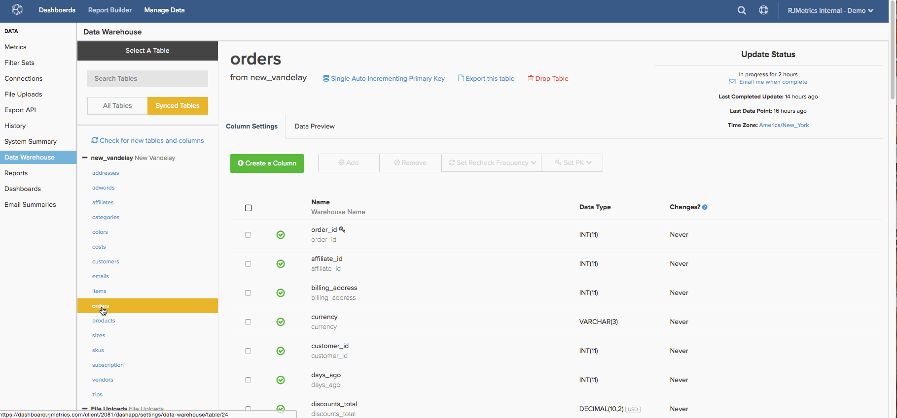

# [!DNL Google ECommerce] ディメンションの作成

>[!NOTE]
>
>[ 管理者権限 ](../../administrator/user-management/user-management.md) が必要です。

[ アカウントへの [!DNL Google ECommerce] 接続 ](../../data-analyst/importing-data/integrations/google-ecommerce.md) が完了したので、[!DNL Commerce Intelligence] でそのデータを使用して何ができるでしょうか。 このトピックでは、e コマースデータを注文および顧客データにリンクするディメンションの構築について説明します。

対象となるディメンションを使用すると、[ マーケティングチャネルやキャンペーンに関する重要な質問への回答 ](../../data-analyst/analysis/most-value-source-channel.md) を行う分析を作成できます。 各ソースからの売上高の割合 取得した顧客のライフタイム値を、[!DNL Facebook] の顧客 [!DNL Google] 比較してどうですか？

## 前提条件と概要

このトピックでディメンションを作成するには、[!DNL Google ECommerce] テーブル、`orders` テーブル、および `customers` テーブルが必要です。 ディメンションを作成する前に、これらのテーブルを [Data Warehouseに同期 ](../../data-analyst/data-warehouse-mgr/tour-dwm.md) する必要があります。 同期されたテーブルは、`Synced Tables` ージの `Data Warehouse Manager` セクションに表示されます。

以下に、リフレッシャーを使用する必要がある場合の、テーブルと列の同期に関する概要を示します。

`orders` テーブルから [!DNL Google eCommerce] テーブルへの結合を作成した後、以下のリストの最初の 3 つのディメンションを作成します。 次に、これらのディメンションを使用して、`customers` テーブルに 3 つのユーザー/顧客ディメンションを作成します。 完了するには、これらの列を `orders` テーブルに結合します。

以下に、対象となるディメンションを示します。

* **注文テーブル**

* 注文の [!DNL Google Analytics] ソース
* オーダー [!DNL Google Analytics] 中
* 注文の [!DNL Google Analytics]A キャンペーン
* 顧客の最初の注文の [!DNL Google Analytics] ソース
* 顧客の最初の注文の中 [!DNL Google Analytics]
* 顧客の最初の注文の [!DNL Google Analytics] キャンペーン

* **顧客テーブル**

* 顧客の最初の注文の [!DNL Google Analytics] ソース
* 顧客の最初の注文の中 [!DNL Google Analytics]
* 顧客の最初の注文の [!DNL Google Analytics] キャンペーン

## ディメンションの作成

ディメンションを作成するには、[/](../data-warehouse-mgr/tour-dwm.md) をクリックして **[!UICONTROL Data]** 0}Data Warehouse Manager} を開きます。**[!UICONTROL Data Warehouse]**

### 受注テーブル、丸 1

この例では、**注文の [!DNL Google Analytics] Source** ディメンションを作成します。

1. Data Warehouseのテーブルのリストで、注文情報が含まれるテーブル（この場合は `orders`）をクリックします。
1. 「**[!UICONTROL Create a Column]**」をクリックします。
1. 列に名前を付けます。
1. `Joined Column` 定義ドロップダウン [ から「](../data-warehouse-mgr/calc-column-types.md)」を選択します。 この例は [ 一対一の関係 ](../data-warehouse-mgr/table-relationships.md) を扱い、`eCommerce.transactionID` の列を `orders` のテーブルの 1 つの行に一致させます。
1. 次に、パス、または使用するテーブルと列の接続方法を定義する必要があります。 `Select a table and column` ドロップダウンをクリックします。
1. 必要なパスは使用できないので、新しく作成する必要があります。 「**[!UICONTROL Create new Path]**」をクリックします。
1. 表示されるウィンドウで、`Many` 側を `orders.order\_id` に設定するか、注文 ID を含む `orders` テーブルの列を設定します。
1. `One` 側で `Google ECommerce` テーブルを見つけ、列を `transactionID` に設定します。

   

1. 「**[!UICONTROL Save]**」をクリックして、パスを作成します。
1. パスを追加したら、「**[!UICONTROL Select table and column]**」ドロップダウンをもう一度クリックします。
1. `ECommerce` テーブルを見つけ、[`Source`] 列をクリックします。 これにより、注文がソース情報に結び付けられます。
1. テーブルスキーマに戻ったら、「**[!UICONTROL Save]**」をもう一度クリックしてディメンションを作成します。

プロセス全体を見ると、次のようになります。

次に、**Order&#39;s [!DNL Google Analytics] medium** を作成して `campaign` ます。 これらの寸法はあまり変更されないので、試してみてください。 しかし、行き詰まった場合は、[ この記事の最後 ](#stuck) を確認して、違いを確認できます。

### 顧客テーブル {#customers}

次の例では、**顧客の最初の注文の [!DNL Google Analytics] ソース** ディメンションを作成します。

1. Data Warehouseのテーブルのリストで、顧客情報が含まれるテーブル（この場合は `customers`）をクリックします。
1. 「**[!UICONTROL Create a Column]**」をクリックします。
1. 列に名前を付けます。
1. この例では、`is MAX` 定義ドロップダウン [ から ](../../data-analyst/data-warehouse-mgr/calc-column-types.md) 定義を選択します。 `is MIN` の定義は、可能な値が 1 つしかないテキスト列に適用した場合にも機能します。 重要な部分は、適切なフィルターが設定されていることを確認することです。これについては後で行います。
1. **[!UICONTROL Select a table and column]** ドロップダウンをクリックし、`orders` テーブルを選択してから、`Order's [!DNL Google Analytics] source` 列を選択します。
1. 「**[!UICONTROL Save]**」をクリックします。
1. テーブルスキーマに戻ったら、「`Options`」ドロップダウンをクリックし、`Filters` をクリックします。
1. 「**[!UICONTROL Add Filter Set]**」をクリックして、`Orders we count` セットを選択します。 フィルターセットをカウントする注文に含まれる注文のみを含める必要があるので、このフィルターセットを選択することが重要です。
1. 「**[!UICONTROL Add Filter]**」をクリックします。 顧客の最初の注文の [!DNL Google Analytics] ソースを見つけるには、フィルターを追加する必要があります。

   _orders.Customer の注文番号= 1

   _
1. 「**[!UICONTROL Save]**」をクリックして、ディメンションを作成します。

次に、**顧客の最初の注文の [!DNL Google Analytics] ードメディア** と `campaign` を作成してみてください。 これらの寸法はあまり変更されないので、試してみてください。 しかし、行き詰まった場合は、[ この記事の最後 ](#stuck) を確認して、違いを確認できます。

### ボーナス：「受注」表、ラウンド 2

必要に応じてここで停止することもできますが、このセクションでは **最後のセクション [!DNL Google Analytics] で作成した** 顧客の最初の注文の [ ディメンション ](#customers) を `orders` のテーブルに取り込むことで、さらに分析できます。 このセクションでディメンションを作成すると、顧客の初回注文の `orders` 属性を使用して、`Revenue` テーブルに作成されたすべての指標（`Number of orders`、`Distinct buyers`、[!DNL Google Analytics] など）を分析できます。

次の使用例は、`Customer's first order's [!DNL Google Analytics] source` ディメンションを `orders` テーブルに結合します。

1. Data Warehouseのテーブルのリストで、注文情報が含まれるテーブル（この場合は `orders`）をクリックします。
1. 「**[!UICONTROL Create a Column]**」をクリックします。
1. 列に名前を付けます。
1. 定義ドロップダウンから「`Joined Column`」を選択します。 これにより、前の節で作成した顧客分析コードが `orders` テーブルに結合されます。
1. **[!UICONTROL Select a table and column]** ドロップダウンをクリックし、`customers` テーブルと `Customer's first order's [!DNL Google Analytics] source` 列を選択します。
1. パスが自動的に入力されない場合は、顧客テーブルと注文テーブルを最もよく接続するパスを選択します。
1. 「**[!UICONTROL Save]**」をクリックして、ディメンションを作成します。

プロセス全体を見ると、次のようになります。

`Customer's first order's` の媒体と `campaign` の寸法を `orders` のテーブルに結合して、作業を終了します。 ディメンションに参加し、問題がある場合は、ヘルプが必要な場合は、チェックアウト [ 記事の最後 ](#stuck)。

### まとめ

ディメンションの作成が完了しました。つまり、様々なチャネルやキャンペーンのパフォーマンスを追跡する強力な分析を作成できるようになりました。 **次の更新が完了するまで、新しい列は使用できません**。

このトピックでは、より人気のあるディメンションの一部について説明していますが、上限は空です。他のオプションの探索に関するヘルプが必要な場合は、独自のディメンションを作成するか、お気軽に ping してください。 

### その他のメモ

**`Orders`の表#1**:`Order's [!DNL Google Analytics]` 中次元と `campaign` 次元を作成する場合、手順 12 で選択した列が異なります。 この例では、列は `Source` です。

**`Customers`の表**:`Customer's first order's [!DNL Google Analytics]` 中次元と `campaign` 次元を作成する場合、手順 5 で選択した列が異なります。 この例では、列がソース `Order's [!DNL Google Analytics]` した。

**`Orders`テーブル #2**:`Customer's first order's [!DNL Google Analytics]` Medium 列と `campaign` 列を `orders` テーブルに結合する場合、手順 5 で選択した列が違います。 この例では、列がソース `Customer's first order's [!DNL Google Analytics]` した。
