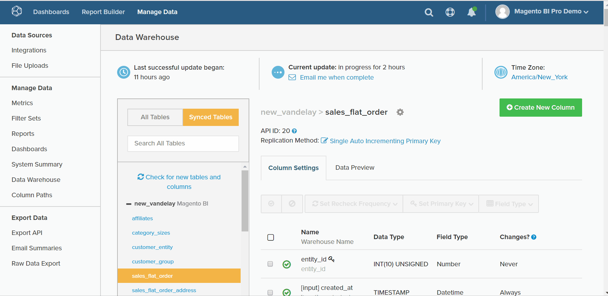

# 集計列の種類

* [同じテーブルの計算](#sametable)
* [1 対多の計算](#onetomany)
* [多対 1 の計算](#manytoone)
* [便利な参照マップ](#map)
* [高度な計算列](#advanced)

[Data Warehouse Manager](../data-warehouse-mgr/tour-dwm.md) 内には、分析用にデータを拡張および最適化する列を作成できます。 [&#x200B; この機能 &#x200B;](../data-warehouse-mgr/creating-calculated-columns.md) にアクセスするには、Data Warehouse Manager で任意のテーブルを選択し、「**[!UICONTROL Create New Column]**」をクリックします。

ここでは、Data Warehouse Manager で作成できる列のタイプについて説明します。 また、列の説明、その列の視覚的なウォークスルー、列の作成に必要なすべての入力の [&#x200B; 参照マップ &#x200B;](#map) についても説明します。 計算列を作成する方法は 3 つあります。

1. [同じテーブルの計算列](#sametable)
1. [1 対多の計算列](#onetomany)
1. [多対 1 の計算列](#manytoone)

## 同じテーブルの計算列 {#sametable}

これらの列は、同じテーブルの入力列を使用して作成されます。

### 年齢 {#age}

年齢の計算列は、現在の時刻と入力時刻の間の秒数を返します。

次の例では、`Seconds since customer's most recent order` テーブルに `customers` を作成します。 これを使用して、`X days` 内で購入を行っていない顧客（チャーンと呼ばれることもあります）のユーザーリストを作成できます。

### 通貨換算

通貨換算計算列は、列のネイティブ通貨を目的の新しい通貨に変換します。

以下の例では、`base\_grand\_total In AED` テーブルで `base\_grand\_total` をネイティブ通貨から AED に変換して `sales\_flat\_order` を作成しています。 この列は、現地通貨でレポートを作成する複数通貨のストアに適しています。

Commerce クライアントの場合、通常、「`base\_currency\_code`」フィールドには現地通貨が格納されます。 `Spot Time` フィールドは、指標で使用される日付と一致する必要があります。

## 1 対多の計算列 {#onetomany}

`One-to-Many` 列 [2 つのテーブル間のパスを使用 &#x200B;](../../data-analyst/data-warehouse-mgr/create-paths-calc-columns.md)。 このパスは、常に、属性が存在する 1 つのテーブルと、その属性が「再配置」される多数のテーブルを意味します。 パスは、`foreign key--primary key` しい関係と言うことができます。

### 結合された列 {#joined}

結合された列は、多くのテーブルの 1 つのテーブル *to* の属性を再配置します。 典型的な 1 対多の例は、顧客（1 人）と注文（多数）です。

次の例では、`Customer's group\_id` ディメンションを `orders` テーブルに結合します。

## 多対 1 の計算列 {#manytoone}

これらの列は、1 対多の列と同じパスを使用しますが、データを反対方向に指します。 列は、多の側とは異なり、パスの片側に作成されます。 この関係により、列の値は集計、つまり、多側のデータポイントに対して実行される数学演算である必要があります。 多くの使用例がありますが、以下にいくつか示します。

### カウント {#count}

この種類の集計列は、1 つのテーブルに対する多数のテーブルの値の数を返します *1 つのテーブルに対して* 行されます）。

次の例では、（`Customer's lifetime number of canceled orders` のフィルターを使用して） ディメンション `customers` を `orders.status` テーブルに作成します。

{: width="699" height="351"}

### 合計 {#sum}

集計列は、`many` のテーブルの値の合計を 1 つのテーブルに表示したものです。

これは、`Customer's lifetime revenue` のような顧客レベルのディメンションを作成するために使用できます。

### 最小または最大 {#minmax}

最小または最大計算列は、多側にある最小または最大のレコードを返します。

これは、`Customer's first order date` のような顧客レベルのディメンションを作成するために使用できます。

### が存在する {#exists}

計算列は、多側でのレコードの存在を判断するバイナリテストです。 つまり、新しい列は、パスが各テーブル内の 1 行以上を接続する場合は `1` を返し、接続できない場合は `0` を返します。

このタイプのディメンションは、例えば、顧客が特定の製品を購入したことがあるかどうかを決定する場合があります。 `customers` テーブルと `orders` テーブルの間の結合、特定の製品のフィルター、ディメンション `Customer has purchased Product X?` を使用して作成できます。

## 便利な参照マップ {#map}

計算列を作成するときにすべての入力が何であるかを思い出すのに苦労している場合は、以下を作成するときにこの参照マップを手元に置いておいてください。

## 高度な計算列 {#advanced}

ビジネスに関する質問を分析し、回答しようとすると、必要な正確な列を作成できない状況が発生する場合があります。

迅速なターンアラウンドを確保するために、Adobeでは [&#x200B; 高度な計算列の種類 &#x200B;](../../data-analyst/data-warehouse-mgr/adv-calc-columns.md) ガイドを参照して、Adobe サポートチームが作成できる列の種類を確認することをお勧めします。 このトピックでは、列を作成するために必要な情報も扱います。これをリクエストに含めます。

## 関連ドキュメント

* [計算列の作成](../../data-analyst/data-warehouse-mgr/creating-calculated-columns.md)
* [計算列のパスの作成/削除](../../data-analyst/data-warehouse-mgr/create-paths-calc-columns.md)
* [テーブルの関係の理解と評価](../../data-analyst/data-warehouse-mgr/table-relationships.md)
