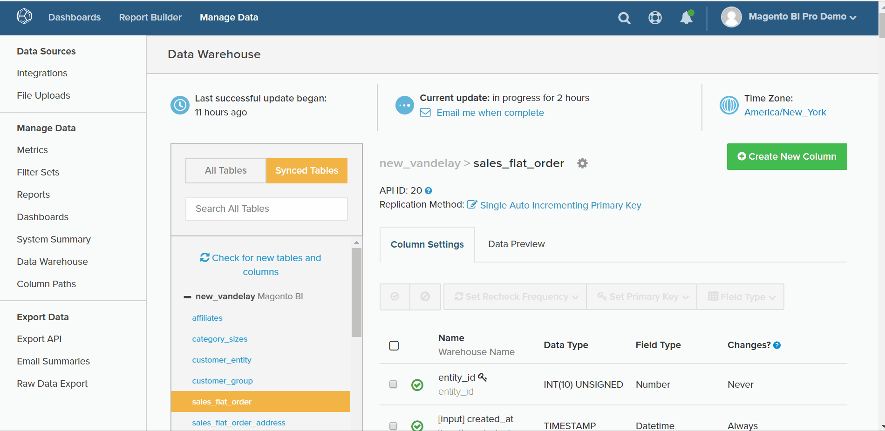
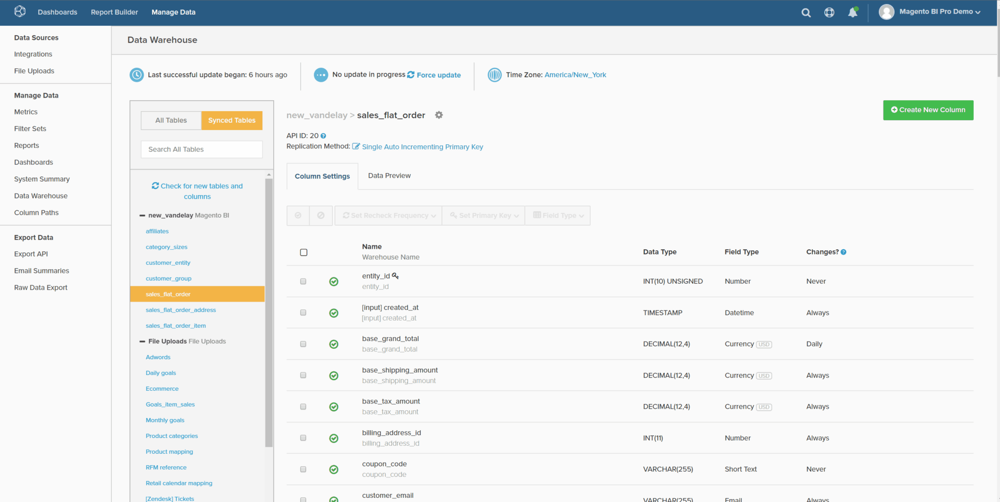
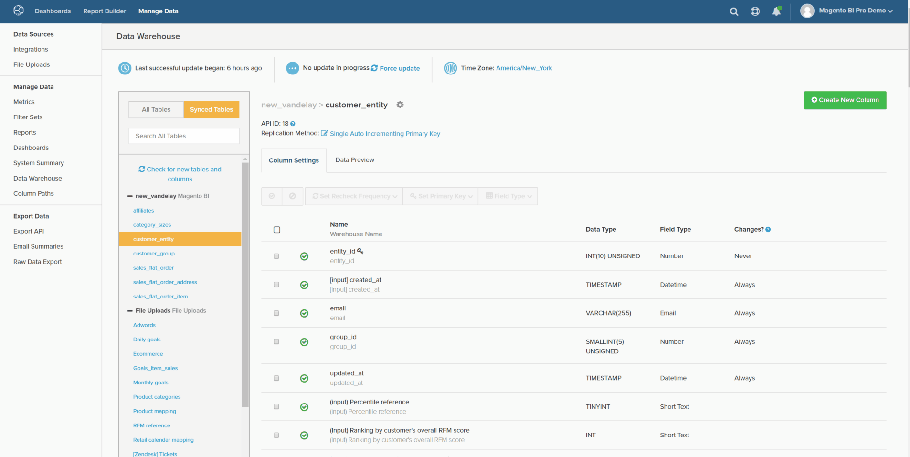

# 計算された列タイプ

* [同じテーブル計算](#sametable)
* [一対多の計算](#onetomany)
* [多対一の計算](#manytoone)
* [便利な参照マップ](#map)
* [高度な計算列](#advanced)

[Data Warehouse Manager](../data-warehouse-mgr/tour-dwm.md)内で、分析用にデータを拡張および最適化するための列を作成できます。 [この機能](../data-warehouse-mgr/creating-calculated-columns.md)にアクセスするには、Data Warehouse Managerで任意のテーブルを選択し、**[!UICONTROL Create New Column]**&#x200B;をクリックします。

ここでは、Data Warehouse Managerで作成できる列の種類について説明します。 また、説明、その列の視覚的なウォークスルー、列の作成に必要なすべての入力の[参照マップ &#x200B;](#map)についても説明します。 計算列を作成するには、次の3つの方法があります。

1. [同じテーブルの計算列](#sametable)
1. [一対多の計算列](#onetomany)
1. [多対一の計算列](#manytoone)

## 同じテーブルの計算列 {#sametable}

これらの列は、同じテーブルの入力列を使用して作成されます。

### 年齢 {#age}

年齢の計算列は、現在の時間とある入力時間の間の秒数を返します。

次の例では、`Seconds since customer's most recent order` テーブルに`customers`を作成します。 これは、`X days`内で購入していない顧客のユーザーリスト（場合によってはチャーンと呼ばれます）を作成するために使用できます。

### 通貨変換

通貨コンバータの計算列は、列のネイティブ通貨を目的の新しい通貨に変換します。

次の例では、`base\_grand\_total In AED`を作成し、そこから`base\_grand\_total`をネイティブ通貨から`sales\_flat\_order` テーブルのAEDに変換します。 この列は、現地通貨でレポートする複数の通貨を持つストアに適しています。

Commerce クライアントの場合、`base\_currency\_code` フィールドには通常、ネイティブ通貨が格納されます。 `Spot Time` フィールドは、指標で使用される日付と一致する必要があります。

## 一対多の計算列 {#onetomany}

`One-to-Many`列[2つのテーブル間のパスを使用](../../data-analyst/data-warehouse-mgr/create-paths-calc-columns.md)。 このパスは常に、属性が存在する1つのテーブルと、その属性が「再配置」される多数のテーブルを意味します。 パスは`foreign key--primary key`関係として記述できます。

### 結合済み列 {#joined}

結合された列は、1つのテーブル *から*&#x200B;の多くのテーブルの属性を再配置します。 「1つ/多く」の典型的な例は、顧客（1つ）と注文（多く）です。

次の例では、`Customer's group\_id` ディメンションが`orders` テーブルに結合されます。

## 多対一の計算列 {#manytoone}

これらの列は、1対多の列と同じパスを使用しますが、データを反対方向に向けます。 列は、多くの側面ではなく、パスの一方の側面に作成されます。 この関係のため、列内の値は集約である必要があります。つまり、多くの側のデータポイントに対して実行される数学的演算です。 これには多くのユースケースがあり、いくつか以下に示します。

### カウント {#count}

このタイプの計算列は、多数のテーブル *から1つのテーブル*&#x200B;までの値の数を返します。

次の例では、ディメンション `Customer's lifetime number of canceled orders`が`customers` テーブルに作成されています（`orders.status`のフィルター付き）。

{: width="699" height="351"}

### 合計 {#sum}

合計計算列は、1つのテーブル上の`many` テーブルの値の合計です。

これは、`Customer's lifetime revenue`のような顧客レベルのディメンションを作成するために使用できます。

### 最小または最大 {#minmax}

「最小」または「最大」の計算列は、多辺に存在する最小または最大のレコードを返します。

これは、`Customer's first order date`のような顧客レベルのディメンションを作成するために使用できます。

### 存在する {#exists}

計算列は、多側のレコードの存在を決定するバイナリテストです。 つまり、新しい列は、パスが各テーブルの少なくとも1つの行に接続している場合は`1`を返し、接続できない場合は`0`を返します。

このタイプのディメンションは、たとえば、顧客が特定の製品を購入したことがあるかどうかを判断する場合があります。 `customers` テーブルと`orders` テーブルの結合、特定の製品のフィルターを使用して、ディメンション `Customer has purchased Product X?`を作成できます。

## 便利な参照マップ {#map}

計算列を作成する際にすべての入力が何であるかを思い出すのに問題がある場合は、構築する際にこの参照マップを便利に使用してください。

## 高度な計算列 {#advanced}

自社ビジネスに関する疑問を分析し、それに回答しようとすると、思うように列を作成できない場合があります。

迅速な対応を可能にするために、Adobeでは、[高度な計算列タイプ &#x200B;](../../data-analyst/data-warehouse-mgr/adv-calc-columns.md) ガイドを参照して、Adobe サポートチームが構築できる列の種類を確認することをお勧めします。 このトピックでは、列を作成するために必要な情報についても説明します。リクエストに含めてください。

## 関連ドキュメント

* [分かりやすい視覚表現](../../data-analyst/data-warehouse-mgr/creating-calculated-columns.md)
* [計算列のパスの作成/削除](../../data-analyst/data-warehouse-mgr/create-paths-calc-columns.md)
* [テーブルの関係の理解と評価](../../data-analyst/data-warehouse-mgr/table-relationships.md)
