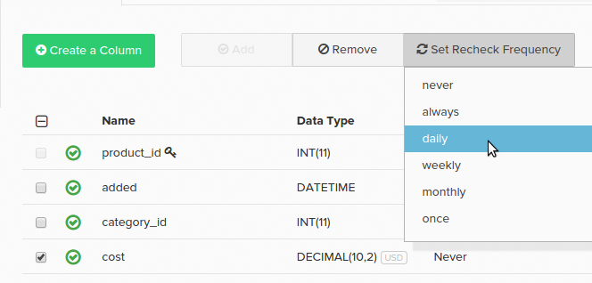

# データチェックの設定

データベーステーブルには、変更可能な値を持つデータ列を含めることができます。 例えば、`orders` テーブルに`status`という列がある場合があります。 注文が最初にデータベースに書き込まれると、ステータス列に値&#x200B;_pending_&#x200B;が含まれる場合があります。 注文は、この[値で](../data-warehouse-mgr/tour-dwm.md)Data Warehouse`pending`にレプリケートされます。

注文ステータスは変更される可能性がありますが、常に`pending`状態であるとは限りません。 最終的には`complete`または`cancelled`になる可能性があります。 Data Warehouseがこの変更を確実に同期させるには、列で新しい値を再確認する必要があります。

これは、説明した[ レプリケーション方法](../data-warehouse-mgr/cfg-replication-methods.md)とどのように適合しますか？ 再チェックの処理は、選択したレプリケーション方法によって異なります。 再確認を設定する必要がないため、`Modified\_At` レプリケーション メソッドは、値の変更を処理するための最適な選択肢です。 `Auto-Incrementing Primary Key`および`Primary Key Batch Monitoring`のメソッドでは、構成を再確認する必要があります。

これらの方法のいずれかを使用する場合、変更可能な列に再チェック用のフラグを付ける必要があります。 方法は3つあります。

1. 更新フラグ列の一部として実行される監査プロセスは、再チェックする列にフラグを付けます。

   >[!NOTE]
   >
   >監査人はサンプリングプロセスに依存しており、変更する列をすぐに検出できない場合があります。

1. 自分で設定するには、Data Warehouse managerの列の横にあるチェックボックスをオンにし、**[!UICONTROL Set Recheck Frequency]**&#x200B;をクリックして、変更を確認する必要がある適切な時間間隔を選択します。

1. [!DNL Adobe Commerce Intelligence] Data Warehouse チームのメンバーは、Data Warehouseで再チェックインする際に、列に手動でマークを付けることができます。 変更可能な列について把握している場合は、チームに連絡して、再チェックの設定を依頼してください。 列のリストと頻度をリクエストに含めます。

## 周波数を再検出 {#frequency}

**ご存知ですか？**
`primary key`列に対して再チェックを設定しても、列の値が変更されたかどうかは確認されません。 テーブルに削除された行がチェックされ、削除された行はData Warehouseからパージされます。

列に再チェック用のフラグが付けられている場合は、再チェックの頻度も設定できます。 特定の列が頻繁に変更されない場合、より頻度の低いリチェックを選択すると、[更新サイクルを最適化できます](../../best-practices/reduce-update-cycle-time.md)。

頻度オプションは次のとおりです。

* `always` – 更新のたびに再確認が行われます
* `daily` – 再確認は、宣言されたタイムゾーンの最初の深夜以降に行われます
* `weekly` – 宣言されたタイムゾーンに対して、毎週9時以降の金曜日の更新で再チェックが行われます
* `monthly` – 再確認は、宣言されたタイムゾーンに対して4週間ごとに金曜日の午後9時以降に行われます
* `once` – 次の更新（1回限りの更新）でのみ発生します

更新の時間は、同期する必要があるデータの量に関連しているため、Adobeでは、更新のたびに更新するのではなく、`daily`、`weekly`または`monthly`の再チェックを選択することをお勧めします。

## リチェック頻度の管理 {#manage}

Data Warehouseでは、テーブル名をクリックして個々の列を確認することで、リチェック周波数を管理できます。 同期ステータスと再確認頻度（**変更回数？）**&#x200B;列）がテーブルの各列に表示されます。

再チェック頻度を変更するには、変更する列の横にあるチェックボックスをクリックします。 次に、**[!UICONTROL Set Recheck Frequency]** ドロップダウンをクリックして、目的の頻度を設定します。

`Paused`列に`Changes?`が表示されることがあります。 この値は、テーブルの[ レプリケーション メソッド ](../../data-analyst/data-warehouse-mgr/cfg-data-rechecks.md)が`Paused`に設定されている場合に表示されます。

[!DNL Adobe]では、更新を最適化し、変更可能な列が再確認されていることを確認するために、これらの列を確認することをお勧めします。 データの変更頻度を考慮して、列の再チェック頻度が高い場合は、更新を最適化するために列を減らすことをお勧めします。

現在のレプリケーション方法や再チェックについて質問がある場合は、お問い合わせください。

**関連：**

* [更新時間の短縮](../../best-practices/reduce-update-cycle-time.md)
* [分析のためのデータベースの最適化](../../best-practices/opt-db-analysis.md)
