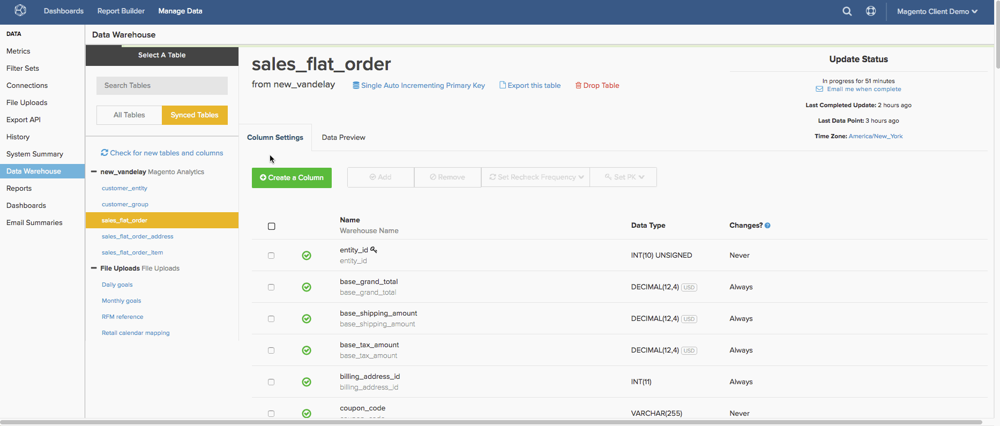

# レプリケーションメソッドの設定

データベース テーブル内の新しいデータまたは更新されたデータを識別するために、`Replication`個のメソッドと[rechecks](../data-warehouse-mgr/cfg-data-rechecks.md)が使用されます。 データの正確性を確保し、更新にかかる時間を最適化するためには、正しく設定することが重要です。 このトピックでは、レプリケーション方法に焦点を当てます。

新しいテーブルが[Data Warehouse Manager](../data-warehouse-mgr/tour-dwm.md)で同期されると、テーブルのレプリケーション方式が自動的に選択されます。 様々なレプリケーション方法、テーブルの構成方法、テーブルデータの動作を理解することで、テーブルに最適なレプリケーション方法を選択できます。

## レプリケーション方法は何ですか？

`Replication`のメソッドは、`Incremental`、`Full Table`、`Paused`の3つのグループに分類されます。

[**[!UICONTROL Incremental Replication]**](#incremental)とは、[!DNL Commerce Intelligence]がレプリケーションを試行するたびに、新しいデータまたは更新されたデータのみをレプリケートすることを意味します。 これらの方法によって待ち時間が大幅に短縮されるため、Adobeでは可能な限り待ち時間を使用することをお勧めします。

[**[!UICONTROL Full Table Replication]**](#fulltable)とは、[!DNL Commerce Intelligence]がレプリケーションを試行するたびにテーブルのコンテンツ全体をレプリケートすることを意味します。 レプリケートされるデータの量が多い可能性があるため、これらの方法により待ち時間と更新時間が増加する可能性があります。 テーブルにタイムスタンプ付きの列または日時の列が含まれている場合は、代わりに増分メソッドを使用することをお勧めします。

**[!UICONTROL Paused]**&#x200B;は、テーブルのレプリケーションが停止または一時停止したことを示します。 [!DNL Commerce Intelligence]は、更新サイクル中に新しいデータまたは更新されたデータを確認しません。つまり、このデータをレプリケーション メソッドとして持つテーブルからデータがレプリケートされません。

## 増分レプリケーション方法 {#incremental}

### で変更（最も理想的）

`Modified At` レプリケーションメソッドでは、datetime カラムを使用します。この列は、行の作成時に入力され、データの変更時に更新されます。これにより、レプリケーションするデータを検索できます。 このメソッドは、次の条件を満たすテーブルを操作するように設計されています。

* 行の作成時に最初に入力され、行が変更されるたびに更新される`datetime`列が含まれます。
* `datetime`列はnullではありません。
* 行はテーブルから削除されません

これらの条件に加えて、Adobeでは、**レプリケーションに使用される**&#x200B;列を`datetime` インデックス作成`Modified At`することをお勧めします。これは、レプリケーション速度の最適化に役立ちます。

更新が実行されると、最新の更新後に発生した`datetime`列の値を持つ行を検索して、新しいデータまたは変更されたデータを特定します。 新しい行が検出されると、それらの行はData Warehouseにレプリケートされます。 [Data Warehouse Manager](../data-warehouse-mgr/tour-dwm.md)に行がある場合、現在のデータベース値で上書きされます。

例えば、テーブルには、データが最後に変更されたことを示す`modified\_at`という列が含まれている場合があります。 最新の更新が火曜日の正午に実行された場合、更新は、火曜日の正午よりも`modified\_at`値が大きいすべての行を検索します。 火曜日の正午から作成または変更された検出された行は、Data Warehouseにレプリケートされます。

**ご存知ですか？**
お使いのデータベースが現在`Incremental` レプリケーション メソッドをサポートしていない場合でも、[または](../../best-practices/mod-db-inc-replication.md)を使用できるようにする`Modified At` データベース `Single Auto Incrementing PK`を変更できます。

`Modified At`は最も理想的なレプリケーション方法であるだけでなく、最速の方法でもあります。 この方法は、大規模なデータセットで顕著な速度の増加を生み出すだけでなく、再チェックオプションを設定する必要もありません。 その他の方法では、データの小さなサブセットが変更された場合でも、変更を特定するためにテーブル全体を繰り返し処理する必要があります。 `Modified At`は、その小さなサブセットのみを反復処理します。

### 1つの自動インクリメント プライマリ キー

`Auto Incrementing`は、プライマリキーを行に順次割り当てるビヘイビアーです。 テーブルが`Auto Incrementing`で、テーブル内の最も高いプライマリキーが1,000の場合、次のプライマリ値は1,001以上になります。 `Auto Incrementing`動作を使用しないテーブルでは、1,000未満のプライマリキー値を割り当てたり、より大きな数値にジャンプしたりすることができますが、これは一般的には使用されません。

このメソッドは、次の条件を満たすテーブルから新しいデータをレプリケートするように設計されています。

* `single-column primary key`；および
* `primary key` データ型は`integer`です。および
* `auto incrementing`個の主要なキー値。

テーブルが`Single Auto Incrementing Primary Key` レプリケーションを使用している場合、Data Warehouseの現在の最大値よりも高いプライマリキー値を検索すると、新しいデータが検出されます。 例えば、Data Warehouse内のプライマリキーの最大値が500である場合、次の更新が実行されると、プライマリキー値が501以上の行が検索されます。

### 日付を追加

`Add Date` メソッドは、`Single Auto Incrementing Primary Key` メソッドと同様に機能します。 このメソッドは、テーブルの主キーに整数を使用する代わりに、`timestamped`列を使用して新しい行をチェックします。

テーブルで`Add Date` レプリケーションを使用する場合、Data Warehouseに同期された最新の日付よりも大きいタイムスタンプ値を検索すると、新しいデータが検出されます。 例えば、2015年20月12日（PT） 09:00:00に最後に更新が実行された場合、これより大きいタイムスタンプを持つ行は、新しいデータとしてマークされ、複製されます。

>[!NOTE]
>
>`Modified At` メソッドとは異なり、`Add Date`は既存の行を確認して更新情報を確認しません。新しい行のみを参照します。

## テーブルの完全なレプリケーション方法 {#fulltable}

### テーブル全体

新しい行が検出されると、`Full table` レプリケーションによってテーブル全体が更新されます。 これは、新しい行があると仮定して、すべてのデータを更新するたびに再処理する必要があるため、はるかに効率的なレプリケーション方法です。

同期プロセスの開始時にデータベースに対してクエリを実行し、行数をカウントすることで、新しい行が検出されます。 ローカルデータベースに[!DNL Commerce Intelligence]を超える行が含まれている場合、テーブルは更新されます。 行数が同じである場合、または[!DNL Commerce Intelligence]にローカル データベースよりも&#x200B;*行多く*&#x200B;行が含まれている場合、テーブルはスキップされます。

これにより、**`Full Table`の場合、**&#x200B;のレプリケーションが互換性がないという重要な点が発生します

* 以降の更新サイクルの間に、ローカルデータベーステーブルで作成した行よりも多くの行が削除されます。または
* カラム値は変更されますが、追加の行は作成されません

上記のいずれのシナリオでも、`Full Table` レプリケーションでは変更が検出されず、データが古くなります。 このレプリケーション方法の非効率性と上記の要件により、`Full Table` レプリケーションは最後の手段としてのみ推奨されます。

### プライマリキーバッチ

テーブルで`Primary Key Batch` （PK バッチ）を使用すると、プライマリキー値の範囲内の行、つまりバッチをカウントすることで、新しいデータが検出されます。 これは通常、整数で使用すると考えられますが、テキスト値でも、システムが一定の範囲を定義できるような方法で並べ替えることができます。

例えば、更新が実行され、1から100までのキーの範囲に対して行数が実行されるとします。 このアップデートでは、システムは37行を見つけてログに記録します。 次の更新では、1 ～ 100の範囲で行カウントが再度実行され、41行が見つかります。 前回のアップデートと比較して行数に違いがあるため、システムはその範囲（またはバッチ）をより詳細に検査します。

このメソッドは、次の条件を満たすテーブルからデータをレプリケートすることを目的としています。

* 単一カラムの非整数。または
* 複合キー（プライマリキーを構成する複数の列） – 複合プライマリキーで使用される列にはnull値を指定できません。
* 1列、整数、自動増分されないプライマリキー値。

この方法は、バッチを調べて変更を見つけるために発生する必要がある処理量が原因で信じられないほど遅いため、理想的ではありません。 Adobeでは、他のレプリケーション方式をサポートするために必要な変更を行うことができない場合を除き、この方式を使用しないことをお勧めします。 この方法を使用する必要がある場合は、更新時間が長くなると予想されます。

## レプリケーションメソッドの設定

レプリケーションメソッドは、テーブルごとに設定されます。 テーブルのレプリケーションメソッドを設定するには、Data Warehouse Managerにアクセスできるように[`Admin`](../../administrator/user-management/user-management.md)権限が必要です。

1. Data Warehouse Managerで、`Synced Tables` リストからテーブルを選択して、テーブルのスキーマを表示します。
1. 現在のレプリケーション方法は、テーブル名の下にリストされます。 変更するには、リンクをクリックします。
1. 表示されるポップアップで、`Incremental`または`Full Table` レプリケーションの横にあるラジオボタンをクリックして、レプリケーションタイプを選択します。
1. 次に、**[!UICONTROL Replication Method]** ドロップダウンをクリックして、メソッドを選択します。 例：`Paused`または`Modified At`

   >[!NOTE]
   >
   >**一部の増分メソッドでは、`Replication Key`**&#x200B;を設定する必要があります。 [!DNL Commerce Intelligence]はこのキーを使用して、次の更新サイクルを開始する場所を決定します。
   >
   >例えば、`modified at` テーブルに`orders` メソッドを使用する場合は、`date column`をレプリケーションキーとして設定する必要があります。 レプリケーションキーのオプションがいくつか存在する可能性がありますが、`created at`または注文の作成日時を選択します。 前回の更新サイクルが2015/00/00/12/1:10:00で停止した場合、次のサイクルは、これより大きい`created at`日付のデータのレプリケートを開始します。

1. 完了したら、**[!UICONTROL Save]**&#x200B;をクリックします。

プロセス全体を検証する：

<!--{: width="801" height="341"}-->

## まとめ

最後に、様々なレプリケーション方法を比較するテーブルを作成しました。 Data Warehouseでテーブルのメソッドを選択する際に非常に便利です。

| **`Method`** | **`Syncing New Data`** | **`Processing Rechecks on Large Data Sets`** | **`Handle Composite Keys?`** | **`Handle Non-Integer PKs?`** | **`Handle Non-Sequential PK Population?`** | **`Handle Row Deletion?`** |
|-----|-----|-----|-----|-----|-----|-----|
| `Auto-Incrementing Primary Key` | より早く | 遅い | いいえ | いいえ | いいえ | はい |
| `Primary Key Batch Monitoring` | 遅い | 遅い | はい | はい | はい | はい |
| `Modified At` | より早く | より早く | はい | はい | はい | いいえ |

{style="table-layout:auto"}

## 関連ドキュメント

* [データの再確認について](../data-warehouse-mgr/cfg-data-rechecks.md)
* [をサポートするためのデータベースの変更 ](../../best-practices/mod-db-inc-replication.md)
* [分析のためのデータベースの最適化](../../best-practices/opt-db-analysis.md)
* [更新時間の短縮](../../best-practices/reduce-update-cycle-time.md)
