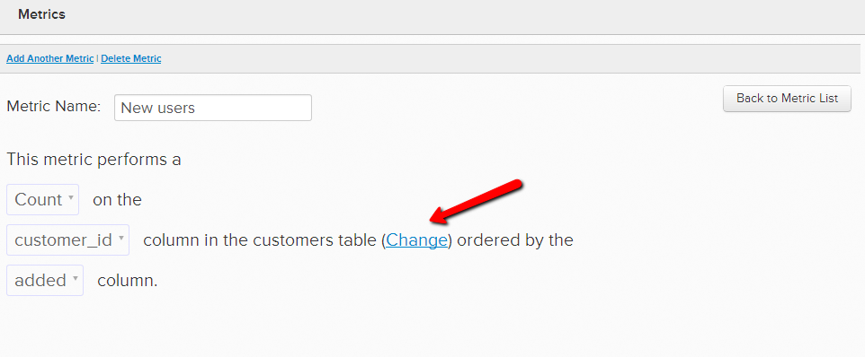
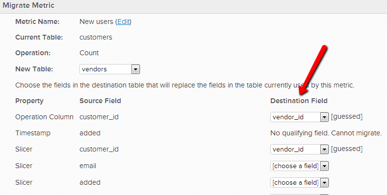
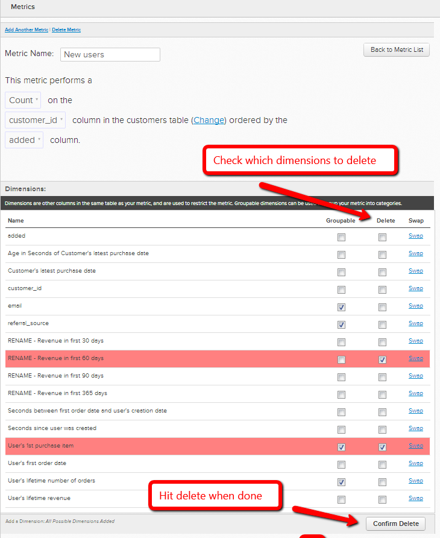

# 指標の操作テーブルの変更

場合によっては、指標が操作を実行するために使用するデータテーブルを変更することもできます。 例えば、新しいユーザーテーブルがある場合、`Users\_Old` テーブルからユーザー関連の指標を移行して、`Users\_New` テーブルを代わりに使用します。

1. **[!UICONTROL Data]** > **[!UICONTROL Metrics]**&#x200B;に移動
1. **[!UICONTROL Edit]** テーブルを切り替える指標の横にある`operational`をクリックします。
1. エディターで、**[!UICONTROL Change]**&#x200B;をクリックします。

   操作テーブルの設定を示す
1. この指標のベースとなる新しいテーブルを選択します。
1. 既存のデータディメンションを、新しいテーブル内の対応するデータディメンションに一致させます。 例えば、`User's registration date`という列がある場合は、新しいテーブルのどの列に同じ日付データが記録されているかを選択するだけです。 （新しいテーブルに一致する列がない場合は、次の手順を参照してください）

   

1. 新しいテーブルに一致する列がない場合は、**データテーブルに作成するか、**&#x200B;によって作成された計算列またはディメンションである[&#x200B; サポート &#x200B;](https://experienceleague.adobe.com/docs/commerce-knowledge-base/kb/troubleshooting/miscellaneous/mbi-service-policies.html?lang=ja)にお問い合わせください。 [!DNL Commerce Intelligence]指標&#x200B;**からディメンションを**&#x200B;削除することもできます。 不要になったディメンションを削除するには、指標のエディターに戻り、`Dimensions`で削除するディメンションを選択するだけです。

   
