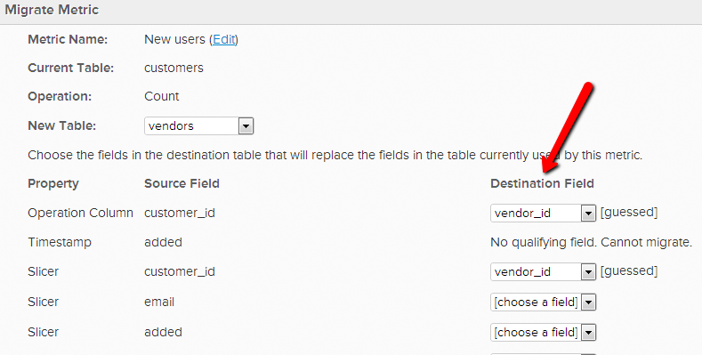

# 指標の操作テーブルの変更

場合によっては、指標が操作の実行に使用するデータテーブルを変更することもできます。 例えば、新しいユーザーテーブルがある場合、ユーザー関連の指標を `Users\_Old` テーブルから移行して、代わりに `Users\_New` テーブルを使用するとします。

1. **[!UICONTROL Data]**/**[!UICONTROL Metrics]** に移動します。
1. **[!UICONTROL Edit]** テーブルを切り替える指標の横にある「`operational`」をクリックします。
1. エディターで、「**[!UICONTROL Change]**」をクリックします。

   
1. この指標のベースとする新しいテーブルを選択します。
1. 既存のデータディメンションを、新しいテーブル内の対応するディメンションに一致させます。 例えば、`User's registration date` という列がある場合、新しいテーブルのどの列に同じ日付データが記録されているかを選択するだけです。 （新しいテーブルに一致する列がない場合は、次の手順を参照）

   

1. 新しいテーブルに一致する列がない場合は、**データ テーブル内で作成する** か、[ が作成した計算列またはディメンションである場合は ](https://experienceleague.adobe.com/docs/commerce-knowledge-base/kb/troubleshooting/miscellaneous/mbi-service-policies.html?lang=ja) サポートにお問い合わせください [!DNL Commerce Intelligence] ことができます。 また、**指標からディメンションを削除する** こともできます。 不要になったディメンションを削除するには、指標のエディターに戻り、削除するディメンションを `Dimensions` で選択します。

   
