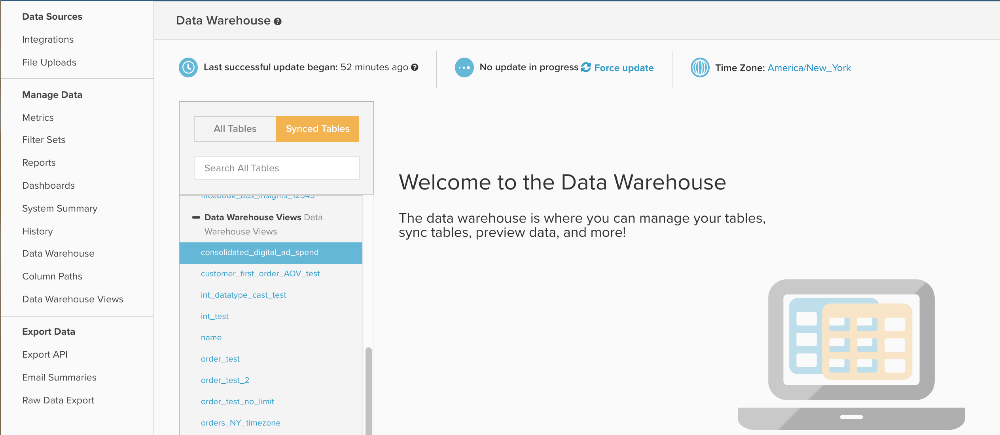
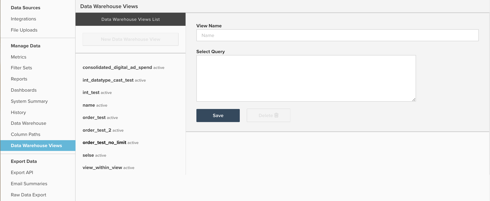

# Data Warehouse ビューの操作

このドキュメントでは、`Data Warehouse Views` > **[!UICONTROL Manage Data]**&#x200B;に移動してアクセスできる&#x200B;**[!UICONTROL Data Warehouse Views]**&#x200B;の目的と用途について説明します。 次に、その機能とビューの作成方法の説明と、`Data Warehouse Views`を使用して[!DNL Facebook]と[!DNL AdWords]支出データを統合する方法の例を示します。

## 汎用

`Data Warehouse Views`機能は、既存のテーブルを変更するか、SQLを使用して複数のテーブルを結合または統合することで、新しいウェアハウステーブルを作成する方法です。 `Data Warehouse View`が作成され、更新サイクルで処理されると、次に示すように、`Data Warehouse Views` ドロップダウンの下に新しいテーブルとしてData Warehouseに入力されます。

テーブル管理オプションを表示する

ここから、新しいビューは他のテーブルと同様に機能し、新しい計算列を作成したり、その上に指標やレポートを構築したりできます。

`Data Warehouse Views`は、主に、複数の類似しているが異なるテーブルをまとめて統合するために使用され、すべてのレポートを1つの新しいテーブルに作成できます。 一般的な例としては、従来のデータベースとライブデータベースのテーブルを統合して履歴データと現在のデータを組み合わせたり、FacebookやAdWordsなどの複数の広告ソースを単一の`Consolidated ad spend` テーブルに組み合わせたりすることが挙げられます。

SQLに精通している場合、これらの統合例では両方とも`UNION`関数を使用しますが、新しいビューを構築する際には任意のPostgreSQL構文と関数を使用できます。

## Data Warehouse ビューの作成と管理

次に示すように、`Data Warehouse Views` > **[!UICONTROL Manage Data]**&#x200B;に移動して、新しい&#x200B;**[!UICONTROL Data Warehouse Views]**&#x200B;を作成し、既存のビューを削除できます。

カスタムビュー設定を示す

ここから、次のサンプル手順に従ってビューを作成できます。

1. 既存のビューを監視している場合は、**[!UICONTROL New Data Warehouse View]**&#x200B;をクリックして、空白のクエリウィンドウを開きます。 空白のクエリウィンドウが既に開いている場合は、次の手順に進みます。
1. `View Name` フィールドに入力して、ビューに名前を付けます。 ここで指定した名前によって、Data Warehouseでのビューの表示名が決まります。 `View names`は、小文字、数字、アンダースコア （_）に制限されています。 その他の文字は禁止されています。
1. 標準のPostgreSQL構文を使用して、`Select Query`というタイトルのウィンドウにクエリを入力します。

   >[!NOTE]
   >
   >クエリは特定の列名を参照する必要があります。 すべての列を選択するために`*`文字を使用することは許可されていません。

1. 完了したら、**[!UICONTROL Save]**&#x200B;をクリックしてビューを保存します。 次の完全な更新サイクルで処理されるまで、ビューには一時的に`Pending` ステータスがあり、その時点でステータスが`Active`に変わります。 更新によって処理された後、ビューはレポートで使用できるようになります。

保存後、`Data Warehouse View`の生成に使用される基になるクエリは編集できないことに注意してください。 `Data Warehouse View`の構造を調整する必要がある場合は、ビューを作成し、計算列、指標、またはレポートを元のビューから新しいビューに手動で移行する必要があります。 移行が完了したら、元のビューを安全に削除できます。 `Data Warehouse Views`は編集できないため、Adobeでは、クエリをData Warehouse ビューとして保存する前に、`SQL Report Builder`を使用してクエリの出力をテストすることをお勧めします。

## 例：[!DNL Facebook]および[!DNL Google AdWords] データ

この記事で前述した例の1つを詳しく見てみましょう：[!DNL Facebook]と[!DNL AdWords]の費用データを新しい統合広告テーブルに統合します。 最も一般的には、次のサンプルデータセットを使用して、2つのテーブルを統合する必要があります。

`Ad source: Google AdWords`

`Table name: campaigns67890`

`Sample data:`

| **`_id`** | **`campaign`** | **`adClicks`** | **`date`** | **`impressions`** | **`adCost`** |
|--- |--- |--- |--- |--- |--- |
| 1 | eee | 60 | 2017-05-05 00:00:00 | 2000 | 10.2 |
| 2 | ggg | 40 | 2017-05-23 00:00:00 | 900 | 4.6 |
| 3 | aaa | 22 | 2017-06-12 00:00:00 | 400 | 2.5 |
| 4 | eee | 350 | 2017-06-30 00:00:00 | 14500 | 35 |
| 5 | fff | 280 | 2017-07-10 00:00:00 | 10200 | 28.5 |

`Ad source: Facebook`

`Table name: facebook_ads_insights_12345`

`Sample data:`

| **`_id`** | **`campaign`** | **`adClicks`** | **`date`** | **`impressions`** | **`adCost`** |
|--- |--- |--- |--- |--- |--- |
| 1 | aaa | 25 | 2017-05-01 00:00:00 | 1200 | 5 |
| 2 | ddd | 12 | 2017-05-15 00:00:00 | 800 | 2.5 |
| 3 | aaa | 40 | 2017-05-22 00:00:00 | 2000 | 7 |
| 4 | aaa | 110 | 2017-06-08 00:00:00 | 6000 | 10 |
| 5 | ccc | 5 | 2017-07-06 00:00:00 | 300 | 1.2 |

[!DNL Facebook]と[!DNL Google AdWords]の両方のキャンペーンを含む単一の広告費テーブルを作成するには、SQL クエリを記述し、`UNION ALL`関数を使用する必要があります。 `UNION ALL` ステートメントは、多くの場合、各クエリの結果を単一の出力に追加しながら、複数の異なるSQL クエリを組み合わせるために使用されます。

PostgreSQL `UNION` ドキュメント [に記載されているように、](https://www.postgresql.org/docs/8.3/queries-union.html) ステートメントには言及する価値があるいくつかの要件があります。

* すべてのクエリは同じ数の列を返す必要があります
* 対応する列のデータ型は同じである必要があります

`UNION`または`UNION ALL` ステートメントを実行する場合、最終出力の列の名前は、最初のクエリの列の名前を反映します。

通常、[!DNL Facebook]と[!DNL Google AdWords]の支出データを`Data Warehouse View`に統合するには、次のようなクエリを含む、7列のテーブルを作成する必要があります。

```sql
    SELECT
        "_id" as id,
        'AdWords' as ad_source,
        "date",
        "campaign",
        "adCost" as spend,
        "impressions",
        "adClicks" as clicks
    FROM campaigns67890
    UNION
    SELECT
        "_id" as id,
        'Facebook' as ad_source,
        "date_start" as date,
        "campaign_name" as campaign,
        "spend",
        "impressions",
        "clicks"
    FROM facebook_ads_insights_12345
```

上記に関するいくつかの重要なポイント：

* わかりやすくするために、すべてのクエリで名前が一致するように、すべての列が上でエイリアスされます。 しかし、これは要件ではありません。 SELECT クエリで列が呼び出される順序によって、列の整列方法が決まります。
* `ad_source`という新しい列が作成され、[!DNL AdWords]または[!DNL Facebook] データのフィルタリングが簡単になります。 このクエリは、両方のテーブルのすべてのデータを組み合わせることに注意してください。 `ad_source`のような列を作成しない場合、特定のソースからの支出を識別する簡単な方法はありません。

上記のクエリを`Data Warehouse View`として保存すると、次のように、[!DNL Facebook]と[!DNL AdWords]の両方の支出を含むテーブルが作成されます。

| **`id`** | **`ad_source`** | **`date`** | **`campaign`** | **`spend`** | **`impressions`** | **`clicks`** |
|--- |--- |--- |--- |--- |--- |--- |
| **1** | [!DNL Facebook] | 2017-05-01 00:00:00 | aaa | 5 | 1200 | 25 |
| **1** | [!DNL Google AdWords] | 2017-05-05 00:00:00 | eee | 10.2 | 2000 | 60 |
| **2** | [!DNL Facebook] | 2017-05-15 00:00:00 | ddd | 2.5 | 800 | 12 |
| **2** | [!DNL Google AdWords] | 2017-05-23 00:00:00 | ggg | 4.6 | 900 | 40 |
| **3** | [!DNL Facebook] | 2017-05-22 00:00:00 | aaa | 7 | 2000 | 40 |
| **3** | [!DNL Google AdWords] | 2017-06-12 00:00:00 | aaa | 2.5 | 400 | 22 |
| **4** | [!DNL Facebook] | 2017-06-08 00:00:00 | aaa | 10 | 6000 | 110 |
| **4** | [!DNL Google AdWords] | 2017-06-30 00:00:00 | eee | 35 | 14500 | 350 |
| **5** | [!DNL Facebook] | 2017-07-06 00:00:00 | ccc | 1.2 | 300 | 5 |
| **5** | [!DNL Google AdWords] | 2017-07-10 00:00:00 | fff | 28.5 | 10200 | 280 |

広告ソースごとに個別のマーケティング指標を作成するのではなく、上の表を使用してひとつの指標を作成するだけで、あらゆる広告を把握できます。

**追加のヘルプをお探しですか？**

SQLの書き込みと`Data Warehouse Views`の作成は、テクニカルサポートには含まれていません。 ただし、[&#x200B; サービスチーム &#x200B;](https://experienceleague.adobe.com/docs/commerce-knowledge-base/kb/troubleshooting/miscellaneous/mbi-service-policies.html?lang=ja)は、ビューの作成に関するサポートを提供しています。 新しいデータベースを使用して従来のデータベースを移行し、特定の分析のために単一のData Warehouse ビューを作成するなど、あらゆる面でサポート チームがサポートします。

通常、同様に構造化された2 ～ 3個のテーブルを統合する目的で新しい`Data Warehouse View`を作成するには、5時間のサービス時間が必要です。これは、約1,250 ドルの作業に相当します。 しかし、以下は、必要な投資を増やす可能性のあるいくつかの一般的な要因です。

* 3つ以上のテーブルを単一のビューに統合
* 複数のData Warehouse ビューの作成
* 複雑な結合ロジックまたはフィルター条件
* 異なるデータ構造を持つ2つ以上のテーブルの統合
