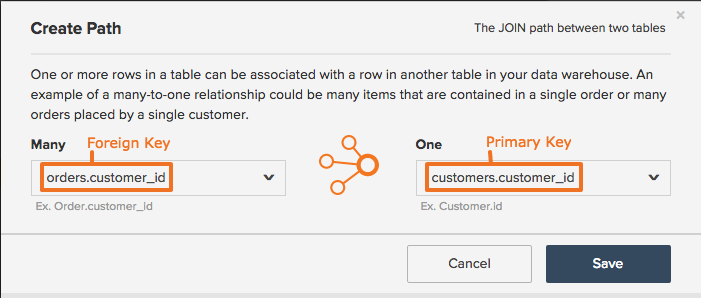

# 計算列のパスの作成または削除

## 計算列の更新

Data Warehouseで[計算列を作成する](../data-warehouse-mgr/creating-calculated-columns.md)場合、列を作成するテーブルが情報を取得するテーブルとどのように関連しているかを説明するパスを定義するように求められます。 パスを正常に作成するには、次の2つのことを知る必要があります。

1. データベース内のテーブルの相互関係
1. この関係を定義するプライマリキーと外部キー

この情報を知っている場合は、このトピックの手順に従ってパスを簡単に作成できます。 組織のテクニカルエキスパートに質問するか、[ プロフェッショナルサービスチーム ](https://experienceleague.adobe.com/docs/commerce-knowledge-base/kb/troubleshooting/miscellaneous/mbi-service-policies.html)にお問い合わせください。

## テーブルの関係とキータイプのリフレッシュ {#refresher}

### テーブルの関係 {#relationships}

この概念については、[ テーブル関係の理解と評価の記事](../../data-analyst/data-warehouse-mgr/table-relationships.md)で説明していますが、簡単な要約は誰にも害を与えることはありません。

テーブルは、次の3つの方法のいずれかで相互に関連付けることができます。

| **`Relationship Type`** | **`Example`** |
|-----|-----|
| **`one-to-one`** | 人と運転免許証番号の関係。 1人の人は1人の運転免許証番号しか持つことができず、運転免許証番号は1人の人にのみ属します。 |
| **`one-to-many`** | 注文とアイテム間の関係 – 注文には多くのアイテムが含まれますが、1つのアイテムは1つの注文に属します。 この場合、注文テーブルは1つの側面であり、アイテムテーブルは多数の側面です。 |
| **`many-to-many`** | 製品とカテゴリの関係：製品は多くのカテゴリに属することができ、カテゴリには多くの製品を含めることができます。 |

{style="table-layout:auto"}

2つのテーブル間の関係が理解されると、あるテーブルから別のテーブルに情報を取り込むために作成するパスを決定するために使用できます。 この次のステップでは、テーブルの関係を促進するプライマリキーと外部キーを知る必要があります。

### プライマリと外部キー {#keys}

`Primary Key`は、テーブル内で一意の値を生成する、変更されない列または一連の列です。 例えば、顧客がweb サイトで注文を行うと、新しい行がショッピングカートの`orders` テーブルに追加され、新しい`order_id`が追加されます。 この`order_id`を使用すると、お客様とビジネスの両方がその特定の注文の進行状況を追跡できます。 注文IDは一意であるため、通常は`Primary Key` テーブルの`orders`です。

`Foreign Key`は、別のテーブルの`Primary Key`列にリンクするテーブル内に作成された列です。 外部キーは、テーブル間の参照を作成し、アナリストがレコードを簡単に検索してリンクできるようにします。 例えば、どの注文が各顧客に属しているかを知りたかったとします。 `customer id`列（`Primary Key` テーブルの`customers`）と`order_id` テーブルの`Foreign Key`列（`customers`、`Primary Key` テーブルの`orders`を参照）を使用すると、この情報をリンクして分析できます。 パスを作成する際に、`Primary Key`と`Foreign Key`の両方を定義するよう求められます。

## パスの作成 {#createpath}

Data Warehouseで列を作成する場合は、あるテーブルから別のテーブルに情報を取り込むパスを定義する必要があります。 テーブル間にパスが存在するため、パスが事前入力されることがありますが、これが発生しない場合は、パスを作成する必要があります。

**顧客**&#x200B;と&#x200B;**注文**&#x200B;の関係を使用して、その方法を表示します。 分類：

* 関係は`one-to-many`です。1人の顧客は複数の注文を持つことができますが、1人の注文は1人の顧客のみを持つことができます。 これにより、関係の方向、または計算列を作成する場所が示されます。 この場合、`orders` テーブルの情報を`customers` テーブルに取り込むことができることを意味します。
* 使用する`primary key`は`customers.customerid`または`customer ID` テーブルの`customers`列です。
* 使用する`foreign key`は`orders.customerid`または`customer ID` テーブルの`orders`列です。

これでパスを作成できます。

1. **[!UICONTROL Data > Data Warehouse]**&#x200B;をクリックします。
1. 表リストで、列を作成する表をクリックします。 この例では、`customers` テーブルです。
1. テーブルスキーマが表示されます。 **[!UICONTROL Create New Column]**&#x200B;をクリックします。
1. 列に名前（例：`Customer's orders`）を付けます。
1. 列の定義を選択します。 便利なカンニングペーパーについては、[計算列ガイド ](../data-warehouse-mgr/creating-calculated-columns.md)を参照してください。
1. [!UICONTROL Select table and column] ドロップダウンで、**[!UICONTROL Create new path]** オプションをクリックします。

   

1. ドロップダウンを使用して、各テーブルのプライマリキーと外部キーを選択します。

   `Many`側では、`orders.customerid`を選択します。覚えておいてください。顧客は多くの注文を受け取ることができます。

   `One`側では、`customers.customerid`を選択します。1つの注文には1人の顧客しか含まれません。

1. **[!UICONTROL Save]**&#x200B;をクリックしてパスを保存し、列の作成を完了します。

### パスの作成の制限 {#limits}

* **[!DNL Commerce Intelligence]は、プライマリ キーと外部キーの関係を推測できません**。 アカウントに誤ったデータを導入しないようにする必要があるため、パスの作成は手動で行う必要があります。

* **現在、パスは2つの異なるテーブル間でのみ指定できます**。 再作成しようとしているロジックには、2つ以上のテーブルが含まれていますか？ その後、（1）最初に列を中間テーブルに結合してから「最終宛先」テーブルに結合するか、（2）目標に対する最適なアプローチを見つけるために[ プロフェッショナルサービスチーム ](https://experienceleague.adobe.com/docs/commerce-knowledge-base/kb/troubleshooting/miscellaneous/mbi-service-policies.html)と相談することは理にかなっています。

* **列は、一度に1つのパスに対する外部キー参照のみにできます**。 例えば、`order_items.order_id`が`orders.id`を指している場合、`order_items.order_id`は他を指すことはできません。

* **`Many-to-many`個のパスは技術的に作成できますが、どちらの側も真の`one-to-many`外部キー**&#x200B;ではないため、多くの場合、不正なデータが生成されます。 これらの経路にアプローチする最適な方法は、常に特定の目的の分析に依存します。 RJ アナリストチームに相談して、最適なソリューションを見つけましょう。

上記の1つ以上の制限により、計算列の作成が妨げられる場合は、サポートに連絡して、該当する列の説明を確認してください

## 集計列パスの削除 {#delete}

Data Warehouseで誤ったパスを作成したか？ あるいは、少し春の掃除をして、片付けたいですか？ アカウントからパスを削除する必要がある場合は、[ チケットをAdobe サポートアナリストに送信できます](../../guide-overview.md#Submitting-a-Support-Ticket)。 **必ずパスの名前を含めてください！**

## まとめ {#wrapup}

これで、Data Warehouseで計算列のパスを簡単に作成できるようになりました。 特定のパスについてまだ不明な点がある場合は、常に&#x200B;**[!UICONTROL Support]** アカウントの[!DNL Commerce Intelligence]をクリックしてサポートを受けることができます。

## 関連

* [テーブルの関係の理解と評価](../data-warehouse-mgr/table-relationships.md)
* [計算列のパスの作成](../data-warehouse-mgr/create-paths-calc-columns.md)
* [計算された列タイプ ](../data-warehouse-mgr/calc-column-types.md)が作成しようとしています。
