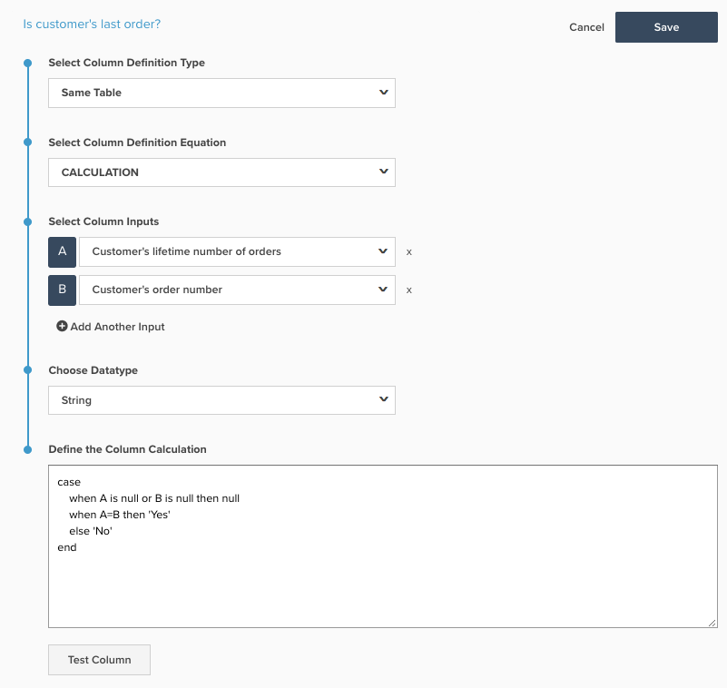
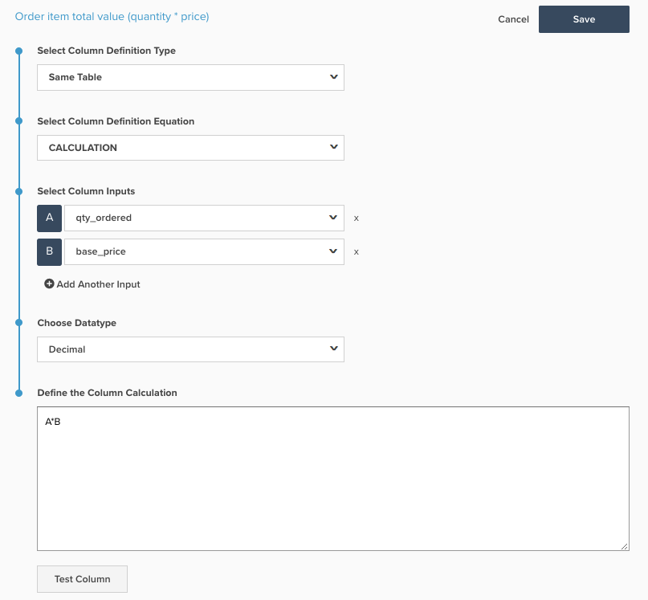
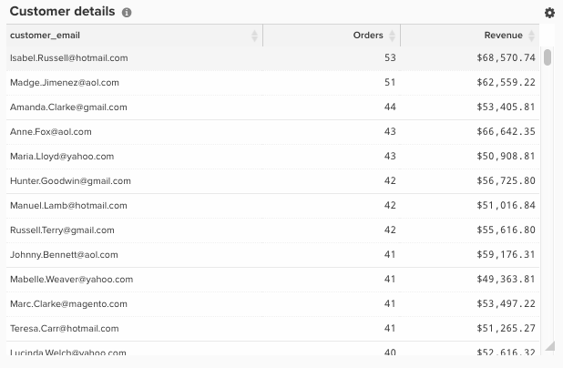

# SQL計算列の作成

このトピックでは、`Calculation`Data Warehouse Manager[を使用してテーブルに追加できる](../data-warehouse-mgr/tour-dwm.md)列タイプの目的と用途について説明します。 以下では、SQL計算の概要、SQL計算の作成手順、および2つの例を示します。

**説明**

以前は、`advanced`と見なされた列は、ここ[!DNL Adobe Commerce Intelligence]のカスタマーサクセスチームのアナリストによってのみ実行できました。 これで、すべての機能はエンドユーザーの手に委ねられ、新しい`SQL Calculation` アーキテクチャでは、高度な列を[!DNL Commerce Intelligence]列の形式で作成できます。

Data Warehouse Managerのオプションとして使用できるようになった`Calculation`列タイプは、PostgreSQL ロジックを使用してテーブル上の列を変換できる同じテーブル操作です。 `Calculation`列タイプで使用できる関数と演算子に関するドキュメントは、PostgreSQL web サイト [ここ](https://www.postgresql.org/docs/9.6/functions.html)にあります。

`Calculation`列で作成できるさまざまな列はほぼ無制限ですが、ほとんどの列は、IF-THEN ステートメントと基本算術を使用して作成できます。この算術は、次の例で使用されています。

**例1：お客様の最後の注文ですか？**

ほとんどのアカウントでは、`Is customer's last order?` テーブルに`orders`という列があり、繰り返し購入率と解約顧客に関する分析を実行しています。 アカウントが新しいアーキテクチャを利用している場合、この列は`Calculation`列を使用して作成され、以下のスクリーンショットに表示されます。

`Is customer's last order?`列では、入力`Customer's lifetime number of orders`と`Customer's order number`がそれぞれ`A`と`B`としてエイリアスされます。

行ごとに、PostgreSQLの意味は次のとおりです。

* ケース：これは、一連のIf - Then文を開始します
* `A`がnullまたは`B`がnullの場合：いずれかの入力が空の場合、出力も空にする必要があります。 これはSQL エラーを防ぐためです
* `A=B`の場合、`Yes`: `Customer's lifetime number of orders`がこの行の`Customer's order number`に等しい場合は、`Yes`を返します。 顧客が4回注文した場合、4回目の注文の行には`Yes`に対して`Is customer's last order?`が返されます
* else `No`: ステートメントが満たされたときに他のいずれも満たさない場合、`No`を返します
* end：これにより、If - Then ステートメントが終了します

この列（`NULL`、`Yes`、`No`）で返される可能性のある値には数字以外の文字が含まれているため、このデータ型は文字列です。

**例2：注文品目の合計値（数量*価格）**

多くの顧客は、アイテムレベルで収益を分析し、`product name`や`category`などのフィールドで収益を分割することを好みます。 ほとんどのデータベースは、注文で製品の売上を実際に提供するのではなく、注文で販売された数量と商品の価格を提供します。

製品収益分析を有効にするには、ほとんどのアカウントの`Order item total value (quantity * price)` テーブルに`Orders Items`という列があります。 アカウントが新しいアーキテクチャを利用している場合、この列も`Calculation`列を使用して構築されており、以下のスクリーンショットに示されています。

のSQL計算列定義

Commerce スキーマでは、`Order item total value (quantity * price)`列はそれぞれ`qty ordered`および`base price`としてエイリアスされた入力`A`および`B`を使用します。

この新しい列によって返される値はドルとセントで表されるため、正しいデータ型は`Decimal(10,2)`です。

**力学**

次に示すように`Calculation`に移動すると、新しい&#x200B;**[!DNL Manage Data > Data Warehouse]**&#x200B;列をテーブルに追加できます。

計算列の結果を表示する

ここから、次の手順に従って`Calculation`列を作成できます。

1. `Calculation`列を追加するテーブルを選択します。
1. 正しいテーブルで、画面の右上にある&#x200B;**[!UICONTROL Create New Column]**&#x200B;をクリックします。
1. `Select a definition` ドロップダウンから、`Same Table`を選択します。
1. `Calculation`を`column definition equation`として選択します。
1. 列名を入力します。
1. 新しい列のロジックで使用されるテーブルから`input`列を選択します。 追加した各列にはレターエイリアスが割り当てられるので、最初の列は`A`、2番目の列は`B`などになります。
1. ウィンドウで、入力のレターエイリアスを使用して、新しい列のPostgreSQL ロジックを入力します。 SQL計算は、SQL クエリのSELECT文とFROM文の間のすべてのロジックを含む、1つの列定義に制限する必要があります。 入力文字を使用するSQL キーワードは、小文字にする必要があります。 例えば、`CASE` ステートメントを使用する場合は、小文字 – `case`で記述する必要があります。 システムは、大文字の`A`が入力の1つを参照していることを前提としています。
1. 適切なデータタイプを選択する。
   * `Integer` – 整数
   * `Decimal(10,2)` – 合計10桁の10進数。そのうち2は小数点の右側にあります
   * `String` – 数字を使用しない任意の種類のテキストまたは一連の文字
   * `Datetime` - `yyyy-MM-dd hh:mm:ss`形式

1. **[!UICONTROL test column]**&#x200B;をクリックします。 これにより、各入力に対して5つのテスト値のリストが生成され、テスト値の各セットに対する手順6のロジックの結果が表示されます。 SQLのいずれかの部分でエラーが発生した場合は、適切なエラーメッセージが返されます。 サンプル結果は、すべての入力列がネイティブフィールドである場合にのみ生成できます。 いずれかの入力列が計算列である場合は、その列を指標に追加し、ビジュアルReport Builderで表示して、結果を検証する必要があります

1. 結果に満足したら、**[!UICONTROL Save]**&#x200B;をクリックします。 この列は使用できます。
