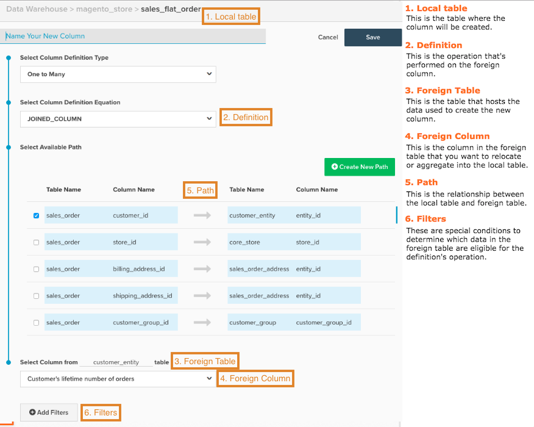

# 計算列を作成

データを分析する場合、様々なソースのデータを統合すると便利です。 獲得ソース、注文テーブルのデータとGoogle Analyticsのリンクによって売上高をグループ化したい場合は、 また、顧客の性別別別に売上高をグループ化したり、顧客属性をトランザクションデータに結合してセグメント化したりする方法についてはどうですか。

このガイドでは、それをどのように行うかを教えています。 使用を開始する前に、Adobeでは [計算列タイプガイド](../../data-analyst/data-warehouse-mgr/calc-column-types.md). この _計算列タイプガイド_ では、Data Warehouseマネージャで作成できる列のタイプと、その定義および例の概要を説明します。

1. 利用を開始するには、 **[!DNL Manage Data > Data Warehouse]** サイドバーに表示されます。

1. 列を作成するテーブルをクリックします。 例えば、 `Customer Gender` 列で「 `sales_flat_order` 表。

1. テーブルスキームが表示されます。 クリック **[!UICONTROL Create New Column]**.

1. 列に名前を付けます（例： ）。 `Customer Gender`.

1. 列の定義を選択します。 ここで、 [計算列のタイプガイド](../data-warehouse-mgr/calc-column-types.md) 便利だ！

1. 特定のタイプの列では、列を正しく作成するために、もう少し情報が必要です。
   * の場合 `One to Many` （結合済み）および `Many to One` （集計）列を使用する場合は、テーブルと列を選択する必要があります。
   * の `Same Table calculation`を選択した場合は、ドロップダウンから目的の日付フィールドを選択する必要があります。

以下を作成する場合、 `One to Many` （結合済み）または `Many to One` （集計）列を使用する場合は、2 つのテーブルを接続するパスを選択する必要があります。 この手順では、既存のパスを使用するか、既存のパスを作成できます。

>[!NOTE]
>
>必ずテーブルを数個または 1 個として適切に定義してください。

* 必要に応じて、 [フィルター](../../data-user/reports/ess-manage-data-filters.md) を新しい列に追加します。
* 終了したら、 **[!UICONTROL Save]**.

それだ！ 新しい列は、現在のテーブルに `Pending` ステータス。 次の更新が完了したら、列を指標およびレポートで使用できるようになります。

## ハンディリファレンスマップ {#map}

計算列を作成する際に、すべての入力値を覚えるのに少し問題がある場合は、作成時にこのリファレンスマップを手元に用意してください。

## 関連ドキュメント

* [計算列のタイプ](../data-warehouse-mgr/calc-column-types.md)
* [高度な計算列のタイプ](../data-warehouse-mgr/adv-calc-columns.md)
* [建物 [!DNL Google ECommerce] 注文と顧客データを含むディメンション](../data-warehouse-mgr/bldg-google-ecomm-dim.md)
