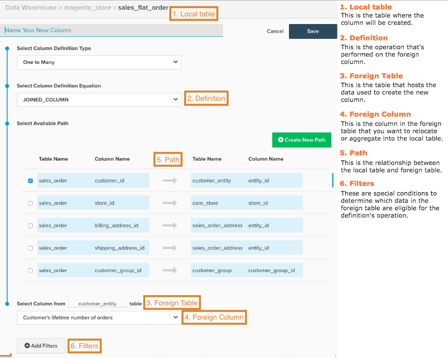

# 計算列の作成

データを分析する際には、さまざまなソースから収集したデータを統合することが重要です。 `orders` テーブルと[!DNL Google Analytics] データのデータをリンクして、獲得ソースごとに収益をグループ化しますか？ 顧客の性別ごとに収益をグループ化したり、セグメント化のために顧客の属性をトランザクションデータに結合したりしたいとします。 ここでは、その方法を詳しく解説します。

開始する前に、Adobeでは、Data Warehouse Managerで作成できる列の種類とその定義と例について、[計算列タイプ ガイド &#x200B;](../../data-analyst/data-warehouse-mgr/calc-column-types.md)を確認することをお勧めします。

1. 開始するには、**[!DNL Manage Data > Data Warehouse]**&#x200B;をクリックしてください。

1. 列を作成するテーブルをクリックします。 例えば、収益セグメンテーション用に`Customer Gender`列を作成する場合は、`sales_flat_order` テーブルを選択します。

1. 表書式が表示されます。 **[!UICONTROL Create New Column]**&#x200B;をクリックします。

1. 列に名前を付けます。 例：`Customer Gender`。

1. 列の定義を選択します。 ここでは、[計算列タイプ ガイド &#x200B;](../data-warehouse-mgr/calc-column-types.md)が役立ちます。

1. 特定のタイプの列の場合、列を適切に作成するために、もう少し詳しい情報が必要です。

   * `One to Many` （結合）列と`Many to One` （集計）列の場合は、テーブルと列を選択する必要があります。

   * `Same Table calculation`の場合、ドロップダウンから目的の日付フィールドを選択する必要があります。

`One to Many` （結合）または`Many to One` （集計）列を作成する場合は、2つのテーブルを接続するパスを選択する必要があります。 この手順では、既存のパスを使用するか、パスを作成できます。

>[!NOTE]
>
>テーブルを正しく定義することを忘れないでください。

* 必要に応じて、新しい列に[&#x200B; フィルター](../../data-user/reports/ess-manage-data-filters.md)を適用できます。

* 完了したら、**[!UICONTROL Save]**&#x200B;をクリックします。

新しい列は、現在のテーブルに`Pending` ステータスで表示されます。 次の更新が完了すると、列は指標とレポートで使用できるようになります。

## 便利な参照マップ {#map}

計算列を作成する際にすべての入力が何であるかを思い出すのに問題がある場合は、構築する際にこの参照マップを便利に保つようにしてください。

## 関連ドキュメント

* [計算された列タイプ](../data-warehouse-mgr/calc-column-types.md)
* [高度な計算列タイプ](../data-warehouse-mgr/adv-calc-columns.md)
* [注文データと顧客データを含む [!DNL Google ECommerce]  ディメンションの作成](../data-warehouse-mgr/bldg-google-ecomm-dim.md)
