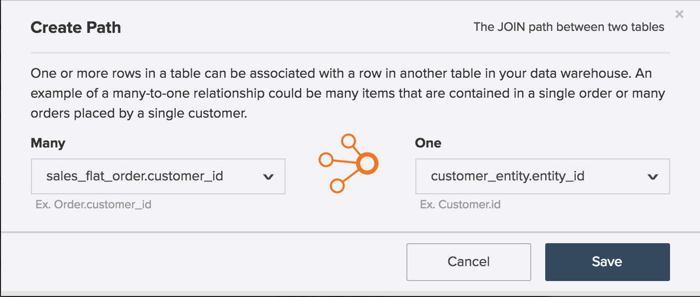
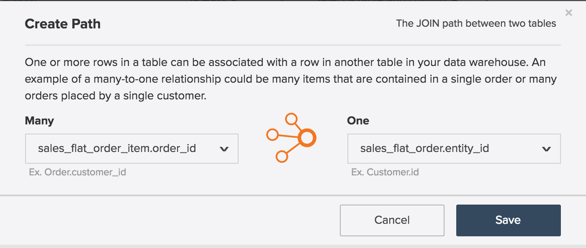
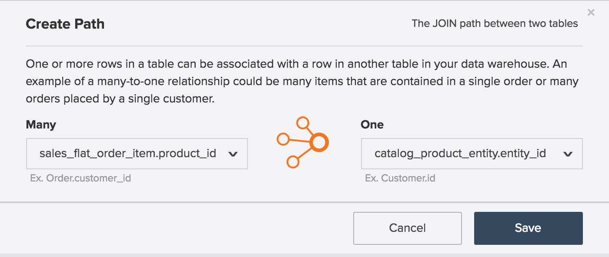

# エンティティ関係図

**[!UICONTROL entity relationship (ER) diagram]**&#x200B;とは [!UICONTROL ER]図は、データベース内のテーブルとその相互関係を視覚化したものです。 このトピックでは、いくつかの一般的なAdobe Commerce データベーステーブル間の関係を視覚化するのに役立つ、いくつかの[!UICONTROL ER]図が含まれています。

>[!NOTE]
>
>このトピック全体を通して、**join**、**relationship**、**path**&#x200B;という単語が表示されます。 これらの単語はすべて、2つのテーブルの接続方法を説明するために使用されます。

## コア Commerce [!UICONTROL ER]図

この`ER`図は、Commerce データベース内のコアテーブル間の関係を表しています。 複数の関係を一度に表示すると、複数のテーブル間でデータがどのように関連付けられるかを確認できます。

以下のセクションには、一度に2つのテーブルに固有の`ER`図が含まれています。 ダイアグラムとその付随する説明を表示するには、そのセクションのヘッダーをクリックします。

## `customer\_entity & sales\_flat\_order`

1人の顧客が多くの注文を行うことができます。 これら2つのテーブル間の関係は`customer\_entity.entity\_id = sales\_flat\_order.customer\_id`です

>[!IMPORTANT]
>
>`customer\_entity.entity\_id`が`sales\_flat\_order.entity\_id`と等しくありません。 最初は`customer\_id`と見なすことができ、2番目は`order\_id.`と見なすことができます

[!DNL Commerce Intelligence]内で、これらの2つのテーブル間のパスが存在しない場合は、「Data Warehouse」タブ内で[ パス ](../data-warehouse-mgr/create-paths-calc-columns.md)を作成できます。 パスを作成する準備ができたら、次のように定義します。

sales_flat_orderからcustomer_entity エンティティ関係ダイアグラム

## `sales\_flat\_order & sales\_flat\_order\_item`

1つの注文に多くの項目を含めることができます。 これら2つのテーブル間の関係は`sales\_flat\_order.entity\_id = sales\_flat\_order\_item.order\_id`です。

[!DNL Commerce Intelligence]内で、これらの2つのテーブル間のパスが存在しない場合は、「Data Warehouse」タブで[ パス ](../data-warehouse-mgr/create-paths-calc-columns.md)を作成できます。 パスを作成する準備ができたら、以下に示すようにパスを定義します。

sales_flat_order_itemからsales_flat_order エンティティ関係ダイアグラム

## `catalog\_product\_entity & sales\_flat\_order\_item`

1つの製品は多くの項目を購入することができます。 これら2つのテーブル間の関係は`catalog\_product\_entity.entity\_id = sales\_flat\_order\_item.product`です。

[!DNL Commerce Intelligence]内で、これらの2つのテーブル間のパスが存在しない場合は、「Data Warehouse」タブ内で[ パス ](../data-warehouse-mgr/create-paths-calc-columns.md)を作成できます。 パスを作成する準備ができたら、以下に示すようにパスを定義します。

sales_flat_order_itemからcatalog_product_entity エンティティ関係ダイアグラム
