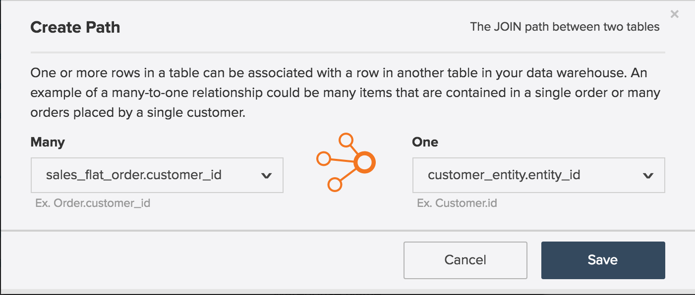
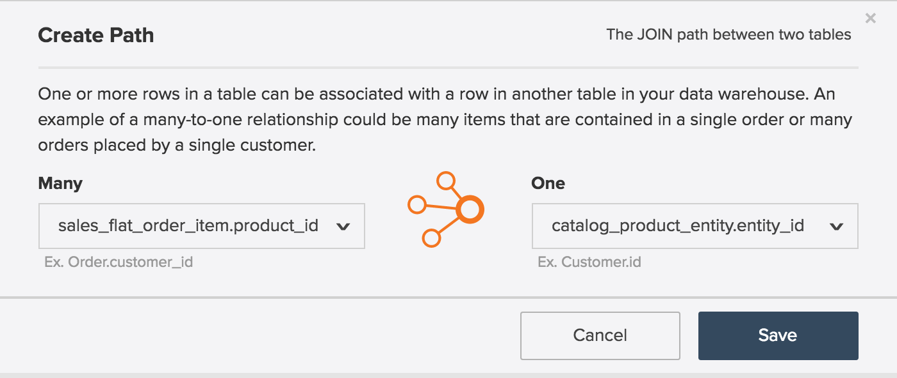

# エンティティ関係図

とは **[!UICONTROL entity relationship (ER) diagram]**? An `ER` ダイアグラムとは、データベース内のテーブルと、それらの関係を視覚化したものです。 この記事では、いくつかの一般的な Commerce データベーステーブル間の関係を視覚化するのに役立つ ER 図をいくつか含んでいます。

>[!NOTE]
>
>この記事では、「 **join**, **関係**、および **パス**. これらの単語は、2 つのテーブルの接続方法を表すのに使用されます。

## コアコマース `ER` 図

この `ER` この図は、Commerce データベース内のコアテーブル間の関係を表しています。 複数の関係を一度に表示すると、多数のテーブル間でのデータの関連付けを確認できます。

以下の節では、 `ER` 一度に 2 つのテーブルに固有の図。 図とそれに伴う説明を表示するには、そのセクションのヘッダーをクリックします。

## `customer\_entity & sales\_flat\_order`

1 人の顧客が多くの注文をすることができます。 この 2 つのテーブル間の関係は、 `customer\_entity.entity\_id = sales\_flat\_order.customer\_id`

>[!IMPORTANT]
>
>`customer\_entity.entity\_id` 次と等しくない `sales\_flat\_order.entity\_id`. 1 つ目は、 `customer\_id` そして二番目は `order\_id.`

内 [!DNL MBI]で指定した 2 つのテーブル間のパスが存在しない場合は、 [パスを作成](../data-warehouse-mgr/create-paths-calc-columns.md) を「Data Warehouse」タブ内に入力します。 パスを作成する準備が整ったら、次のように定義します。

## `sales\_flat\_order & sales\_flat\_order\_item`

1 つの注文に多数の項目を含めることができます。 この 2 つのテーブル間の関係は、 `sales\_flat\_order.entity\_id = sales\_flat\_order\_item.order\_id`.

内 [!DNL MBI]で指定した 2 つのテーブル間のパスが存在しない場合は、 [パスを作成](../data-warehouse-mgr/create-paths-calc-columns.md) を「Data Warehouse」タブ内に入力します。 パスを作成する準備が整ったら、次のように定義します。

## `catalog\_product\_entity & sales\_flat\_order\_item`

1 つの商品は多くの商品を購入できます。 この 2 つのテーブル間の関係は、 `catalog\_product\_entity.entity\_id = sales\_flat\_order\_item.product`.

内 [!DNL MBI]で指定した 2 つのテーブル間のパスが存在しない場合は、 [パスを作成](../data-warehouse-mgr/create-paths-calc-columns.md) を「Data Warehouse」タブ内に入力します。 パスを作成する準備が整ったら、次のように定義します。

