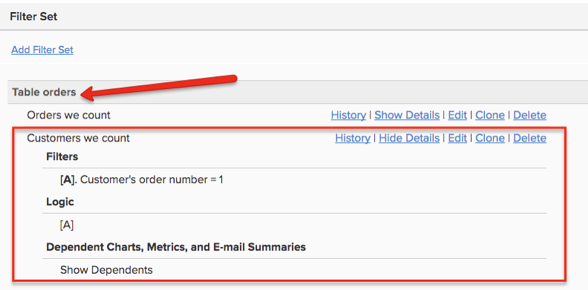

# ゲストによる注文

注文を確認中に、多数の注文に気づいた場合 `customer\_id` 値が null であるか、結合して戻す値がありません `customers` 表に示すように、お客様のストアがゲストによる注文を許可していることを示します。 これは、 `customers` テーブルには、すべての顧客が含まれているとは限りません。

このトピックでは、ゲストによる注文がデータに与える影響と、お客様のデータ内のゲストによる注文を適切に考慮する必要があるオプションについて説明します [!DNL Commerce Intelligence] Data Warehouse。

## ゲストによる注文がデータに与える影響

標準のコマースデータベースには、 `orders` ～に結合するテーブル `customers` 表。 各行の `orders` テーブルには `customer\_id` 列内の 1 行に固有の列 `customers` 表。

* **すべての顧客が登録されている場合** とのゲストによる注文は許可されていません。つまり、 `orders` テーブルの値が `customer\_id` 列。 その結果、すべての注文が `customers` 表。

  

* **ゲストによる注文が許可されている場合**&#x200B;の場合は、一部の注文の値が `customer\_id` 列。 の値が与えられるのは、登録された顧客のみです `customer\_id` 列 `orders` 表。 登録されていないお客様には、 `NULL` （または空白）この列の値。 その結果、すべての注文レコードが一致するレコードを `customers` 表。

  >[!NOTE]
  >
  >注文をおこなった一意の個人を識別するには、の横に別の一意のユーザー属性が必要です `customer\_id` 注文に添付されています。 通常は、顧客の E メールアドレスが使用されます。

## ゲスト設定でのゲスト注文のData Warehouse方法

通常、アカウントを実装するセールスエンジニアは、Data Warehouseの基盤を構築する際にゲストの注文を考慮に入れます。

ゲストによる注文を考慮する最も最適な方法は、 `orders` 表。 この設定では、すべての顧客が持つ一意の顧客 ID（通常、顧客の E メールが使用されます）を使用します。 これにより、 `customers` 表。 このオプションを選択した場合、少なくとも 1 回購入した顧客のみが顧客レベルのレポートに含まれます。 まだ 1 回の購入を行っていない登録ユーザーは含まれません。 このオプションを使用すると、 `New customer` 指標は、 `orders` 表。

君はこの事に気づくだろう `Customers we count` このタイプの設定で設定されたフィルターには、次のフィルターが含まれています： `Customer's order number = 1`.

ゲストによる注文がない状況では、各顧客が顧客テーブル内の一意の行として存在します（画像 1 を参照）。 指標 ( `New customers` は、以下に基づいてこのテーブルの id を単にカウントできます。 `created\_at` 登録日に基づいて新規顧客を理解する日付。

すべての顧客指標が `orders` ゲストによる注文を考慮するテーブルで、次の条件を満たしていることを確認する必要があります。 `not counting customers twice`. 注文テーブルの ID をカウントする場合は、すべての注文をカウントします。 の代わりに、 `orders` テーブルを作成し、フィルターを使用します。 `Customer's order number = 1`に設定した場合、個別の顧客ごとにをカウントします `only one time`. これは、 `Customer's lifetime revenue` または `Customer's lifetime number of orders`.

上では、null があることがわかります。 `customer\_ids` （内） `orders` 表。 を使用する場合、 `customer\_email` を使用して個別顧客を識別すると、 `erin@test.com` は 3 件の注文をしています。 したがって、 `New customers` 指標 `orders` 次の条件に基づくテーブル：

* `Operation table = orders`
* `Operation column = id`
* `Operation = count`
* `Timestamp = Customer's first order date`
* `Filter = Customer's we count (where Customer's order number = 1)`
