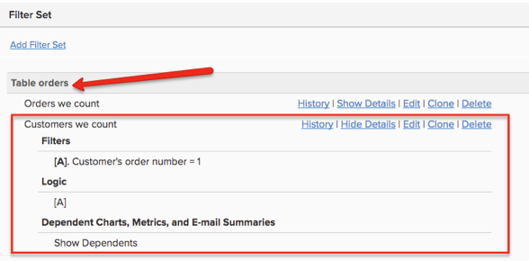

# ゲストオーダー

注文を確認する際に、多くの`customer\_id`値がnullであるか、`customers` テーブルに戻る値がないことに気付いた場合、これはストアでゲスト注文が許可されていることを示します。 つまり、`customers` テーブルには、すべての顧客が含まれていない可能性が高くなります。

このトピックでは、ゲストオーダーがデータに与える影響と、[!DNL Commerce Intelligence] Data Warehouseでゲストオーダーを適切に考慮するために必要なオプションについて説明します。

## ゲストオーダーがデータに与える影響

通常のコマースデータベースには、`orders` テーブルに結合する`customers` テーブルがあります。 `orders` テーブルのすべての行には、`customer\_id` テーブルの1つの行に一意の`customers`列があります。

* **すべての顧客が登録されていて、ゲスト注文が許可されていない場合、** テーブルのすべてのレコードが`orders`列に値を持っていることを意味します。 `customer\_id`その結果、すべての注文が`customers` テーブルに結合されます。

  顧客情報を示す

* **ゲスト注文が許可されている場合**、これは、一部の注文が`customer\_id`列に値を持たないことを意味します。 `customer\_id` テーブルの`orders`列の値が与えられるのは、登録された顧客のみです。 登録されていないお客様には、この列の`NULL` （または空白）値が送信されます。 その結果、すべての注文レコードが`customers` テーブル内の一致するレコードを持つわけではありません。

  >[!NOTE]
  >
  >注文を行った一意の個人を識別するには、注文に添付された`customer\_id`の横に別の一意のユーザー属性が必要です。 通常、顧客のメールアドレスが使用されます。

## Data Warehouse設定でゲスト注文を考慮する方法

通常、アカウントを実装するセールスエンジニアは、Data Warehouseの基盤を構築する際に、ゲスト注文を考慮します。

ゲスト注文を考慮する最も最適な方法は、すべての顧客レベルの指標を`orders` テーブルに基づくことです。 この設定では、ゲストを含め、すべての顧客が持つ一意の顧客IDが使用されます（通常はお客様の電子メールが使用されます）。 これにより、`customers` テーブルの登録データは無視されます。 このオプションを使用すると、少なくとも1回の購入を行った顧客のみが顧客レベルのレポートに含まれます。 1回の購入をまだ行っていない登録ユーザーは含まれていません。 このオプションを使用すると、`New customer`指標は、`orders` テーブル内の顧客の最初の注文日に基づきます。

このタイプの設定で設定された`Customers we count` フィルターには、`Customer's order number = 1`のフィルターがあります。

ゲスト注文がない場合、各顧客は顧客テーブルの一意の行として存在します（画像1を参照）。 `New customers`などの指標は、`created\_at`日に基づいてこのテーブルのIDを単純にカウントし、登録日に基づいて新規顧客を把握できます。

ゲスト注文の設定で、すべての顧客指標が`orders` テーブルに基づいて設定され、ゲスト注文を考慮する場合は、`not counting customers twice`であることを確認する必要があります。 注文テーブルのIDをカウントする場合、すべての注文をカウントします。 代わりに、`orders` テーブルのIDをカウントし、フィルター`Customer's order number = 1`を使用する場合は、一意の顧客`only one time`ごとにカウントします。 これは、`Customer's lifetime revenue`や`Customer's lifetime number of orders`などのすべての顧客レベルの指標に適用されます。

`customer\_ids` テーブルにnull `orders`があることがわかります。 `customer\_email`を使用して一意の顧客を特定すると、`erin@test.com`が3件の注文を行っていることがわかります。 したがって、次の条件に基づいて`New customers` テーブルに`orders` メトリックを作成できます。

* `Operation table = orders`
* `Operation column = id`
* `Operation = count`
* `Timestamp = Customer's first order date`
* `Filter = Customer's we count (where Customer's order number = 1)`
