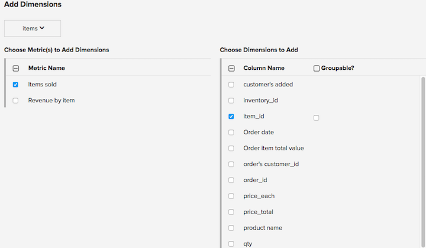

# データディメンションの管理

>[!NOTE]
>
>[管理者権限](../../administrator/user-management/user-management.md)が必要です。

ディメンションとは、指標と同じテーブル内のフィールドで、その指標に基づいてチャートをフィルタリングまたはセグメント化するために使用できます。 たとえば、収益指標には、都市、州、国、注文ステータス、クーポンコードなどのディメンションを含めることができます。

## 複数の指標へのディメンションの追加

複数の指標に1つ以上のディメンションを一度に追加するには：

1. **[!UICONTROL Manage Data > Metrics]**&#x200B;に移動します。

1. **[!UICONTROL Add Dimensions To Metric(s)]**&#x200B;をクリックします。

1. ディメンションを含むテーブルを選択します。

1. `Choose Metric(s) to Add Dimensions`列で、ディメンションを追加する指標を選択します。 選択すると、`Choose Dimensions to Add`列が右側に表示されます。 選択した指標に追加するディメンションを確認します。

   

1. レポート上のデータディメンションのいずれかをセグメント化またはグループ化する場合は、それらが&#x200B;_グループ化できる_&#x200B;であることを必ず示してください。

1. **[!UICONTROL Add]**&#x200B;をクリックします。

## 複数の指標からのディメンションの削除

複数の指標から1つ以上のディメンションを削除するには：

1. **[!UICONTROL Data > Metrics]**&#x200B;に移動します。

1. **[!UICONTROL Remove Dimensions From Metric(s)]**&#x200B;をクリックします。

1. ディメンションを含むテーブルを選択します。

1. 左側からディメンションを削除する指標と、右側から削除するディメンションを選択します。

1. **[!UICONTROL Remove]**&#x200B;をクリックします。

1. ディメンションがレポートで使用されている場合、ディメンションを使用しているチャートのリストに警告が表示されます。 「**[!UICONTROL Delete]**」をクリックして、チェックしたディメンションと、レポートを含むすべての依存関係を削除します。

## 指標でのディメンションの管理

**指標にディメンションを追加するには：**

1. **[!UICONTROL Data > Metrics]**&#x200B;に移動します。

1. 新しいディメンションを作成する指標の&#x200B;**[!UICONTROL Edit]**&#x200B;をクリックします。

1. `Dimensions` セクションで、`Add a dimension` ドロップダウンを使用して、追加するディメンションを選択します。

>[!NOTE]
>
>フィルターまたはグループ化するディメンションは、既に[!DNL Commerce Intelligence]で追跡されている必要があります。 目的のディメンションが見つからない場合は、[Data Warehouse](../data-warehouse-mgr/tour-dwm.md) ページを使用して、データベース内の新しいデータ列のトラッキングを開始する必要がある場合があります。

**指標からディメンションを削除するには：**

1. **[!UICONTROL Manage Data > Metrics]**&#x200B;に移動します。

1. 新しいディメンションを作成する指標の&#x200B;**[!UICONTROL Edit]**&#x200B;をクリックします。

1. 「`Dimensions`」セクションで、削除するディメンションの横にある「削除」列のチェックボックスを選択します。

>[!NOTE]
>
>ディメンションを削除した後でも、Data Warehouseのテーブルには列として存在します。 任意の指標に追加し直して、これらのディメンションを使用して新しい指標を構築できます。 ディメンションが対応するデータ列を[!DNL Commerce Intelligence]から削除するには、[Data Warehouse](../data-warehouse-mgr/tour-dwm.md) ページからデータ列のトラッキングを解除するだけです。

## 関連ドキュメント

* [セグメンテーションとフィルタリングのベストプラクティス](../../best-practices/segment-filter.md)
