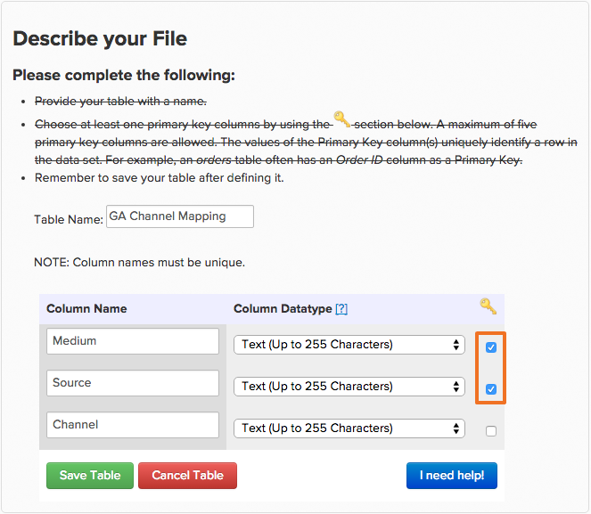
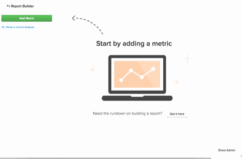

# 取得ソースを使用する[!DNL Google Analytics]

## チャネルとは？ {#channels}

カスタムセグメントを作成して、様々なトラフィックのパフォーマンスを確認し、傾向を確認することは、[!DNL Google Analytics]の最も強力な用途のひとつです。 [!DNL Google Analytics]にデフォルトで存在するセグメントの1つのクラスは`Channels`です。 チャネルとは、顧客がサイトを訪問する一般的な方法のグループです。 [!DNL Google Analytics]は、ソーシャルメディア、クリック課金、電子メール、紹介リンクなど、ユーザーを獲得する様々な方法を自動的に並べ替え、バケットまたはチャネルにバンドルします。

## Commerce Intelligenceに`channels`が表示されないのはなぜですか？ {#nochannels}

`Channels`は、データの単純な集約バケットです。 獲得をチャンネルバケットに分類するには、[!DNL Google]は、獲得[Medium](https://support.google.com/analytics/answer/1033173?hl=en) （トラフィックの出所）と獲得[Source](https://support.google.com/analytics/answer/6099206?hl=en) （ソースの一般的なカテゴリ）の組み合わせで、特定のパラメーターを使用して個別のルールと定義を設定します。

これらのバケットを設定することで、トラフィックの送信元を把握できます。このデータは、チャネルではなく、SourceとMediumの組み合わせでタグ付けされます。 [!DNL Google]はチャネル情報を2つの個別のデータポイントとして送信するため、チャネルグループ化は[!DNL Commerce Intelligence]に自動的に表示されません。

## デフォルトのチャネルグループ化は何ですか？ どのように作成されますか？

デフォルトでは、[!DNL Google]は8つの異なるチャネルを設定します。 チャネルの作成方法を決定するルールは次のとおりです。

| **チャネル** | **何ですか？** | **どのように作成されますか？** |
|---|---|---|
| 直接 | サイトに直接来た人が対象です。 | Source = `Direct` およびMedium = `(not set); OR Medium = (none)` |
| オーガニック検索 | 無料の検索エンジンで有機的にランク付けされたトラフィック。 | Medium = `organic` |
| リファラル | オーガニック検索ではない外部リンクまたはソーシャルネットワークではないweb サイトから取得したトラフィック。 | Medium = `referral` |
| 有料検索 | UTM トラッキングコードを持つトラフィックで、メディアが「cpc」、「ppc」、または「paidsearch」のいずれかであり、「Content」と一致しない広告配信ネットワークです。 | Medium = `^(cpc`\|`ppc`\|`paidsearch)$` およびAd Distribution Network ≠ `Content` |
| ソーシャル | 広告としてタグ付けされていない、約400のソーシャルネットワークから提供されるリファラルトラフィック。 | ソーシャル Source リファラル = `Yes` またはMedium = `^(social`\|`social-network`\|`social-media`\|`sm`\|`social network`\|`social media)$` |
| メール | 「メール」というメディアでタグ付けされたセッションからのトラフィック。 | MEDIUMのUTM トラッキングコード = `email` |
| 表示 | メディアが表示またはcpmのUTM トラッキングコードを持つトラフィック。 また、広告配信ネットワークが「コンテンツ」と一致するAdWords インタラクションも含まれます | Medium = `^(display`\|`cpm`\|`banner)$` またはAd Distribution Network = `Content` およびAd Format ≠ `Text` |
| その他 | 「cpc」、「ppc」、「cpm」、「cpv」、「cpa」、「cpp」、「アフィリエイト」のメディアでタグ付けされた、その他の広告チャネルからのセッション（有料検索を含まない）。 | Medium = `^(cpv`\|`cpa`\|`cpp`\|`content-text)$` |

{style="table-layout:auto"}

## Data Warehouseでこれらのチャネルグループを再作成するにはどうすればよいですか？ {#recreate}

チャネルはソースとメディアの組み合わせに過ぎません。次に、Data Warehouseでこれらのグループ化を簡単に再作成する3 ステップのプロセスです。

1. **統合[!DNL Google ECommerce]を有効にする**

   [有効にした場合](../importing-data/integrations/google-ecommerce.md)、Data Warehouseの&#x200B;**medium**&#x200B;および&#x200B;**source** フィールドを[同期](tour-dwm.md#syncing)してください。 この操作が完了すると、メディアおよびソースの取得データがData Warehouseに取り込まれます。

1. **Googleのチャネルグループ化のマッピングをアップロード**

   Adobe Commerceは、デフォルトのグループ化がファイルとしてマッピングされたテーブルを作成し、[ ダウンロード ](../../assets/ga-channel-mapping.csv)できます。

   [!DNL Google Analytics] Proで独自のチャネルを作成している場合は、ファイルを[!DNL Commerce Intelligence]にアップロードする前に、特定のルールをマッピングテーブルに追加する必要があります。

   [ ファイルのアップロード ](../importing-data/connecting-data/using-file-uploader.md)としてData Warehouseに取り込みます。

   

1. **[!DNL Google ECommerce]とマッピング ファイル アップロード**&#x200B;の関係を確立します

   [!DNL Google ECommerce]とマッピングテーブルの関係を確立するには、[ サポートリクエスト ](../../guide-overview.md#Submitting-a-Support-Ticket)をData Analyst チームに送信し、このトピックを参照してください。 アナリストは、ECommerce テーブルに&#x200B;**Channel**&#x200B;という新しい計算列を作成します。 **完全な更新サイクル**&#x200B;の後、この列は`Filter`または`Group by`で使用できるようになります。

これで[!DNL Google Analytics Channel]個のグループがData Warehouseに追加されました。つまり、新しい視点でデータを分析できます。

この例では、**注文数**&#x200B;指標を&#x200B;**チャネル**&#x200B;でセグメント化して簡単に始めました。 新しい列をテストして、[!DNL Google Analytics Channel] データでどのような傾向を特定できるかを確認します。

## 関連ドキュメント

* [Report Builderの使用](../../tutorials/using-visual-report-builder.md)
* [期待される[!DNL Google ECommerce] データ](../importing-data/integrations/google-ecommerce-data.md)
* [注文データと顧客データを含む[!DNL Google ECommerce] ディメンションの作成](../data-warehouse-mgr/bldg-google-ecomm-dim.md)
* [最も価値のある獲得ソースとチャネルは何か？](../analysis/most-value-source-channel.md)
