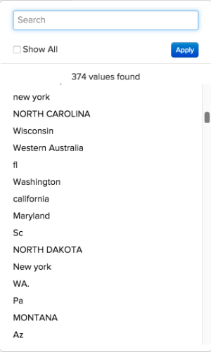
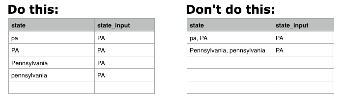
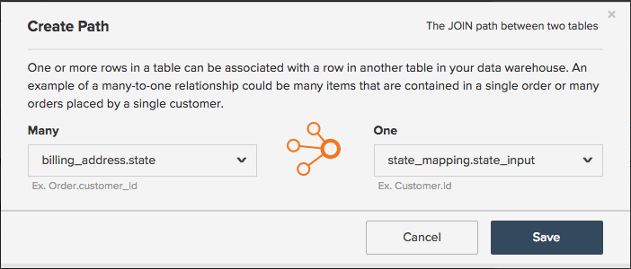
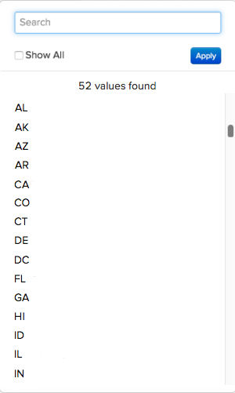

# マッピングテーブルによるデータの標準化

`Report Builder`さんが`Revenue by State` レポートを作成しているとします。 レポートに`billing state` グループを追加し、次の項目が表示されるまで、すべてが正常に処理されます。

## どうすればこれが起こりますか？

残念ながら、標準化が不十分な場合、レポートを作成する際に、データが乱雑になったり、頭痛の種になることがあります。 この例では、顧客が請求ステータス情報を入力するためのドロップダウンメニューや標準化された方法がない可能性があります。 この結果、様々な値（`pa`、`PA`、`penna`、`pennsylvania`、および`Pennsylvania`）が同じ状態で作成され、`Report Builder`で奇妙な結果が生じます。

データのクリーンアップや、必要な列のデータベースへの直接挿入に役立つ技術リソースがある可能性があります。 そうでない場合は、別の解決策があります – **マッピング テーブル**。 マッピングテーブルを使用すると、単一の出力にデータをマッピングすることで、乱雑なデータを迅速かつ簡単にクレンジングおよび標準化できます。

>[!NOTE]
>
>Adobe サポートチームの助けを借りずに、統合テーブルのマッピングテーブルを作成することはできません。

## どうすれば作成できますか？ {#how}

**データ形式の更新：**

* スプレッドシートにヘッダー行があることを確認します。
* コンマの使用は避けます。 ファイルをアップロードすると問題が発生します。
* 日付には、標準の日付形式`(YYYY-MM-DD HH:MM:SS)`を使用します。
* パーセントは小数で入力してください。
* 先頭または末尾のゼロが適切に保持されていることを確認します。

詳しく説明する前に、Adobeでは[生のテーブルデータを書き出すことをお勧めします](../../tutorials/export-raw-data.md)。 まず生データを見ると、クリーンアップする必要があるデータについて、可能なすべての組み合わせを調べることができるため、マッピングテーブルがすべてをカバーしていることを確認できます。

マッピングテーブルを作成するには、ファイルのアップロードに関する[形式ルール &#x200B;](../../data-analyst/importing-data/connecting-data/using-file-uploader.md)に従う2列のスプレッドシートを作成する必要があります。

最初の列に、データベースに保存されている値を&#x200B;**各行に1つだけ**&#x200B;入力します。 例えば、`pa`と`PA`は同じ行にすることはできません。各入力には独自の行が必要です。 例については、以下を参照してください。

2番目の列に、これらの値&#x200B;**が**&#x200B;であるべき値を入力します。 請求状態の例を続けて、`pa`、`PA`、`Pennsylvania`、`pennsylvania`を単に`PA`にしたい場合は、この列に入力値ごとに`PA`と入力します。

## [!DNL Commerce Intelligence]でこれを使用するには何が必要ですか？ {#use}

マッピングテーブルの作成が完了したら、[&#x200B; ファイル &#x200B;](../../data-analyst/importing-data/connecting-data/using-file-uploader.md)を[!DNL Commerce Intelligence]にアップロードし、[新しいフィールドを目的のテーブルに再配置する結合列](../../data-analyst/data-warehouse-mgr/calc-column-types.md)を作成する必要があります。 これは、ファイルがData Warehouseに同期された後に実行できます。

次の使用例は、結合列を使用して、`mapping_state` テーブル （`state_input`）で作成した列を`customer_address` テーブルに移動します。 これにより、`state_input`列ではなく、レポートのクリーン `state`列でグループ化できます。

`joined`列を作成するには、Data Warehouse Managerでフィールドを再配置するテーブルに移動します。 この例では、これは`customer_address` テーブルです。

1. **[!UICONTROL Create a Column]**&#x200B;をクリックします。
1. 「`Joined Column`」ドロップダウンから「`Definition`」を選択します。
1. データベースの`state`列と区別する名前を列に付けます。 レポートビルダーでセグメント化するときに使用する列を指定できるように、列に`billing state (mapped)`という名前を付けます。
1. テーブルを接続するために必要なパスが存在しないので、テーブルを作成する必要があります。 **[!UICONTROL Create new path]** ドロップダウンで「`Select a table and column`」をクリックします。

   テーブルの関係がわからない場合や、プライマリキーと外部キーを適切に定義する方法がわからない場合は、[&#x200B; チュートリアル &#x200B;](../../data-analyst/data-warehouse-mgr/create-paths-calc-columns.md)を参照してヘルプを確認してください。

   * `Many`側で、フィールドを再配置するテーブル（繰り返しますが、`customer_address`です）と、例の`Foreign Key`列または`state`列を選択します。
   * `One`側で、`mapping` テーブルと`Primary key`列を選択します。 この場合、`state_input` テーブルから`mapping_state`列を選択します。
   * ここでは、どのような経路であるのかを確認します。

     

1. 終了したら、**[!UICONTROL Save]**&#x200B;をクリックしてパスを作成します。
1. 保存直後にパスが入力されない可能性があります。これが発生した場合は、`Path` ボックスをクリックし、作成したパスを選択してください。
1. **[!UICONTROL Save]**&#x200B;をクリックして列を作成します。

## どうすればいいですか？」と尋ねます {#wrapup}

更新サイクルが完了すると、データベースの乱雑な列ではなく、新しい結合列を使用してデータを適切にセグメント化できるようになります。 今すぐグループ化オプションを見てください – もうストレスの混乱はありません：

マッピングテーブルは、Data Warehouseの一部のデータをクリーンアップする場合に便利です。 ただし、マッピングテーブルは、[で [!DNL Google Analytics channels] をレプリケートするなど、その他のクールなユースケースにも使用できます。 [!DNL Commerce Intelligence]](../data-warehouse-mgr/rep-google-analytics-channels.md)

### 関連

* [テーブルの関係の理解と評価](../data-warehouse-mgr/table-relationships.md)
* [計算列のパスの作成/削除](../data-warehouse-mgr/create-paths-calc-columns.md)
