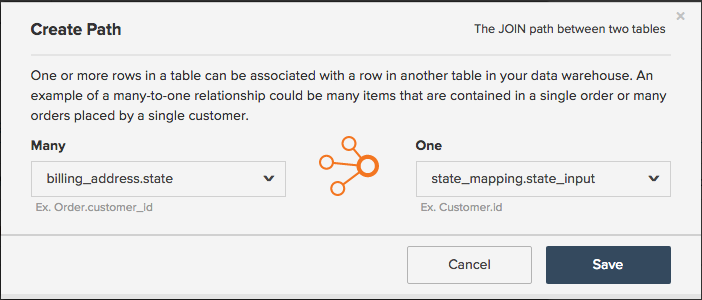

# マッピングテーブルを使用したデータの標準化

`Report Builder` しいレポートを作成する `Revenue by State` にいると仮定します。 レポートに `billing state` しいグループ化を追加しようとすると、次の情報が表示されるまで、すべてが正常に動作します。

## どうしてこんな事が起こったの？

残念ながら、標準化されていないと、レポートを作成する際にデータの混乱や頭痛の種になる場合があります。 この例では、顧客が請求状態情報を入力するためのドロップダウンメニューや標準化された方法がなかった可能性があります。 これにより、同じ状態に対して様々な値（`pa`、`PA`、`penna`、`pennsylvania`、`Pennsylvania`）が導き出され、`Report Builder` でいくつかの奇妙な結果につながります。

データのクリーンアップや、必要な列のデータベースへの直接挿入に役立つテクニカルリソースが存在する場合があります。 そうでない場合は、別の解決策 **マッピングテーブル** があります。 マッピングテーブルを使用すると、データを単一の出力にマッピングすることで、散らかったデータをすばやく簡単にクレンジングして標準化できます。

>[!NOTE]
>
>統合テーブルのマッピングテーブルを作成するには、Adobe サポートチームのサポートが必要です。

## 作成方法 {#how}

**データ形式設定の更新：**

* スプレッドシートにヘッダー行があることを確認します。
* コンマの使用は避けます。 これにより、ファイルをアップロードする際に問題が発生します。
* 日付には、標準の日付形式 `(YYYY-MM-DD HH:MM:SS)` を使用します。
* 割合は小数で入力する必要があります。
* 先頭または末尾のゼロが正しく保持されていることを確認します。

取り組む前に、Adobeでは [&#x200B; 生のテーブルデータを書き出す &#x200B;](../../tutorials/export-raw-data.md) ことをお勧めします。 最初に生データを調べると、クリーンアップする必要があるデータのすべての組み合わせを調べることができ、マッピングテーブルがすべてをカバーしていることを確認できます。

マッピングテーブルを作成するには、[&#x200B; ファイルアップロードのフォーマットルール &#x200B;](../../data-analyst/importing-data/connecting-data/using-file-uploader.md) に従う 2 列のスプレッドシートを作成する必要があります。

最初の列に、データベースに格納されている値を **各行に 1 つの値のみ** と入力します。 例えば、`pa` と `PA` を同じ行に配置することはできません。各入力には、それぞれ独自の行が必要です。 以下に例を示します。

2 番目の列に、これらの値 **あるべき** を入力します。 請求状態の例を続けて、`pa`、`PA`、`Pennsylvania`、`pennsylvania` を単純に `PA` にする場合は、入力値ごとにこの列に `PA` を入力します。

## 使用するた [!DNL Commerce Intelligence] に必要な操作 {#use}

マッピングテーブルの作成が完了したら、[&#x200B; に &#x200B;](../../data-analyst/importing-data/connecting-data/using-file-uploader.md) ファイルをアップロード [!DNL Commerce Intelligence] し、新しいフィールドを目的のテーブルに再配置する [&#x200B; 結合列を作成 &#x200B;](../../data-analyst/data-warehouse-mgr/calc-column-types.md) する必要があります。 これは、ファイルがData Warehouseに同期された後で実行できます。

次の使用例は、`mapping_state` テーブル （`state_input`）に作成した列を、結合された列を使用して `customer_address` テーブルに移動します。 これにより、`state_input` 列ではなく、レポートのクリーンな `state` 列でグループ化できるようになります。

`joined` 列を作成するには、Data Warehouse Manager でフィールドの移動先となるテーブルに移動します。 この例では、これが `customer_address` テーブルになります。

1. 「**[!UICONTROL Create a Column]**」をクリックします。
1. `Joined Column` ドロップダウンから「`Definition`」を選択します。
1. 列に、データベースの `state` 列と区別する名前を付けます。 Report Builder でセグメント化する際に使用する列を指定できるように、列 `billing state (mapped)` に名前を付けます。
1. テーブルの接続に必要なパスが存在しないので、パスを作成する必要があります。 **[!UICONTROL Create new path]** ドロップダウンで「`Select a table and column`」をクリックします。

   テーブルの関係が何か、またはプライマリキーと外部キーを適切に定義する方法が不明な場合は、[&#x200B; チュートリアル &#x200B;](../../data-analyst/data-warehouse-mgr/create-paths-calc-columns.md) でヘルプを確認してください。

   * `Many` 側で、フィールドの移動先のテーブル（ここでは `customer_address`）と、`Foreign Key` 列（この例では `state` 列）を選択します。
   * `One` 側で、`mapping` テーブルと `Primary key` 列を選択します。 この場合は、`state_input` のテーブルから `mapping_state` の列を選択します。
   * パスは次のようになります。

     

1. 終了したら、「**[!UICONTROL Save]**」をクリックしてパスを作成します。
1. 保存後すぐにパスが入力されない場合があります。この場合は、「`Path`」ボックスをクリックし、作成したパスを選択します。
1. 「**[!UICONTROL Save]**」をクリックして、列を作成します。

## 私は今何をしますか？ {#wrapup}

更新サイクルが完了すると、データベースの乱雑な列ではなく、新しく結合された列を使用して、データを適切にセグメント化できるようになります。 グループ化オプションを今すぐ見てみましょう。ストレスの混乱をなくします。

マッピングテーブルは、Data Warehouse内の散らかっている可能性のあるデータをクリーンアップする場合にいつでも便利です。 ただし、マッピングテーブルは、[&#x200B; 内のレプリケーション  [!DNL Google Analytics channels]  など、その他の優れたユースケースにも使用  [!DNL Commerce Intelligence]](../data-warehouse-mgr/rep-google-analytics-channels.md) きます。

### 関連

* [テーブルの関係の理解と評価](../data-warehouse-mgr/table-relationships.md)
* [計算列のパスの作成/削除](../data-warehouse-mgr/create-paths-calc-columns.md)
